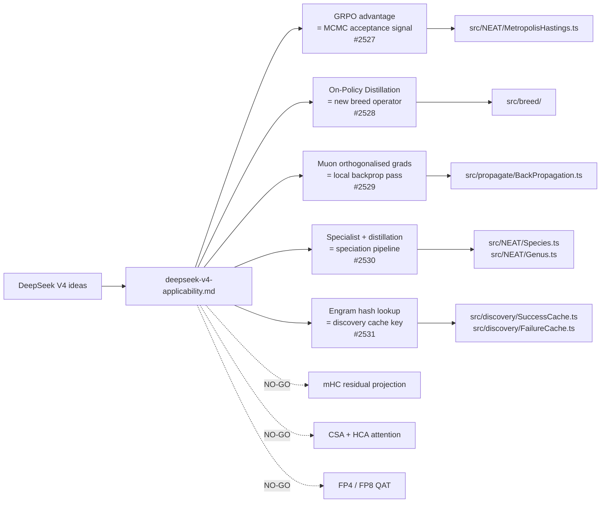

# DeepSeek V4 Applicability to NEAT-AI (Issue #2526)

> **📦 Archived under
> [Issue #2575](https://github.com/stSoftwareAU/NEAT-AI/issues/2575).** This
> research note was moved from `docs/research/` to `docs/archive/research/`. Its
> conclusions have landed (or been triaged out) — see the
> [`deepseek-papers-index.md`](deepseek-papers-index.md) catalogue for the
> consolidated implementation status. Topic index:
> [`docs/README.md`](../../README.md).

This research note maps each notable DeepSeek V4 technique onto NEAT-AI's
existing architecture (memetic evolution, MCMC acceptance, speciation, discovery
cache, backprop, breeding) and records a GO / NO-GO recommendation with a
one-paragraph rationale per item. It is the foundation document for the
experimental sub-issues spawned from #2525.

> **Source.** DeepSeek-AI, _DeepSeek V4 Technical Report_, 2026.
> [`huggingface.co/deepseek-ai/DeepSeek-V4-Pro`](https://huggingface.co/deepseek-ai/DeepSeek-V4-Pro/blob/main/DeepSeek_V4.pdf).
> Citations below use the form _(V4 §x.y)_ and refer to that PDF.
>
> **Scope.** Documentation only. No source-code changes. Each GO recommendation
> is paired with an experimental sub-issue under #2525 that owns the
> implementation work; this note does not pre-empt those experiments.

## Summary table

| # | V4 idea                                   | Closest NEAT-AI surface                  | Recommendation | Effort | Sub-issue |
| - | ----------------------------------------- | ---------------------------------------- | -------------- | ------ | --------- |
| 1 | GRPO (Group Relative Policy Optimisation) | Selection / MCMC acceptance              | **GO**         | M      | #2527     |
| 2 | On-Policy Distillation (OPD)              | Breeding operator                        | **GO**         | M      | #2528     |
| 3 | Muon optimiser                            | Local backprop pass (`src/propagate/`)   | **GO**         | M      | #2529     |
| 4 | Specialist + generalist distillation      | Speciation (`Species.ts`, `Genus.ts`)    | **GO**         | L      | #2530     |
| 5 | Manifold-Constrained Hyper-Connections    | Parallel synaptic paths in deep genomes  | **NO-GO**      | L      | —         |
| 6 | Engram conditional memory                 | `SuccessCache` / `FailureCache`          | **GO**         | S      | #2531     |
| 7 | Hybrid Compressed/Heavy-Compressed Attn.  | (No analogue — NEAT-AI has no attention) | **NO-GO**      | —      | —         |
| 8 | FP4 / FP8 quantisation-aware training     | Backprop weights / activations           | **NO-GO**      | M      | —         |

## Idea → Module mapping diagram

## 1. GRPO — Group Relative Policy Optimisation — **GO** (#2527)

**Technical summary.** GRPO (V4 §3.2, originating in DeepSeekMath) replaces the
absolute reward signal of PPO with a **group-relative advantage**: for each
prompt, sample _G_ rollouts, compute their rewards, and use the
mean-and-stdev-normalised reward as the advantage. The critical consequence is
that **no separate value/critic network is needed** — variance reduction comes
from the group baseline.

**Closest NEAT-AI surface.** `src/NEAT/MetropolisHastings.ts` already accepts or
rejects mutations against an absolute fitness delta with a temperature. NEAT's
species-level acceptance is the equivalent of GRPO's group baseline: candidate
creatures within the same species are directly comparable, and the fitness
distribution within a species is the natural normaliser.

**Rationale (GO).** GRPO maps almost directly onto NEAT-AI's selection step.
Replacing the raw fitness delta with `(fitness − groupMean) / (groupStdev + ε)`
inside the species cohort preserves the existing MCMC machinery while reducing
the dependence on absolute fitness magnitude — a known weakness when fitness
units shift across discovery iterations. The experiment in #2527 will measure
acceptance ratio stability and convergence speed on the standard ED-fold
benchmarks.

**Risk.** Low. The advantage signal is a function of cached fitnesses; neither
UUIDs (§"Neuron UUID stability" in AGENTS.md) nor `semanticVersion` are touched.

**Effort.** **M.** New advantage computation, plumbing into
`MetropolisHastings`, regression test that legacy absolute-delta mode still
works behind a feature flag.

## 2. On-Policy Distillation — **GO** (#2528)

**Technical summary.** OPD (V4 §4.1) trains a single _student_ network on the
combined output distributions of _K_ pre-trained _teachers_, computing a
KL-divergence loss against the mixture rather than mimicking any single teacher.
The "on-policy" aspect is that the student generates its own rollouts and is
corrected against the teachers' logits at each step.

**Closest NEAT-AI surface.** `src/breed/` currently produces offspring by
crossover (`Breed.ts`, `EditParentByIndex.ts`, `InputWeightCrossover.ts`) and
subgraph transplantation (`SubgraphTransplant.ts`, `Father.ts`). None of these
use teacher activations; they recombine **structure**, not **behaviour**.

**Rationale (GO).** A new breeding operator that takes _K_ elite parents,
generates a small batch of training inputs from the activation domain, and fits
a fresh child by gradient descent against the parents' averaged outputs gives
NEAT-AI a "behavioural crossover" mode that complements the existing structural
crossover. This directly addresses long-standing fragility when two highly fit
but topologically incompatible parents are paired (today they fall back to
grafting, which is noisy). #2528 will benchmark OPD-bred children against
transplanted children on diverse-elite populations.

**Risk.** Low–medium. The child is a new creature with a new UUID; existing
neuron UUIDs are not touched. `semanticVersion` defaults to
`CURRENT_CREATURE_SEMANTIC_VERSION` via the `Creature` constructor. The breeding
operator must produce a valid, validated topology (it is a new genome, not a
mutation of an existing one), so UUID/semver invariants hold by construction.

**Effort.** **M.** New operator under `src/breed/OnPolicyDistillation.ts`,
shared with `Mutator.ts` mutation registry, plus tests for output shape and
species-membership behaviour.

## 3. Muon optimiser — **GO** (#2529)

**Technical summary.** Muon (V4 §3.3) wraps each gradient matrix _G_ with a
**Newton–Schulz orthogonalisation** so the resulting update has roughly
orthogonal columns. Empirically this gives larger effective step sizes without
exploding individual weights, and reduces the dependence on adaptive-step
optimisers (Adam, AdamW). The Newton–Schulz iteration is five matrix multiplies
per layer and is cheap relative to a forward pass.

**Closest NEAT-AI surface.** `src/propagate/BackPropagation.ts` plus
`WasmTopologicalBackprop.ts` orchestrate the local gradient-descent pass that
follows mutation. Today the per-neuron weight update is a vanilla SGD-style step
with elasticity (`ElasticDistribution.ts`).

**Rationale (GO).** NEAT genomes are sparse and irregular, but each neuron's
incoming weights still form a small matrix (or vector when the neuron has fan-in
1). For neurons with non-trivial fan-in, applying Newton–Schulz
orthogonalisation to the per-neuron incoming-weight gradient is well-defined and
cheap. The expected payoff is faster local convergence inside the backprop pass,
which is the dominant local-search operator in memetic evolution. #2529 will
compare per-neuron error-decay curves between vanilla and Muon-wrapped updates.

**Risk.** Low for UUIDs and semver — neuron identity is not touched. Higher for
numerical stability: Newton–Schulz needs the gradient matrix scaled to a
spectral norm bound. The experiment must cover degenerate fan-ins (1, 2),
all-zero gradients, and the elastic-distribution interaction.

**Effort.** **M.** Implementation in TS for the orchestration layer, with the
matrix-matrix kernel pushed into NEAT-AI-core if profiling shows it dominates.

## 4. Specialist + generalist distillation pipeline — **GO** (#2530)

**Technical summary.** V4 trains domain-specialist models independently (coding,
maths, reasoning) and merges them via OPD into one generalist (V4 §4.2). The
two-stage post-training shape is "many small experts → one distilled student".

**Closest NEAT-AI surface.** `src/NEAT/Species.ts` and `src/NEAT/Genus.ts`
already partition the population by genetic distance into species, with each
species evolving (semi-) independently. What is missing is an explicit **merge**
step that takes the elite of each species and produces a single broadly
competent creature.

**Rationale (GO).** This is essentially the OPD breeding operator (#2528)
applied at speciation granularity instead of pair granularity: take one elite
per species, fit a student against the ensemble, and seed it back into the
population. It mirrors V4's pipeline almost exactly, with the speciation
machinery providing the "domain expert" partition for free. #2530 owns the
multi-species harness and the periodic distillation schedule.

**Risk.** Medium. The distilled student is a new creature, so UUID and semver
invariants hold by construction. The risk is **population-dynamics**: injecting
a high-fitness student can collapse diversity; the experiment must report
species-count and Shannon-diversity time series, not just fitness.

**Effort.** **L.** Depends on #2528 (the operator), plus a new schedule and
diagnostics in `Neat.ts` / `NeatEvolution.ts`.

## 5. Manifold-Constrained Hyper-Connections (mHC) — **NO-GO**

**Technical summary.** mHC (V4 §3.4) extends multi-stream residual blocks by
projecting the inter-stream mixing matrix onto the **Birkhoff polytope** — the
convex hull of permutation matrices — using Sinkhorn–Knopp iteration. The
constraint preserves total information across streams and stabilises deep
residual training.

**Closest NEAT-AI surface.** Deep evolved genomes can have parallel synaptic
paths between layers, but they are **discovered**, not pre-defined, and there is
no notion of "stream" in NEAT-AI's data plane.

**Rationale (NO-GO).** mHC is a regulariser for **architecturally fixed**
multi-stream residual blocks. NEAT-AI's parallel paths are emergent — there is
no canonical _K_-stream block to project onto a polytope, and forcing one would
conflict with the principle that topology is evolved, not designed. The closest
legitimate fit would be inside a CRISPR template, but the gain-per-complexity
ratio is poor. Revisit only if a future change introduces a fixed-shape
stream-aware module.

**Risk.** N/A (not adopted).

**Effort.** **L** if pursued; see above.

## 6. Engram conditional memory — **GO** (#2531)

**Technical summary.** "Engram" memory in V4 §3.5 is an O(1) hash-keyed lookup
of conditioning vectors keyed by an n-gram of preceding tokens. The memory is
read-only at inference and updated offline; the engineering value is that
lookups are constant-time and the hit/miss ratio is observable.

**Closest NEAT-AI surface.** `src/discovery/SuccessCache.ts` and
`FailureCache.ts` already maintain content-addressable caches keyed by
mutation/discovery context. Today the keys are fingerprint hashes
(`FailureCacheKey.ts`); they are O(1) but the **value** is a coarse
success/failure flag, not a structured engram of "context → preferred
substructure".

**Rationale (GO).** The Engram framing supplies a clean upgrade path: extend the
cache key to include a small **structural neighbourhood hash** (the n-gram
analogue) and the cache value to include the highest-yield substructure observed
for that key. Lookup remains O(1); discovery picks up "if you have seen this
neighbourhood, try this transplant first". #2531 defines the key format,
eviction policy, and the diagnostic that proves the hit-rate matters.

**Risk.** Low. The engram cache is keyed by **UUID-based wire labels** (per
AGENTS.md "Discovery/cache/FFI wire contract"), never by runtime integer ids.
`semanticVersion` is unaffected. The only meaningful risk is cache-pollution
from stale entries; eviction is already handled by `DiscoveryCacheEviction.ts`.

**Effort.** **S.** Mostly key-format and value-shape changes plus a hit-rate
metric.

## 7. Hybrid Compressed / Heavily-Compressed Attention (CSA + HCA) — **NO-GO**

**Technical summary.** CSA + HCA (V4 §3.1) compress the long-context KV cache by
storing aggressively-quantised summary tokens for distant context and
high-precision tokens for recent context. The win is purely a long- context
inference-memory win.

**Closest NEAT-AI surface.** **None.** NEAT-AI evolves feed-forward (or
optionally recurrent) genomes; there is no attention mechanism, no KV cache, no
context window.

**Rationale (NO-GO).** Adopting CSA/HCA would require introducing an attention
primitive into NEAT-AI first — a much larger architectural change that is out of
scope here. If a future track explores attention-style operators (e.g. as a new
squash family), the KV-compression discussion can be revisited then.

**Risk.** N/A (not adopted).

**Effort.** N/A.

## 8. FP4 / FP8 quantisation-aware training — **NO-GO**

**Technical summary.** V4 §5 trains with FP8 weights and activations and serves
quantised FP4 weights, using stochastic rounding and per-channel scales to keep
the gradient signal alive. The win scales with parameter count: at billions of
parameters it cuts memory bandwidth roughly proportionally.

**Closest NEAT-AI surface.** `src/propagate/BackPropagation.ts` weights are FP64
(TypeScript `number`); WASM-side activation buffers are FP32 / FP64 depending on
path.

**Rationale (NO-GO).** NEAT-AI populations are typically **hundreds-to-thousands
of small networks**, not single-billion-parameter models. Per-creature memory is
dwarfed by per-creature **bookkeeping** (UUID strings, mutation history,
discovery cache entries). The FP4/FP8 win materialises on dense attention
layers; a sparse, irregular NEAT genome would pay the quantisation tax
(per-neuron scale tracking, stochastic-round RNG) without recovering it. Revisit
only if a single-creature regime emerges where one genome dominates RAM (e.g. a
frozen distilled generalist served at scale).

**Risk.** N/A (not adopted).

**Effort.** **M** if pursued; per-neuron scale tracking would also need parity
gate work in NEAT-AI-core.

## Cross-cutting invariants

Every GO recommendation has been screened against the two critical invariants in
AGENTS.md:

- **Neuron UUID stability.** Each operator either creates a new creature (OPD,
  distilled generalist) or modifies weights only (GRPO, Muon, Engram cache). No
  proposed change rewrites an existing neuron's UUID.
- **Semantic version immutability.** None of the GO experiments change the
  `Creature` constructor's default semantic version handling, and none introduce
  a new pipeline step that re-bumps `semanticVersion`. The `Creature`
  constructor continues to default new offspring to
  `CURRENT_CREATURE_SEMANTIC_VERSION`.

Anything that needs to cross a process, machine, disk, cache, or FFI boundary in
the experiments above must continue to use **UUID-only wire formats** (per
AGENTS.md "Discovery/cache/FFI wire contract"). The Engram cache (#2531) is the
most likely place to slip on this rule and so its sub- issue must include a
wire-format test.

## What this note does not do

- It does not prescribe implementation — each GO experiment owns its own design
  in its sub-issue.
- It does not commit to merging any experiment to `Develop`. Sub-issues must
  produce benchmark evidence (per the Performance Task Workflow in `AGENTS.md`)
  before adoption.
- It does not re-open V4 ideas marked NO-GO. If circumstances change (e.g.
  attention is added, or a single-creature regime emerges), open a new follow-up
  issue rather than re-litigating here.
