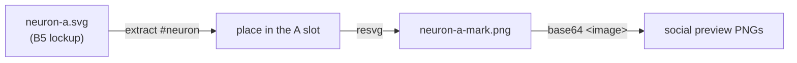

# 🎨 NEAT-AI brand

Shared visual identity for the NEAT-AI repository family. This directory is the
**canonical home** for the family's brand assets — they live in the hub
repository so every sibling repo pulls from one source instead of a copy.

Previously these files lived in
[NEAT-AI-Lamarck](https://github.com/stSoftwareAU/NEAT-AI-Lamarck) (the repo
that produced them); they moved here under NEAT-AI-Lamarck Issue #149.

## Social previews

**1280×640** previews live in [`social-previews/`](social-previews/). Each repo
keeps the same organic lockup (the signed-off neuron standing in for the first
**A**, teal/coral synapses wrapping the wordmark, capability pills) and adds a
subtitle, a one-line descriptor, and a small motif so siblings stay recognisable
as one family. The per-repo catalogue is in
[`social-previews/README.md`](social-previews/README.md).

Two variants of every preview ship (Issue #3764), plus a GitHub upload set:

| Variant                        | Use                                                                                                                                            |
| ------------------------------ | ---------------------------------------------------------------------------------------------------------------------------------------------- |
| `social-previews/*.png`        | **Canonical.** Transparent background — README headers, docs, slides, and anything that follows the reader's light/dark mode. Always 1280×640. |
| `social-previews/opaque/*.png` | Same artwork flattened onto the brand navy, for surfaces that cannot composite alpha. May exceed 1 MB.                                         |
| `social-previews/github/*.png` | GitHub's **Settings → General → Social preview** upload slot. 1280×640 **transparent** PNG, palette-quantised under 1 MB — GitHub refuses larger files. |
| `social-previews/source/*.png` | Optional large masters. Native resolution, never overwritten. Fitted onto the canvas by `scale_social_previews.ts`.                            |

The transparent set draws dark ink under a white halo, so the lockup reads on a
white page (the halo disappears) and on a dark one (the halo outlines the ink).
Uploading a preview into a repository's Social-preview slot is a manual step —
the API does not expose it.

## Transparent mark

[`neat-ai-social-organic-alt-transparent.png`](neat-ai-social-organic-alt-transparent.png)
is a transparent PNG of the organic hero, kept for compositing outside the
preview canvas.

## Regenerating the set

Generated lockups (no `source/` master) come from the SVG renderer:

```bash
deno run -A scripts/brand/render_social_previews.ts
```

Hand-authored previews keep a large master under
[`social-previews/source/`](social-previews/source/). Fit those onto 1280×640,
rebuild their opaque twins, and write the under-1 MB GitHub PNGs — without
touching the masters:

```bash
deno run -A scripts/brand/scale_social_previews.ts
```

Rebuild only the GitHub uploads from the current transparent PNGs:

```bash
deno run -A scripts/brand/scale_social_previews.ts --github-only
```

`render_social_previews.ts` skips any spec that already has a `source/` master,
so regenerating the generated set cannot clobber the hand-authored files.

- [`scripts/brand/preview_specs.ts`](../../scripts/brand/preview_specs.ts) — one
  row per PNG: subtitle, descriptor, motif.
- [`scripts/brand/preview_art.ts`](../../scripts/brand/preview_art.ts) — the
  shared neuron-A lockup and the two palettes.
- [`scripts/brand/preview_motifs.ts`](../../scripts/brand/preview_motifs.ts) —
  the per-repo motifs.
- [`docs/brand/templates/neuron-a.svg`](templates/neuron-a.svg) — the signed-off
  starting SVG; [`neuron-a-mark.png`](templates/neuron-a-mark.png) is the
  organic A embedded in every preview.

The mark is generated too — never hand-exported (Issue #3805):

```bash
deno run -A scripts/brand/render_neuron_mark.ts
```

It lifts the `neuron` group out of the template, drops the template's own
wordmark, and places the face in the A slot the generated lockup leaves open:



A hand-exported mark once shipped corrupt, and the rasteriser dropped it
silently — every preview rendered with a blank A.
`scripts/brand/png_integrity.ts` now checks the bytes before they are embedded,
so that fails loud instead.

The renderer rasterises with `@resvg/resvg-js` (a developer tool pulled from npm
at run time, not a library dependency) and lays text out from measured glyph
extents, so re-render on a host with Helvetica or DejaVu Sans available.

## Adding or changing an asset

`test/docs/BrandAssets.ts`, `test/docs/BrandTransparency.ts`, and
`test/docs/BrandGithubUploads.ts` guard the set behaviourally: the catalogue and
the directory must list the same files, every canonical preview must be
1280×640, the canonical set must really be transparent, every preview must have
an opaque twin and a transparent GitHub upload under 1 MB, and the links in
these two
documents must resolve. Add the image **and** its catalogue row in the same
change. Large `source/` masters are not required to be 1280×640.
