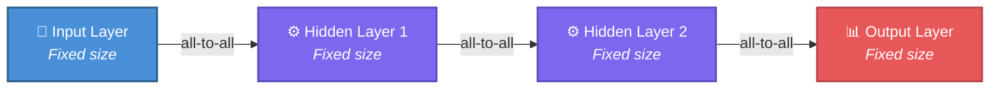
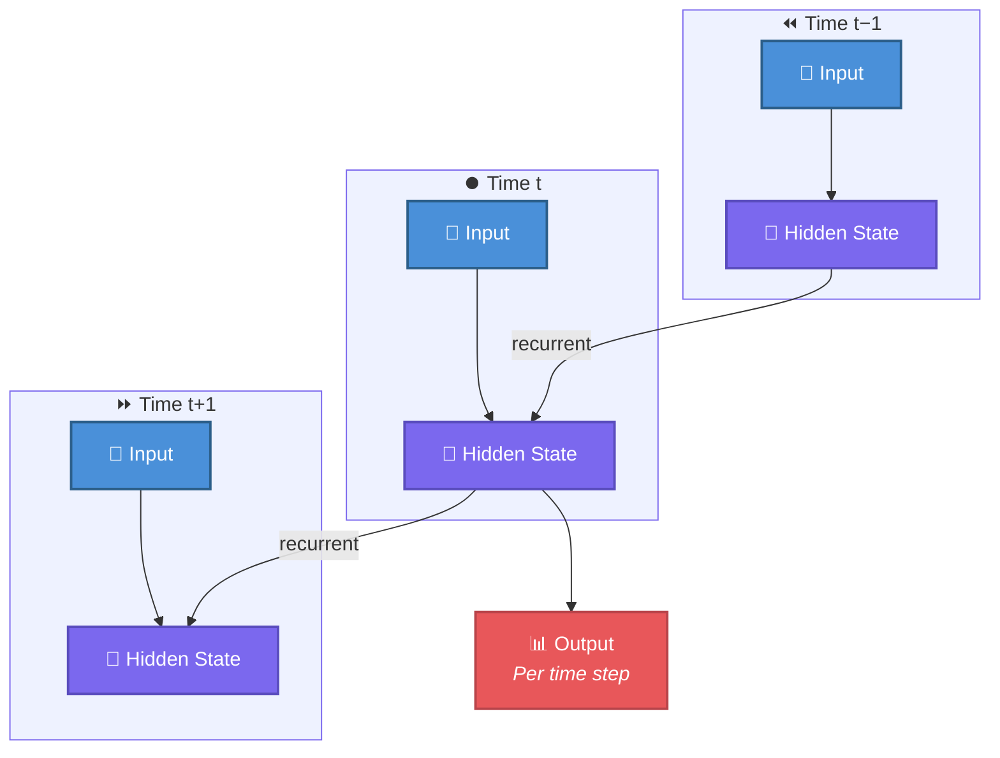
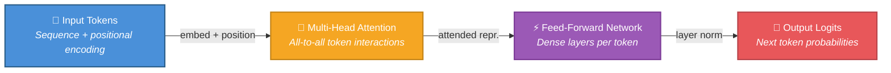
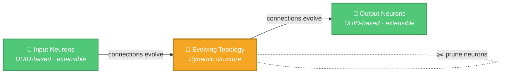

# 🏗️ Architectural Comparison

Part of the [Comparison hub](../../COMPARISON.md). This page contrasts the
**[NEAT-AI](../../AGENTS.md#-terminology)** topology with the four mainstream
network families it is most often compared against: feedforward networks, CNNs,
RNNs/LSTMs, and Transformers.

> [!IMPORTANT]
> **NEAT-AI ≠ NEAT.** **NEAT** means the original 2002 algorithm; **NEAT-AI**
> means this project — they are no longer the same thing. See the
> [NEAT vs NEAT-AI rule](../../AGENTS.md#-neat-vs-neat-ai--which-term-to-use)
> for the one canonical statement of the convention.

## 🧠 Traditional Feedforward Neural Networks

> **Key characteristics:** Structure defined before training · All-to-all
> connections between layers · No feedback loops · Static topology

**Reference**:
[Feedforward Neural Network](https://en.wikipedia.org/wiki/Feedforward_neural_network)

## 🖼️ Convolutional Neural Networks (CNNs)

```mermaid
graph LR
    I["🖼️ Input Image<br/><i>Fixed grid</i>"]
    C["🔍 Convolution Layers<br/><i>Spatial filters</i>"]
    P["📐 Pooling Layers<br/><i>Downsample</i>"]
    FC["🧠 Fully Connected<br/><i>Classification</i>"]
    OUT["🏷️ Predictions<br/><i>Class scores</i>"]

    I -->|"shared weights"| C
    C -->|"feature maps"| P
    P -->|"flattened"| FC
    FC -->|"softmax"| OUT

    style I fill:#4A90D9,stroke:#2C5F8A,color:#fff,stroke-width:2px
    style C fill:#F5A623,stroke:#C48418,color:#fff,stroke-width:2px
    style P fill:#7B68EE,stroke:#5A4DBE,color:#fff,stroke-width:2px
    style FC fill:#48A999,stroke:#2E7A6E,color:#fff,stroke-width:2px
    style OUT fill:#E8575A,stroke:#B8444A,color:#fff,stroke-width:2px
```

> **Key characteristics:** Designed for spatial data (images) · Shared weights
> via convolution · Approximate translation invariance · Fixed architecture per
> layer type

**Reference**:
[Convolutional Neural Network](https://en.wikipedia.org/wiki/Convolutional_neural_network)

## 🔄 Recurrent Neural Networks (RNNs/LSTMs)

> **Key characteristics:** Processes sequences · Maintains a hidden state
> (memory) · Fixed recurrent structure · Can suffer from vanishing or exploding
> gradients

**Reference**:
[Recurrent Neural Network](https://en.wikipedia.org/wiki/Recurrent_neural_network)

## 🤖 Transformer/LLM Architecture

> **Key features:** Self-attention mechanism (all tokens attend to all tokens) ·
> Positional encoding for order · Multi-head attention · Fixed architecture,
> often at massive scale (billions of parameters) · Pre-trained on large
> corpora, then fine-tuned

**Reference**:
[Transformer (machine learning model)](https://en.wikipedia.org/wiki/Transformer_(machine_learning_model))

## 🧬 NEAT-AI Architecture

> **NEAT-AI vs standard NEAT:** NEAT-AI inherits the evolving-topology core from
> standard NEAT and adds UUID-keyed input/output neurons (so features can be
> added without restarting), error-guided structural mutation, MCMC mutation
> acceptance, gradient-based weight optimisation, and synthetic synapses for
> temporary densification.
>
> **NEAT-AI vs fixed-architecture nets:** ✓ Topology evolves during training · ✓
> Connections can be added/removed dynamically · ✓ Neurons can be added/pruned
> automatically · ✓ Structure adapts to problem complexity · ✓ No predetermined
> architecture · ✓ Can handle non-differentiable objectives.

**Visualisation**: See the
[interactive visualisation](https://stsoftwareau.github.io/NEAT-AI/index.html).

## 🔗 Related comparison pages

- [Training paradigms](./TRAINING_PARADIGMS.md) — how each family is trained.
- [What NEAT-AI implements](./IMPLEMENTED.md) — the full feature breakdown.
- [References](./REFERENCES.md) — supporting literature.
