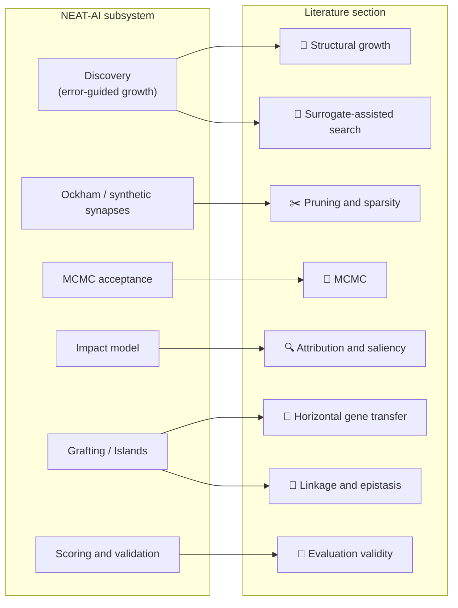

# 📚 References and Further Reading

Part of the [Comparison hub](../../COMPARISON.md). Consolidated supporting
references for every external claim made across the comparison sub-documents.

> [!IMPORTANT]
> **NEAT-AI ≠ NEAT.** **NEAT** means the original 2002 algorithm; **NEAT-AI**
> means this project — they are no longer the same thing. See the
> [NEAT vs NEAT-AI rule](../../AGENTS.md#-neat-vs-neat-ai--which-term-to-use)
> for the one canonical statement of the convention.

**How to read this page.** Each section **leads with the primary source** — the
paper that introduced the idea — followed by later work and, last, a Wikipedia
or tutorial link as orientation. The orientation links are deliberate: this
documentation set assumes no prior expertise, so a reader who has never met
Metropolis-Hastings should have somewhere gentle to start. They are just not the
citation. Where NEAT-AI borrows a result outside the conditions it was proved
under, the entry says so.

## 🧬 NEAT algorithm (standard NEAT)

- [Evolving Neural Networks through Augmenting Topologies](http://nn.cs.utexas.edu/downloads/papers/stanley.ec02.pdf)
  — Stanley & Miikkulainen (2002) — **the foundational paper**; innovation
  numbers, speciation, complexification from a minimal start.
- [Evolving Neural Networks](https://www.cs.utexas.edu/users/ai-lab/?neat) — UT
  Austin NEAT Lab — the authors' own follow-on work.
- [NEAT (Wikipedia)](https://en.wikipedia.org/wiki/Neuroevolution_of_augmenting_topologies)
  — orientation.

## 🔬 Neuroevolution

Where the field went after 2002 — the modern comparison points for any claim
that NEAT-AI is competitive.

- [Evolution Strategies as a Scalable Alternative to Reinforcement Learning](https://arxiv.org/abs/1703.03864)
  — Salimans et al. (2017) — parameter-space evolution at scale, with the
  rank-based fitness shaping NEAT-AI also uses.
- [Deep Neuroevolution: Genetic Algorithms are a Competitive Alternative for Training Deep Neural Networks](https://arxiv.org/abs/1712.06567)
  — Such et al. (2017).
- [Abandoning Objectives: Evolution through the Search for Novelty Alone](https://doi.org/10.1162/EVCO_a_00025)
  — Lehman & Stanley (2011) — novelty search; behaviour, not fitness, as the
  selection signal.
- [Illuminating Search Spaces by Mapping Elites](https://arxiv.org/abs/1504.04909)
  — Mouret & Clune (2015) — MAP-Elites; a quality-diversity archive rather than
  a single incumbent.
- [Completely Derandomized Self-Adaptation in Evolution Strategies](https://doi.org/10.1162/106365601750190398)
  — Hansen & Ostermeier (2001) — CMA-ES, the standard continuous-optimisation
  baseline.
- [Large-Scale Evolution of Image Classifiers](https://arxiv.org/abs/1703.01041)
  — Real et al. (2017).
- [Neuroevolution: A Different Kind of Deep Learning](https://www.oreilly.com/radar/neuroevolution-a-different-kind-of-deep-learning/)
  — O'Reilly article — orientation.

## 🧠 Traditional neural networks

- [Learning Representations by Back-Propagating Errors](https://doi.org/10.1038/323533a0)
  — Rumelhart, Hinton & Williams (1986) — the primary source for the gradient
  training NEAT-AI runs inside its memetic loop.
- [Deep Learning](https://www.deeplearningbook.org/) — Goodfellow, Bengio &
  Courville — comprehensive textbook.
- [Neural Networks and Deep Learning](http://neuralnetworksanddeeplearning.com/)
  — Michael Nielsen — beginner-friendly.
- [Gradient Descent Optimization](https://ruder.io/optimizing-gradient-descent/)
  — Sebastian Ruder — survey of the optimiser family.
- [Backpropagation](https://en.wikipedia.org/wiki/Backpropagation) —
  orientation.

## 🤖 Modern LLMs and Transformers

- [Attention Is All You Need](https://arxiv.org/abs/1706.03762) — Vaswani et al.
  (2017) — **the Transformer paper**.
- [BERT](https://arxiv.org/abs/1810.04805) — Devlin et al. (2018).
- [Improving Language Understanding by Generative Pre-Training](https://cdn.openai.com/research-covers/language-unsupervised/language_understanding_paper.pdf)
  — Radford et al. (2018) — the original GPT paper.
- [The Illustrated Transformer](https://jalammar.github.io/illustrated-transformer/)
  — Jay Alammar — visual explanation, orientation.

## 🧬 Memetic algorithms

Evolution plus per-individual local search — what NEAT-AI calls memetic
evolution (see the
[themed-terms glossary](../GLOSSARY.md#-themed--house-terms)).

- Moscato (1989), _On Evolution, Search, Optimization, Genetic Algorithms and
  Martial Arts: Towards Memetic Algorithms_ — Caltech Concurrent Computation
  Program, Report C3P 826 — the primary source that named the family. No stable
  public copy; cite by report number.
- [Memetic Algorithms for Optimization](https://link.springer.com/chapter/10.1007/978-3-540-72960-0_1)
  — Krasnogor & Smith (2005) — later survey treatment.
- [Memetic Algorithms](https://en.wikipedia.org/wiki/Memetic_algorithm) —
  orientation.

## 🧬 Lamarckian and Baldwinian evolution

Whether what an individual learns is written back into its genome. NEAT-AI
writes trained weights back, which is the Lamarckian choice, and the trade-off
below is the reason that choice is not free.

- [How Learning Can Guide Evolution](https://www.cs.toronto.edu/~hinton/absps/evolution.htm)
  — Hinton & Nowlan (1987) — the Baldwin effect made computational: learning
  reshapes the fitness landscape evolution searches, without any write-back.
- [Lamarckian Evolution, the Baldwin Effect and Function Optimization](https://doi.org/10.1007/3-540-58484-6_245)
  — Whitley, Gordon & Mathias (1994) — the direct comparison. Lamarckian
  write-back converges faster but costs population diversity; Baldwinian
  learning keeps diversity and converges more slowly.
- [Meta-Lamarckian Learning in Memetic Algorithms](https://doi.org/10.1109/TEVC.2003.819944)
  — Ong & Keane (2004) — choosing _which_ local search to apply, adaptively,
  rather than fixing one. Builds on Moscato's memetic framing above.

## 🎲 Markov Chain Monte Carlo (MCMC)

Markov Chain Monte Carlo (MCMC) is the sampling family NEAT-AI borrows its
accept/reject rule from.

- [Equation of State Calculations by Fast Computing Machines](https://doi.org/10.1063/1.1699114)
  — Metropolis, Rosenbluth, Rosenbluth, Teller & Teller (1953) — **the primary
  source** for the temperature-scaled acceptance rule itself.
- [Monte Carlo Sampling Methods Using Markov Chains and Their Applications](https://doi.org/10.1093/biomet/57.1.97)
  — Hastings (1970) — the generalisation to asymmetric proposals.
- [Optimization by Simulated Annealing](https://doi.org/10.1126/science.220.4598.671)
  — Kirkpatrick, Gelatt & Vecchi (1983) — the actual ancestor of
  temperature-scaled acceptance _in a search algorithm_, which is how NEAT-AI
  uses it.
- [Weak Convergence and Optimal Scaling of Random Walk Metropolis Algorithms](https://projecteuclid.org/journals/annals-of-applied-probability/volume-7/issue-1/Weak-convergence-and-optimal-scaling-of-random-walk-Metropolis-algorithms/10.1214/aoap/1034625254.full)
  — Roberts, Gelman & Gilks (1997) — optimal scaling for random-walk Metropolis
  on smooth high-dimensional targets, the source of the ~23.4% figure. **Note:**
  the result is about random-walk Metropolis, not about evolutionary-algorithm
  acceptance rates; NEAT-AI's ~23.4% target is a heuristic borrowed from it, not
  a consequence of it.
- [Metropolis-Hastings Algorithm](https://en.wikipedia.org/wiki/Metropolis%E2%80%93Hastings_algorithm)
  and
  [Markov Chain Monte Carlo](https://en.wikipedia.org/wiki/Markov_chain_Monte_Carlo)
  — orientation.

## ✂️ Pruning and sparsity

The literature behind removing structure that does not pay for itself — the
Ockham sibling, synthetic synapses, and the cost-of-growth penalty.

- [Optimal Brain Damage](https://proceedings.neurips.cc/paper/1989/hash/6c9882bbac1c7093bd25041881277658-Abstract.html)
  — LeCun, Denker & Solla (1989) — **the primary source**: prune by second-order
  saliency, not by weight magnitude.
- [Second Order Derivatives for Network Pruning: Optimal Brain Surgeon](https://proceedings.neurips.cc/paper/1992/hash/303ed4c69846ab36c2904d3ba8573050-Abstract.html)
  — Hassibi & Stork (1993) — the full-Hessian successor, with a weight update
  that compensates for what was removed.
- [Pruning Convolutional Neural Networks for Resource Efficient Inference](https://arxiv.org/abs/1611.06440)
  — Molchanov et al. (2017), extended by
  [Importance Estimation for Neural Network Pruning](https://arxiv.org/abs/1906.10771)
  (2019) — Taylor-expansion pruning criteria, the cheap approximation of the two
  above.
- [Data-free Parameter Pruning for Deep Neural Networks](https://arxiv.org/abs/1507.06149)
  — Srinivas & Babu (2015) — merging functionally redundant neurons rather than
  deleting them.
- [DSD: Dense-Sparse-Dense Training for Deep Neural Networks](https://arxiv.org/abs/1607.04381)
  — Han et al. (2017) — prune, retrain, then re-densify. The ancestor of
  synthetic synapses.
- [Scalable Training of Artificial Neural Networks with Adaptive Sparse Connectivity](https://www.nature.com/articles/s41467-018-04316-3)
  — Mocanu et al. (2018), SET; and
  [Rigging the Lottery: Making All Tickets Winners](https://arxiv.org/abs/1911.11134)
  — Evci et al. (2020), RigL — dynamic sparse training, where connections are
  dropped and regrown throughout training.
- [The Lottery Ticket Hypothesis](https://arxiv.org/abs/1803.03635) — Frankle &
  Carbin (2019) — iterated prune-and-retest.
- [Modeling by Shortest Data Description](https://doi.org/10.1016/0005-1098%2878%2990005-5)
  — Rissanen (1978); and
  [Keeping Neural Networks Simple by Minimizing the Description Length of the Weights](https://doi.org/10.1145/168304.168306)
  — Hinton & van Camp (1993) — minimum description length (MDL), the formal
  counterpart of a cost-of-growth penalty.

## 🌱 Structural growth

Adding structure where the error says it is needed — the literature behind
error-guided Discovery.

- [The Cascade-Correlation Learning Architecture](https://proceedings.neurips.cc/paper_files/paper/1989/hash/69adc1e107f7f7d035d7baf04342e1ca-Abstract.html)
  — Fahlman & Lebiere (1990) — **Discovery's direct ancestor**: each new unit is
  chosen to maximise correlation with the residual error, then frozen.
- [Net2Net: Accelerating Learning via Knowledge Transfer](https://arxiv.org/abs/1511.05641)
  — Chen, Goodfellow & Shlens (2016) — function-preserving widening and
  deepening, so growth costs no accuracy at the moment it happens.
- [Firefly Neural Architecture Descent: a General Approach for Growing Neural Networks](https://arxiv.org/abs/2102.08574)
  — Wu et al. (2020) — splitting existing neurons along the steepest descent
  direction.
- [GradMax: Growing Neural Networks using Gradient Information](https://arxiv.org/abs/2201.05125)
  — Evci et al. (2022) — initialising new units to maximise the gradient norm.

## 🎯 Surrogate-assisted search and racing

Propose cheaply, accept expensively — the architecture of the Discovery pipeline
and of every sampled screen in the fleet.

- [Surrogate-Assisted Evolutionary Computation: Recent Advances and Future Challenges](https://doi.org/10.1016/j.swevo.2011.03.001)
  — Jin (2011) — **the primary source** and the name for the pattern: a cheap
  model proposes, the expensive true objective confirms.
- [Efficient Global Optimization of Expensive Black-Box Functions](https://doi.org/10.1023/A:1008306431147)
  — Jones, Schonlau & Welch (1998) — expected improvement as an acquisition
  function; how to decide what is worth evaluating for real.
- [Hoeffding Races: Accelerating Model Selection Search for Classification and Function Approximation](https://proceedings.neurips.cc/paper_files/paper/1993/hash/02a32ad2669e6fe298e607fe7cc0e1a0-Abstract.html)
  — Maron & Moore (1994); and
  [A Racing Algorithm for Configuring Metaheuristics](https://dl.acm.org/doi/10.5555/2955491.2955494)
  — Birattari et al. (2002), F-Race — drop candidates as soon as the evidence
  against them is statistically sufficient.
- [Non-stochastic Best Arm Identification and Hyperparameter Optimization](https://proceedings.mlr.press/v51/jamieson16.html)
  — Jamieson & Talwalkar (2016), successive halving; and
  [Hyperband](https://arxiv.org/abs/1603.06560) — Li et al. (2017) — budget
  allocation across candidates of unknown quality.
- [Future Paths for Integer Programming and Links to Artificial Intelligence](https://doi.org/10.1016/0305-0548%2886%2990048-1)
  — Glover (1986), tabu search — memory-based search, the ancestor of the
  discovery caches that stop NEAT-AI re-proposing what it has already tried.

## 🔍 Attribution and saliency

Deciding which part of a network is responsible for an outcome — the literature
behind the impact model.

- [On Pixel-Wise Explanations for Non-Linear Classifier Decisions by Layer-Wise Relevance Propagation](https://doi.org/10.1371/journal.pone.0130140)
  — Bach et al. (2015) — **the primary source** for propagating a decision back
  onto the units that produced it.
- [Learning Important Features Through Propagating Activation Differences](https://arxiv.org/abs/1704.02685)
  — Shrikumar, Greenside & Kundaje (2017), DeepLIFT — attribution against a
  reference activation rather than a raw gradient.
- [A Unified Approach to Interpreting Model Predictions](https://arxiv.org/abs/1705.07874)
  — Lundberg & Lee (2017), SHAP — the exact treatment of the non-additivity that
  NEAT-AI's impact discounting only approximates.
- [Revisiting the Importance of Individual Units in CNNs via Ablation](https://arxiv.org/abs/1806.02891)
  — Zhou et al. (2018) — measuring a unit's importance by deleting it and
  re-measuring, which is the empirical check on any attribution score.

## 📏 Evaluation validity

Whether a score obtained after thousands of adaptive comparisons still means
anything. Every accept/reject decision in an evolutionary run reuses the same
held-out data, so this is the section that governs how far any reported result
can be trusted.

- [The Reusable Holdout: Preserving Validity in Adaptive Data Analysis](https://doi.org/10.1126/science.aaa9375)
  — Dwork et al. (2015), _Science_ — **the primary source**: adaptive reuse of a
  holdout set destroys its validity, and a noise-adding mechanism can restore a
  bounded amount of it.
- [The Ladder: A Reliable Leaderboard for Machine Learning Competitions](https://arxiv.org/abs/1502.04585)
  — Blum & Hardt (2015) — only report an improvement when it clears a noise
  threshold; the practical form of the result above.
- [Flat Minima](https://doi.org/10.1162/neco.1997.9.1.1) — Hochreiter &
  Schmidhuber (1997) — sharpness of the found optimum as a proxy for
  generalisation.
- [On Large-Batch Training for Deep Learning: Generalization Gap and Sharp Minima](https://arxiv.org/abs/1609.04836)
  — Keskar et al. (2017); and
  [Sharpness-Aware Minimization](https://arxiv.org/abs/2010.01412) — Foret et
  al. (2021), SAM — measuring and then optimising for flatness directly.

## 🔗 Linkage and epistasis

Which genes must change together — the theory behind coordinated structural
discovery, and behind why changing one connection at a time stalls.

- [Learning Linkage](https://www.semanticscholar.org/paper/Learning-Linkage-Harik-Goldberg/2105a01fcda623e48b3a8129fc4add52ea97f5b2)
  — Harik & Goldberg (1997) — **the primary source**: discover which loci
  interact instead of assuming the encoding already groups them.
- [The Linkage Tree Genetic Algorithm](https://doi.org/10.1007/978-3-642-15844-5_27)
  — Thierens (2010) — build the dependency structure from the population and
  recombine along it.
- [Genetic Algorithms with Sharing for Multimodal Function Optimization](https://dl.acm.org/doi/10.5555/42512.42519)
  — Goldberg & Richardson (1987) — fitness sharing; the classical answer to a
  population collapsing onto one peak.

## 🧬 Horizontal gene transfer and breeding

- [Automated Software Transplantation](https://doi.org/10.1145/2771783.2771796)
  — Barr, Harman, Jia, Marginean & Petke (2015) — **the closest precedent** for
  grafting a working subtree out of one individual into another, including the
  problem of the transplant's dependencies.
- [Punctuated Equilibria: A Parallel Genetic Algorithm](https://libraopen.lib.virginia.edu/public_view/np1939186)
  — Cohoon, Hegde, Martin & Richards (1987); and
  [Distributed Genetic Algorithms](https://dblp.org/rec/conf/icga/Tanese89.html)
  — Tanese (1989) — the island model's primary sources: isolated subpopulations
  with periodic migration.
- [Cosine Similarity](https://en.wikipedia.org/wiki/Cosine_similarity) — the
  measure NEAT-AI uses for neuron alignment in inter-species breeding.
- [Horizontal Gene Transfer](https://en.wikipedia.org/wiki/Horizontal_gene_transfer)
  and [Island Model](https://en.wikipedia.org/wiki/Island_model) — orientation.

## ⚡ GPU acceleration

- [Metal Performance Shaders](https://developer.apple.com/metal/Metal-Performance-Shaders-Framework/)
  — Apple documentation.
- [wgpu Documentation](https://wgpu.rs/) — cross-platform GPU abstraction.
- [CUDA Programming Guide](https://docs.nvidia.com/cuda/cuda-c-programming-guide/)
  — NVIDIA documentation.

## 📖 Machine-learning fundamentals

- [Machine Learning Course](https://www.coursera.org/learn/machine-learning) —
  Andrew Ng (Coursera).
- [Fast.ai](https://www.fast.ai/) — practical deep-learning course.
- [3Blue1Brown — Neural Networks](https://www.youtube.com/playlist?list=PLZHQObOWTQDNU6R1_67000Dx_ZCJB-3pi)
  — visual explanations.

## 🔗 Related comparison pages

- [Comparison hub](../../COMPARISON.md) — the top-level overview.
- [What NEAT-AI implements](./IMPLEMENTED.md).
- [Unique approaches](./UNIQUE_APPROACHES.md).
- [Future work](./FUTURE_WORK.md).
