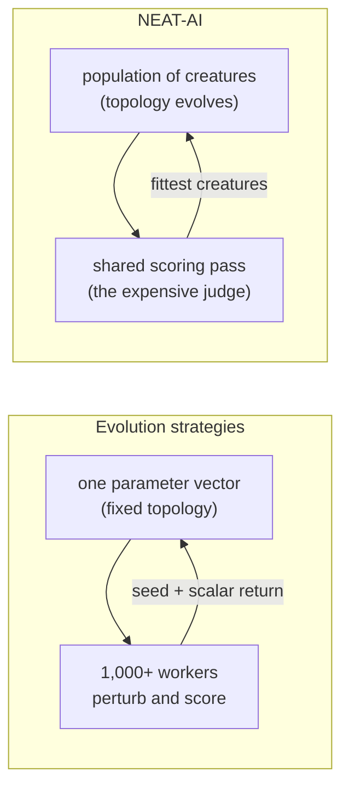

# 🎓 Training Paradigms

Part of the [Comparison hub](../../COMPARISON.md). This page compares how
**[NEAT-AI](../../AGENTS.md#-terminology)** is trained against the gradient-only
paradigm of traditional neural networks, against the modern gradient-free
alternatives (evolution strategies and quality-diversity), and explains where
NEAT-AI sits in the reinforcement-learning landscape.

> [!IMPORTANT]
> **NEAT-AI ≠ NEAT.** **NEAT** means the original 2002 algorithm; **NEAT-AI**
> means this project — they are no longer the same thing. See the
> [NEAT vs NEAT-AI rule](../../AGENTS.md#-neat-vs-neat-ai--which-term-to-use)
> for the one canonical statement of the convention.

## 🧠 Traditional Neural Networks

**Training approach**:

- **Backpropagation**: Gradient-based weight updates using the chain rule.
- **Fixed Architecture**: Structure determined before training begins.
- **Batch Training**: Process multiple samples simultaneously for efficiency.
- **Static Learning**: Architecture doesn't change during training.
- **Transfer Learning**: Pre-trained models can be fine-tuned for new tasks.
- **Supervised Learning**: Requires labelled datasets.

**Strengths**:

- Fast convergence with gradient descent.
- Proven scalability to billions of parameters.
- Rich ecosystem of tools and frameworks.
- Highly optimised for GPU parallel processing.

**Weaknesses**:

- Requires manual architecture design.
- Needs differentiable loss functions.
- Catastrophic forgetting in continuous learning.
- Limited interpretability (black box).
- Rigid input/output dimensions.

## 🧬 NEAT-AI

**Training approach** (standard NEAT contribution in italics; everything else is
a NEAT-AI extension):

- _Genetic operations: mutation, crossover, speciation (standard NEAT)._
- **Hybrid Approach**: combines evolutionary search with backpropagation —
  standard NEAT has no gradient step.
- **Dynamic Architecture**: structure evolves during training (inherits standard
  NEAT's evolving topology).
- **Backpropagation**: gradient-based weight optimisation (fully implemented;
  not present in standard NEAT).
- **Memetic Learning**: records and reuses successful weight patterns; on
  NEAT-AI's internal workloads this hybrid step has often converged faster than
  pure backpropagation in practice.
- **Error-Guided Discovery**: GPU-accelerated structural hints based on error
  analysis — standard NEAT mutates structure uniformly at random.
- **Population-Based**: evolves multiple networks simultaneously (inherited from
  standard NEAT).
- **Regularisation**: dropout, L1/L2 weight & bias decay, sparse training,
  neuron pruning, and cost-of-growth penalty.
- **Transfer Learning**: checkpoint export/import with weight freezing for
  fine-tuning on related tasks.
- **MCMC Mutation Acceptance**: Metropolis-Hastings criterion with adaptive
  temperature tuning for accepting/rejecting mutations — standard NEAT accepts
  all mutations unconditionally.
- **Synthetic Synapses**: temporary dense inter-layer connectivity during
  backpropagation, pruned after training.
- **Advanced Breeding**: input-weight crossover, subgraph transplantation
  (horizontal gene transfer), diversity-driven breeding, and cosine-similarity
  neuron alignment for genetically incompatible creatures — standard NEAT
  refuses crossover between incompatible parents.

**Strengths**:

- Automatic architecture search.
- Adaptive complexity (grows/shrinks as needed).
- Works with non-differentiable objectives.
- Extensible inputs/outputs via UUID indexing.
- Lifelong learning support for long-running deployments (continuous training as
  new data arrives), with the degree of catastrophic forgetting depending on how
  you construct and refresh your training data.
- Can trace evolutionary history.
- Transfer learning via checkpoint export/import with UUID-based neuron mapping.
- ONNX export for interoperability with standard ML tooling.

**Weaknesses**:

- More computationally expensive (population-based).
- Slower convergence than pure gradient descent.
- Limited scalability compared to massive transformers.
- Less efficient for pure parallel processing.

## 🧭 Modern Gradient-Free Training

Standard NEAT (2002) is not the live alternative to NEAT-AI. Academic
neuroevolution largely moved to **evolution strategies (ES)** and
**quality-diversity (QD)** methods, so out-scoring a twenty-four-year-old
algorithm is not the comparison a knowledgeable reader wants — "why not ES?" is.
This section answers it, including the parts where the answer does not flatter
NEAT-AI.

### 📈 Evolution strategies (ES)

[Salimans, Ho, Chen, Sidor & Sutskever (2017)](https://arxiv.org/abs/1703.03864)
perturb a single fixed-length parameter vector with Gaussian noise, score each
perturbation on the task, and step the vector along a return-weighted average of
those perturbations. No backpropagation, no value function, and no structural
change: the architecture is chosen up front and only the numbers move.

The paper's headline result is an engineering one. Every worker can regenerate
any other worker's perturbation from a shared random seed, so workers exchange
**a random seed and a scalar return** instead of a whole parameter vector. That
collapses the communication cost enough to scale past a thousand parallel
workers — which is how the paper solved 3D humanoid walking in about ten minutes
of wall-clock time.

NEAT-AI already borrows one piece of that paper. The centred rank transform is
what `mcmc.mcmcAdvantageMode: "rankShaped"` applies to a proposal before the
MCMC (Markov Chain Monte Carlo) acceptance test, so one outlier score cannot
dominate the decision — see
[rank shaping in the glossary](../GLOSSARY.md#-themed--house-terms) and
[what the temperature means](../config/MUTATION_ADAPTATION.md#-what-the-temperature-actually-means).

### 🎨 Quality-diversity (QD)

Novelty search — [Lehman & Stanley (2011)](https://doi.org/10.1162/EVCO_a_00025)
— selects on behavioural novelty rather than on fitness at all.
[MAP-Elites](https://arxiv.org/abs/1504.04909) (Multi-dimensional Archive of
Phenotypic Elites) — Mouret & Clune (2015) — keeps the best solution found in
each cell of a behaviour space. Both produce an **archive of behaviourally
diverse elites** instead of a single champion, and both frequently find a better
single solution than a hill-climb aiming for exactly that.

NEAT-AI has speciation, fitness sharing and islands, but every optimiser in the
deployment still drives one incumbent forward. The archive is a named gap, not a
feature — see
[quality-diversity and behavioural archives](./FUTURE_WORK.md#1--quality-diversity-and-behavioural-archives).

### 📐 CMA-ES

[Hansen & Ostermeier (2001)](https://doi.org/10.1162/106365601750190398) —
Covariance Matrix Adaptation Evolution Strategy (CMA-ES) — is the
adaptive-covariance lineage and the standard baseline for continuous black-box
optimisation. It learns the covariance of its sampling distribution as it goes,
so the search shape follows the landscape rather than staying isotropic. Its
rank-μ update ranks the cohort before updating that distribution, which is the
same rank-not-magnitude idea NEAT-AI's rank-shaped acceptance uses. Like ES, it
optimises a fixed-length vector; topology is not its problem.

### ⚖️ The honest scoreboard

| Axis                           | ES                                                                | NEAT-AI                                                        |
| ------------------------------ | ----------------------------------------------------------------- | -------------------------------------------------------------- |
| Evolves topology               | ❌ fixed parameter vector                                         | ✅ structure grows and shrinks during the run                  |
| Parallel scaling               | ✅ 1,000+ workers on seed-and-scalar exchange                     | 🟡 islands exchanging whole creatures                          |
| Sample efficiency              | ❌ worse than reinforcement learning, by the authors' own account | 🟡 worse than gradient descent wherever a good gradient exists |
| Wall-clock through parallelism | ✅ the paper's central claim                                      | ✅ the deployment's central bet                                |
| Non-differentiable objectives  | ✅                                                                | ✅                                                             |

Legend: ✅ supported · 🟡 partial · ❌ not supported.

Both halves of that table matter. ES beats NEAT-AI on the axis NEAT-AI would
most like to claim — its workers ship a seed and a number, while NEAT-AI's
islands ship whole creatures — and ES cannot do the thing NEAT-AI actually
exists to do, which is to search architectures rather than tune a vector whose
shape someone already chose.

### ⏱️ Sample efficiency versus wall-clock — the same bargain

The ES paper does not claim to be more sample-efficient than reinforcement
learning. It argues the opposite, and then argues that the deficit is
affordable, because the perturbations are independent and a thousand machines
can evaluate them at once. The binding budget is wall-clock time, not sample
count.

NEAT-AI makes that same bargain one level up, and it is a deliberate choice
rather than an accident: proposals are cheap and plentiful — mutations across a
whole population, on roughly twenty machines evolving independently and
exchanging their fittest creatures — while the scoring pass that accepts or
rejects one is the expensive, shared judge. That is the
[surrogate-assisted pattern](./REFERENCES.md#-surrogate-assisted-search-and-racing):
propose cheaply, confirm expensively. Read on the sample-efficiency axis alone
this looks like the "slower convergence" entry in
[Pros and cons](./PROS_AND_CONS.md#-neat-ai--cons); read on wall-clock with the
population running in parallel, it is the trade the design was made to take.

Both loops spend samples freely to buy wall-clock; they differ in what the loop
is allowed to change.

## 🎮 Reinforcement Learning

NEAT-AI is a **direct policy search** method for episode-based reinforcement
learning (RL): each creature is a candidate policy, and the rollout score
(cumulative reward, optionally with shaping penalties) is its fitness. Compared
to value-based RL ([DQN](https://www.nature.com/articles/nature14236)) and
policy-gradient methods ([PPO](https://arxiv.org/abs/1707.06347), REINFORCE),
NEAT-AI (like standard NEAT) does not learn a value function and does not
differentiate through the policy — both evolve the network's topology and
weights directly against a scalar episode score. This means the reward can be
sparse, discontinuous, or provided only by a black-box simulator; the action
decoder need not be differentiable; and the policy architecture grows with the
task instead of being chosen up front.

The cost is sample efficiency per environment step — when a dense,
differentiable reward is available, DQN or PPO usually converge in fewer
simulator steps. Where NEAT-AI wins is in parallelism (rollouts are
embarrassingly parallel across the population) and robustness to
non-differentiable objectives. The streaming primitive is `Creature.activate`,
called once per simulator tick; the canonical episode-rollout loop and
worked-example link are documented in
[REINFORCEMENT_LEARNING.md](../REINFORCEMENT_LEARNING.md).

## 🔗 Related comparison pages

- [Architectural comparison](./ARCHITECTURES.md) — the topologies being trained.
- [Unique approaches](./UNIQUE_APPROACHES.md) — memetic evolution, MCMC,
  synthetic synapses, and more.
- [Pros and cons](./PROS_AND_CONS.md) — the trade-offs distilled.
- [References](./REFERENCES.md) — supporting literature.
