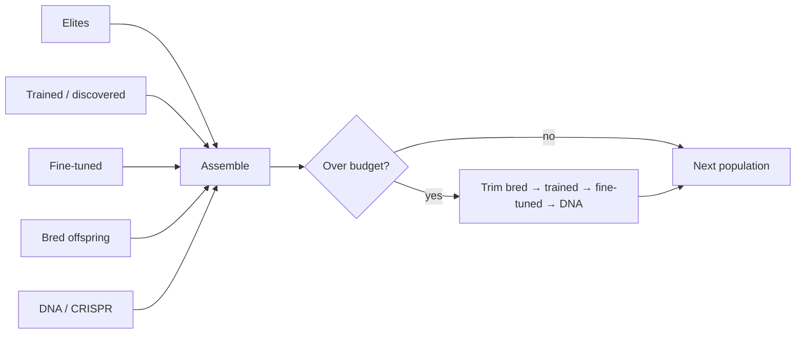

# 🧬 Core evolution parameters

The headline parameters that drive the NEAT (NeuroEvolution of Augmenting
Topologies) outer loop: how big the population is, how aggressively it mutates,
when to stop, and how growth is penalised. These options live on the top-level
`NeatOptions` object and are validated by `createNeatConfig()`.

```ts
import { createNeatConfig } from "@stsoftware/neat-ai";

const config = createNeatConfig({
  populationSize: 50,
  iterations: 1_000,
  targetError: 0.05,
  mutationRate: 0.3,
  elitism: 1,
  costOfGrowth: 0.000_000_1,
});
```

## 📊 Quick reference

| Option                            | Type       | Default            | Description                                                                                               |
| --------------------------------- | ---------- | ------------------ | --------------------------------------------------------------------------------------------------------- |
| `costName`                        | `CostName` | `"MSE"`            | Cost/fitness function name                                                                                |
| `populationSize`                  | `integer`  | `50`               | Target population size (min: 2)                                                                           |
| `iterations`                      | `integer`  | `MAX_SAFE_INTEGER` | Maximum generations to evolve                                                                             |
| `targetError`                     | `number`   | `0.05`             | Stop when error falls below this (0–1)                                                                    |
| `mutationRate`                    | `number`   | `0.3`              | Probability of mutating a gene (>0.001)                                                                   |
| `mutationAmount`                  | `integer`  | `1`                | Number of changes per gene during mutation (min: 1)                                                       |
| `elitism`                         | `integer`  | `1`                | Top-performing individuals retained each generation (min: 1)                                              |
| `costOfGrowth`                    | `number`   | `0.0000001`        | Penalty per structural addition (min: 0)                                                                  |
| `timeoutMinutes`                  | `integer`  | `0`                | Maximum training time in minutes (0 = unlimited)                                                          |
| `feedbackLoop`                    | `boolean`  | `false`            | Enable recurrent connections                                                                              |
| `debug`                           | `boolean`  | `false`            | Enable debug mode (slower)                                                                                |
| `verbose`                         | `boolean`  | `false`            | Enable verbose logging                                                                                    |
| `creativeThinkingConnectionCount` | `integer`  | `1`                | New links during creative thinking phase                                                                  |
| `geneticCompatibilityThreshold`   | `number`   | `0.3`              | Speciation distance threshold (0–1)                                                                       |
| `sparseRatio`                     | `number`   | `random × random`  | Fraction of neurons selected for sparse activation (0–1)                                                  |
| `globalBreedingRate`              | `number`   | `random`           | Cross-species vs within-species breeding ratio (0–1)                                                      |
| `maxCRISPRsPerGeneration`         | `integer`  | `1`                | Max CRISPR (Clustered Regularly Interspaced Short Palindromic Repeats) injections per generation (min: 1) |

## 🧬 Population and selection

### `populationSize`

**Default: 50** | Type: integer | Min: 2

The number of creatures (neural networks) in the population. Larger populations
explore more of the search space but consume more memory and compute per
generation.

- **Small (10–30):** Fast prototyping, quick iteration.
- **Medium (50–100):** General-purpose training.
- **Large (200+):** Production runs where solution quality matters more than
  speed.

#### Population size is a hard cap (Issue #3508)

Each generation is assembled from five slices: elites, creatures returned by
completed training / discovery / replay tasks, fine-tuned variants, bred
offspring, and CRISPR (DNA) enhanced creatures. Heavy-pool results arrive
asynchronously — a single training task can return up to four creatures — so the
assembled population is capped at the effective population size (see
[`adaptivePopulation`](./POPULATION.md) when adaptive sizing is enabled).

When the slices overflow, the surplus is trimmed weakest-contribution first:
bred offspring, then trained, then fine-tuned, then DNA. Elites are never
trimmed, so the only way the population can exceed the cap is an `elitism`
setting larger than `populationSize`.



### `elitism`

**Default: 1** | Type: integer | Min: 1

Number of top-performing creatures guaranteed to survive into the next
generation unchanged. Ensures the best solution found so far is never lost.

### `geneticCompatibilityThreshold`

**Default: 0.3** | Type: number | Range: 0–1

Controls how different two creatures must be to belong to different species.
Lower values create more species (finer-grained niching); higher values create
fewer, broader species.

### `globalBreedingRate`

**Default: random** | Type: number | Range: 0–1

Controls the balance between cross-species breeding and within-species breeding.
Higher values favour more cross-species mating. Randomised by default to
maintain population diversity.

### `sparseRatio`

**Default: random × random** | Type: number | Range: 0–1

Fraction of neurons selected for sparse activation. Randomised by default so
each creature gets a different sparsity level, promoting diversity.

## 🛑 Stopping conditions

### `iterations`

**Default: MAX_SAFE_INTEGER** | Type: integer | Min: 0

Maximum number of generations to evolve. Combined with `targetError` and
`timeoutMinutes`, provides three independent stopping conditions. Whichever
condition is met first stops evolution.

### `targetError`

**Default: 0.05** | Type: number | Range: 0–1

Evolution stops when the best creature's error falls below this threshold. Lower
values demand higher accuracy but may require significantly more generations.

### `timeoutMinutes`

**Default: 0 (unlimited)** | Type: integer | Min: 0

Maximum total minutes for the training loop. Set to `0` for unlimited.

## 🎲 Mutation rates

### `mutationRate`

**Default: 0.3** | Type: number | Min: >0.001

Probability of applying a mutation to each gene. Higher rates increase
exploration but may disrupt good solutions. Plateau detection and stability
adaptation can dynamically adjust this during evolution — see
[Mutation adaptation](./MUTATION_ADAPTATION.md).

### `mutationAmount`

**Default: 1** | Type: integer | Min: 1

Number of changes applied per gene during a single mutation event. Higher values
create more dramatic changes per generation.

### `creativeThinkingConnectionCount`

**Default: 1** | Type: integer

Number of new links proposed during the creative-thinking phase per generation.

### `maxCRISPRsPerGeneration`

**Default: 1** | Type: integer | Min: 1

Maximum number of CRISPR injections applied per generation. CRISPRs cycle across
generations instead of being permanently consumed. Increase this value to apply
multiple CRISPR injections per generation for faster structural convergence.

## 📐 Growth penalties and bounds

### `costOfGrowth`

**Default: 0.0000001 (1e-7)** | Type: number | Min: 0

Penalty applied to creatures for structural complexity. Each new synapse costs 1
× `costOfGrowth`; each new neuron costs approximately 3 × `costOfGrowth` (two
synapses plus the neuron body). This biases evolution towards simpler networks
when accuracy is comparable.

Set to `0` to disable the growth penalty entirely.

### `costName`

**Default: "MSE"** | Type: CostName

The cost (fitness) function used to evaluate creatures. Common options include
`"MSE"` (Mean Squared Error) and others defined in `src/costs/`.

## 🔁 Topology mode

### `feedbackLoop`

**Default: false** | Type: boolean

Enables recurrent (feedback) connections, allowing the network to maintain
internal state across activations. Required for time-series tasks. When
disabled, the network operates in forward-only mode.

> [!WARNING]
> When `feedbackLoop` is `true`, `disableRandomSamples` must also be `true`.
> This constraint is enforced by validation and `createNeatConfig()` will throw
> if violated.

## 🐛 Diagnostics

### `debug`

**Default: false** | Type: boolean

Enable debug-mode invariants and extra runtime checks. Significantly slower — do
not use in production.

### `verbose`

**Default: false** | Type: boolean

Enable verbose logging. When `true`, `log` defaults to `1` (log every
iteration). See [Logging](./LOGGING.md).

## ✅ Validation rules

- `populationSize` must be at least 2.
- `mutationRate` must be greater than `0.001`.
- `targetError` is clamped to the range `[0, 1]`.
- When `feedbackLoop` is `true`, `disableRandomSamples` must also be `true`.

## 👀 See also

- [Configuration presets](./PRESETS.md) — pre-built profiles built from these
  options.
- [Mutation adaptation](./MUTATION_ADAPTATION.md) — adaptive mutation
  thresholds, plateau detection, MCMC, and per-creature hyperparameter
  evolution.
- [Population sizing](./POPULATION.md) — adaptive population sizing and
  fine-tune population fractions.
- [PERFORMANCE_TUNING.md](../PERFORMANCE_TUNING.md) — practical guidance on
  picking population sizes and training schedules at scale.

---

**Up to:** [`README.md`](../../README.md) (entry point) ·
[`docs/README.md`](../README.md) (topic index).
