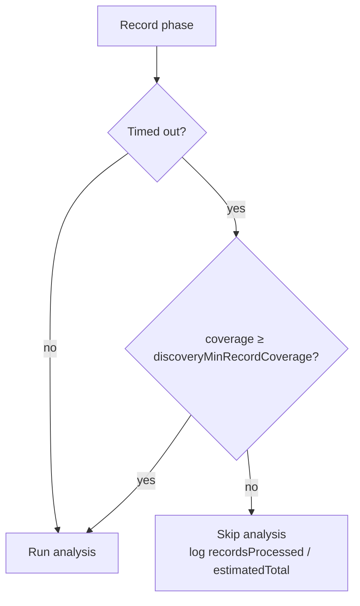
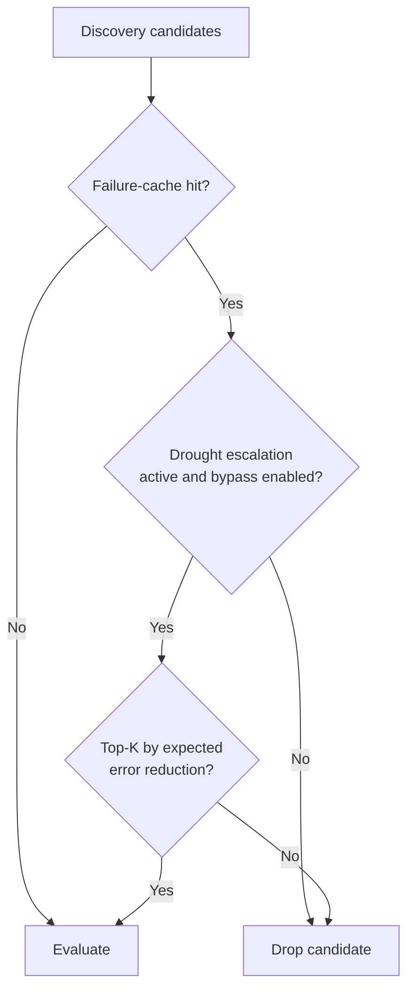

# 🔍 Discovery parameters

Discovery uses the Rust FFI (Foreign Function Interface) extension for GPU
(Graphics Processing Unit) accelerated structural analysis. It proposes
structural improvements (add neurons, add synapses, change activation functions,
remove low-impact elements) based on error patterns recorded during evaluation.

Set `discoverySampleRate` to `-1` to disable discovery entirely.

```ts
import { createNeatConfig } from "@stsoftware/neat-ai";

const config = createNeatConfig({
  discoverySampleRate: 0.2,
  discoveryRecordTimeOutMinutes: 5,
  discoveryAnalysisTimeoutMinutes: 10,
  discoveryCacheDir: "./discovery-cache",
});
```

> [!NOTE]
> Discovery requires the Rust FFI extension and only activates when
> `discoverySampleRate` is greater than `0`. When running in environments
> without the native extension (e.g. some CI runners), set
> `discoverySampleRate: -1` to avoid runtime errors.

## 📊 Quick reference

| Option                              | Type      | Default   | Description                                                         |
| ----------------------------------- | --------- | --------- | ------------------------------------------------------------------- |
| `discoverySampleRate`               | `number`  | `0.2`     | Fraction of records sampled for structural analysis (-1 to disable) |
| `discoveryRecordTimeOutMinutes`     | `number`  | `5`       | Maximum minutes for the recording phase                             |
| `discoveryMinRecordCoverage`        | `number`  | `0.5`     | Minimum recorded coverage (0–1) before analysis runs on a timeout   |
| `discoveryAnalysisTimeoutMinutes`   | `number`  | `10`      | Maximum minutes for the analysis phase (0.05–60)                    |
| `discoveryBatchSize`                | `integer` | `128`     | Observations per discovery promise                                  |
| `discoveryBufferSize`               | `number`  | `0`       | Read buffer size in bytes (0 = default)                             |
| `discoveryRustFlushRecords`         | `integer` | `4096`    | Records accumulated before flushing to Rust                         |
| `discoveryRustFlushBytes`           | `number`  | `~50 MiB` | Payload size threshold before flushing                              |
| `discoveryMaxNeurons`               | `integer` | `6`       | Maximum neurons analysed per discovery iteration                    |
| `discoveryDrainEveryNBatches`       | `integer` | `10`      | Drain promise chains every N batches                                |
| `maxConcurrentDiscoveries`          | `integer` | `1`       | Maximum concurrent discovery operations                             |
| `discoveryMinCandidatesPerCategory` | `object`  | see below | Minimum candidates to evaluate per discovery category               |

## 🔬 Recording and analysis

### `discoverySampleRate`

**Default: 0.2 (20%)** | Type: number

Fraction of training records sampled for structural analysis. Higher values give
the analysis engine more data to work with, improving candidate quality at the
cost of longer recording time.

### `discoveryRecordTimeOutMinutes`

**Default: 5** | Type: number | Min: 0

Maximum minutes allocated to the recording phase before discovery advances to
analysis. At approximately 700 records/sec, 5 minutes allows recording around
210,000 samples.

### `discoveryMinRecordCoverage`

**Default: 0.5 (50%)** | Type: number | Range: 0–1

Minimum fraction of the dataset that must be recorded before the analysis phase
runs when the record-phase timeout fires. On a large dataset (e.g. 520 binary
files at a 5% sample) the record timeout can fire after only a fraction of the
expected records have been sampled, leaving focus-neuron coverage too sparse for
a meaningful analysis pass. When recording times out below this threshold,
analysis is skipped with a clear reason instead of burning the analysis budget
on partial data.

The guard only fires on a genuine timeout that left part of a **multi-file**
dataset unread — a recording that finished normally (or a single-file dataset
where the total cannot be estimated) is never affected. Set to `0` to disable
the guard and always run analysis.



### `discoveryAnalysisTimeoutMinutes`

**Default: 10** | Type: number | Range: 0.05–60

Maximum minutes allocated to the analysis phase (after recording). The Rust
library requires at least 3 seconds (0.05 minutes).

### `discoveryMaxNeurons`

**Default: 6** | Type: integer | Min: 0

Maximum number of neurons analysed per discovery iteration. Balances
thoroughness with speed. Set to `0` to skip neuron analysis.

### `discoveryBatchSize`

**Default: 128** | Type: integer | Min: 1

Number of observations per discovery promise batch.

### `discoveryRustFlushRecords`

**Default: 4096** | Type: integer | Min: 1

Number of records accumulated in memory before flushing to the Rust recorder.
Lower values reduce peak memory at the cost of more frequent I/O.

### `discoveryRustFlushBytes`

**Default: ~50 MiB (52,428,800 bytes)** | Type: number | Min: 1

Estimated payload size threshold before flushing a Rust discovery chunk.
Prevents V8 from hitting `JSON.stringify()` maximum string length limits.

### `discoveryDrainEveryNBatches`

**Default: 10** | Type: integer | Min: 1

Drain promise chains every N batches during discovery recording to prevent
memory buildup.

### `maxConcurrentDiscoveries`

**Default: 1** | Type: integer | Min: 1

Maximum number of discovery operations that can run concurrently. When set to
`1` (the default), behaviour is identical to the original single-discovery
guard. Setting to 2–3 allows pipelined discovery: when a new fittest creature is
found, its discovery can start immediately without waiting for the previous one
to complete. Each concurrent discovery runs on a separate heavy worker (see
[Workers](./WORKERS.md)).

## 📂 Minimum candidates per category

Pass as `discoveryMinCandidatesPerCategory` in options.

| Option            | Type      | Default | Description                                       |
| ----------------- | --------- | ------- | ------------------------------------------------- |
| `addNeurons`      | `integer` | `1`     | Minimum candidates for add-neurons category       |
| `addSynapses`     | `integer` | `1`     | Minimum candidates for add-synapses category      |
| `changeSquash`    | `integer` | `1`     | Minimum candidates for change-squash category     |
| `removeLowImpact` | `integer` | `3`     | Minimum candidates for remove-low-impact category |

## 🔄 Discovery replay

When discovery caching is enabled, successful discoveries can be replayed
against newer fittest creatures to re-apply structural improvements.

| Option                           | Type      | Default                                          | Description                                        |
| -------------------------------- | --------- | ------------------------------------------------ | -------------------------------------------------- |
| `discoveryReplayMaxSingles`      | `integer` | `max(2 × threads, 10)`                           | Maximum cached candidates to re-score individually |
| `discoveryReplayMaxPairwise`     | `integer` | `10`                                             | Maximum candidates for pairwise replay             |
| `discoveryReplayMaxTriples`      | `integer` | `8`                                              | Maximum candidates for triple replay               |
| `discoveryReplayTimeoutMinutes`  | `number`  | `5`                                              | Maximum minutes for replay operations              |
| `discoveryReplayMinTimeMinutes`  | `number`  | `1`                                              | Minimum remaining time required to start replay    |
| `discoveryReplayConcurrency`     | `integer` | `threads` (or `max(cores, 8)` if verify enabled) | Bounded concurrency for replay scoring             |
| `discoveryReplayVerifyScores`    | `boolean` | `false`                                          | Verify replay scores against current dataset       |
| `discoveryReplayRescoreBaseline` | `boolean` | `false` (`true` when verify enabled)             | Report baseline score drift                        |

### `discoveryReplayVerifyScores`

**Default: false** | Type: boolean

When enabled, replay verifies baseline and candidate scores against the current
dataset directory and only reports confirmed improvements.

### `discoveryReplayConcurrency`

**Default: threads (or max(cores, 8) when verify is enabled)** | Type: integer |
Min: 1

Bounded concurrency for replay scoring operations.

## 💾 Caching

| Option                                 | Type      | Default                       | Description                                                |
| -------------------------------------- | --------- | ----------------------------- | ---------------------------------------------------------- |
| `discoveryCacheDir`                    | `string`  | `undefined`                   | Base directory for discovery caching                       |
| `discoveryFailureCacheDir`             | `string`  | `{discoveryCacheDir}/failure` | Directory for caching failed candidates                    |
| `discoverySuccessCacheDir`             | `string`  | `{discoveryCacheDir}/success` | Directory for caching successful candidates                |
| `discoveryFailureCacheBypassOnDrought` | `boolean` | `true`                        | Re-admit top-K failure-cache hits during a drought (#3072) |

> [!WARNING]
> Delete the cache directory when the training dataset changes materially.
> Replaying cached discoveries against a substantially different dataset can
> introduce stale structural signals that degrade training quality.

### `discoveryFailureCacheBypassOnDrought`

**Default: true** | Type: boolean

Normally `CandidateFiltering` drops failure-cache hits _before_ Phase-1
evaluation so previously-failed candidates never consume evaluation slots. For a
plateaued creature this can be self-defeating: once every candidate is in the
failure cache, **no** candidate reaches evaluation and the creature can never
escape the drought.

When the Rust discovery engine raises a drought signal —
`noveltyEscalationActive` or `creatureDroughtAlarm` (NEAT-AI-Discovery #1423) —
and this option is enabled, the candidate filter re-admits the top-K
highest-value cached candidates (ranked by `expectedErrorReduction`, K scaling
with the worker thread count) so at least one candidate is re-evaluated. The
bypass is logged as:

```text
[DiscoveryRunner] failure-cache bypass: N candidates re-evaluated (drought escalation)
```

Set to `false` to keep the strict failure-cache filter even during a drought.



## 🐛 Debug options

| Option                                     | Type      | Default     | Description                                                               |
| ------------------------------------------ | --------- | ----------- | ------------------------------------------------------------------------- |
| `discoveryBaseDirectory`                   | `string`  | `undefined` | Custom base directory for discovery temporary files                       |
| `discoverySkipRecordPhase`                 | `boolean` | `false`     | Skip recording if parquet files already exist (debug/replay optimisation) |
| `discoveryDisableCleanup`                  | `boolean` | `false`     | Preserve parquet files after discovery for debugging                      |
| `discoveryDisableEvaluationSummaryLogging` | `boolean` | `false`     | Disable internal evaluation summary logging                               |

### `discoveryBaseDirectory`

**Default: undefined** | Type: string

Custom base directory for discovery temporary files. By default, discovery uses
`.discovery` in the current working directory. Set this to redirect discovery
files to a different location for testing or debugging.

### `discoverySkipRecordPhase`

**Default: false** | Type: boolean

When enabled, skips the record phase if parquet files already exist in the
discovery directory. Useful for debugging to re-run analysis on previously
recorded data without re-recording.

### `discoveryDisableCleanup`

**Default: false** | Type: boolean

When enabled, preserves discovery temporary files (parquet files) after
discovery completes instead of cleaning them up. Useful for debugging to examine
the intermediate discovery data.

### `discoveryDisableEvaluationSummaryLogging`

**Default: false** | Type: boolean

Disables the internal evaluation summary logging. When set to `true`, the
library will not log the evaluation summary, allowing external code to handle
logging using the exported formatting utilities.

## ✅ Validation rules

- `discoveryAnalysisTimeoutMinutes` must be in the range `0.05–60`.
- Discovery focus neuron UUIDs (Universally Unique Identifiers) must be an array
  of non-empty strings.
- `maxConcurrentDiscoveries` must be at least `1` and is bounded by the
  available heavy workers (see [Workers](./WORKERS.md)).

## 👀 See also

- [DISCOVERY_GUIDE.md](../DISCOVERY_GUIDE.md) — end-to-end walkthrough of
  distributed, multi-machine discovery: caches, replay, candidate category
  limits, focus overrides, and the cost-of-growth gate.
- [DISCOVERY_ARCHITECTURE.md](../DISCOVERY_ARCHITECTURE.md) — internal
  architecture of the discovery pipeline.
- [Workers](./WORKERS.md) — worker pool partitioning between fast and heavy
  tasks.
- [PERFORMANCE_TUNING.md](../PERFORMANCE_TUNING.md) — operational tuning for
  discovery throughput and memory.

---

**Up to:** [`README.md`](../../README.md) (entry point) ·
[`docs/README.md`](../README.md) (topic index).
