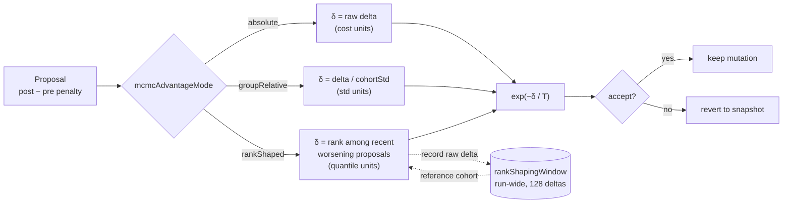

# 🎛️ Mutation adaptation

Adaptive mutation, plateau detection and MCMC (Markov Chain Monte Carlo)
acceptance all adjust how mutations are applied and accepted. They share a
common goal: keep exploration alive when the population stagnates, and tighten
exploitation when fitness improves.

```ts
import { createNeatConfig } from "@stsoftware/neat-ai";

const config = createNeatConfig({
  adaptiveMutationThresholds: {
    medium: 100,
    large: 300,
    largeTopologyWeight: 0.1,
  },
  plateauDetection: { enabled: true },
  mcmc: { enabled: true, initialTemperature: 1.0, coolingRate: 0.995 },
});
```

## 🎚️ Adaptive mutation thresholds

Controls mutation strategy based on creature size. Large creatures have massive
search spaces where structural mutations (`ADD_NODE`, `ADD_CONNECTION`) rarely
improve fitness.

Pass as `adaptiveMutationThresholds` in options.

| Option                | Type      | Default | Description                                                   |
| --------------------- | --------- | ------- | ------------------------------------------------------------- |
| `medium`              | `integer` | `100`   | Neuron count threshold for medium creatures (min: 1)          |
| `large`               | `integer` | `300`   | Neuron count threshold for large creatures (min: 1)           |
| `largeTopologyWeight` | `number`  | `0.1`   | Weight factor for topology mutations in large creatures (0–1) |

**Behaviour by creature size:**

- **Small** (< medium neurons): Normal topology mutation rates.
- **Medium** (>= medium, < large): Reduced topology expansion.
- **Large** (>= large): Focus on `MOD_WEIGHT` and `MOD_BIAS`; topology mutations
  weighted by `largeTopologyWeight` (default 10% chance).

**Validation:** `large` must be greater than `medium`.

## 📉 Plateau detection

Detects fitness stagnation and applies responses to escape local optima.
Disabled by default.

Pass as `plateauDetection` in options.

| Option                          | Type      | Default | Description                                             |
| ------------------------------- | --------- | ------- | ------------------------------------------------------- |
| `enabled`                       | `boolean` | `false` | Enable plateau detection                                |
| `windowSize`                    | `integer` | `10`    | Generations considered for improvement rate (min: 1)    |
| `minImprovementRate`            | `number`  | `0.001` | Minimum improvement rate to avoid plateau status (0–1)  |
| `rapidImprovementRate`          | `number`  | `0.01`  | Threshold for "rapid improvement" status (0–1)          |
| `responseMutationMultiplier`    | `number`  | `2.0`   | Mutation rate multiplier when on a plateau (min: 1)     |
| `responseImprovementMultiplier` | `number`  | `0.8`   | Mutation rate multiplier during rapid improvement (0–1) |

**Validation:** `rapidImprovementRate` must be greater than
`minImprovementRate`.

## 🎲 MCMC acceptance criterion

Issue #2199: Markov Chain Monte Carlo (MCMC) acceptance applies the
[Metropolis–Hastings](https://en.wikipedia.org/wiki/Metropolis%E2%80%93Hastings_algorithm)
criterion to mutation acceptance. Instead of unconditionally accepting all
mutations, worse-fitness moves are accepted with a probability that decreases as
temperature cools. This enables the population to escape local optima early in
evolution and converge to precise solutions later.

The acceptance probability follows:

```
P(accept) = min(1, exp(-deltaCost / temperature))
```

Temperature follows an exponential cooling schedule with adaptive tuning (Issue
#2201) that adjusts temperature toward the theoretically optimal acceptance rate
of ~23.4% (Roberts et al. 1997).

Pass as `mcmc` in options.

| Option                 | Type                                            | Default      | Description                                                                                       |
| ---------------------- | ----------------------------------------------- | ------------ | ------------------------------------------------------------------------------------------------- |
| `enabled`              | `boolean`                                       | `false`      | Whether MCMC acceptance is active                                                                 |
| `initialTemperature`   | `number`                                        | `1.0`        | Starting temperature for Metropolis–Hastings acceptance                                           |
| `minTemperature`       | `number`                                        | `0.01`       | Floor temperature to prevent acceptance probability reaching zero                                 |
| `coolingRate`          | `number`                                        | `0.995`      | Multiplicative cooling factor applied per generation                                              |
| `targetAcceptanceRate` | `number`                                        | `0.234`      | Optimal acceptance rate for high-dimensional MCMC                                                 |
| `adjustmentRate`       | `number`                                        | `0.02`       | Rate at which temperature adapts toward the target acceptance rate                                |
| `toleranceRate`        | `number`                                        | `0.05`       | Tolerance band around target rate within which no adjustment occurs                               |
| `mcmcAdvantageMode`    | `"absolute" \| "groupRelative" \| "rankShaped"` | `"absolute"` | Acceptance signal — see [what the temperature means](#-what-the-temperature-actually-means) below |
| `minCohortSize`        | `number`                                        | `4`          | Issue #2527 — minimum species size for `groupRelative` mode                                       |
| `advantageEps`         | `number`                                        | `1e-8`       | Issue #2527 — numerical stabiliser added to cohort std before the divide                          |
| `advantageClip`        | `number`                                        | `10`         | Issue #2527 — symmetric clip on the group-relative advantage delta                                |
| `rankShapingWindow`    | `number`                                        | `128`        | Issue #3909 — recent proposal deltas retained as the ranking cohort in `rankShaped` mode          |

**How it works:**

- **Improving mutations** (lower cost) are always accepted.
- **Worsening mutations** are accepted with probability
  `exp(-deltaCost / temperature)`.
- **Topology mutations** (add/remove nodes or connections) are always accepted
  unconditionally, since discrete structural changes do not lend themselves to
  continuous cost comparison.
- **Adaptive tuning** (Issue #2201): after each generation, the smoothed
  acceptance rate is compared to the target. If acceptance is too high the
  temperature decreases; if too low it increases.

> [!TIP]
> MCMC works well alongside plateau detection. Plateau detection adjusts _how
> much_ mutation happens, while MCMC temperature adjusts _which_ mutations
> stick. Enable both for a robust exploration/exploitation balance.

### 🌡️ What the temperature actually means

`mcmcAdvantageMode` decides what is divided by the temperature, and therefore
what unit the temperature is measured in. The cooling schedule
(`initialTemperature`, `minTemperature`, `coolingRate`) is otherwise identical
in all three modes, so **a temperature tuned under one mode does not carry over
to another**.

| Mode              | Value fed to `exp(-δ / T)`                                           | Temperature is measured in | Fixed `T` still means the same thing when…                                |
| ----------------- | -------------------------------------------------------------------- | -------------------------- | ------------------------------------------------------------------------- |
| `"absolute"`      | the raw `post − pre` weight/bias penalty delta                       | cost-function units        | never — the corpus, the cost function and convergence all move it         |
| `"groupRelative"` | `delta / (cohortStd + eps)`, clipped to `±advantageClip`             | cohort standard deviations | the cost function is rescaled, but not when the cohort's spread collapses |
| `"rankShaped"`    | the proposal's quantile in `(0, 1)` among recent worsening proposals | quantile units             | always — only the ordering of proposals is used                           |

`"rankShaped"` (Issue #3909) is the
[Salimans et al. 2017](https://arxiv.org/abs/1703.03864) rank transform: raw
magnitudes are replaced by ranks within the cohort before they are used. Because
only the ordering survives, one freak proposal cannot dominate and the schedule
means the same thing at every stage of a run. The same argument underpins
CMA-ES's rank-μ update (Hansen & Ostermeier 2001), so this is well-trodden
ground in the evolutionary-algorithm literature.

Practical notes for `"rankShaped"`:

- **Improving proposals are still accepted unconditionally.** Only worsening
  proposals are ranked, and only against other worsening proposals — otherwise
  every worsening move would sit at the top of a mostly-improving distribution.
- **`T` is now readable.** A proposal at the median of recent damage (`q ≈ 0.5`)
  is accepted with probability `exp(-0.5 / T)`: about 61% at `T = 1.0`, 8% at
  `T = 0.2`, effectively never at `T = 0.01`. `reheatFactor` moves the schedule
  by the same interpretable amount whatever the corpus is doing.
- **The ranking cohort spans generations.** One generation only proposes
  `populationSize × mutationRate` weight/bias mutations, so the window
  (`rankShapingWindow`, default 128) is carried on the run's MCMC state. Until
  it fills, a worsening proposal shapes to the no-information value `0.5`.
- **Parent selection follows the mode.** As with `"groupRelative"`, the
  cohort-relative ranking replaces raw fitness for mother selection —
  `"rankShaped"` uses centred ranks in `[-0.5, +0.5]` instead of the z-score.
  The **authoritative scorer verdict is never rank-shaped**; that is the one
  place the absolute number is the point.



**Measured** on the synthetic convergence harness
`bench/MCMCAdvantageConvergence.ts` (population 32, 500 iterations, 12 seeded
trials). Higher mean score is better; the cost-scale sweep multiplies the whole
objective while holding the temperature curriculum fixed:

| Mode              | mean score | acceptance | mean score at ×1 / ×1 000 / ×1 000 000 |
| ----------------- | ---------- | ---------- | -------------------------------------- |
| `"absolute"`      | −0.151315  | 0.832      | −0.151315 / −0.089692 / −0.089687      |
| `"groupRelative"` | −0.111894  | 0.709      | −0.111894 / −0.111894 / −0.111894      |
| `"rankShaped"`    | −0.093585  | 0.501      | −0.093585 / −0.093585 / −0.093585      |

The `"absolute"` row moves when the objective is rescaled — its acceptance rate
falls from 83% to 41% for the same schedule — which is exactly the coupling rank
shaping removes.

## 👀 See also

- [Core evolution parameters](./CORE_EVOLUTION.md) — base mutation rates that
  these adaptations modulate.
- [Regularisation](./REGULARISATION.md) — weight/bias regularisation and output
  range constraints.
- [Population sizing](./POPULATION.md) — adaptive population sizing pairs
  naturally with plateau detection.
- [PERFORMANCE_TUNING.md](../PERFORMANCE_TUNING.md) — when MCMC and plateau
  detection are worth the per-generation overhead.

---

**Up to:** [`README.md`](../../README.md) (entry point) ·
[`docs/README.md`](../README.md) (topic index).
