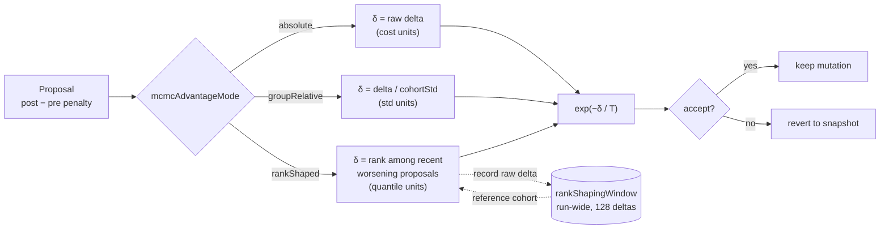
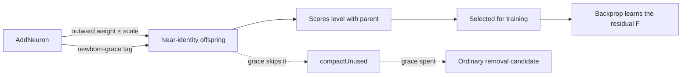
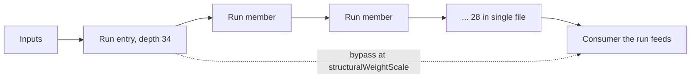

# 🎛️ Mutation adaptation

Adaptive mutation, plateau detection and MCMC (Markov Chain Monte Carlo)
acceptance all adjust how mutations are applied and accepted. They share a
common goal: keep exploration alive when the population stagnates, and tighten
exploitation when fitness improves.

```ts
import { createNeatConfig } from "@stsoftware/neat-ai";

const config = createNeatConfig({
  adaptiveMutationThresholds: {
    medium: 100,
    large: 300,
    largeTopologyWeight: 0.1,
  },
  plateauDetection: { enabled: true },
  mcmc: { enabled: true, initialTemperature: 1.0, coolingRate: 0.995 },
});
```

## 🎚️ Adaptive mutation thresholds

Controls mutation strategy based on creature size. Large creatures have massive
search spaces where structural mutations (`ADD_NODE`, `ADD_CONNECTION`) rarely
improve fitness.

Pass as `adaptiveMutationThresholds` in options.

| Option                | Type      | Default | Description                                                   |
| --------------------- | --------- | ------- | ------------------------------------------------------------- |
| `medium`              | `integer` | `100`   | Neuron count threshold for medium creatures (min: 1)          |
| `large`               | `integer` | `300`   | Neuron count threshold for large creatures (min: 1)           |
| `largeTopologyWeight` | `number`  | `0.1`   | Weight factor for topology mutations in large creatures (0–1) |

**Behaviour by creature size:**

- **Small** (< medium neurons): Normal topology mutation rates.
- **Medium** (>= medium, < large): Reduced topology expansion.
- **Large** (>= large): Focus on `MOD_WEIGHT` and `MOD_BIAS`; topology mutations
  weighted by `largeTopologyWeight` (default 10% chance).

**Validation:** `large` must be greater than `medium`.

## 📉 Plateau detection

Detects fitness stagnation and applies responses to escape local optima.
Disabled by default.

Pass as `plateauDetection` in options.

| Option                          | Type      | Default | Description                                             |
| ------------------------------- | --------- | ------- | ------------------------------------------------------- |
| `enabled`                       | `boolean` | `false` | Enable plateau detection                                |
| `windowSize`                    | `integer` | `10`    | Generations considered for improvement rate (min: 1)    |
| `minImprovementRate`            | `number`  | `0.001` | Minimum improvement rate to avoid plateau status (0–1)  |
| `rapidImprovementRate`          | `number`  | `0.01`  | Threshold for "rapid improvement" status (0–1)          |
| `responseMutationMultiplier`    | `number`  | `2.0`   | Mutation rate multiplier when on a plateau (min: 1)     |
| `responseImprovementMultiplier` | `number`  | `0.8`   | Mutation rate multiplier during rapid improvement (0–1) |

**Validation:** `rapidImprovementRate` must be greater than
`minImprovementRate`.

## 🎲 MCMC acceptance criterion

Issue #2199: Markov Chain Monte Carlo (MCMC) acceptance applies the
[Metropolis–Hastings](https://en.wikipedia.org/wiki/Metropolis%E2%80%93Hastings_algorithm)
criterion to mutation acceptance. Instead of unconditionally accepting all
mutations, worse-fitness moves are accepted with a probability that decreases as
temperature cools. This enables the population to escape local optima early in
evolution and converge to precise solutions later.

The acceptance probability follows:

```
P(accept) = min(1, exp(-deltaCost / temperature))
```

Temperature follows an exponential cooling schedule with adaptive tuning (Issue
#2201) that adjusts temperature toward the theoretically optimal acceptance rate
of ~23.4% (Roberts et al. 1997).

Pass as `mcmc` in options.

| Option                 | Type                                            | Default      | Description                                                                                       |
| ---------------------- | ----------------------------------------------- | ------------ | ------------------------------------------------------------------------------------------------- |
| `enabled`              | `boolean`                                       | `false`      | Whether MCMC acceptance is active                                                                 |
| `initialTemperature`   | `number`                                        | `1.0`        | Starting temperature for Metropolis–Hastings acceptance                                           |
| `minTemperature`       | `number`                                        | `0.01`       | Floor temperature to prevent acceptance probability reaching zero                                 |
| `coolingRate`          | `number`                                        | `0.995`      | Multiplicative cooling factor applied per generation                                              |
| `targetAcceptanceRate` | `number`                                        | `0.234`      | Optimal acceptance rate for high-dimensional MCMC                                                 |
| `adjustmentRate`       | `number`                                        | `0.02`       | Rate at which temperature adapts toward the target acceptance rate                                |
| `toleranceRate`        | `number`                                        | `0.05`       | Tolerance band around target rate within which no adjustment occurs                               |
| `mcmcAdvantageMode`    | `"absolute" \| "groupRelative" \| "rankShaped"` | `"absolute"` | Acceptance signal — see [what the temperature means](#-what-the-temperature-actually-means) below |
| `minCohortSize`        | `number`                                        | `4`          | Issue #2527 — minimum species size for `groupRelative` mode                                       |
| `advantageEps`         | `number`                                        | `1e-8`       | Issue #2527 — numerical stabiliser added to cohort std before the divide                          |
| `advantageClip`        | `number`                                        | `10`         | Issue #2527 — symmetric clip on the group-relative advantage delta                                |
| `rankShapingWindow`    | `number`                                        | `128`        | Issue #3909 — recent proposal deltas retained as the ranking cohort in `rankShaped` mode          |

**How it works:**

- **Improving mutations** (lower cost) are always accepted.
- **Worsening mutations** are accepted with probability
  `exp(-deltaCost / temperature)`.
- **Topology mutations** (add/remove nodes or connections) are always accepted
  unconditionally, since discrete structural changes do not lend themselves to
  continuous cost comparison.
- **Adaptive tuning** (Issue #2201): after each generation, the smoothed
  acceptance rate is compared to the target. If acceptance is too high the
  temperature decreases; if too low it increases.

> [!TIP]
> MCMC works well alongside plateau detection. Plateau detection adjusts _how
> much_ mutation happens, while MCMC temperature adjusts _which_ mutations
> stick. Enable both for a robust exploration/exploitation balance.

### 🌡️ What the temperature actually means

`mcmcAdvantageMode` decides what is divided by the temperature, and therefore
what unit the temperature is measured in. The cooling schedule
(`initialTemperature`, `minTemperature`, `coolingRate`) is otherwise identical
in all three modes, so **a temperature tuned under one mode does not carry over
to another**.

| Mode              | Value fed to `exp(-δ / T)`                                           | Temperature is measured in | Fixed `T` still means the same thing when…                                |
| ----------------- | -------------------------------------------------------------------- | -------------------------- | ------------------------------------------------------------------------- |
| `"absolute"`      | the raw `post − pre` weight/bias penalty delta                       | cost-function units        | never — the corpus, the cost function and convergence all move it         |
| `"groupRelative"` | `delta / (cohortStd + eps)`, clipped to `±advantageClip`             | cohort standard deviations | the cost function is rescaled, but not when the cohort's spread collapses |
| `"rankShaped"`    | the proposal's quantile in `(0, 1)` among recent worsening proposals | quantile units             | always — only the ordering of proposals is used                           |

`"rankShaped"` (Issue #3909) is the
[Salimans et al. 2017](https://arxiv.org/abs/1703.03864) rank transform: raw
magnitudes are replaced by ranks within the cohort before they are used. Because
only the ordering survives, one freak proposal cannot dominate and the schedule
means the same thing at every stage of a run. The same argument underpins
CMA-ES's rank-μ update (Hansen & Ostermeier 2001), so this is well-trodden
ground in the evolutionary-algorithm literature.

Practical notes for `"rankShaped"`:

- **Improving proposals are still accepted unconditionally.** Only worsening
  proposals are ranked, and only against other worsening proposals — otherwise
  every worsening move would sit at the top of a mostly-improving distribution.
- **`T` is now readable.** A proposal at the median of recent damage (`q ≈ 0.5`)
  is accepted with probability `exp(-0.5 / T)`: about 61% at `T = 1.0`, 8% at
  `T = 0.2`, effectively never at `T = 0.01`. `reheatFactor` moves the schedule
  by the same interpretable amount whatever the corpus is doing.
- **The ranking cohort spans generations.** One generation only proposes
  `populationSize × mutationRate` weight/bias mutations, so the window
  (`rankShapingWindow`, default 128) is carried on the run's MCMC state. Until
  it fills, a worsening proposal shapes to the no-information value `0.5`.
- **Parent selection follows the mode.** As with `"groupRelative"`, the
  cohort-relative ranking replaces raw fitness for mother selection —
  `"rankShaped"` uses centred ranks in `[-0.5, +0.5]` instead of the z-score.
  The **authoritative scorer verdict is never rank-shaped**; that is the one
  place the absolute number is the point.



**Measured** on the synthetic convergence harness
`bench/MCMCAdvantageConvergence.ts` (population 32, 500 iterations, 12 seeded
trials). Higher mean score is better; the cost-scale sweep multiplies the whole
objective while holding the temperature curriculum fixed:

| Mode              | mean score | acceptance | mean score at ×1 / ×1 000 / ×1 000 000 |
| ----------------- | ---------- | ---------- | -------------------------------------- |
| `"absolute"`      | −0.151315  | 0.832      | −0.151315 / −0.089692 / −0.089687      |
| `"groupRelative"` | −0.111894  | 0.709      | −0.111894 / −0.111894 / −0.111894      |
| `"rankShaped"`    | −0.093585  | 0.501      | −0.093585 / −0.093585 / −0.093585      |

The `"absolute"` row moves when the objective is rescaled — its acceptance rate
falls from 83% to 41% for the same schedule — which is exactly the coupling rank
shaping removes.

## 🧬 Identity-initialised structural mutation

`AddNeuron` and `AddConnection` wire new structure with a random weight drawn
uniformly from `[-0.5, +0.5]`. On a creature whose behaviour is already tuned to
fifth-decimal margins, injecting that into a live neuron's summed input is a
large perturbation, so the offspring is overwhelmingly likely to score below its
parent — and a mutation that drops the score is never picked for a gradient
step, so the structure it proposed is discarded in the generation that made it.

Scaling the **outward** synapse down approaches the residual construction
`x + εF(x)` of
[He et al. (2016), _Deep Residual Learning for Image Recognition_](https://arxiv.org/abs/1512.03385):
the new structure is nearly a no-op at birth, scores level with its parent, and
therefore survives long enough for backprop to learn a job for it. The inward
synapse keeps its full-scale draw — it only determines what the new neuron
_sees_, and shrinking it would flatten the gradient the new structure needs.

| Option                         | Type      | Default | Description                                                                                                                                                    |
| ------------------------------ | --------- | ------- | -------------------------------------------------------------------------------------------------------------------------------------------------------------- |
| `structuralWeightScale`        | `number`  | `1`     | Scale passed to `Synapse.randomWeight()` for the outward synapse of `AddNeuron`, and for `AddConnection` on the main mutation path. Must be greater than zero. |
| `structuralNewbornGraceRounds` | `integer` | `0`     | Compaction passes a newly inserted neuron is exempt from `compactUnused` removal (min: 0).                                                                     |

Both defaults reproduce the historical behaviour exactly, bit-for-bit on a fixed
seed.

```ts
const config = createNeatConfig({
  // Near-identity initialisation, matching the creative-thinking path's
  // 1 / synapseCount scale, with one compaction pass of newborn protection.
  structuralWeightScale: 0.0001,
  structuralNewbornGraceRounds: 1,
});
```

**Why the grace period is needed.** `compactUnused` ranks hidden neurons by
`|activation range| × min(maxOutgoingWeight, 1) − plankConstant × fanIn` and
removes the smallest. A neuron with a near-zero outward weight scores ~0, so it
is the _first_ candidate — it would be compacted away before the gradient step
that was meant to give it a job. `structuralNewbornGraceRounds` tags the newborn
so compaction skips it. The budget is spent one round at a time, on every
lineage that leaves a training round: `compactUnused` spends a round on the
compacted copy it returns, the training teardown spends a round on the trained
(uncompacted) creature, and — when `compactUnused` found nothing to remove and
the teardown fell back to `compactVariants` — the teardown spends a round on
that fallback creature too. No lineage can end up exempt from compaction for the
rest of the run.

> [!NOTE]
> The grace is honoured by `compactUnused` only. When `compactUnused` finds no
> removal candidate at all, both training paths fall back to `compactVariants`,
> which prunes structurally rather than by activation trace and has no newborn
> awareness.



> [!NOTE]
> A near-identity neuron is easy to accept and may still contribute nothing.
> Watch the outward weight magnitude of newly added neurons _after_ training: if
> it stays at its initial scale, the operator is inflating the creature with
> dead structure that still costs growth cost and evaluation time.

### 📊 What the sweep measured

`bench/structural_weight_scale_sweep.ts` compares scales on one seed, with the
mutation sites held identical across rows, and reports all four numbers Issue
#3970 asked for. Reproduce it with:

```bash
deno task bench:structural-scale -- \
  --scales=1,0.1,0.01,0.001 --trials=40 --generations=100 --population=20
```

Replicated across two seeds (3970 and 17), on a tuned 24-hidden-neuron parent:

| Observation                                                                           | Holds?                                   |
| ------------------------------------------------------------------------------------- | ---------------------------------------- |
| Median relative error delta falls from ~2e-4 at scale `1` to ~1e-8 or below           | ✅ yes                                   |
| Behaviour-neutral births rise monotonically, 42.5% → 67.5–75%                         | ✅ yes                                   |
| Acceptance _at birth_ **falls** at the smallest scale, 32.5% → 22.5–25%               | ✅ yes                                   |
| Hidden-neuron count stays flat — no runaway growth at any scale                       | ✅ yes                                   |
| Post-training outward weights **stay at their birth scale** (~1.5×, ≤5% grow tenfold) | ✅ yes                                   |
| Score-per-wall-clock-hour improves                                                    | ❌ no — the ordering flips between seeds |

The first two confirm the mechanism does exactly what the residual construction
claims. The third is the growth cost working as designed, not a bug: a
behaviour-neutral newborn still pays `~1.2 × growthCost`, so it lands near-tied
rather than ahead.

The last two are why **both knobs ship defaulted off**. On this benchmark the
newborn's outward weight does not grow during training, which is the "accepted
but useless" failure mode — near-identity structure that is easy to accept and
contributes nothing — and no score-per-hour advantage survives a change of seed.
Enable a reduced scale only alongside a measurement that shows the outward
weights actually growing on _your_ workload.

## 🌉 Targeted skip connections

Any forward synapse from a low-index neuron to a high-index one **is** a skip
connection, so the topology has always permitted the residual construction
`x + F(x)`. What was missing is an operator that proposes one _deliberately_.

`AddConnection` draws its endpoints uniformly. On a creature with thousands of
neurons the chance that a single draw straddles one specific deep chain is
negligible, while the output neuron is a target many draws hit — so evolution
finds short-circuits **to the output** and none around a deep interior run.
Issue #3972 measured exactly that asymmetry on
`test/data/grq-23-forests-constants.json`: the output neuron has fan-in 325 and
a one-hop path from the inputs, while the 28-neuron single-file tail from depth
34 to 61 carries no bypass anywhere along it.

`AddSkipConnection` (`ADD_SKIP_CONN`) closes that gap. Selection is the whole
operator — a randomly placed skip is just `AddConnection`:

1. Serial runs come from `findSerialChains` (#3972): maximal runs of consecutive
   depth levels holding exactly one neuron each, connected end to end. That is
   the structure with no depth-parallel route around it, so one zero derivative
   anywhere along it zeroes the gradient for every member upstream.
2. Runs shorter than `skipMinRunLength` are ignored.
3. Longer runs are preferred, ties broken by the deeper run.
4. The bypass runs from the run's **entry** neuron to a neuron the run
   **feeds**, so that consumer sees both the processed signal and a short-path
   copy of the entry activation.
5. The new synapse is initialised at `structuralWeightScale` (#3970), not at a
   full `[-0.5, +0.5]` draw — a ±0.5 bypass around a tuned run is the same
   mistake that issue describes.

Exactly one bypass is added per mutation, so #3971's per-operator telemetry can
still attribute the result.

| Option               | Type      | Default | Description                                                                                     |
| -------------------- | --------- | ------- | ----------------------------------------------------------------------------------------------- |
| `skipConnectionRate` | `number`  | `0`     | Probability that a mutation draw proposes a bypass instead of drawing from `mutation`. `0` off. |
| `skipMinRunLength`   | `integer` | `4`     | Shortest serial run worth bypassing, counted in hidden neurons (min: 2).                        |

`skipConnectionRate: 0` consumes no randomness of its own and is bit-identical
to a build without the operator — pinned by `test/NEAT/SkipConnectionRate.ts`
against a golden captured from commit `e02d33af`. `ADD_SKIP_CONN` is
deliberately absent from `Mutation.ALL` and `Mutation.FFW`, so an existing
`mutation` list never picks it up.

```ts
const config = createNeatConfig({
  // Propose a targeted bypass on 5% of mutation draws, around any single-file
  // run of six or more hidden neurons, at a near-identity weight.
  skipConnectionRate: 0.05,
  skipMinRunLength: 6,
  structuralWeightScale: 0.01,
});
```



> [!NOTE]
> The operator does **not** consult #3972's zero-gradient fraction when ranking
> runs, even though that measurement now exists. Reading it needs input samples
> a mutation operator is never given, and costs a forward and reverse sweep per
> sample — it cannot ride on every mutation. Length is the proxy; the harness
> below measures the gradient directly.

### 📊 What the null comparison measured

`bench/skip_connection_null_comparison.ts` runs three arms on one creature and
one seed: **baseline**, **skip** (`AddSkipConnection`), and **random**
(`AddConnection` at the same weight scale, matched to the number of synapses the
skip arm actually added). Reproduce with:

```bash
# #3972's own creature, profile only.
deno task bench:skip-null --creature test/data/grq-23-forests-constants.json \
  --profile-only true --samples 64 --skips 4

# Synthetic tuned parent with a 12-neuron single-file tail, trained.
deno task bench:skip-null --skips 3 --seed 3973 --iterations 300 --obs-scale 3
```

On the GRQ creature, 64 seeded samples, one bypass (`4395 -> 5048`):

| Arm      | Added | Entry neuron zero-gradient | Chain aggregate | Pooled depths 1–34 |
| -------- | ----: | -------------------------: | --------------: | -----------------: |
| baseline |     0 |                     100.0% |           85.0% |              89.4% |
| skip     |     1 |                  **40.6%** |           82.8% |              89.4% |
| random   |     1 |                     100.0% |           85.0% |              89.4% |

The bypass is doing the ResNet job where it is aimed: the run's entry neuron had
an **exactly-zero gradient on every one of 64 samples**, and after one targeted
bypass the gradient reaches it on 59.4% of them. A uniformly drawn connection at
the same weight scale changes nothing — the targeting, not the synapse, is what
moved the number.

**Two honest limits.** The pooled figure over depths 1–34 does not move at all:
those depths hold thousands of neurons that already have many parallel routes,
so a 28-neuron tail is lost in the average. And the chain aggregate improves
only 2.2 points, because the bypass restores the route _into_ the chain rather
than repairing the zero derivatives inside it — Issue #3974's `ModSquash` work
is what targets those.

On the synthetic trained parent the skip synapse **grows during training** on
both seeds — median `|w|` 0.0020 → 0.0151 (seed 3973) and 0.0036 → 0.0593 (seed
17), 7× and 17× its birth scale — while the random arm's synapse stays at or
below its own (0.0045 → 0.0038 and 0.0010 → 0.0032). So the bypass is not the
"accepted but useless" structure #3970 warned about: backprop finds a job for
it. Dataset error after training is mixed across seeds (skip better on seed 17,
baseline better on seed 3973), which is why the operator ships **off by
default**: switch it on alongside a measurement on your own workload.

## 👀 See also

- [Core evolution parameters](./CORE_EVOLUTION.md) — base mutation rates that
  these adaptations modulate.
- [Regularisation](./REGULARISATION.md) — weight/bias regularisation and output
  range constraints.
- [Population sizing](./POPULATION.md) — adaptive population sizing pairs
  naturally with plateau detection.
- [`docs/evidence/skip-connection-null-grq.md`](../evidence/skip-connection-null-grq.md)
  — the committed output of the null comparison on #3972's creature.
- [PERFORMANCE_TUNING.md](../PERFORMANCE_TUNING.md) — when MCMC and plateau
  detection are worth the per-generation overhead.

---

**Up to:** [`README.md`](../../README.md) (entry point) ·
[`docs/README.md`](../README.md) (topic index).
