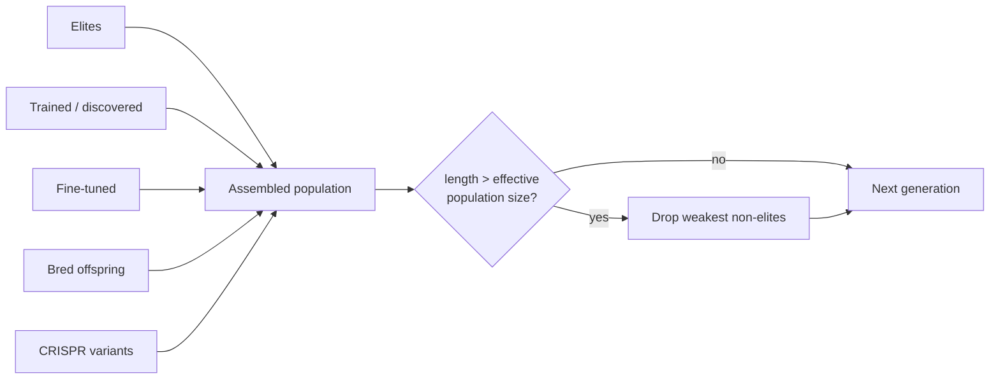

# 👥 Population sizing

Population-level controls beyond the static `populationSize` knob. These options
dynamically grow or shrink the active population, and adjust the fraction of
creatures dedicated to fine-tuning, based on diversity and recent fitness
improvements.

```ts
import { createNeatConfig } from "@stsoftware/neat-ai";

const config = createNeatConfig({
  populationSize: 100,
  adaptivePopulation: {
    enabled: true,
    minPopulationFraction: 0.5,
    maxPopulationFraction: 2.0,
  },
  fineTunePopulation: {
    minPopulationFraction: 0.1,
    maxPopulationFraction: 0.4,
  },
});
```

## 📊 Adaptive population sizing

Issue #1863: Automatically adjusts population size based on species diversity
metrics. When diversity drops below a threshold the population grows to
encourage exploration. When diversity is high and fitness is stagnating, the
population can shrink to focus resources on the most promising individuals.

Issue #2316: Added worker-aware minimum floor to ensure enough creatures per
worker for good CPU (Central Processing Unit) utilisation at production scale.
On machines with many cores (e.g. 32-core production clusters), the default
population of 50 means each worker gets only ~1.5 creatures — too few for even
work distribution.

Pass as `adaptivePopulation` in options.

```ts
const config = createNeatConfig({
  populationSize: 100, // starting size
  adaptivePopulation: {
    enabled: true,
    minPopulationFraction: 0.5, // never below 50 creatures
    maxPopulationFraction: 2.0, // can grow up to 200 creatures
    minCreaturesPerWorker: 3, // ensure enough work per worker
  },
});
```

| Option                   | Type      | Default | Description                                                               |
| ------------------------ | --------- | ------- | ------------------------------------------------------------------------- |
| `enabled`                | `boolean` | `false` | Whether adaptive population sizing is active                              |
| `minPopulationFraction`  | `number`  | `0.5`   | Minimum population as a fraction of `populationSize` (0–1)                |
| `maxPopulationFraction`  | `number`  | `2.0`   | Maximum population as a fraction of `populationSize`                      |
| `lowDiversityThreshold`  | `number`  | `0.3`   | Diversity level below which population grows (0–1)                        |
| `highDiversityThreshold` | `number`  | `0.8`   | Diversity level above which population may shrink during stagnation (0–1) |
| `adjustmentRate`         | `number`  | `0.1`   | Maximum population change per generation as a fraction (0–1)              |
| `minCreaturesPerWorker`  | `number`  | `3`     | Worker-aware floor: minimum creatures per worker thread (0 to disable)    |

## 🚧 Population cap (hard bound)

Issue #3508: the population is a **hard bound**, not a target. Each generation
is assembled from several slices — elites, completed training / discovery
results, fine-tuned creatures, freshly bred offspring, and CRISPR (Clustered
Regularly Interspaced Short Palindromic Repeats) variants — and only the bred
slice was budgeted. When several heavy-pool tasks completed in the same
generation (far more likely on a slow or contended machine), the population, and
therefore the next generation's fitness queue, grew well past the configured
size — a queue depth of 48 was observed for `populationSize: 15`.

The assembled population is now trimmed back to the effective population size
(`populationSize`, or the adaptive size when `adaptivePopulation.enabled`), so
memory and CPU per generation stay within what was configured:

- **Elites are never dropped.** If elitism alone meets the cap, the population
  stays at the elite count.
- **The weakest non-elites go first.** Unevaluated creatures have no score to
  rank by and are treated as the weakest; ties fall back to assembly order, so
  the over-represented heavy-pool results — the slice that overflows the budget
  — are dropped ahead of the freshly bred offspring that drive exploration.
- **Survivors keep their order**, elites first.



Telemetry consumers can rely on the bound: `populationSize` on
`generation_complete`, and the fitness-queue depth it drives, never exceed the
effective population size.

## 👥 Fine-tune population

Dynamically adjusts the fine-tuning population size based on recent success
rates. When fine-tuning produces improvements, more resources are allocated.

Pass as `fineTunePopulation` in options.

| Option                   | Type      | Default | Description                                             |
| ------------------------ | --------- | ------- | ------------------------------------------------------- |
| `minPopulationFraction`  | `number`  | `0.1`   | Minimum fraction of population for fine-tuning (0–1)    |
| `maxPopulationFraction`  | `number`  | `0.4`   | Maximum fraction of population for fine-tuning (0–1)    |
| `basePopulationFraction` | `number`  | `0.2`   | Starting fraction before success data exists (0–1)      |
| `successRateWindow`      | `integer` | `10`    | Recent generations considered for success rate (min: 1) |

## ✅ Validation rules

- `adaptivePopulation.maxPopulationFraction` must be greater than or equal to
  `adaptivePopulation.minPopulationFraction`.
- `fineTunePopulation.maxPopulationFraction` must be greater than or equal to
  `fineTunePopulation.minPopulationFraction`.
- `fineTunePopulation.basePopulationFraction` must lie within
  `[minPopulationFraction, maxPopulationFraction]`.

## 👀 See also

- [Core evolution parameters](./CORE_EVOLUTION.md) — the static `populationSize`
  baseline.
- [Workers](./WORKERS.md) — `minCreaturesPerWorker` interacts with the worker
  pool partitioning.
- [Mutation adaptation](./MUTATION_ADAPTATION.md) — plateau detection pairs well
  with adaptive population sizing during stagnation.
- [PERFORMANCE_TUNING.md](../PERFORMANCE_TUNING.md) — picking population sizes
  for large CPU clusters.

---

**Up to:** [`README.md`](../../README.md) (entry point) ·
[`docs/README.md`](../README.md) (topic index).
