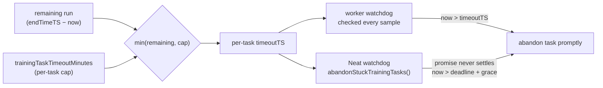
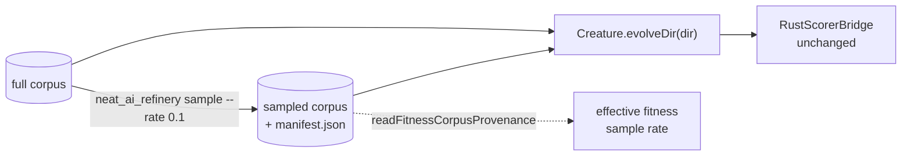

# 🏋️ Training parameters

Training parameters control backpropagation within each NEAT (NeuroEvolution of
Augmenting Topologies) generation: how much data is used, how aggressively
weights/biases are updated. These options sit on the top-level `NeatOptions`
object.

```ts
import { createNeatConfig } from "@stsoftware/neat-ai";

const config = createNeatConfig({
  // Omit trainPerGen to auto-scale with the population for supervised costs
  // (default 10 for a population of 50); set explicitly to tune throughput.
  trainPerGen: 10,
  trainingBatchSize: 100,
  trainingSampleRate: 1,
});
```

## 📊 Quick reference

| Option                         | Type      | Default                    | Description                                               |
| ------------------------------ | --------- | -------------------------- | --------------------------------------------------------- |
| `trainPerGen`                  | `integer` | _auto_ (20% of population) | Creatures trained per generation (min: 0)                 |
| `trainingTaskTimeoutMinutes`   | `number`  | `5`                        | Per-task wall-clock cap; `0` disables (min: 0)            |
| `trainingBatchSize`            | `integer` | `100`                      | Observations per training batch (min: 1)                  |
| `trainingSampleRate`           | `number`  | `1`                        | Fraction of data used for training (0.0001–1)             |
| `dataSetPartitionBreak`        | `integer` | `2000`                     | Records per dataset file (min: 1)                         |
| `maximumBiasAdjustmentScale`   | `number`  | `1`                        | Maximum bias adjustment per training iteration (min: 0)   |
| `maximumWeightAdjustmentScale` | `number`  | `1`                        | Maximum weight adjustment per training iteration (min: 0) |

## 🔁 Backpropagation cadence

### `trainPerGen`

**Default: auto — `max(1, round(populationSize × 0.2))` for supervised costs;
`1` for custom/unrecognised costs** | Type: integer | Min: 0

`trainPerGen` is **the primary throughput knob for supervised learning**. Each
generation, the fittest `trainPerGen` creatures of the (score-sorted) population
receive a backpropagation (gradient-descent) step; the rest rely on evolutionary
weight mutation alone.

> [!IMPORTANT]
> With a small `trainPerGen` only a handful of creatures get any gradient step
> per generation, so high-dimensional supervised tasks (image classification,
> regression with many inputs) converge slowly. NEAT-AI therefore **scales the
> default with the population** (Issue #2791): for the default population of 50
> the default `trainPerGen` is `10`, giving 20% gradient coverage per generation
> rather than the previous ~2% (a single creature).

**How the default is chosen**

- **Recognised built-in supervised costs** (`MSE`, `MAE`, `MAPE`, `MSLE`,
  `CROSS_ENTROPY`, `HINGE`) scale with the population:
  `max(1, round(populationSize × 0.2))`.
- **Custom or unrecognised costs** keep the conservative default of `1`, so
  evolution-only tasks are unchanged.
- **A `customCost` function** also keeps the default of `1`, whatever `costName`
  says (Issue #3776). `costName` retains its `MSE` default even when a
  `customCost` replaces the built-in cost, so it is not evidence that the task
  is supervised — set `trainPerGen` explicitly if your custom objective does
  benefit from gradient steps.

Each scheduled task runs **two epochs** so the training loop can revert an epoch
that made the creature worse (Issue #3776) — a single epoch has nothing to
compare against. The per-task wall-clock budget (`trainingTaskTimeoutMinutes`)
still bounds the total work.

> [!NOTE]
> **Who receives those steps has been measured, and on the harness it is no
> better than random** (Issue #3934). Over 10,546 real gradient steps —
> 20-creature populations on a 600-record corpus, **not** GRQ's scale —
> selecting the top `trainPerGen` by current score reached the same final exact
> score as drawing `trainPerGen` creatures uniformly, and which arm was ahead
> **flipped between runs of the same configuration**. Score rank does order
> realised gain, in the direction you would expect (the incumbent is nearest its
> local optimum, so it gains least), but only weakly — ρ = 0.104 over the 6,777
> unbiased events, below the 0.2 materiality floor, so no gain predictor was
> built.
>
> The number worth knowing is a different one, and it bears directly on this
> setting: **`trainPerGen` is not the number of gradient steps a generation
> buys.** A creature is trained at most once per run (Issue #3553) and a refused
> slot is lost rather than reallocated, so a rule that keeps choosing the head
> of the population keeps choosing creatures it has already trained. On the
> harness today's rule converted **50.3 %** of its offered slots into gradient
> steps against **90.4 %** for uniform selection, and of the steps it did take,
> **88.1 % produced a creature worse than the one they trained**. Raising
> `trainPerGen` buys neither guaranteed progress nor, necessarily, more steps.
>
> Both percentages are harness-scale properties of a 20-creature population, not
> production readings. The per-training-event record lives in
> [`trainingGainLog`](../TRAINING_GAIN_LOG.md) (off by default) so the same
> question can be asked on a real lineage, and the study with its caveats is in
> [`docs/evidence/memetic-gain-3934.md`](../evidence/memetic-gain-3934.md).

**Choosing a value for supervised tasks**

- Start with the auto-scaled default. Raise `trainPerGen` (towards the
  population size) when convergence is slow and you have spare worker capacity;
  lower it to free workers for breeding/discovery.
- Pair `trainPerGen` with enough training `iterations` so evolution has time to
  apply many gradient steps — a single generation with one creature trained is
  rarely enough for a high-dimensional task.
- Set `trainPerGen: 0` to disable backpropagation entirely and rely solely on
  evolutionary selection (pure evolution / reinforcement-learning tasks).

`trainPerGen` is capped at the population size and is never scheduled for more
creatures than there are idle training workers, so an over-large value simply
trains as many creatures as capacity allows.

### `trainingTaskTimeoutMinutes`

**Default: 5** | Type: number | Min: 0 (`0` disables)

Maximum wall-clock minutes any **single** training task may run, independent of
the overall `timeoutMinutes` run budget (Issue #3053).

Without this cap an individual task inherited the **entire remaining run
budget**, so a stuck or pathologically slow creature could burn 10+ minutes
before timing out — a handful of such tasks dominated the run's wall-clock. The
per-task budget is now:

```text
min(remainingRunMinutes, trainingTaskTimeoutMinutes)
```

The worker-side training loop evaluates this deadline on **every sample** (not
only behind the 60s progress-log gate), so a task that exceeds its cap is
abandoned promptly rather than overrunning by up to a full sample batch.

A second, **Neat-level** watchdog (`Neat.abandonStuckTrainingTasks()`, swept at
the start of each finish-up cycle) covers the case the worker-side check cannot:
a task whose worker promise **never settles**. Each in-flight task's per-task
deadline is tracked in `trainingDeadlines`; once a task overruns its own
deadline plus a small grace it is abandoned **individually and promptly**,
instead of waiting for the whole batch to be cleared at the hard deadline.

- Lower the cap (e.g. `2`) on tight wall-clock budgets so no single task can
  starve breeding/discovery.
- Set `trainingTaskTimeoutMinutes: 0` to disable the cap and restore the
  previous "use the full remaining run budget" behaviour.

This cap applies only to per-creature training tasks; discovery scheduling still
uses the full remaining budget.



### `trainingBatchSize`

**Default: 100** | Type: integer | Min: 1

Number of observations per training batch during backpropagation.

### `trainingSampleRate`

**Default: 1** | Type: number | Range: 0.0001–1

Fraction of the training dataset used in each training iteration. Values below
`1.0` enable stochastic training, which can improve generalisation and speed up
each generation at the cost of noisier fitness signals.

> [!IMPORTANT]
> **`trainingSampleRate` is a backpropagation knob, not a fitness knob.** It
> resolves in `src/architecture/training/TrainingSetup.ts` and lands as
> `maxRecords` on the training path; it never reaches
> `src/architecture/Fitness.ts`. Lowering it makes each **training** pass
> cheaper and leaves the cost of **scoring** exactly where it was. To make
> scoring cheaper, see
> [Fitness corpus fidelity](#-fitness-corpus-fidelity--not-trainingsamplerate)
> below — a different mechanism entirely, in a different layer.

### `dataSetPartitionBreak`

**Default: 2000** | Type: integer | Min: 1

Number of records per dataset shard. Lower values reduce peak memory at the cost
of more file handles.

## 📐 Adjustment scales

### `maximumBiasAdjustmentScale`

**Default: 1** | Type: number | Min: 0

Maximum amount by which a bias can be adjusted in one training iteration. Higher
values allow more aggressive bias updates.

### `maximumWeightAdjustmentScale`

**Default: 1** | Type: number | Min: 0

Maximum amount by which a weight can be adjusted in one training iteration.
Higher values allow more aggressive weight updates.

## 🧪 Synthetic synapses — not a `NeatOptions` option

`syntheticSynapses` is **not** part of `NeatOptions`. It lives on the internal
`TrainOptions` surface (`src/config/TrainOptions.ts`), which only the internal
`trainDir()` entry point accepts. `createNeatConfig()` never reads the key, and
the train options the evolution loop builds internally
(`src/NEAT/NeatScheduling.ts`) do not forward it — so passing it here is a type
error, and there is no public API that turns synthetic synapses on.

See [Training API — Synthetic Synapses](../api/TRAINING.md#-synthetic-synapses)
for what the feature does and where the flag is read.

## 🎯 Fitness corpus fidelity — not `trainingSampleRate`

Fitness is evaluated over **every record** of the dataset directory a run is
given. There is no option that thins it — and deliberately so: the cheaper
fidelity lives in the data pipeline, not in the scorer's arguments. Point a run
at a smaller corpus and its generations get cheaper; nothing in
`RustScorerConfig`, `RustScorerBridge` or `BatchRustScorerBridge` changes,
because the directory is the only thing that changed (Issue #3926).

|             | `trainingSampleRate`           | Fitness corpus fidelity          |
| ----------- | ------------------------------ | -------------------------------- |
| Layer       | `NeatOptions` / `TrainOptions` | the data pipeline                |
| Affects     | backpropagation                | scoring                          |
| Set by      | the caller, per run            | which directory the run is given |
| Recorded as | the option value               | the corpus `manifest.json`       |



[NEAT-AI-Refinery](https://github.com/stSoftwareAU/NEAT-AI-Refinery) publishes
such a corpus deterministically — the same source and seed reproduce it byte for
byte — with a `manifest.json` beside the records recording how it was made.
NEAT-AI scans a corpus directory for `.bin` files, so the manifest is never read
as records; `readFitnessCorpusProvenance()` reads it deliberately, so a run can
record which fidelity produced its score rather than guess:

```typescript
import {
  assertFitnessCorpusSampleRate,
  readFitnessCorpusProvenance,
} from "@stsoftware/neat-ai";

const provenance = readFitnessCorpusProvenance("trainData-binary-sampler");
// Verify the corpus really is the size the manifest claims before trusting it.
assertFitnessCorpusSampleRate(provenance);
console.log(provenance.effectiveSampleRate); // e.g. 0.10065
```

A directory with no manifest is the full corpus and reports rate `1`. A manifest
that is present but unreadable throws a `DatasetError` with reason
`CORRUPT_PROVENANCE` — reading it as "no manifest" would report full fidelity
for a run that scored a tenth of the corpus.

**Choosing when to use a sampled corpus is a separate decision** — model
management, not this mechanism. Production scores the full corpus until a policy
opts in. Measured cost per fidelity on the sampler creature is in
[`docs/evidence/fitness-corpus-fidelity-3926.md`](../evidence/fitness-corpus-fidelity-3926.md).

> [!WARNING]
> **A sampled corpus does not rank creatures the way the full corpus does.**
> Measured over the 46-creature production sampler population (Issue #3927):
> Spearman ρ stays above 0.95 down to rate 0.05, and every rate is still
> unusable. At rate 0.5 the finest score gap a sampled ordering resolves is
> **7.4× coarser than the median gap between adjacent creatures** in that very
> population, and about 160× coarser by rate 0.01. High rank correlation is not
> evidence of a usable fidelity; score-gap resolution is. The table, the caveats
> — the run is against a synthetic corpus at the production record shape, not
> production data — and the harness that reproduces them are in
> [`docs/evidence/rank-fidelity-3927.md`](../evidence/rank-fidelity-3927.md).

Choosing a fidelity is a per-call decision; deciding _when_ a creature earns an
exact one is a policy across generations, and that lives in
[`evolutionControl`](../EVOLUTION_CONTROL.md) (Issue #3931). It is off by
default, and while no sampling rate passes the gate above it should stay off.

Deciding _how many_ creatures are made in the first place is a third decision,
and it lives in [`preSelection`](../PRE_SELECTION.md) (Issue #3932): breed a
surplus, screen it cheaply, and spend the true evaluation only on the survivors.
Also off by default (`ratio: 1`), and the measured result —
[`docs/evidence/pre-selection-3932.md`](../evidence/pre-selection-3932.md) — is
why: at equal record budget no arm improved, and both screens cut mean genetic
distance while a keep-at-random control raised it.

If the `"surrogate"` screen is turned on, the uncertainty guard of Issue #3933
comes with it — see [`SURROGATE_UNCERTAINTY.md`](../SURROGATE_UNCERTAINTY.md).
It is on by default and must stay on in production: without it, exact
evaluations land only where the model is already confident, so the model is
never corrected where it is wrong.

## 👀 See also

- [Core evolution parameters](./CORE_EVOLUTION.md) — population, mutation, and
  stopping conditions.
- [Regularisation](./REGULARISATION.md) — weight/bias regularisation and output
  range constraints applied during training.
- [Mutation adaptation](./MUTATION_ADAPTATION.md) — adaptive thresholds, plateau
  detection, and MCMC acceptance.
- [EVOLUTION_CONTROL.md](../EVOLUTION_CONTROL.md) — the per-generation policy
  deciding which creatures earn an exact evaluation, and the guards keeping an
  approximate score out of the elite band, `previousFittest` and the export.
- [PRE_SELECTION.md](../PRE_SELECTION.md) — offspring over-generation and
  screening: how many candidates a generation considers, and the invariants
  keeping a screened-out creature out of the archive, species statistics and the
  export.
- [SURROGATE_UNCERTAINTY.md](../SURROGATE_UNCERTAINTY.md) — the uncertainty
  guard on the surrogate screen: mandatory uncertainty, the acquisition rule and
  its exploration floor, the out-of-distribution refusal, and the signed-bias
  drift monitor.
- [TRAINING_GAIN_LOG.md](../TRAINING_GAIN_LOG.md) — the per-training-event
  record of realised gain: what each gradient step bought, at the rank the rule
  selected it at. Off by default, and it changes no selection.
- [PERFORMANCE_TUNING.md](../PERFORMANCE_TUNING.md) — picking batch sizes for
  large datasets and CPU/GPU (Graphics Processing Unit) targets.

---

**Up to:** [`README.md`](../../README.md) (entry point) ·
[`docs/README.md`](../README.md) (topic index).
