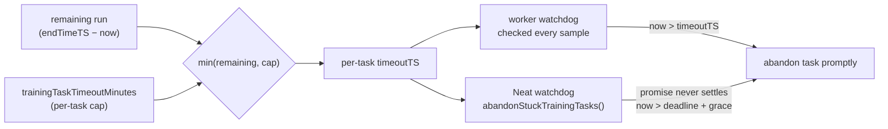

# 🏋️ Training parameters

Training parameters control backpropagation within each NEAT (NeuroEvolution of
Augmenting Topologies) generation: how much data is used, how aggressively
weights/biases are updated. These options sit on the top-level `NeatOptions`
object.

```ts
import { createNeatConfig } from "@stsoftware/neat-ai";

const config = createNeatConfig({
  // Omit trainPerGen to auto-scale with the population for supervised costs
  // (default 10 for a population of 50); set explicitly to tune throughput.
  trainPerGen: 10,
  trainingBatchSize: 100,
  trainingSampleRate: 1,
});
```

## 📊 Quick reference

| Option                         | Type      | Default                    | Description                                               |
| ------------------------------ | --------- | -------------------------- | --------------------------------------------------------- |
| `trainPerGen`                  | `integer` | _auto_ (20% of population) | Creatures trained per generation (min: 0)                 |
| `trainingTaskTimeoutMinutes`   | `number`  | `5`                        | Per-task wall-clock cap; `0` disables (min: 0)            |
| `trainingBatchSize`            | `integer` | `100`                      | Observations per training batch (min: 1)                  |
| `trainingSampleRate`           | `number`  | `1`                        | Fraction of data used for training (0.0001–1)             |
| `dataSetPartitionBreak`        | `integer` | `2000`                     | Records per dataset file (min: 1)                         |
| `maximumBiasAdjustmentScale`   | `number`  | `1`                        | Maximum bias adjustment per training iteration (min: 0)   |
| `maximumWeightAdjustmentScale` | `number`  | `1`                        | Maximum weight adjustment per training iteration (min: 0) |

## 🔁 Backpropagation cadence

### `trainPerGen`

**Default: auto — `max(1, round(populationSize × 0.2))` for supervised costs;
`1` for custom/unrecognised costs** | Type: integer | Min: 0

`trainPerGen` is **the primary throughput knob for supervised learning**. Each
generation, the fittest `trainPerGen` creatures of the (score-sorted) population
receive a backpropagation (gradient-descent) step; the rest rely on evolutionary
weight mutation alone.

> [!IMPORTANT]
> With a small `trainPerGen` only a handful of creatures get any gradient step
> per generation, so high-dimensional supervised tasks (image classification,
> regression with many inputs) converge slowly. NEAT-AI therefore **scales the
> default with the population** (Issue #2791): for the default population of 50
> the default `trainPerGen` is `10`, giving 20% gradient coverage per generation
> rather than the previous ~2% (a single creature).

**How the default is chosen**

- **Recognised built-in supervised costs** (`MSE`, `MAE`, `MAPE`, `MSLE`,
  `CROSS_ENTROPY`, `HINGE`) scale with the population:
  `max(1, round(populationSize × 0.2))`.
- **Custom or unrecognised costs** keep the conservative default of `1`, so
  evolution-only tasks are unchanged.
- **A `customCost` function** also keeps the default of `1`, whatever `costName`
  says (Issue #3776). `costName` retains its `MSE` default even when a
  `customCost` replaces the built-in cost, so it is not evidence that the task
  is supervised — set `trainPerGen` explicitly if your custom objective does
  benefit from gradient steps.

Each scheduled task runs **two epochs** so the training loop can revert an epoch
that made the creature worse (Issue #3776) — a single epoch has nothing to
compare against. The per-task wall-clock budget (`trainingTaskTimeoutMinutes`)
still bounds the total work.

**Choosing a value for supervised tasks**

- Start with the auto-scaled default. Raise `trainPerGen` (towards the
  population size) when convergence is slow and you have spare worker capacity;
  lower it to free workers for breeding/discovery.
- Pair `trainPerGen` with enough training `iterations` so evolution has time to
  apply many gradient steps — a single generation with one creature trained is
  rarely enough for a high-dimensional task.
- Set `trainPerGen: 0` to disable backpropagation entirely and rely solely on
  evolutionary selection (pure evolution / reinforcement-learning tasks).

`trainPerGen` is capped at the population size and is never scheduled for more
creatures than there are idle training workers, so an over-large value simply
trains as many creatures as capacity allows.

### `trainingTaskTimeoutMinutes`

**Default: 5** | Type: number | Min: 0 (`0` disables)

Maximum wall-clock minutes any **single** training task may run, independent of
the overall `timeoutMinutes` run budget (Issue #3053).

Without this cap an individual task inherited the **entire remaining run
budget**, so a stuck or pathologically slow creature could burn 10+ minutes
before timing out — a handful of such tasks dominated the run's wall-clock. The
per-task budget is now:

```text
min(remainingRunMinutes, trainingTaskTimeoutMinutes)
```

The worker-side training loop evaluates this deadline on **every sample** (not
only behind the 60s progress-log gate), so a task that exceeds its cap is
abandoned promptly rather than overrunning by up to a full sample batch.

A second, **Neat-level** watchdog (`Neat.abandonStuckTrainingTasks()`, swept at
the start of each finish-up cycle) covers the case the worker-side check cannot:
a task whose worker promise **never settles**. Each in-flight task's per-task
deadline is tracked in `trainingDeadlines`; once a task overruns its own
deadline plus a small grace it is abandoned **individually and promptly**,
instead of waiting for the whole batch to be cleared at the hard deadline.

- Lower the cap (e.g. `2`) on tight wall-clock budgets so no single task can
  starve breeding/discovery.
- Set `trainingTaskTimeoutMinutes: 0` to disable the cap and restore the
  previous "use the full remaining run budget" behaviour.

This cap applies only to per-creature training tasks; discovery scheduling still
uses the full remaining budget.



### `trainingBatchSize`

**Default: 100** | Type: integer | Min: 1

Number of observations per training batch during backpropagation.

### `trainingSampleRate`

**Default: 1** | Type: number | Range: 0.0001–1

Fraction of the training dataset used in each training iteration. Values below
`1.0` enable stochastic training, which can improve generalisation and speed up
each generation at the cost of noisier fitness signals.

### `dataSetPartitionBreak`

**Default: 2000** | Type: integer | Min: 1

Number of records per dataset shard. Lower values reduce peak memory at the cost
of more file handles.

## 📐 Adjustment scales

### `maximumBiasAdjustmentScale`

**Default: 1** | Type: number | Min: 0

Maximum amount by which a bias can be adjusted in one training iteration. Higher
values allow more aggressive bias updates.

### `maximumWeightAdjustmentScale`

**Default: 1** | Type: number | Min: 0

Maximum amount by which a weight can be adjusted in one training iteration.
Higher values allow more aggressive weight updates.

## 🧪 Synthetic synapses — not a `NeatOptions` option

`syntheticSynapses` is **not** part of `NeatOptions`. It lives on the internal
`TrainOptions` surface (`src/config/TrainOptions.ts`), which only the internal
`trainDir()` entry point accepts. `createNeatConfig()` never reads the key, and
the train options the evolution loop builds internally
(`src/NEAT/NeatScheduling.ts`) do not forward it — so passing it here is a type
error, and there is no public API that turns synthetic synapses on.

See [Training API — Synthetic Synapses](../api/TRAINING.md#-synthetic-synapses)
for what the feature does and where the flag is read.

## 👀 See also

- [Core evolution parameters](./CORE_EVOLUTION.md) — population, mutation, and
  stopping conditions.
- [Regularisation](./REGULARISATION.md) — weight/bias regularisation and output
  range constraints applied during training.
- [Mutation adaptation](./MUTATION_ADAPTATION.md) — adaptive thresholds, plateau
  detection, and MCMC acceptance.
- [PERFORMANCE_TUNING.md](../PERFORMANCE_TUNING.md) — picking batch sizes for
  large datasets and CPU/GPU (Graphics Processing Unit) targets.

---

**Up to:** [`README.md`](../../README.md) (entry point) ·
[`docs/README.md`](../README.md) (topic index).
