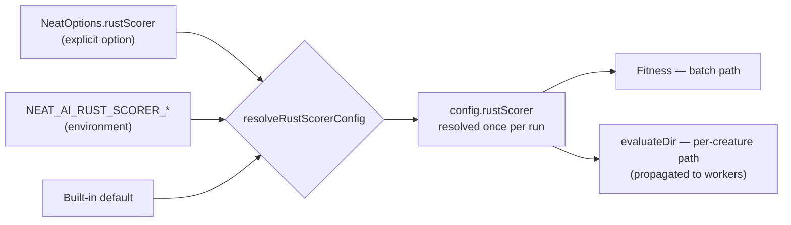

# 🧵 Workers and parallel evaluation

NEAT-AI (NeuroEvolution of Augmenting Topologies — Artificial Intelligence) runs
both fitness evaluation and heavy tasks (discovery, training, recording) on a
worker pool. These options size the pool, partition it between fast and heavy
roles, and control how creatures are distributed across workers during
evaluation.

```ts
import { createNeatConfig } from "@stsoftware/neat-ai";

const config = createNeatConfig({
  threads: 8,
  heavyTaskWorkerCount: 2,
  workerThreadCap: { maxMemoryMB: 8192, estimatedMemoryPerWorkerMB: 2048 },
  parallelEvaluation: { topologyGrouping: true },
});
```

## 📊 Quick reference

| Option                                       | Type      | Default                                                          | Description                                       |
| -------------------------------------------- | --------- | ---------------------------------------------------------------- | ------------------------------------------------- |
| `threads`                                    | `integer` | `navigator.hardwareConcurrency + heavyTaskWorkerCount` (default) | Worker threads (min: 1)                           |
| `heavyTaskWorkerCount`                       | `integer` | `2`                                                              | Workers dedicated to discovery/training (min: 1)  |
| `workerThreadCap.maxMemoryMB`                | `integer` | `0` (disabled)                                                   | Total memory budget for workers (MB)              |
| `workerThreadCap.estimatedMemoryPerWorkerMB` | `integer` | `2048`                                                           | Estimated memory per worker (MB)                  |
| `parallelEvaluation.topologyGrouping`        | `boolean` | `true`                                                           | Group same-topology creatures for WASM cache hits |
| `rustScorer.enabled`                         | `boolean` | `false`                                                          | Score datasets with the external Rust scorer      |

## 🧮 Sizing the pool

### `threads`

**Default:** `navigator.hardwareConcurrency + heavyTaskWorkerCount` | Type:
integer | Min: 1

Total worker threads. The default keeps the fast pool at ≥ one thread per
logical CPU even after partitioning.

### Worker thread cap

Cap worker thread count based on available memory (Issue #1569). This is opt-in
— when `maxMemoryMB` is not set (or `0`), behaviour is unchanged.

```ts
const config = createNeatConfig({
  threads: 16,
  workerThreadCap: {
    maxMemoryMB: 8192, // 8 GB memory budget
    estimatedMemoryPerWorkerMB: 2048, // 2 GB per worker (default)
  },
});
// Effective threads = min(16, floor(8192 / 2048)) = 4
```

| Field                        | Default        | Min | Description                                  |
| ---------------------------- | -------------- | --- | -------------------------------------------- |
| `maxMemoryMB`                | `0` (disabled) | `0` | Total memory budget in MB for worker threads |
| `estimatedMemoryPerWorkerMB` | `2048`         | `1` | Estimated memory per worker in MB            |

When `maxMemoryMB > 0`, the effective thread count is:
`min(threads, max(1, floor(maxMemoryMB / estimatedMemoryPerWorkerMB)))`.

A warning is logged when the thread count is capped.

## ⚡ Worker pool partitioning

Issue #2243: Control how workers are split between fast tasks (fitness
evaluation/scoring) and heavy tasks (discovery, training, recording).

```ts
const config = createNeatConfig({
  threads: 8,
  heavyTaskWorkerCount: 2, // 2 heavy workers, 6 fast workers
});
```

| Field                  | Default | Min | Description                                 |
| ---------------------- | ------- | --- | ------------------------------------------- |
| `heavyTaskWorkerCount` | `2`     | `1` | Workers dedicated to discovery and training |

Fast workers (`threads - heavyTaskWorkerCount`) handle fitness evaluation
exclusively and are never blocked by long-running discovery or training tasks.

**Partitioning is disabled when `threads <= 2`** — all workers share both roles
because there are too few workers to partition meaningfully.

**Validation (when `threads > 2`):** `heavyTaskWorkerCount` must be `< threads`
so at least one worker remains available for fast tasks.

## 🚀 Parallel evaluation

Issue #1862: Controls how creatures are distributed across workers during
fitness evaluation. Topology-aware grouping ensures creatures with identical
network structure are evaluated on the same worker, maximising WASM
(WebAssembly) compilation cache hits and improving evaluation throughput.

Pass as `parallelEvaluation` in options.

```ts
const config = createNeatConfig({
  parallelEvaluation: {
    topologyGrouping: true, // default
  },
});
```

| Option             | Type      | Default | Description                                                     |
| ------------------ | --------- | ------- | --------------------------------------------------------------- |
| `topologyGrouping` | `boolean` | `true`  | Group creatures by topology hash to improve WASM cache hit rate |

> [!TIP]
> Keep `topologyGrouping` enabled unless you have a specific reason to disable
> it. Topology grouping improves WASM cache utilisation by batching same-shape
> creatures together. Every worker handed to evaluation participates — to
> reserve capacity for concurrent training or discovery, size the heavy pool
> with `heavyTaskWorkerCount` rather than capping evaluation. (Issue #3566
> removed the inert `maxConcurrentEvaluations` cap, which defaulted to "no
> cap".)

## 🦀 Native Rust scorer

Issue #3865: `rustScorer` routes dataset scoring through the external
`rust_scorer` binary instead of the WASM path. It used to be reachable only
through `NEAT_AI_RUST_SCORER_*` environment variables; it is now an option you
can pass alongside the rest of your configuration.

```ts
const config = createNeatConfig({
  rustScorer: {
    enabled: true, // default: false
    binaryPath: "/opt/bin/rust_scorer", // default: "rust_scorer" (via PATH)
    batch: true, // one invocation per generation (default)
    strict: true, // an exec/parse failure throws (default)
    timeoutMs: 0, // 0 = no timeout
  },
});
```

| Field        | Type      | Default        | Description                                       |
| ------------ | --------- | -------------- | ------------------------------------------------- |
| `enabled`    | `boolean` | `false`        | Delegate dataset scoring to the Rust scorer       |
| `binaryPath` | `string`  | `rust_scorer`  | Scorer executable (resolved via `PATH`)           |
| `batch`      | `boolean` | `true`         | One invocation per generation, not per creature   |
| `strict`     | `boolean` | `true`         | Throw on exec/parse failure instead of degrading  |
| `timeoutMs`  | `integer` | `0` (no limit) | Per-invocation timeout in milliseconds (min: `0`) |
| `env`        | `object`  | `{}`           | Extra environment variables for the child process |

### Precedence

**An explicit option beats the environment, and the environment beats the
built-in default.** Set a field here and it wins outright; omit it and the
matching `NEAT_AI_RUST_SCORER_*` variable applies; omit both and the default
does. So `rustScorer: { enabled: false }` keeps the native path off even on a
host that exports `NEAT_AI_RUST_SCORER_ENABLED=1`.



Omitting `rustScorer` entirely resolves to exactly the environment-derived
config, so a caller who sets nothing sees no change in behaviour. The
environment layer is read once and cached for the process; the merged result
belongs to one run and never writes back into that cache.

The environment variables themselves are listed in
[TROUBLESHOOTING.md](../TROUBLESHOOTING.md#-environment-variables-reference).

## ✅ Validation rules

- `threads` must be at least `1`.
- `heavyTaskWorkerCount` must be at least `1`, and strictly less than `threads`
  when `threads > 2`. Partitioning is disabled when `threads <= 2`.
- `workerThreadCap.estimatedMemoryPerWorkerMB` must be at least `1` if
  `maxMemoryMB > 0`.
- `rustScorer.timeoutMs` must be a non-negative integer.

## 👀 See also

- [Discovery](./DISCOVERY.md) — `maxConcurrentDiscoveries` interacts with
  `heavyTaskWorkerCount`.
- [Population sizing](./POPULATION.md) —
  `adaptivePopulation.minCreaturesPerWorker` keeps each worker fed.
- [PERFORMANCE_TUNING.md](../PERFORMANCE_TUNING.md) — operational tuning for
  WASM caches, thread pools, memory management, and scaling.
- [PERFORMANCE_RESEARCH.md](../PERFORMANCE_RESEARCH.md) — WASM migration
  research and benchmark learnings.

---

**Up to:** [`README.md`](../../README.md) (entry point) ·
[`docs/README.md`](../README.md) (topic index).
