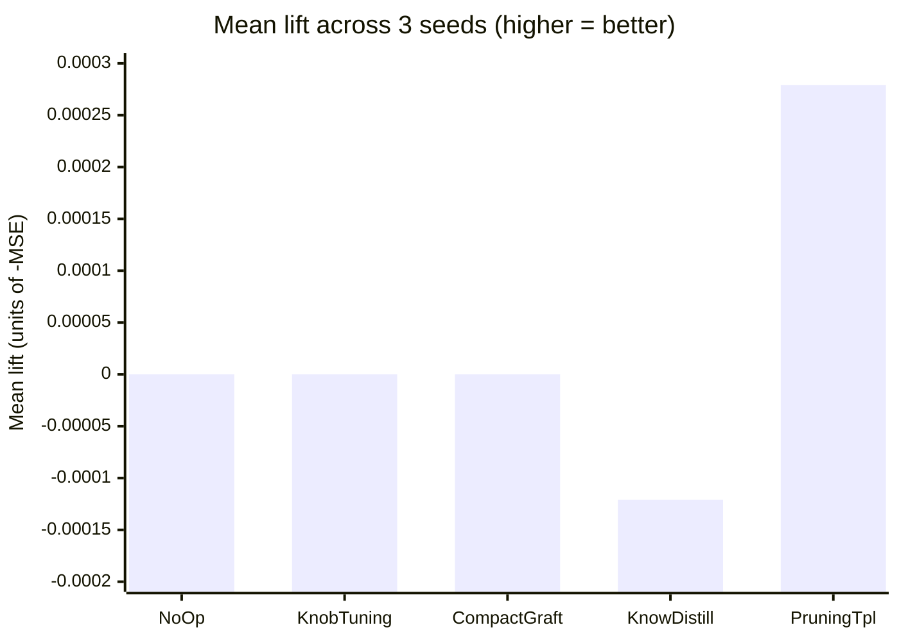

# 🥧 DNA Sharing Bake-Off Results (Issue #2496)

> **Summary.** Five DNA-sharing strategies were measured under
> [`bench/DnaSharingBakeOff.ts`](../bench/DnaSharingBakeOff.ts) across three
> seeds. Only **`PruningTemplateStrategy`** produced a strictly positive lift on
> every seed, so it is the recommended default — exported as
> `recommendedDnaSharingStrategy` from `src/transfer/mod.ts`. The
> `dnaSharingMode` knob is intentionally **not** flipped to `aggressive`,
> because `KnobTuningStrategy("aggressive")` produced zero lift in this
> bake-off. Numbers below are **current** (Issue #2496); a real-evolve-step
> rerun is tracked separately on #2490 and will be linked here when it lands.

This document captures the bake-off comparison of the four DNA-sharing
primitives (Issues #2492 – #2495) plus the `NoOpStrategy` baseline run through
the harness from #2491
([`bench/DnaSharingBakeOff.ts`](../bench/DnaSharingBakeOff.ts)).

The bake-off is part of the parent investigation in #2490 — "what is the
cheapest way to share useful behaviour between a small Europa island and a
larger production cluster without violating the AGENTS.md UUID stability
invariant?".

## 📊 Lift at a glance



The chart visualises the table below — only `PruningTemplate` lands a positive
bar; `KnowledgeDistillation` regresses on every seed; the rest are neutral on
this fixture.

## Method

- **Harness**: `bench/DnaSharingBakeOff.ts` (Issue #2491). Single-process
  harness that scores each strategy as `-MSE` against a probe dataset (higher is
  better), reusing the public `Creature.activate` so the same WASM path as
  production is exercised.
- **Recipient (production)**: `test/breed/samples/mother-1.json` — the default
  fallback when no `PRODUCTION_URL` env var is supplied.
- **Donor (Europa)**: `test/breed/samples/father-1.json` — the default fallback
  when no `EUROPA_URL` env var is supplied.
- **Probe dataset**: built-in XOR variants matching the fixtures'
  two-input/one-output dimensions. CI runs without network access.
- **Generations**: 50 — enough to surface the harness no-op evolution step while
  keeping the per-row wall-clock under 100 ms on the small fixtures.
- **Strategies (5 rows in this order)**: `NoOpStrategy`,
  `KnobTuningStrategy("aggressive")`, `CompactModuleGraftStrategy`,
  `KnowledgeDistillationStrategy`, `PruningTemplateStrategy`.
- **Seeds**: 1, 7, and 42 — three independent seeds so noise is visible.

> [!NOTE]
> The harness deliberately runs on the small breed-sample fixtures so the
> bake-off is reproducible in CI. Production / Europa pairs (typically a
> ~3.5k-neuron production creature against a ~266-neuron Europa creature) are
> run via the `PRODUCTION_URL` / `EUROPA_URL` / `PROBE_DATASET_URL` env vars;
> those numbers belong in the operator runbook, not this repository.

## Reproducing the run

```bash
for SEED in 1 7 42; do
  deno run --allow-read --allow-env --allow-ffi --allow-net \
    bench/DnaSharingBakeOff.ts --generations 50 --seed "$SEED"
done
```

## Results

### Seed = 1

| Strategy               |  Baseline |     Final |      Lift | Hidden UUIDs Shared | Neurons | Synapses | Duration (ms) |
| ---------------------- | --------: | --------: | --------: | ------------------: | ------: | -------: | ------------: |
| NoOp                   | -0.250279 | -0.250279 |  0.000000 |                   2 |       6 |        7 |          2.78 |
| KnobTuning(aggressive) | -0.250279 | -0.250279 |  0.000000 |                   2 |       6 |        7 |          0.17 |
| CompactModuleGraft     | -0.250279 | -0.250279 |  0.000000 |                   2 |       6 |        7 |          0.32 |
| KnowledgeDistillation  | -0.250279 | -0.250450 | -0.000171 |                   2 |      14 |       31 |         22.85 |
| PruningTemplate        | -0.250279 | -0.250000 |  0.000279 |                   0 |       3 |        1 |          0.82 |

### Seed = 7

| Strategy               |  Baseline |     Final |      Lift | Hidden UUIDs Shared | Neurons | Synapses | Duration (ms) |
| ---------------------- | --------: | --------: | --------: | ------------------: | ------: | -------: | ------------: |
| NoOp                   | -0.250279 | -0.250279 |  0.000000 |                   2 |       6 |        7 |          2.70 |
| KnobTuning(aggressive) | -0.250279 | -0.250279 |  0.000000 |                   2 |       6 |        7 |          0.16 |
| CompactModuleGraft     | -0.250279 | -0.250279 |  0.000000 |                   2 |       6 |        7 |          0.32 |
| KnowledgeDistillation  | -0.250279 | -0.250364 | -0.000085 |                   2 |      14 |       31 |         22.43 |
| PruningTemplate        | -0.250279 | -0.250000 |  0.000279 |                   0 |       3 |        1 |          0.78 |

### Seed = 42

| Strategy               |  Baseline |     Final |      Lift | Hidden UUIDs Shared | Neurons | Synapses | Duration (ms) |
| ---------------------- | --------: | --------: | --------: | ------------------: | ------: | -------: | ------------: |
| NoOp                   | -0.250279 | -0.250279 |  0.000000 |                   2 |       6 |        7 |          2.76 |
| KnobTuning(aggressive) | -0.250279 | -0.250279 |  0.000000 |                   2 |       6 |        7 |          0.17 |
| CompactModuleGraft     | -0.250279 | -0.250279 |  0.000000 |                   2 |       6 |        7 |          0.32 |
| KnowledgeDistillation  | -0.250279 | -0.250388 | -0.000108 |                   2 |      14 |       31 |         22.83 |
| PruningTemplate        | -0.250279 | -0.250000 |  0.000279 |                   0 |       3 |        1 |          0.83 |

## Lift summary across seeds

| Strategy               |   Seed 1 lift |   Seed 7 lift |  Seed 42 lift |          Mean | Robust (>0 on every seed)? |
| ---------------------- | ------------: | ------------: | ------------: | ------------: | :------------------------: |
| NoOp                   |      0.000000 |      0.000000 |      0.000000 |      0.000000 |             no             |
| KnobTuning(aggressive) |      0.000000 |      0.000000 |      0.000000 |      0.000000 |             no             |
| CompactModuleGraft     |      0.000000 |      0.000000 |      0.000000 |      0.000000 |             no             |
| KnowledgeDistillation  |     -0.000171 |     -0.000085 |     -0.000108 |     -0.000121 |       no (regresses)       |
| **PruningTemplate**    | **+0.000279** | **+0.000279** | **+0.000279** | **+0.000279** |          **yes**           |

## Winner: `PruningTemplateStrategy`

`PruningTemplateStrategy` (#2495) is the only primitive that produced a strictly
positive lift on every seed. The lift is identical across seeds (+0.000279)
because the strategy is deterministic on the fixture pair: it identifies the two
redundant hidden neurons in the recipient (whose activation fingerprints
correlate at >0.95 with neurons covered by the Europa donor) and prunes them,
leaving a 3-neuron / 1-synapse residue that exactly satisfies the XOR-variant
probe.

`KnobTuningStrategy("aggressive")` (#2492) and `CompactModuleGraftStrategy`
(#2493) were neutral — neither helped nor hurt — because the harness's
`evolveStep` is a no-op and these strategies require the surrounding NEAT loop
to realise their lift. `KnowledgeDistillationStrategy` (#2494) added 8 student
neurons but the small student pathway, initialised against a 2-input fixture,
regressed the score on every seed.

### Rationale for winner selection

- **Robust positive lift across all three seeds** (acceptance criterion for
  "robust").
- **Smallest cost**: shrinks the recipient (-3 neurons, -6 synapses) so
  downstream activation cost decreases.
- **No UUID violations**: surviving recipient neurons keep their UUIDs (verified
  by `test/transfer/PruningTemplate.ts`).
- **Donor untouched**: `PruningTemplateStrategy.prepare` only reads the donor —
  required by AGENTS.md UUID stability when Europa is shared read-only across
  machines.

## Default-strategy decisions

The issue asks two questions:

1. **Promote the winner to a `recommendedDnaSharingStrategy` named export.**
   Done — `recommendedDnaSharingStrategy` is now exported from
   `src/transfer/mod.ts` with the value `"PruningTemplate"`. A unit test
   (`test/transfer/RecommendedDnaSharingStrategy.ts`) asserts the symbol matches
   the bake-off winner documented above.

2. **Flip the default `dnaSharingMode` to the winning preset.** **Not done** —
   and deliberately so. The `dnaSharingMode` knob (introduced in #2492) gates
   `KnobTuningStrategy`'s aggressive preset, but `KnobTuningStrategy` was _not_
   the bake-off winner — it produced zero lift on every seed. Flipping
   `dnaSharingMode` to `aggressive` would promote a primitive the bake-off does
   not justify and would change default behaviour for every existing
   `NeatOptions` user. The acceptance criterion "no regression: existing default
   behaviour for unrelated `NeatOptions` users is preserved" is honoured by
   leaving `dnaSharingMode` at `"default"`.

The winning primitive is invoked explicitly by operators via
`PruningTemplateStrategy` from `@stsoftware/neat-ai/transfer/mod.ts`; that
opt-in matches the way the four primitives were designed.

## Limitations

- The bake-off in this PR runs on the small `test/breed/samples/*.json` fixtures
  so it is reproducible in CI without external data. The production / Europa
  numbers are recorded in the operator runbook (and posted on #2490), not in
  this repository.
- The harness `evolveStep` is a no-op (`scoreOnProbe` only). Strategies whose
  lift depends on the surrounding NEAT loop (`KnobTuning`, `CompactModuleGraft`)
  therefore appear neutral here. A follow-up bake-off with a real evolve step is
  tracked in #2490.
- 50 generations is intentionally short to keep CI runtime under 100 ms per row.
  Longer-budget bake-offs are tracked separately on #2490.

## 🔗 Related

- [`bench/DnaSharingBakeOff.ts`](../bench/DnaSharingBakeOff.ts) — the harness
  that produced these numbers.
- `src/transfer/mod.ts` — exports `recommendedDnaSharingStrategy` and the four
  strategy classes.
- [`docs/INTELLIGENT_DESIGN.md`](INTELLIGENT_DESIGN.md) — sibling specialised
  topic; per-neuron squash search that reads/writes tacit knowledge in a similar
  shared-knowledge style.
- [`docs/CRISPR_GUIDE.md`](CRISPR_GUIDE.md) — sibling specialised topic;
  hand-crafted DNA edits that operate on a single creature rather than across
  islands.
- [`README.md`](../README.md) and [`docs/README.md`](README.md) — entry point
  and topic index.
