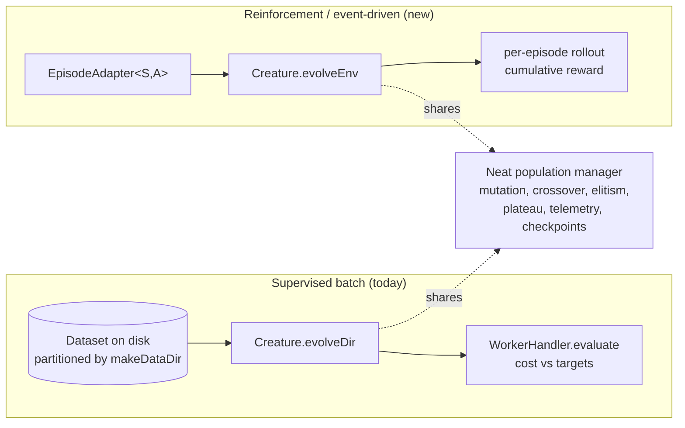
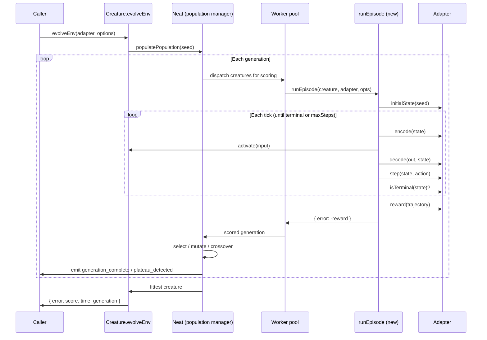
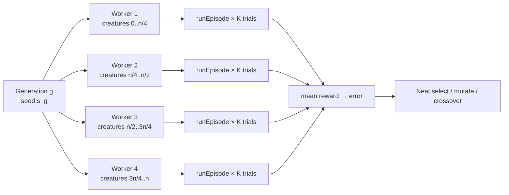

# 🎮 RFC: First-class event-driven evolution API (`evolveEnv`)

> **Status:** Design (RFC). No implementation yet — this document is the
> reference contract that the implementation issue and the
> [NEAT-AI-Examples migration](https://github.com/stSoftwareAU/NEAT-AI-Examples/issues/230)
> will be measured against.
>
> **Tracks:** Issue #2610 in NEAT-AI; design half of
> [NEAT-AI-Examples#230](https://github.com/stSoftwareAU/NEAT-AI-Examples/issues/230).

NEAT-AI today gives **supervised batch evolution** the full library treatment
through `Creature.evolveDir()` / `Creature.evolveDataSet()`: worker pool,
plateau detection, checkpointing, lifecycle events, signal-based interrupt. It
gives **reinforcement / event-driven evolution** essentially nothing — every
episodic example in
[NEAT-AI-Examples](https://github.com/stSoftwareAU/NEAT-AI-Examples) (cart-pole,
mountain-car, snake, maze, lunar lander) reimplements the population loop by
hand.

This RFC proposes a first-class entry point — `Creature.evolveEnv` — that reuses
the existing population manager, mutation operators, plateau detection,
telemetry, and checkpointing, and only adds a new **scorer** path: per-creature
episode rollout driven by a small `EpisodeAdapter` interface.

## 📋 Table of contents

1. [Paradigm split: supervised batch vs reinforcement / event-driven](#-paradigm-split-supervised-batch-vs-reinforcement--event-driven)
2. [API surface — `Creature.evolveEnv(adapter, options)`](#-api-surface--creatureevolveenvadapter-options)
3. [Episodic options](#-episodic-options)
4. [Fitness aggregation](#-fitness-aggregation)
5. [Reuse plan: what stays, what is new](#-reuse-plan-what-stays-what-is-new)
6. [Validation hold-out hook (deferred)](#-validation-hold-out-hook-deferred)
7. [Multi-threaded rollouts](#-multi-threaded-rollouts)
8. [Migration path for the Examples repo](#-migration-path-for-the-examples-repo)
9. [Acceptance criteria](#-acceptance-criteria)

## 🆚 Paradigm split: supervised batch vs reinforcement / event-driven

NEAT-AI now hosts two distinct evolution paradigms. Naming them clearly stops
contributors from grafting an episode rollout onto an `evolveDir` code path it
was never designed for.

| Paradigm                                   | Existing API                                       | Use case                                                                                                                                  |
| ------------------------------------------ | -------------------------------------------------- | ----------------------------------------------------------------------------------------------------------------------------------------- |
| **Supervised batch evolution**             | `Creature.evolveDir()`, `Creature.evolveDataSet()` | Pre-generated forward-only dataset (MNIST, XOR, stock-market regression). Fitness = `1 − costFn(predicted, expected)` over a dataset.     |
| **Reinforcement / event-driven evolution** | _new_ `Creature.evolveEnv()`                       | Stepping a creature through an environment per generation (lunar lander, cart-pole, snake, mountain-car, maze). Fitness = episode reward. |

"Event-driven" here means **interactive episodic** — each tick the creature
observes state, emits an action, and the environment transitions — not literal
DOM/event-bus events. The streaming primitive itself (`Creature.activate`) is
already documented in [`REINFORCEMENT_LEARNING.md`](REINFORCEMENT_LEARNING.md);
this RFC is about wrapping that primitive in the same orchestration that
`evolveDir` already provides.



## 🧩 API surface — `Creature.evolveEnv(adapter, options)`

The proposed shape is deliberately small. The library owns the population loop;
the caller owns the world.

```typescript
/**
 * Adapter that lets NEAT-AI roll out a creature against an episodic
 * environment. The adapter is the single seam between the library and the
 * caller's world: NEAT-AI never touches `S` or `A` directly, only through
 * the methods below.
 *
 * Type parameters:
 *   S — the simulator's internal state type (opaque to NEAT-AI).
 *   A — the decoded action type (opaque to NEAT-AI).
 */
export interface EpisodeAdapter<S, A> {
  /**
   * Build a fresh starting state from a deterministic seed. Same seed
   * MUST produce the same state so per-generation seed reuse gives a fair
   * fitness comparison across creatures.
   */
  initialState(rngSeed: number): S;

  /**
   * Encode the current state as a Float32Array suitable for
   * `Creature.activate(...)`. The caller owns buffer reuse — NEAT-AI will
   * not retain the returned buffer between ticks.
   */
  encode(state: S): Float32Array;

  /**
   * Decode the creature's output vector into an action of type `A`. Called
   * once per tick after `creature.activate`.
   */
  decode(out: Float32Array, state: S): A;

  /** Advance the world by one tick and return the next state. */
  step(state: S, action: A): S;

  /** Terminal predicate. The rollout stops when this returns true. */
  isTerminal(state: S): boolean;

  /**
   * Reduce a finished trajectory to a scalar fitness. NEAT-AI converts
   * this back to its internal `error` representation (see
   * [Fitness aggregation](#-fitness-aggregation)). Higher is better.
   */
  reward(traj: { initial: S; final: S; steps: number }): number;
}

/**
 * Episode-rollout-specific knobs. Layered on top of NeatOptions, which
 * already supplies population size, mutation rates, plateau detection,
 * checkpoint store, telemetry, threads, and so on.
 */
export interface EpisodicOptions {
  /** Hard cap on ticks per rollout (safety net for non-terminating policies). */
  maxStepsPerEpisode: number;
  /** Episodes per creature per generation; reward is averaged. Default 1. */
  trialsPerScore?: number;
  /** Generation-level seed; deterministic when set. */
  trialSeed?: number;
  /**
   * Optional ± perturbation applied to the seed across the K trials so each
   * trial faces a slightly different start state. Variance reduction knob.
   */
  initialPerturbation?: number;
}

declare module "./Creature.ts" {
  interface Creature {
    evolveEnv<S, A>(
      adapter: EpisodeAdapter<S, A>,
      options: NeatOptions & EpisodicOptions,
    ): Promise<{
      error: number;
      score: number;
      time: number;
      generation: number;
    }>;
  }
}
```

The interface is fully typed — no `unknown`, no `any`, no positional `args`. `S`
and `A` are opaque caller-owned types. The reward function receives only the
trajectory summary the library already has to track (initial state, final state,
step count); callers that need richer per-tick history can close over their own
accumulator inside `step` and read it inside `reward`.

### 📛 Why `evolveEnv` (and not `evolveEpisodic` / `evolveAgent`)

The candidate names sit alongside the existing pair `evolveDir` and
`evolveDataSet`:

- **`evolveEnv`** — pairs with `evolveDir` / `evolveDataSet` by ending in a
  short noun naming the input ("a directory of records", "a dataset of records",
  "an environment to step through"). Tab-completion lines them up.
- **`evolveEpisodic`** — names the paradigm rather than the input, breaks the
  noun-suffix pattern, and is a mouthful at the call site:
  `creature.evolveEpisodic(cartPoleAdapter, ...)`.
- **`evolveAgent`** — names the wrong half: the creature is the agent, the
  adapter is the environment. The method already lives on `Creature` so naming
  the agent is redundant; what the call needs is the environment.

The doc therefore picks **`evolveEnv`** as canonical. It is short, pairs with
the existing two methods, and reads correctly at the call site:

```typescript
await creature.evolveEnv(cartPoleAdapter, {
  populationSize: 64,
  iterations: 200,
  maxStepsPerEpisode: 500,
  trialsPerScore: 4,
});
```

## ⚙️ Episodic options

Beyond the standard `NeatOptions` (population size, mutation rates, plateau
window, threads, checkpoint store, telemetry sink, etc.), `evolveEnv` adds:

| Option                | Type     | Default | Purpose                                                                                                       |
| --------------------- | -------- | ------- | ------------------------------------------------------------------------------------------------------------- |
| `maxStepsPerEpisode`  | `number` | —       | Required. Safety cap on tick count so a non-terminating policy cannot wedge a generation.                     |
| `trialsPerScore`      | `number` | `1`     | Number of episodes rolled out per creature per generation. Mean reward becomes the fitness.                   |
| `trialSeed`           | `number` | random  | Seed used for `initialState(seed)` in the first trial of each generation. Reused per-generation for fairness. |
| `initialPerturbation` | `number` | `0`     | When `trialsPerScore > 1`, trials 2…K use `trialSeed + perturbation * trialIndex` so each trial differs.      |

**Per-generation seed reuse** is non-negotiable for fairness — every creature in
generation `g` must face the same starting state, otherwise the fittest creature
wins by luck. Rotating `trialSeed` across generations stops the population
over-fitting to one configuration of the world.

## 🧮 Fitness aggregation

NEAT-AI's internal contract is **lower error is better**, with score expressed
as `score = 1 − error`. `evolveDir`'s `WorkerHandler.evaluate(dataDir)` returns
`error = costFn(predicted, expected)`, and the population manager and plateau
detector both drive off that one number. `evolveEnv` MUST present the same
surface so every existing piece of telemetry (target-error early-stop, plateau
detection, `onTrainingEvent`, checkpoint persistence) keeps working unchanged.

### Single trial

```text
fitness  = adapter.reward(trajectory)        // higher is better
score    = fitness                           // pass-through for population
error    = -fitness                          // negate so lower is better,
                                             // matches evolveDir convention
```

### `K = trialsPerScore` trials

```text
rewards  = [adapter.reward(trajectory_i) for i in 1..K]
fitness  = mean(rewards)                     // variance reduction
score    = fitness
error    = -fitness
```

The library does no shaping or normalisation — that is the adapter's job.
Callers who need to clip, normalise, or subtract a baseline do so inside
`reward(...)` and return the final scalar. Sign convention is documented up
front so adapters return raw cumulative reward (higher = better) and the library
handles the inversion.

> [!IMPORTANT]
> `targetError` and plateau detection compare **error**, not reward. An adapter
> that wants the loop to stop "when reward ≥ 200" sets
> `options.targetError = -200`. This mirrors `evolveDir`'s behaviour and avoids
> a second early-stop code path.

## 🔄 Reuse plan: what stays, what is new

The whole point of this RFC is that `evolveEnv` is **almost entirely an
existing-code path** with one new scorer. Concretely:

### Reused verbatim (no changes)

- `Neat` population manager (`src/NEAT/Neat.ts`) — speciation, selection,
  elitism, generation bookkeeping.
- Mutation and crossover operators (`src/mutate/`, `src/breed/`) — the same
  library operators that `evolveDir` uses. Examples will stop carrying their
  private `mutateCreatureExport()`.
- Plateau detection and adaptive mutation (`src/NEAT/Neat.ts` plus the
  plateau-window window used by `generation_complete` / `plateau_detected`
  events).
- Lifecycle telemetry — `onTrainingEvent` with the existing
  `generation_complete` and `plateau_detected` event kinds. Phase-timing fields
  populated in `evolveDir` (Issue #2239) reapply unchanged; the evaluation phase
  becomes "rollout phase" but uses the same field name.
- Checkpoint persistence (`config.creatureStore`, `checkpointEveryGeneration`,
  `writeCreatures`).
- Signal-based interrupt — `SIGTERM` listener that flips `interrupted = true`
  and lets the current generation finish before exiting cleanly.
- Time and iteration budgets — `timeoutMinutes`, `iterations`, `targetError`.
- Result shape — `{ error, score, time, generation }` matches `evolveDir`'s
  return so existing CLIs and dashboards do not branch on the entry point.

### New code paths

- **Adapter-driven scorer**. `WorkerHandler.evaluate(dataDir)` is replaced for
  this entry point by a small `runEpisode(creature, adapter, opts)` function
  that owns the rollout loop. It calls `Creature.activate` exactly the way the
  canonical loop in [`REINFORCEMENT_LEARNING.md`](REINFORCEMENT_LEARNING.md)
  does, then averages reward across `trialsPerScore` trials.
- **No on-disk dataset**. `evolveEnv` does not call `makeDataDir`; there is no
  `dataSetDir`. Workers receive the adapter (or a worker-safe handle to it)
  instead of a directory path. See
  [Multi-threaded rollouts](#-multi-threaded-rollouts).
- **Reward → error inversion**. A small bookkeeping helper that converts the
  caller's "higher is better" scalar into the library's "lower is better"
  internal error. Centralising this in one place keeps `targetError` semantics
  correct.
- **Adapter validation at entry**. Fail fast if `maxStepsPerEpisode <= 0`,
  `trialsPerScore < 1`, or any required adapter method is missing — using
  `ValidationError` from `src/errors/` to match the existing failure-mode
  vocabulary.

### Sequence: where the new scorer fits



## 🧪 Validation hold-out hook (deferred)

A separate validation/hold-out evaluation is **out of scope for this first
cut**, but is called out here so it can land cleanly later (tracked under Issue
#198). The intended shape:

- `EpisodicOptions.validation?: { adapter: EpisodeAdapter<S, A>; trials:
  number; everyGenerations: number }`
  — when present, the library scores the generation's fittest creature against
  an independent adapter and emits a `validation_complete` event alongside
  `generation_complete`.
- The validation adapter is allowed to differ from the training adapter (e.g.
  harder seeds, more trials, no shaping), so the user can detect over-fitting on
  the training distribution. This is the episodic analogue of `evolveDir`'s
  held-out test set.

This RFC reserves the option name and event kind so neither has to be renamed
when validation lands.

## 🧵 Multi-threaded rollouts

Rollouts are embarrassingly parallel: each creature's episode is independent.
The implementation issue tracks plumbing this through the existing worker pool;
the design constraints are:

1. **Reuse `WorkerHandler` infrastructure**. The pool, partitioning into
   fast/heavy slots (Issue #2243), per-worker WASM cache caps (Issue #1567), and
   worker-init fallback (`preferDirect`) are not specific to dataset-style
   evaluation. Refactor `WorkerHandler` so the "what to evaluate" step is
   pluggable: dataset evaluation today, adapter rollout for `evolveEnv`, future
   scorers later.
2. **Adapter shipping**. Adapters that hold non-cloneable references (open
   files, native handles) cannot cross worker boundaries via `structuredClone`.
   The first cut accepts this and runs single-threaded when the adapter declares
   `transferable: false` (or the adapter cannot be serialised).
   `transferable: true` adapters (pure-function adapters built from primitive
   state and the methods above) can be shipped to workers and rolled out in
   parallel.
3. **Determinism under parallelism**. Per-generation seed reuse stays — every
   worker uses the same generation seed. Workers identify themselves only for
   load balancing, not for seed selection.
4. **Telemetry**. `phaseTiming.scoreEvalMs` repurposed to mean "rollout phase
   wall-clock"; existing dashboards keep working without code changes.



Full implementation of multi-threaded rollouts is tracked separately so the
single-threaded scorer can land first and unblock the Examples migration.

## 🧭 Migration path for the Examples repo

The five event-driven examples in
[NEAT-AI-Examples](https://github.com/stSoftwareAU/NEAT-AI-Examples)
(`cart_pole`, `mountain_car`, `snake_game`, `maze_navigation`, `lunar_lander`)
currently each carry ~150 lines of bespoke population code: random init,
sort-by-score, top-half selection, manual mutation via a private
`mutateCreatureExport`, hand-rolled elitism. After `evolveEnv` lands, each
example collapses to:

```typescript
// 1. Wrap the simulator
const adapter: EpisodeAdapter<CartPoleState, number> = {
  initialState: (seed) => CartPole.reset(seed),
  encode: (s) => s.toFloat32Array(),
  decode: (out) => out[0] > 0 ? 1 : 0,
  step: (s, a) => s.step(a),
  isTerminal: (s) => s.terminal,
  reward: (t) => t.steps, // survival proxy
};

// 2. Hand it to NEAT-AI
const result = await creature.evolveEnv(adapter, {
  populationSize: 64,
  iterations: 200,
  maxStepsPerEpisode: 500,
  trialsPerScore: 4,
  targetError: -495, // stop when mean survival ≥ 495 ticks
  onTrainingEvent: (e) => log(e),
});
```

The migration plan is intentionally staged so the contract is stable before all
five examples flip:

1. **RFC merged (this doc).** Examples team can start writing adapters.
2. **`evolveEnv` implementation merged.** Single-threaded scorer; same return
   shape as `evolveDir`. One example (cart-pole) migrated in the same PR as a
   smoke test.
3. **Remaining four examples migrated** — one PR per example so review stays
   small and any adapter-shape feedback lands before the last conversion.
4. **Multi-threaded rollouts** — separate PR; no API change, just the worker
   pool plumbing described above.
5. **Validation hold-out hook** — separate PR; adds the `validation` option and
   `validation_complete` event without breaking existing call sites.

After step 3 the Examples repo will have **deleted** every copy of
`mutateCreatureExport`, every hand-rolled population loop, every example-side
plateau heuristic. The win is measured in lines of duplication removed and in
features the examples now get for free (plateau detection, checkpointing,
`SIGTERM`-clean exit, lifecycle events).

## ✅ Acceptance criteria

This RFC closes when all of the following are true:

- [x] `docs/event-driven-evolution.md` exists in `stSoftwareAU/NEAT-AI` and
      covers all eight points enumerated in the issue.
- [x] The chosen API name (`evolveEnv`) is justified explicitly against
      `evolveEpisodic` and `evolveAgent`.
- [x] `EpisodeAdapter<S, A>` is fully typed — no `unknown`, no `any`.
- [x] The doc names which existing NEAT-AI internals are reused (population
      manager, mutation, plateau detection, lifecycle events, checkpoint
      persistence, signal-interrupt) and which are new (per-episode scorer,
      reward → error inversion, adapter validation).
- [x] Cross-references the Examples repo issue
      ([NEAT-AI-Examples#230](https://github.com/stSoftwareAU/NEAT-AI-Examples/issues/230))
      and names the five migration follow-ups (`cart_pole`, `mountain_car`,
      `snake_game`, `maze_navigation`, `lunar_lander`).
- [x] `./quality.sh` passes.

Implementation work is tracked separately so this RFC stays merge-ready without
waiting on code.
