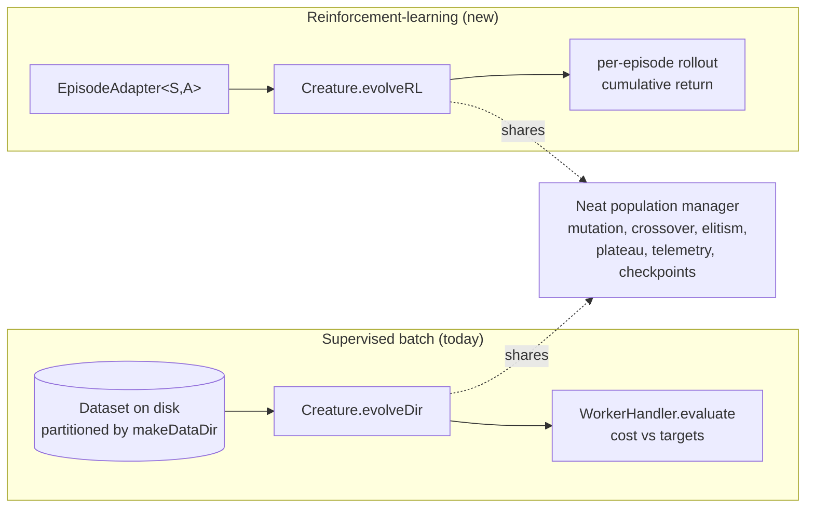
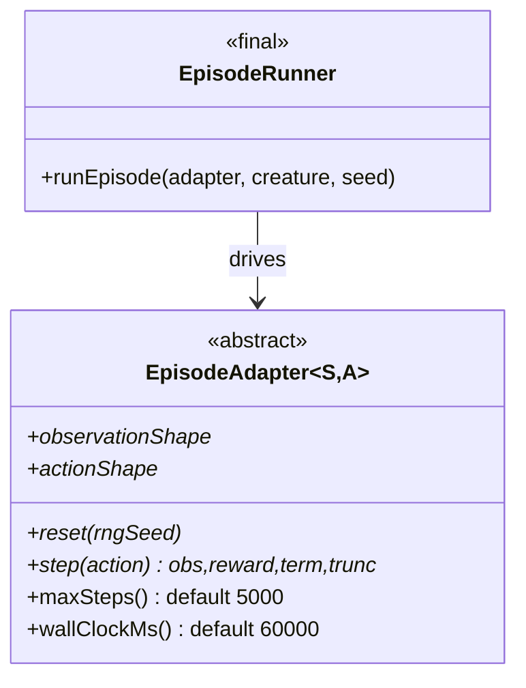
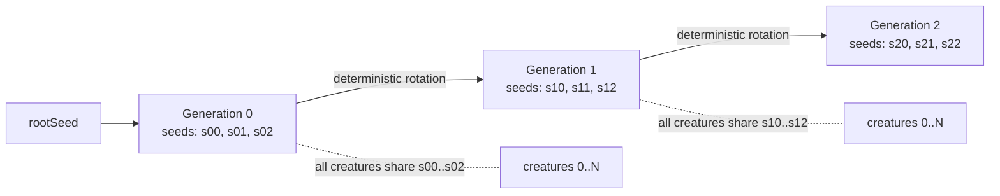
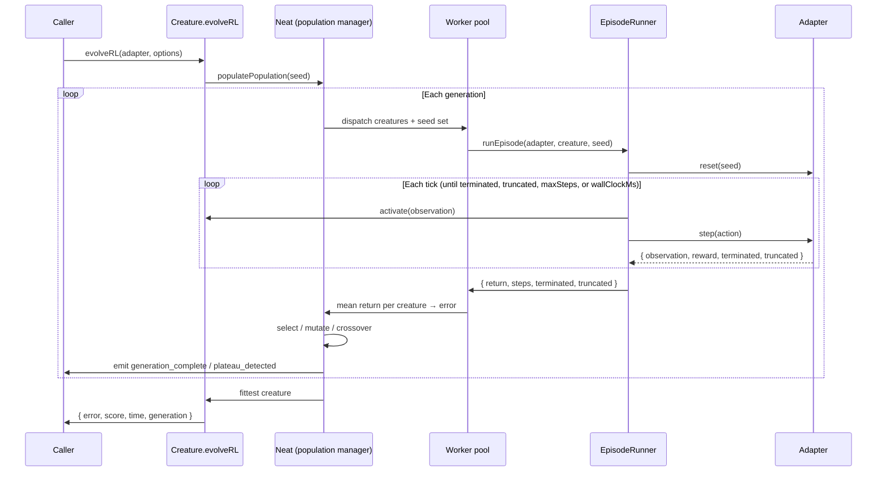
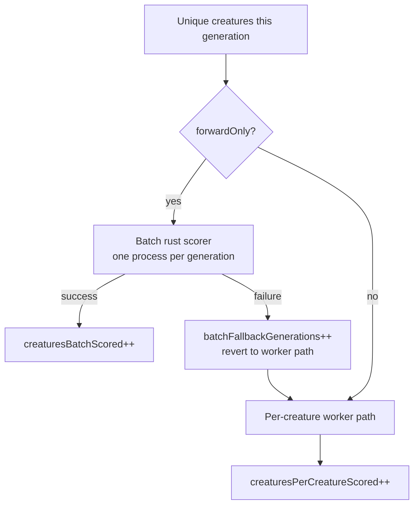
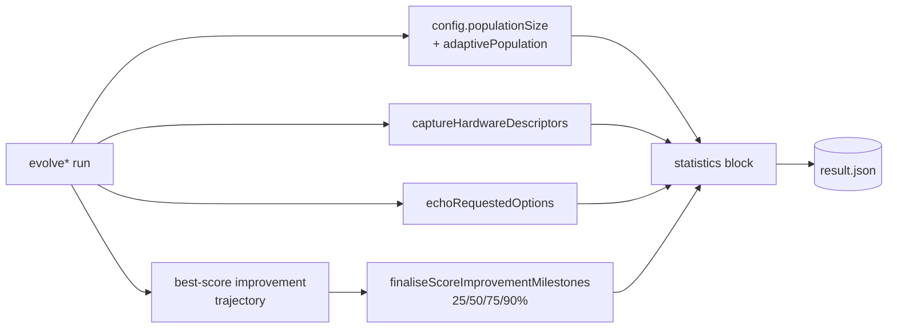

# 🎮 RFC: First-class reinforcement-learning evolution API (`evolveRL`)

> **Status:** Design (RFC). The contract below is the reference that the
> implementation sub-issues under #2624 are measured against.
>
> **Tracks:** Issue #2624 in NEAT-AI (parent), Issue #2625 (this rewrite), Issue
> #2612 (worker contract). Replaces the `evolveEnv` design from the earlier RFC
> #2610.

<!-- -->

> [!IMPORTANT]
> **This is the design RFC, not the shipped API reference.** The implemented
> [`EpisodeAdapter`](../src/creature/EpisodeAdapter.ts) refined the contract
> below as it landed (Issue #2626): the observation-size member is
> `observationLength` (a getter, not `observationShape`); the adapter adds an
> abstract `decodeAction(creatureOutput, state)` rather than baking action
> decoding into the network output; `reset(rngSeed)` returns
> `{ observation, state }`; and `step(state, action)` threads the simulator
> state explicitly. For the **accurate, runnable** contract and a worked
> `CountingAdapter`, see
> [`REINFORCEMENT_LEARNING.md`](REINFORCEMENT_LEARNING.md#-driving-evolution-with-evolverl)
> and [`api/EVOLUTION.md`](api/EVOLUTION.md#-creatureevolverl). The names in the
> code blocks below are the original proposal, kept for design provenance.

NEAT-AI today gives **supervised batch evolution** the full library treatment
through `Creature.evolveDir()` / `Creature.evolveDataSet()`: worker pool,
plateau detection, checkpointing, lifecycle events, signal-based interrupt. It
gives **reinforcement-learning / event-driven evolution** essentially nothing —
every episodic example in
[NEAT-AI-Examples](https://github.com/stSoftwareAU/NEAT-AI-Examples) (cart-pole,
mountain-car, snake, maze, lunar lander) reimplements the population loop by
hand.

This RFC proposes a first-class entry point — `Creature.evolveRL` — that reuses
the existing population manager, mutation operators, plateau detection,
telemetry, and checkpointing, and adds a new **scorer** path: per-creature
episode rollout driven by a small class-shaped `EpisodeAdapter` contract whose
return shape mirrors Gym/Gymnasium so contributors arriving from PyTorch-NEAT or
Stable-Baselines3 recognise it immediately.

> [!NOTE]
> **Rename note (RFC #2610 → this doc).** Earlier design drafts of this API used
> the working name `evolveEnv`. The name was changed to `evolveRL` before the
> contract was finalised — there is no migration path to worry about, because
> the contract documented here is the one the implementation sub-issues build
> against. Older PRs and design comments that say `evolveEnv` refer to the same
> method.

## 📋 Table of contents

1. [Paradigm split: supervised batch vs reinforcement-learning](#-paradigm-split-supervised-batch-vs-reinforcement-learning)
2. [API surface — `Creature.evolveRL(adapter, options)`](#-api-surface--creatureevolverladapter-options)
3. [Why `evolveRL` is the canonical name](#-why-evolverl-is-the-canonical-name)
4. [Adapter contract: abstract / overridable / final](#-adapter-contract-abstract--overridable--final)
5. [Default termination guards](#-default-termination-guards)
6. [Seed cadence](#-seed-cadence)
7. [Per-creature episode averaging](#-per-creature-episode-averaging)
8. [Opt-in statistics schedule](#-opt-in-statistics-schedule)
9. [Worker contract (cross-reference #2612)](#-worker-contract-cross-reference-2612)
10. [Reuse plan: what stays, what is new](#-reuse-plan-what-stays-what-is-new)
11. [Validation hold-out hook (deferred)](#-validation-hold-out-hook-deferred)
12. [Migration path for the Examples repo](#-migration-path-for-the-examples-repo)
13. [Acceptance criteria](#-acceptance-criteria)

## 🆚 Paradigm split: supervised batch vs reinforcement-learning

NEAT-AI now hosts two distinct evolution paradigms. Naming them clearly stops
contributors from grafting an episode rollout onto an `evolveDir` code path it
was never designed for.

| Paradigm                             | Existing API                                       | Use case                                                                                                                               |
| ------------------------------------ | -------------------------------------------------- | -------------------------------------------------------------------------------------------------------------------------------------- |
| **Supervised batch evolution**       | `Creature.evolveDir()`, `Creature.evolveDataSet()` | Pre-generated forward-only dataset (MNIST, XOR, stock-market regression). Fitness = `1 − costFn(predicted, expected)` over a dataset.  |
| **Reinforcement-learning evolution** | _new_ `Creature.evolveRL()`                        | Stepping a creature through an environment per generation (lunar lander, cart-pole, snake, mountain-car, maze). Fitness = mean return. |

"Reinforcement-learning" here means **interactive episodic** — each tick the
creature observes state, emits an action, the environment transitions, and the
caller scores the episode by the cumulative return — not literal DOM/event-bus
events. The streaming primitive itself (`Creature.activate`) is documented in
[`REINFORCEMENT_LEARNING.md`](REINFORCEMENT_LEARNING.md); this RFC is about
wrapping that primitive in the same orchestration that `evolveDir` already
provides.



## 🧩 API surface — `Creature.evolveRL(adapter, options)`

The proposed shape is deliberately small. The library owns the population loop;
the caller owns the world. The adapter is a **class** (not a structural
interface) so guards have safe defaults and library-owned methods cannot be
re-implemented by accident.

```typescript
/**
 * Adapter that lets NEAT-AI roll out a creature against an episodic
 * environment. Subclass this to plug in your simulator. NEAT-AI never
 * touches the simulator state `S` or action `A` directly — only through
 * the methods declared abstract below.
 *
 * Type parameters:
 *   S — the simulator's internal state type (opaque to NEAT-AI).
 *   A — the decoded action type (opaque to NEAT-AI).
 */
export abstract class EpisodeAdapter<S, A> {
  /** Required: integer length of the observation vector fed to `activate`. */
  abstract readonly observationShape: number;

  /** Required: integer length of the action vector produced by `activate`. */
  abstract readonly actionShape: number;

  /**
   * Required: build a fresh starting state from a deterministic seed.
   * Same seed MUST produce the same state so per-generation seed reuse
   * gives a fair fitness comparison across creatures.
   */
  abstract reset(rngSeed: number): S;

  /**
   * Required: advance the world by one tick. Returns the next observation,
   * the per-step reward, and the Gym/Gymnasium-style termination flags.
   *
   * - `terminated` — the episode reached an environment-defined terminal
   *   state (snake hit a wall, pole fell over, agent reached the goal).
   * - `truncated`  — the episode was cut short by a guard (wall-clock,
   *   max-steps) rather than by the environment itself. Returns
   *   bootstrappable for downstream RL algorithms that care about the
   *   distinction.
   * - `info`       — optional diagnostic payload, ignored by NEAT-AI.
   */
  abstract step(action: A): {
    observation: Float32Array;
    reward: number;
    terminated: boolean;
    truncated: boolean;
    info?: Record<string, unknown>;
  };

  /**
   * Overridable: max steps per episode before the runner truncates.
   * Default 5000. Episodes that hit this cap return `truncated = true`.
   */
  maxSteps(): number {
    return 5_000;
  }

  /**
   * Overridable: wall-clock budget per episode in milliseconds before
   * the runner truncates. Default 60_000 (60 seconds). Primary safety
   * guard — the library cannot know step cost in advance.
   */
  wallClockMs(): number {
    return 60_000;
  }
}

/**
 * Library-owned: the loop that drives an `EpisodeAdapter`. Callers do
 * NOT subclass or override this — it is the contract that the rest of
 * NEAT-AI expects (sign convention, truncation semantics, telemetry).
 */
export class EpisodeRunner {
  // final — implemented by NEAT-AI, not by the caller
  runEpisode<S, A>(
    adapter: EpisodeAdapter<S, A>,
    creature: Creature,
    seed: number,
  ): { return: number; steps: number; terminated: boolean; truncated: boolean };
}

/**
 * Episode-rollout-specific knobs. Layered on top of NeatOptions, which
 * already supplies population size, mutation rates, plateau detection,
 * checkpoint store, telemetry, threads, and so on.
 */
export interface RLOptions {
  /** Episodes per creature per generation; mean return → fitness. Default 3. */
  episodesPerCreature?: number;

  /**
   * Number of distinct seeds shared by every creature within a generation.
   * Default 3 (matches `episodesPerCreature`).
   */
  seedsPerGeneration?: number;

  /**
   * Generation-zero seed. The seed set rotates **per generation** —
   * generation `g+1` derives a fresh seed set deterministically from this
   * value. Defaults to a random seed.
   */
  rootSeed?: number;

  /**
   * Opt-in: fix the seed set across generations. Intended only for tests
   * and regression harnesses; never the default in real evolution because
   * it lets the population over-fit one map.
   */
  fixedSeeds?: boolean;

  /**
   * Opt-in: emit per-generation statistics on the geometric milestone
   * schedule (1, 2, 5, 10, 20, 50, 100, 200, 500, 1000, …). Off by
   * default for performance and memory reasons.
   */
  statistics?: boolean;
}

declare module "./Creature.ts" {
  interface Creature {
    evolveRL<S, A>(
      adapter: EpisodeAdapter<S, A>,
      options: NeatOptions & RLOptions,
    ): Promise<{
      error: number;
      score: number;
      time: number;
      generation: number;
    }>;
  }
}
```



The interface is fully typed — no `unknown`, no `any`, no positional `args`. `S`
and `A` are opaque caller-owned types. The runner receives a single seed and
returns the trajectory summary it had to track anyway (cumulative return, step
count, termination flags); callers that need richer per-tick history can
accumulate it inside `step` and surface it in the optional `info` field.

## 📛 Why `evolveRL` is the canonical name

Three names were considered for the new entry point:

- **`evolveEnv`** — the original working name from RFC #2610. It pairs with
  `evolveDir` / `evolveDataSet` by ending in a short noun naming the input ("an
  environment to step through"), but "environment" is overloaded in the
  Node/Deno world (process env vars, runtime environment) and does not
  immediately tell readers _what kind_ of evolution this is.
- **`evolveOnline`** — accurately describes that the data is generated online
  rather than read from disk, but conflicts with the established online-learning
  meaning ("update weights one sample at a time"), which is not what NEAT-AI
  does in this method.
- **`evolveInteractive`** — describes the interactive loop, but reads as though
  a human is in the loop. The interaction here is between the creature and a
  simulator, not between a developer and the trainer.
- **`evolveRL`** — explicitly signals **reinforcement-learning** semantics to
  anyone arriving from Gym/Gymnasium, Stable-Baselines3, RLlib, or PyTorch-NEAT.
  It is the term the wider ML community already uses for "evolve a policy
  against an episodic environment by cumulative return".

`evolveRL` wins because it sets reader expectations correctly the moment the
method appears in tab-completion. The alternatives are either ambiguous
(`evolveEnv`), already mean something else (`evolveOnline`), or imply the wrong
actor (`evolveInteractive`). The doc therefore picks **`evolveRL`** as
canonical:

```typescript
await creature.evolveRL(cartPoleAdapter, {
  populationSize: 64,
  iterations: 200,
  episodesPerCreature: 3,
});
```

## 🧱 Adapter contract: abstract / overridable / final

The class-shaped contract has three tiers. Subclassers fill in the abstract
tier, optionally override the guard tier, and never touch the final tier.

| Tier            | Members                                                             | Caller obligation                                                                           |
| --------------- | ------------------------------------------------------------------- | ------------------------------------------------------------------------------------------- |
| **Abstract**    | `reset(rngSeed)`, `step(action)`, `observationShape`, `actionShape` | **MUST** override. The library has no sensible default for "what is your simulator?".       |
| **Overridable** | `maxSteps()` (default `5000`), `wallClockMs()` (default `60_000`)   | **MAY** override per adapter. Defaults catch runaway policies even if the subclass forgets. |
| **Final**       | `EpisodeRunner.runEpisode(adapter, creature, seed)`                 | **MUST NOT** re-implement. Library-owned so sign convention and telemetry stay consistent.  |

The Gym/Gymnasium return shape (`observation`, `reward`, `terminated`,
`truncated`, `info`) is deliberate: developers familiar with Gymnasium 0.26+
recognise the four-flag split immediately, and tooling that already speaks that
shape (recorders, wrappers, replay buffers) can be ported with minimal glue.

## ⏱️ Default termination guards

Every episode is bounded by **two guards** that the runner enforces. Both are
overridable per adapter; the defaults catch the common mistake of forgetting to
bound an episode entirely.

| Guard      | Default     | Method        | When it fires                                                                                                       |
| ---------- | ----------- | ------------- | ------------------------------------------------------------------------------------------------------------------- |
| Wall-clock | `60_000` ms | `wallClockMs` | **Primary** guard. The library cannot know per-step cost in advance, so a real-time budget is the safest catch-all. |
| Max-steps  | `5_000`     | `maxSteps`    | Belt-and-braces guard for cheap simulators where wall-clock would never fire.                                       |

**Whichever guard fires first marks the episode as `truncated`, not
`terminated`.** The distinction matters because:

- `terminated = true` means the environment itself ended the episode (snake hit
  a wall, pole fell over, lander reached the pad). The cumulative return is the
  genuine episode return.
- `truncated = true` means the runner cut the episode short. The return is a
  partial sum and downstream RL algorithms that care about bootstrapping (e.g.
  PPO-style critics) treat it differently from a true terminal state.

Concrete examples:

- **Snake hits a wall** → `terminated = true`, `truncated = false`. The
  environment defined the end.
- **A "press-left-forever" policy** in cart-pole → eventually `truncated = true`
  from the wall-clock guard at 60 s. Cart-pole itself would never terminate this
  policy; the runner does.
- **A policy that survives more than 5 000 ticks** in a fast simulator →
  `truncated = true` from the max-steps guard. The wall-clock budget had not
  been reached yet.

## 🎲 Seed cadence

Episode seeds follow three rules. They are tuned for **fairness within a
generation** and **diversity across generations**.

1. **All creatures in generation `g` play the same `N` seeded episodes.** `N`
   defaults to `seedsPerGeneration = 3`. Sharing the seed set across creatures
   makes the per-generation fitness comparison fair — every creature faces the
   same maps, the same starting positions, the same stochastic draws.
2. **The seed set rotates per generation.** Generation `g + 1` derives a fresh
   seed set deterministically from the parent seed (a single PRNG step over the
   previous seed set), so the population cannot over-fit one map. The rotation
   is deterministic, so a run with the same `rootSeed` is fully reproducible.
3. **Fixed seeds are opt-in via `fixedSeeds: true`.** Intended for tests and
   regression harnesses where you want byte-identical episodes across
   generations. Never the default in real evolution — without rotation, the
   population reliably learns to game whichever map seed you picked.



## 🧮 Per-creature episode averaging

Per-creature fitness is the **mean return across `episodesPerCreature`
episodes** (default `3`). Averaging across multiple seeds is a noise-reduction
knob: stochastic environments and noisy spawn positions inflate the variance of
a single rollout, and selecting on a noisy estimate produces over-fit "lucky"
creatures.

NEAT-AI's internal contract is **lower error is better**, with score expressed
as `score = 1 − error`. `evolveRL` MUST present the same surface so every
existing piece of telemetry (`targetError` early-stop, plateau detection,
`onTrainingEvent`, checkpoint persistence) keeps working unchanged.

```text
returns  = [runEpisode(adapter, creature, seed_i).return for i in 1..K]
fitness  = mean(returns)                     // variance reduction
score    = fitness                           // pass-through for population
error    = -fitness                          // negate so lower is better,
                                             // matches evolveDir convention
```

The library does no shaping or normalisation — that is the adapter's job.
Callers who need to clip, normalise, or subtract a baseline do so inside their
adapter's `step` and let the cumulative return reflect the shaped reward. Sign
convention is documented up front so adapters return raw cumulative reward
(higher = better) and the library handles the inversion to `error`.

> [!IMPORTANT]
> `targetError` and plateau detection compare **error**, not return. An adapter
> that wants the loop to stop "when mean return ≥ 200" sets
> `options.targetError = -200`. This mirrors `evolveDir`'s behaviour and avoids
> a second early-stop code path.

## 📈 Opt-in statistics schedule

Statistics are **off by default** for performance and memory reasons — running a
64-creature population for 10 000 generations should not silently retain a
per-generation history. Set `statistics: true` to enable the milestone reporter.

When enabled, the reporter emits a payload on the **geometric milestone
schedule**:

```text
1, 2, 5, 10, 20, 50, 100, 200, 500, 1_000, 2_000, 5_000, …
```

Geometric (rather than linear) spacing means a long run produces O(log N)
samples instead of O(N), with denser early-run samples where the population is
changing fastest.

Per-milestone payload:

| Field              | Description                                              |
| ------------------ | -------------------------------------------------------- |
| `generation`       | Generation index (matches the milestone above).          |
| `bestScore`        | Best creature's score (= mean return, higher is better). |
| `bestNeurons`      | Best creature's neuron count.                            |
| `bestSynapses`     | Best creature's synapse count.                           |
| `meanEpisodeSteps` | Mean episode length (in steps) across the generation.    |
| `wallClockMs`      | Generation wall-clock time in milliseconds.              |

## 🛰️ Worker contract (cross-reference #2612)

`evolveRL` accepts a **serialisable adapter description** so a per-episode
worker can construct its own adapter instance without `structuredClone`-ing the
caller's class. The description is the pair `(import URL, JSON config)`,
matching **Option A in #2612**:

```typescript
type AdapterDescriptor = {
  /** ESM URL the worker imports to obtain the adapter constructor. */
  importUrl: string;
  /** Constructor argument passed to the imported class. JSON-clean. */
  config: Record<string, unknown>;
};
```

The runner accepts either a live `EpisodeAdapter` instance (single-threaded,
adapter is local) or an `AdapterDescriptor` (multi-threaded, the worker pool
constructs an adapter per worker). `EpisodeRunner.runEpisode` is the same final
method either way; only how the adapter reaches the runner changes.

The full worker plumbing — pool sizing, partitioning, fast/heavy slot
allocation, the per-worker WASM cache cap — is tracked in #2612.

## 🔄 Reuse plan: what stays, what is new

The whole point of this RFC is that `evolveRL` is **almost entirely an
existing-code path** with one new scorer. Concretely:

### Reused verbatim (no changes)

- `Neat` population manager (`src/NEAT/Neat.ts`) — speciation, selection,
  elitism, generation bookkeeping.
- Mutation and crossover operators (`src/mutate/`, `src/breed/`) — the same
  library operators that `evolveDir` uses.
- Plateau detection and adaptive mutation (`src/NEAT/Neat.ts` plus the
  plateau-window machinery used by `generation_complete` / `plateau_detected`
  events).
- Lifecycle telemetry — `onTrainingEvent` with the existing
  `generation_complete` and `plateau_detected` event kinds. Phase-timing fields
  populated in `evolveDir` (Issue #2239) reapply unchanged; the evaluation phase
  becomes "rollout phase" but uses the same field name.
- Checkpoint persistence (`config.creatureStore`, `checkpointEveryGeneration`,
  `writeCreatures`).
- Signal-based interrupt — `SIGTERM` listener that flips `interrupted = true`
  and lets the current generation finish before exiting cleanly.
- Time and iteration budgets — `timeoutMinutes`, `iterations`, `targetError`.
- Result shape —
  `{ error, score, time, generation, phaseTimingTotals, scorerUtilisation, statistics }`
  matches `evolveDir`'s return so existing CLIs and dashboards do not branch on
  the entry point. `phaseTimingTotals` is the whole-run per-phase timing
  breakdown (Issue #3210), `scorerUtilisation` is the whole-run per-backend
  scorer-utilisation breakdown (Issue #3234), and `statistics` is the run-level
  tuning block (population, hardware, options echo, score-improvement milestones
  — Issue #3422); see below.

### New code paths

- **Adapter-driven scorer**. `WorkerHandler.evaluate(dataDir)` is replaced for
  this entry point by `EpisodeRunner.runEpisode(adapter, creature, seed)` which
  owns the rollout loop and enforces the wall-clock and max-steps guards.
- **No on-disk dataset**. `evolveRL` does not call `makeDataDir`; there is no
  `dataSetDir`. Workers receive an `AdapterDescriptor` instead of a directory
  path (see #2612).
- **Return → error inversion**. A small bookkeeping helper that converts the
  adapter's "higher is better" cumulative return into the library's "lower is
  better" internal error. Centralising this in one place keeps `targetError`
  semantics correct.
- **Adapter validation at entry**. Fail fast if `episodesPerCreature < 1`,
  `observationShape <= 0`, `actionShape <= 0`, or any abstract member is missing
  — using `ValidationError` from `src/errors/` to match the existing
  failure-mode vocabulary.
- **Geometric milestone reporter**. Implements the opt-in statistics schedule
  above; off by default.

### Sequence: where the new scorer fits



## ⏱️ Run-level phase timing totals (Issue #3210)

Every `evolve*` function already streams a per-generation
`GenerationPhaseTiming` on each `generation_complete` event. Alongside the
single total `time`, the result now also carries `phaseTimingTotals` — the
whole-run **sum** of those always-on measurements, so a caller can confirm where
the bulk of the time went (typically fitness/scoring when scanning large
training data) without wiring up an `onTrainingEvent` listener.

```typescript
const { time, phaseTimingTotals } = await creature.evolveDataSet(data, opts);
// e.g. { generations: 200, totalMs: 812_340, fitnessMs: 780_120,
//        breedingMs: 9_800, mutationMs: 1_400, deduplicationMs: 900,
//        speciationMs: 700, sortMs: 300, writeScoresMs: 5_100,
//        checkpointWriteMs: 0, otherMs: 13_920 }
const scoringShare = phaseTimingTotals.fitnessMs / phaseTimingTotals.totalMs;
```

- **Major phases only** — `fitnessMs`, `breedingMs`, `mutationMs`,
  `deduplicationMs`, `speciationMs`, `sortMs`, `writeScoresMs`,
  `checkpointWriteMs`. No breeding sub-phase totals.
- **Raw milliseconds** — percentages are the caller's to derive.
- **`otherMs`** reconciles the named buckets against the run total: worker
  start-up, population seeding, finish-up waits, the final checkpoint write and
  any phase overlap. It is clamped at 0, so when pipelined phases overlap
  wall-clock the named phases can sum to slightly more than `totalMs`.
- **`generations`** is the number of generations aggregated; **`totalMs`**
  equals the returned `time`.

The overhead is effectively zero — the per-generation measurements are always
on; this just sums them.

## 🔀 Run-level scorer-utilisation totals (Issue #3234)

Alongside `phaseTimingTotals`, every `evolve*` result also carries
`scorerUtilisation` — the whole-run **per-backend** count of how creatures were
scored. `Fitness.calculate()` can score a generation two ways: the Rust native
**batch (one-pass)** path (only forwardOnly creatures, one `rust_scorer` process
per generation) or the **per-creature worker** path (recurrent creatures, and
anything that falls back). Previously a single combined count spanned both, so a
silent regression — the batch path breaks and every creature quietly falls back
to the slow worker path — looked identical to a healthy run. `scorerUtilisation`
splits the count by backend and tallies fallback generations so that regression
is visible in `result.json`.



```typescript
const { scorerUtilisation } = await creature.evolveDataSet(data, opts);
// e.g. { generations: 200, batchScorerInvocations: 200,
//        creaturesBatchScored: 40_000, creaturesPerCreatureScored: 0,
//        batchFallbackGenerations: 0 }
```

- **`batchScorerInvocations`** — total `rust_scorer` processes spawned across
  the run. Roughly one per generation when batch mode is healthy; `0` means
  batch mode was disabled, unavailable, or never used.
- **`creaturesBatchScored`** — creatures resolved via the native batch path. `0`
  on a batch-enabled host is a red flag: the one-pass path never ran.
- **`creaturesPerCreatureScored`** — creatures resolved via the worker path
  (recurrent creatures plus any batch remainder or fallback).
- **`batchFallbackGenerations`** — generations where a batch attempt failed and
  its creatures reverted to the worker path. **Non-zero exposes the exact
  silent-fallback regression this telemetry exists to catch.**
- **`generations`** is the number of generations aggregated.

The per-generation split is also emitted on the verbose `[Throughput]` log line
(`batchScored…/perCreatureScored…/batchFallback…`). The overhead is zero — the
counters are always on; this just sums them.

## 🎛️ Run-level tuning statistics (Issue #3422)

Alongside `phaseTimingTotals` and `scorerUtilisation`, every `evolve*` result
carries a `statistics` block so each run's `result.json` is self-contained
enough to compare configurations across the production fleet and judge which
gives the best **rate** of score improvement. Final score alone is insufficient
because runs plateau — the same final number can be reached fast or slow, on a
big or small machine.

```typescript
const { statistics } = await creature.evolveDataSet(data, opts);
// {
//   populationSize: 150,          // configured — the primary tuning variable
//   adaptivePopulation: false,    // AdaptivePopulationConfig.enabled
//   // finalPopulationSize: 137,  // present ONLY when adaptivePopulation is on
//   hardware: { cpuCores: 32, totalMemoryBytes: 67_000_000_000, host: "GRQ-7" },
//   requestedOptions: { populationSize: 150, threads: 32 }, // callbacks dropped; `creatures` echoed as a count
//   improvement: {
//     firstScore: 0.42, finalScore: 0.91, totalImprovement: 0.49,
//     milestones: [ { fraction: 0.25, generation: 12, timeMs: 41000, scoredCount: 18000, score: 0.54 }, … ],
//   },
// }
```

- **`populationSize`** — the configured population size, recorded even when it
  came from a default (it is the primary tuning variable). GRQ-cluster feeds
  this into the `population` column of `performance.csv`.
- **`adaptivePopulation`** / **`finalPopulationSize`** — whether adaptive
  population sizing was enabled, and the final actual population size. The final
  size is present **only** when adaptive sizing was on; otherwise the population
  never diverges from `populationSize`.
- **`hardware`** — best-effort host descriptors (CPU cores, total memory bytes,
  host identifier) so "variants checked per hour" can be normalised against the
  machine that produced it. Any field is `null` when the runtime API is
  unavailable or `--allow-sys` was not granted.
- **`requestedOptions`** — a JSON-safe echo of the options the caller actually
  requested (its changes from the defaults). Non-serialisable entries (callbacks
  such as `onTrainingEvent`, an `AbortSignal`, typed arrays) are recorded by a
  compact marker keyed by their option name, never serialised.
- **`improvement`** — a compact milestone summary of the score-improvement
  curve: the generation, elapsed time, and cumulative creatures scored at which
  the run reached 25/50/75/90% of its total improvement. It is derived at run
  end from a tiny in-memory trajectory (one point per improvement) — **no**
  per-generation series is persisted, keeping `result.json` small.

Per-hour rates are **derived downstream** from `generation`, `time`, and
`scorerUtilisation`; they are deliberately not emitted here.



## 🧪 Validation hold-out hook (deferred)

A separate validation/hold-out evaluation is **out of scope for this first
cut**, but is called out here so it can land cleanly later (tracked under Issue
#198). The intended shape:

- `RLOptions.validation?: { adapter: EpisodeAdapter<S, A>; episodes: number; everyGenerations: number }`
  — when present, the library scores the generation's fittest creature against
  an independent adapter and emits a `validation_complete` event alongside
  `generation_complete`.
- The validation adapter is allowed to differ from the training adapter (e.g.
  harder seeds, more episodes, no shaping), so the user can detect over-fitting
  on the training distribution. This is the episodic analogue of `evolveDir`'s
  held-out test set.

This RFC reserves the option name and event kind so neither has to be renamed
when validation lands.

## 🧭 Migration path for the Examples repo

The five reinforcement-learning examples in
[NEAT-AI-Examples](https://github.com/stSoftwareAU/NEAT-AI-Examples)
(`cart_pole`, `mountain_car`, `snake_game`, `maze_navigation`, `lunar_lander`)
currently each carry ~150 lines of bespoke population code: random init,
sort-by-score, top-half selection, manual mutation, hand-rolled elitism. After
`evolveRL` lands, each example collapses to:

```typescript
// 1. Subclass EpisodeAdapter to wrap the simulator
class CartPoleAdapter extends EpisodeAdapter<CartPoleState, number> {
  readonly observationShape = 4;
  readonly actionShape = 1;
  private state!: CartPoleState;

  reset(seed: number) {
    this.state = CartPole.reset(seed);
    return this.state;
  }

  step(action: number) {
    const r = this.state.step(action > 0 ? 1 : 0);
    return {
      observation: this.state.toFloat32Array(),
      reward: r.reward,
      terminated: r.terminal,
      truncated: false,
    };
  }
}

// 2. Hand it to NEAT-AI
const result = await creature.evolveRL(new CartPoleAdapter(), {
  populationSize: 64,
  iterations: 200,
  episodesPerCreature: 3,
  targetError: -495, // stop when mean return ≥ 495 ticks
  statistics: true,
  onTrainingEvent: (e) => log(e),
});
```

The migration plan is staged so the contract is stable before all five examples
flip:

1. **RFC merged (this doc).** Examples team can start writing adapters.
2. **`evolveRL` implementation merged.** Single-threaded scorer; same return
   shape as `evolveDir`. One example (cart-pole) migrated in the same PR as a
   smoke test.
3. **Remaining four examples migrated** — one PR per example so review stays
   small and any adapter-shape feedback lands before the last conversion.
4. **Multi-threaded rollouts** — separate PR (#2612); no API change, just the
   worker pool plumbing.
5. **Validation hold-out hook** — separate PR; adds the `validation` option and
   `validation_complete` event without breaking existing call sites.

## ✅ Acceptance criteria

This RFC closes when all of the following are true:

- [x] `docs/event-driven-evolution.md` no longer mentions `evolveEnv` outside
      the rename note.
- [x] The `evolveRL` name is justified explicitly against `evolveEnv`,
      `evolveOnline`, and `evolveInteractive`.
- [x] The class-shaped adapter contract is fully documented (abstract /
      overridable / final tiers).
- [x] Default termination guards (60-second wall-clock, 5 000 steps, truncated
      semantics) are documented.
- [x] Seed-cadence rules (per-generation rotation, fixed-seed opt-in) are
      documented.
- [x] `episodesPerCreature = 3` averaging is documented.
- [x] Opt-in statistics schedule (geometric: 1, 2, 5, 10, 20, 50, 100, 200, 500,
      1 000) and payload are documented.
- [x] [`docs/REINFORCEMENT_LEARNING.md`](REINFORCEMENT_LEARNING.md)
      cross-references `evolveRL` where appropriate.
- [x] `./quality.sh` passes.

Implementation work for the new contract is tracked under #2624 and the
sub-issues it spawns; this RFC stays merge-ready without waiting on code.
