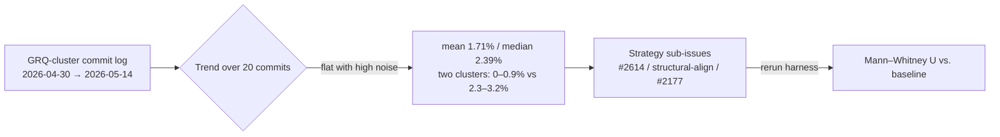

# Cross-species breeding baseline — Issue #2654

This is the shared baseline for the cross-species breeding improvement track
(Issue #2653). Each downstream strategy sub-issue (anchor-derived pseudo-UUIDs
#2614, structural alignment, subgraph transplant #2177) **must** rerun the
harness in
[`bench/CrossSpeciesBreedingProportion.ts`](../../bench/CrossSpeciesBreedingProportion.ts)
against the **same fixtures** and report a two-sample Mann–Whitney U `p`-value
against the baseline numbers below.

## 1. GRQ-cluster commit-log trend

Mined from
[`stSoftwareAU/GRQ-cluster`](https://github.com/stSoftwareAU/GRQ-cluster) commit
messages, walking back from
[`e0c3149c830ca1889d0f8d04bfeed2982d6c0af`](https://github.com/stSoftwareAU/GRQ-cluster/commit/e0c3149cc830ca1889d0f8d04bfeed2982d6c0af).
Each row is one evolution commit; `shared neurons` is the count of hidden
neurons the cluster's best creature shared with the named foreign creature
(`Jovian` is the foreign-cluster baseline; rows labelled
`unavailable (europa_dir_missing)` lacked the comparison directory and are
excluded from the trend chart).

| Date (UTC)       | SHA        | Score (Δ)             | Producer  | Shared neurons | Proportion |
| ---------------- | ---------- | --------------------- | --------- | -------------- | ---------- |
| 2026-05-14 17:58 | `e0c3149c` | 0.4209 → 0.4212 (Δ3)  | GRQ-18    | 45 of 1674     | 2.69%      |
| 2026-05-13 21:29 | `f4de6c0a` | 0.4208 → 0.4209 (Δ1)  | Mac-Ultra | 41 of 1674     | 2.45%      |
| 2026-05-13 19:52 | `81597e4b` | 0.4207 → 0.4208 (Δ1)  | Mac-Ultra | 41 of 1674     | 2.45%      |
| 2026-05-13 02:35 | `e5c6822a` | 0.4205 → 0.4207 (Δ2)  | Mac-Ultra | 41 of 1674     | 2.45%      |
| 2026-05-11 21:39 | `b6a2a0ef` | 0.4203 → 0.4204 (Δ1)  | Mac-Ultra | 42 of 1674     | 2.51%      |
| 2026-05-10 21:29 | `34e90552` | 0.4202 → 0.4203 (Δ1)  | GRQ-24    | 43 of 1674     | 2.57%      |
| 2026-05-10 07:34 | `35ac2751` | 0.4201 → 0.4202 (Δ1)  | GRQ-25    | 54 of 1685     | 3.20%      |
| 2026-05-09 01:14 | `acf20b6a` | 0.4200 → 0.4201 (Δ1)  | GRQ-23    | 7 of 1673      | 0.42%      |
| 2026-05-07 08:02 | `71099250` | 0.4198 → 0.4199 (Δ1)  | GRQ-23    | 7 of 1673      | 0.42%      |
| 2026-05-07 06:51 | `1d83f918` | 0.4196 → 0.4198 (Δ2)  | Mac-Ultra | 39 of 1673     | 2.33%      |
| 2026-05-07 00:00 | `6dc784ee` | 0.4195 → 0.4196 (Δ1)  | Mac-Ultra | 39 of 1674     | 2.33%      |
| 2026-05-06 12:21 | `e15f4131` | 0.4194 → 0.4195 (Δ1)  | Mac-Ultra | 39 of 1674     | 2.33%      |
| 2026-05-06 01:47 | `c237ea7a` | 0.4193 → 0.4194 (Δ1)  | GRQ-18    | 43 of 1674     | 2.57%      |
| 2026-05-05 09:43 | `a598d224` | 0.4190 → 0.4191 (Δ1)  | GRQ-3     | 43 of 1674     | 2.57%      |
| 2026-05-05 08:57 | `bb431f98` | 0.4169 → 0.4190 (Δ21) | GRQ-18    | 43 of 1674     | 2.57%      |
| 2026-05-03 00:46 | `160240eb` | 0.4167 → 0.4168 (Δ1)  | GRQ-23    | 7 of 1671      | 0.42%      |
| 2026-05-02 04:07 | `10ab3331` | 0.4166 → 0.4167 (Δ1)  | Mac-Ultra | 14 of 1630     | 0.86%      |
| 2026-05-01 14:21 | `32676efd` | 0.4165 → 0.4166 (Δ1)  | Mac-Ultra | 0 of 1667      | 0.00%      |
| 2026-04-30 22:11 | `611df181` | 0.4164 → 0.4165 (Δ1)  | Mac-Ultra | 0 of 1667      | 0.00%      |
| 2026-04-29 21:40 | `d96be7d9` | 0.4162 → 0.4163 (Δ1)  | Mac-Ultra | 0 of 1667      | 0.00%      |

**Summary.** Shared-neuron proportions sit in two distinct regimes across these
commits — a low cluster (0–0.86%) and a higher cluster (2.3–3.2%) — with **no
monotonic trend in either direction over the 20 most recent commits**. The mean
across the window is **1.71% (stddev 1.20%)**; the median is **2.39%**. Reading
the chronological sequence, the proportion rose from 0% on 2026-04-30 to ~2.5%
in early May, dipped back to 0.42% on 2026-05-07 (producer `GRQ-23`), then
recovered to 2.45–2.69% by 2026-05-14. The signal is **flat-with-noise, not
improving** — exactly the gap the strategy sub-issues are meant to close.
Cross-producer scatter (`Mac-Ultra` vs. `GRQ-23`) is the dominant source of
variance, suggesting that producer-local UUID allocation, not breeding intent,
drives most of today's shared-neuron count.



## 2. Fresh baseline run on today's `main`

Run with:

```bash
deno run --allow-read --allow-write \
  bench/CrossSpeciesBreedingProportion.ts \
  --n=200 \
  --out=docs/evidence/cross-species-baseline.json
```

The harness loads
[`test/fixtures/cross-species/europa.json`](../../test/fixtures/cross-species/europa.json)
as the mother and
[`test/fixtures/cross-species/grq-cluster.json`](../../test/fixtures/cross-species/grq-cluster.json)
as the father. Both fixtures are compact (≈ 6.5 KB each), share the same
`input=4, output=2` shape, and have **fully disjoint hidden wire UUIDs** so
`geneticCompatibility(mother, father) = 0` — the exact low-compatibility regime
the strategy sub-issues target.

Each iteration invokes `Offspring.breed(mother, father)` with
`interSpeciesCrossoverThreshold = 0`, which forces breeding through the standard
`createCompatibleFather` crossover path. The shared JSON output is checked in at
[`docs/evidence/cross-species-baseline.json`](./cross-species-baseline.json).

### Baseline numbers (N = 200, today's `main`)

| Axis           | n   | mean   | stddev | min    | max    |
| -------------- | --- | ------ | ------ | ------ | ------ |
| **vs. mother** | 200 | 0.5000 | 0.0000 | 0.5000 | 0.5000 |
| **vs. father** | 200 | 0.5000 | 0.0000 | 0.5000 | 0.5000 |
| **min(both)**  | 200 | 0.5000 | 0.0000 | 0.5000 | 0.5000 |

`baselineCompatibility = 0.0` (zero hidden UUIDs shared between the parent
fixtures).

**Interpretation.** Standard crossover on zero-compatibility parents allocates
exactly half of each offspring's hidden neurons to the mother's UUIDs and half
to the father's UUIDs — a knife-edge distribution with zero variance. That
distribution is what each downstream strategy must beat: an effective
anchor-derived, structural, or transplant strategy will lift one or both of the
`vs. mother` / `vs. father` proportions above 0.5 (and necessarily the
`min(both)`), producing a Mann–Whitney U `p`-value `<= 0.05` against the
baseline distribution.

## 3. Statistical protocol

- **Test**: two-sample Mann–Whitney U / Wilcoxon rank-sum, two-sided, normal
  approximation with tie correction and continuity correction. Implemented in
  [`src/utils/Statistics.ts`](../../src/utils/Statistics.ts) (function
  `mannWhitneyU`). Unit tests in
  [`test/utils/Statistics.ts`](../../test/utils/Statistics.ts).
- **Sample size**: **N = 200** per parent pair.
- **Significance level**: **α = 0.05** (two-sided).
- **Decision rule**: a strategy improves the baseline when both (a) the mean of
  `min(both)` rises strictly above `0.5000` and (b) the two-sided `p` against
  the baseline `min(both)` distribution is `≤ 0.05`. Reporting only mean uplift
  without `p` is not sufficient — the baseline has zero variance, so even tiny
  means will read as "significant" under careless thresholds.

## 4. Reuse from strategy sub-issues

```ts
import {
  runBaseline,
  sharedNeuronProportion,
} from "../bench/CrossSpeciesBreedingProportion.ts";
import { mannWhitneyU } from "../src/utils/Statistics.ts";

// 1. Load the same fixtures.
// 2. Run runBaseline() once for "before".
// 3. Run the new strategy entry point N=200 times, collecting per-
//    offspring proportions the same way sharedNeuronProportion() does.
// 4. Feed both vsMother / vsFather / minOfBoth arrays into
//    mannWhitneyU() to obtain p against the baseline.
```
