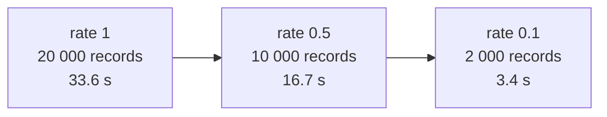

# Wall-clock per generation vs corpus fidelity (Issue #3926)

The multi-fidelity claim is that scoring a corpus one tenth the size costs
roughly one tenth of the wall-clock, because each record is scored independently
on a forward-only creature. This is the measurement of that claim, not an
assumption of it.

## The run

```bash
deno task bench:fitness-corpus --records=20000 --rates=1,0.5,0.1 \
  --population=20 --seed=3926
```

| Parameter  | Value                                                                                                                                                                                                  |
| ---------- | ------------------------------------------------------------------------------------------------------------------------------------------------------------------------------------------------------ |
| Creature   | `grq-3926` preset — 5,317 neurons / 39,031 synapses over 2,511 inputs, switched to the forward-only topology production runs it under, which repairs it to 5,312 / 38,991 (production: 5,317 / 38,988) |
| Generation | one scoring pass over a population of 20 (the requested production population)                                                                                                                         |
| Corpus     | 20,000 synthetic records at the production record shape (2511 → 1, 10,048 B a record)                                                                                                                  |
| Cost       | `MSE` (mean squared error)                                                                                                                                                                             |
| Host       | 7-core container, Deno 2.x, WASM (WebAssembly) scoring path                                                                                                                                            |

A sampled corpus is a stride of the full one, so every fidelity scores the same
distribution of records and the comparison isolates corpus **size**.

## The measurement

| Fitness sample rate | Records | Corpus    | ms / generation | vs full |
| ------------------- | ------- | --------- | --------------- | ------- |
| 1                   | 20000   | 191.7 MiB | 33631           | 1.000   |
| 0.5                 | 10000   | 95.8 MiB  | 16728           | 0.497   |
| 0.1                 | 2000    | 19.2 MiB  | 3383            | 0.101   |

Wall-clock tracks corpus size to within a percent at both rates: 0.497 and 0.101
against the 0.5 and 0.1 the corpora were cut at. The cost of a generation is
where the issue assumed it was — in the per-record scoring work — so a tenth of
the corpus really does buy about ten times the generations per hour.



## What this does not say

- **It is not a licence to sample.** Choosing when a run should score a sampled
  corpus is model management and is decided elsewhere; production keeps scoring
  the full corpus.
- **It is a synthetic corpus at the production record shape**, not the 21.2 GiB
  production corpus, and the creature is the `grq-3926` generated topology at
  the production neuron/synapse/input counts rather than the production
  `network.json`. The proportionality it measures is a property of per-record
  scoring work, which both share.
- **It is the WASM (WebAssembly) scoring path, and a generation here is one
  scoring pass** over the population rather than a full `evolveDir` generation
  (which also breeds, mutates and writes checkpoints). Both engines do the same
  per-record work, and the breeding half of a generation does not grow with the
  corpus, so the ratio is the corpus-size effect in isolation — but the absolute
  milliseconds are this harness's, not production's.
- **It says nothing about score quality.** A tenth of the records is a noisier
  estimate of the same quantity; that trade-off is the surrogate-model question
  the parent issue tracks, not this measurement.
