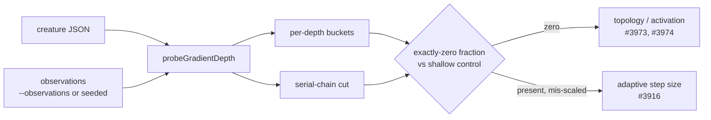

# 📉 Gradient reliability at depth — measured profile (Issue #3972)

Produced by
[`scripts/gradientDepthReport.ts`](../../scripts/gradientDepthReport.ts) over
[`src/propagate/GradientDepthProbe.ts`](../../src/propagate/GradientDepthProbe.ts).
Every section below names the exact command that produced it, so the whole
document is reproducible from a clean checkout.



## 📖 Reading the tables

- **zero** — the fraction of neuron × sample measurements whose gradient was
  _exactly_ zero. This is the number a mean magnitude hides.
- **sign flips** — of the consecutive-sample pairs where both gradients were
  non-zero, how many reversed sign. `n/a` means no pair was comparable, which at
  these depths means the gradient was never non-zero twice running. This is the
  shattered-gradient diagnostic of
  [Balduzzi et al. (2017)](https://arxiv.org/abs/1702.08591). Note the probe
  holds the weights fixed, so "consecutive" means consecutive **observations**,
  not consecutive training steps.
- **zero attribution** — counted **per blocked route** out of the neuron, not
  per neuron, so a neuron with two dead routes contributes two counts and no
  tie-break has to pick a winner. `downstream-zero` means the loss happened
  closer to the output and this neuron only inherited it.
- **squash returning a zero derivative** — which squash was responsible. Read it
  before concluding "saturation": `HARD_TANH` outside `(-1, 1)` really is
  saturation, but `STEP` and `BIPOLAR` return zero for _every_ input and pass no
  gradient at any depth. Those are different faults.

## ⚠️ Provenance and its limits

The production corpus is not in this repository, so the rows below are **seeded
synthetic observations**, not production data. Two consequences, stated rather
than buried:

1. Each creature is profiled on rows of **its own input width**, so the GRQ
   creature (2,511 inputs) and the controls are not on the same data. The
   controls bound what a _working_ gradient looks like in this engine; they are
   not a matched-corpus comparison.
2. The controls are **not trained** — the probe measures a fixed creature.

To show the GRQ result is not an artefact of the input distribution, the same
creature is profiled at two scales two orders of magnitude apart. Feed a real
corpus with `--observations <file.json>` (a JSON array of input rows) to replace
the synthetic rows entirely.

---

## 🧬 The GRQ-lineage creature

```bash
deno run --allow-read --allow-write --allow-env --allow-ffi \
  scripts/gradientDepthReport.ts \
  --creature test/data/grq-23-forests-constants.json --samples 64 --seed 42
```

## test/data/grq-23-forests-constants.json

- observations: 64 rows (SYNTHETIC seeded uniform[-1, 1), seed 42 — not
  production data)
- deepest layer: 61
- serial chain: depth 34–61, 28 neurons

| depth | neurons | obs   | zero   | median \|g\| | p95 \|g\| | max \|g\| | sign flips | zero attribution (per blocked route)                                                                           | squash returning a zero derivative                                                                                                                                                                            |
| ----- | ------- | ----- | ------ | ------------ | --------- | --------- | ---------- | -------------------------------------------------------------------------------------------------------------- | ------------------------------------------------------------------------------------------------------------------------------------------------------------------------------------------------------------- |
| 1     | 1030    | 65920 | 99.6%  | 0.00e+0      | 0.00e+0   | 3.79e-1   | 14.3%      | zero-derivative 58478, downstream-zero 34514, if-condition 12204, untaken-if-branch 543, unselected-min-max 64 | HARD_TANH 41145, STEP 8764, LOGISTIC 2239, ReLU 1434, SQRT 855, BIPOLAR 701, Mish 500, LogSigmoid 492, Softplus 450, GAUSSIAN 370, Exponential 357, ELU 344, SELU 298, ReLU6 296, GELU 125, TANH 64, Swish 44 |
| 2     | 442     | 28288 | 64.3%  | 0.00e+0      | 1.00e+0   | 1.23e+1   | 0.0%       | zero-derivative 18221, downstream-zero 16150, untaken-if-branch 1242, if-condition 767, unselected-min-max 122 | HARD_TANH 12805, STEP 1703, LOGISTIC 933, SQRT 450, ReLU 346, ReLU6 315, TANH 240, GELU 230, GAUSSIAN 217, LogSigmoid 215, Softplus 191, Mish 180, ELU 95, Swish 87, Exponential 84, SELU 67, BIPOLAR 63      |
| 3     | 282     | 18048 | 73.6%  | 0.00e+0      | 1.00e+0   | 1.46e+1   | 0.0%       | downstream-zero 10278, zero-derivative 9875, untaken-if-branch 5623, unselected-min-max 74                     | HARD_TANH 5494, STEP 1141, LOGISTIC 974, SQRT 598, ReLU6 364, Softplus 275, Exponential 188, LogSigmoid 125, ReLU 120, Mish 116, GELU 102, TANH 85, ELU 79, Swish 71, BIPOLAR 64, GAUSSIAN 63, SELU 16        |
| 4     | 90      | 5760  | 95.1%  | 0.00e+0      | 0.00e+0   | 1.00e+0   | 0.0%       | zero-derivative 7408, downstream-zero 6964, untaken-if-branch 378, if-condition 191                            | HARD_TANH 3967, STEP 1139, LOGISTIC 775, SQRT 328, Exponential 210, ReLU 202, BIPOLAR 190, Softplus 148, GELU 132, Swish 79, ReLU6 63, TANH 59, LogSigmoid 40, SELU 34, ELU 27, Mish 15                       |
| 5     | 62      | 3968  | 98.5%  | 0.00e+0      | 0.00e+0   | 2.00e-3   | 23.1%      | zero-derivative 4184, downstream-zero 2855, untaken-if-branch 57                                               | HARD_TANH 2737, SQRT 304, STEP 254, ReLU6 253, LOGISTIC 189, Softplus 106, ReLU 99, Exponential 85, ELU 63, LogSigmoid 44, Mish 20, Swish 18, SELU 12                                                         |
| 6     | 34      | 2176  | 99.3%  | 0.00e+0      | 0.00e+0   | 4.27e-2   | 0.0%       | downstream-zero 3616, zero-derivative 2492, if-condition 64, untaken-if-branch 32                              | HARD_TANH 1180, STEP 381, SQRT 311, LOGISTIC 162, Softplus 96, Exponential 85, ReLU 71, LogSigmoid 69, ReLU6 63, ELU 38, GELU 28, Mish 8                                                                      |
| 7     | 32      | 2048  | 96.4%  | 0.00e+0      | 0.00e+0   | 1.00e+0   | 0.0%       | zero-derivative 3505, downstream-zero 2423, untaken-if-branch 155                                              | HARD_TANH 1593, LOGISTIC 564, STEP 441, SQRT 279, BIPOLAR 126, TANH 122, ReLU 95, GAUSSIAN 63, ReLU6 63, Mish 60, Softplus 42, GELU 29, LogSigmoid 28                                                         |
| 8     | 31      | 1984  | 97.8%  | 0.00e+0      | 0.00e+0   | 1.00e+0   | 0.0%       | zero-derivative 3200, downstream-zero 2582, if-condition 63, untaken-if-branch 54                              | HARD_TANH 1276, STEP 752, LOGISTIC 563, SQRT 223, ReLU 108, Softplus 91, ReLU6 63, ELU 45, Exponential 44, Swish 35                                                                                           |
| 9     | 26      | 1664  | 99.1%  | 0.00e+0      | 0.00e+0   | 2.97e-2   | 100.0%     | zero-derivative 2154, downstream-zero 1378, if-condition 64                                                    | HARD_TANH 1205, LOGISTIC 322, STEP 191, SQRT 153, TANH 64, BIPOLAR 63, ELU 55, Softplus 54, ReLU 30, Swish 17                                                                                                 |
| 10    | 12      | 768   | 99.5%  | 0.00e+0      | 0.00e+0   | 5.66e-16  | n/a        | zero-derivative 907, downstream-zero 553                                                                       | HARD_TANH 433, STEP 191, SQRT 185, LOGISTIC 63, LogSigmoid 35                                                                                                                                                 |
| 11    | 8       | 512   | 99.8%  | 0.00e+0      | 0.00e+0   | 6.17e-24  | n/a        | zero-derivative 738, downstream-zero 210, untaken-if-branch 75                                                 | STEP 320, HARD_TANH 192, SQRT 98, LOGISTIC 64, ReLU6 64                                                                                                                                                       |
| 12    | 6       | 384   | 99.5%  | 0.00e+0      | 0.00e+0   | 4.95e-20  | n/a        | downstream-zero 1338, zero-derivative 880                                                                      | HARD_TANH 320, LOGISTIC 191, STEP 127, Softplus 84, TANH 63, ReLU 42, Exponential 21, Mish 21, ELU 11                                                                                                         |
| 13    | 12      | 768   | 98.8%  | 0.00e+0      | 0.00e+0   | 7.04e-19  | n/a        | zero-derivative 1587, downstream-zero 1253                                                                     | SQRT 330, HARD_TANH 310, LOGISTIC 295, STEP 251, ReLU6 125, Softplus 96, BIPOLAR 64, TANH 63, ELU 27, Swish 18, ReLU 4, SELU 4                                                                                |
| 14    | 14      | 896   | 99.6%  | 0.00e+0      | 0.00e+0   | 2.80e-20  | n/a        | zero-derivative 1500, downstream-zero 1203, untaken-if-branch 29                                               | STEP 383, LOGISTIC 357, HARD_TANH 255, BIPOLAR 128, Mish 126, TANH 63, SQRT 55, LogSigmoid 48, ReLU 23, ELU 22, Exponential 22, Swish 18                                                                      |
| 15    | 14      | 896   | 99.0%  | 0.00e+0      | 0.00e+0   | 7.11e-2   | n/a        | zero-derivative 1288, downstream-zero 1226, untaken-if-branch 14                                               | HARD_TANH 566, LOGISTIC 252, STEP 126, SQRT 110, BIPOLAR 64, ReLU 46, ELU 45, Softplus 42, Exponential 19, Swish 18                                                                                           |
| 16    | 14      | 896   | 99.3%  | 0.00e+0      | 0.00e+0   | 7.15e-2   | n/a        | zero-derivative 869, downstream-zero 641, untaken-if-branch 14                                                 | HARD_TANH 512, LOGISTIC 190, STEP 64, BIPOLAR 63, Exponential 22, SELU 18                                                                                                                                     |
| 17    | 10      | 640   | 99.1%  | 0.00e+0      | 0.00e+0   | 1.57e-19  | n/a        | downstream-zero 1006, zero-derivative 997, if-condition 63, untaken-if-branch 18                               | HARD_TANH 255, LOGISTIC 204, Softplus 137, STEP 126, SQRT 110, Exponential 83, SELU 64, Swish 18                                                                                                              |
| 18    | 8       | 512   | 98.8%  | 0.00e+0      | 0.00e+0   | 3.76e-18  | n/a        | zero-derivative 897, downstream-zero 824, untaken-if-branch 45                                                 | SQRT 220, HARD_TANH 191, LOGISTIC 126, STEP 126, ELU 66, Mish 50, Softplus 42, Exponential 38, ReLU 38                                                                                                        |
| 19    | 10      | 640   | 99.4%  | 0.00e+0      | 0.00e+0   | 1.25e-19  | n/a        | zero-derivative 806, downstream-zero 435, untaken-if-branch 32                                                 | HARD_TANH 256, STEP 255, LOGISTIC 191, SQRT 55, LogSigmoid 49                                                                                                                                                 |
| 20    | 6       | 384   | 99.7%  | 0.00e+0      | 0.00e+0   | 7.83e-24  | n/a        | zero-derivative 742, downstream-zero 213                                                                       | HARD_TANH 320, LOGISTIC 240, STEP 127, SQRT 55                                                                                                                                                                |
| 21    | 7       | 448   | 99.6%  | 0.00e+0      | 0.00e+0   | 2.30e-20  | n/a        | downstream-zero 671, zero-derivative 474, if-condition 64                                                      | HARD_TANH 255, LOGISTIC 128, TANH 63, ELU 11, ReLU 9, Mish 8                                                                                                                                                  |
| 22    | 9       | 576   | 99.8%  | 0.00e+0      | 0.00e+0   | 9.64e-19  | n/a        | zero-derivative 812, downstream-zero 354, untaken-if-branch 60, unselected-min-max 50                          | HARD_TANH 511, LOGISTIC 188, STEP 64, ReLU 31, Swish 18                                                                                                                                                       |
| 23    | 7       | 448   | 99.8%  | 0.00e+0      | 0.00e+0   | 9.04e-18  | n/a        | zero-derivative 899, downstream-zero 209, untaken-if-branch 102, if-condition 64                               | HARD_TANH 383, LOGISTIC 252, STEP 127, ReLU 74, TANH 63                                                                                                                                                       |
| 24    | 9       | 576   | 99.7%  | 0.00e+0      | 0.00e+0   | 3.66e-14  | n/a        | zero-derivative 1268, downstream-zero 257, unselected-min-max 44, untaken-if-branch 18                         | HARD_TANH 447, STEP 379, LOGISTIC 209, BIPOLAR 64, TANH 63, ReLU 62, GELU 44                                                                                                                                  |
| 25    | 7       | 448   | 100.0% | 0.00e+0      | 0.00e+0   | 0.00e+0   | n/a        | zero-derivative 400, downstream-zero 386, if-condition 64, untaken-if-branch 46                                | HARD_TANH 256, STEP 64, LOGISTIC 62, SELU 18                                                                                                                                                                  |
| 26    | 7       | 448   | 100.0% | 0.00e+0      | 0.00e+0   | 0.00e+0   | n/a        | zero-derivative 780, downstream-zero 244                                                                       | HARD_TANH 320, LOGISTIC 192, STEP 128, Exponential 64, Mish 47, SELU 18, Softplus 11                                                                                                                          |
| 27    | 8       | 512   | 99.8%  | 0.00e+0      | 0.00e+0   | 7.83e-14  | n/a        | zero-derivative 771, downstream-zero 439                                                                       | HARD_TANH 319, STEP 192, LOGISTIC 189, ReLU 71                                                                                                                                                                |
| 28    | 11      | 704   | 99.9%  | 0.00e+0      | 0.00e+0   | 3.59e-15  | n/a        | zero-derivative 776, downstream-zero 307                                                                       | HARD_TANH 448, STEP 191, LOGISTIC 83, ReLU 24, GELU 19, Softplus 11                                                                                                                                           |
| 29    | 6       | 384   | 99.7%  | 0.00e+0      | 0.00e+0   | 7.96e-15  | n/a        | zero-derivative 574, downstream-zero 192                                                                       | HARD_TANH 192, LOGISTIC 191, STEP 127, Exponential 64                                                                                                                                                         |
| 30    | 7       | 448   | 99.8%  | 0.00e+0      | 0.00e+0   | 3.53e-9   | n/a        | zero-derivative 766, downstream-zero 64                                                                        | HARD_TANH 447, STEP 319                                                                                                                                                                                       |
| 31    | 5       | 320   | 97.5%  | 0.00e+0      | 0.00e+0   | 5.75e-2   | 0.0%       | zero-derivative 374, downstream-zero 122, untaken-if-branch 56                                                 | HARD_TANH 192, STEP 182                                                                                                                                                                                       |
| 32    | 4       | 256   | 98.0%  | 0.00e+0      | 0.00e+0   | 6.99e-2   | n/a        | zero-derivative 192, downstream-zero 168, untaken-if-branch 14                                                 | HARD_TANH 128, STEP 64                                                                                                                                                                                        |
| 33    | 3       | 192   | 97.4%  | 0.00e+0      | 0.00e+0   | 7.15e-2   | n/a        | zero-derivative 128, downstream-zero 45, untaken-if-branch 14                                                  | HARD_TANH 128                                                                                                                                                                                                 |
| 34    | 1       | 64    | 100.0% | 0.00e+0      | 0.00e+0   | 0.00e+0   | n/a        | downstream-zero 64                                                                                             | —                                                                                                                                                                                                             |
| 35    | 1       | 64    | 100.0% | 0.00e+0      | 0.00e+0   | 0.00e+0   | n/a        | downstream-zero 50, unselected-min-max 14                                                                      | —                                                                                                                                                                                                             |
| 36    | 1       | 64    | 100.0% | 0.00e+0      | 0.00e+0   | 0.00e+0   | n/a        | downstream-zero 64                                                                                             | —                                                                                                                                                                                                             |
| 37    | 1       | 64    | 100.0% | 0.00e+0      | 0.00e+0   | 0.00e+0   | n/a        | downstream-zero 64                                                                                             | —                                                                                                                                                                                                             |
| 38    | 1       | 64    | 100.0% | 0.00e+0      | 0.00e+0   | 0.00e+0   | n/a        | downstream-zero 64                                                                                             | —                                                                                                                                                                                                             |
| 39    | 1       | 64    | 100.0% | 0.00e+0      | 0.00e+0   | 0.00e+0   | n/a        | downstream-zero 57, unselected-min-max 7                                                                       | —                                                                                                                                                                                                             |
| 40    | 1       | 64    | 100.0% | 0.00e+0      | 0.00e+0   | 0.00e+0   | n/a        | downstream-zero 64                                                                                             | —                                                                                                                                                                                                             |
| 41    | 1       | 64    | 100.0% | 0.00e+0      | 0.00e+0   | 0.00e+0   | n/a        | if-condition 64, downstream-zero 43, zero-derivative 21                                                        | HARD_TANH 21                                                                                                                                                                                                  |
| 42    | 1       | 64    | 100.0% | 0.00e+0      | 0.00e+0   | 0.00e+0   | n/a        | downstream-zero 75, unselected-min-max 44, untaken-if-branch 9                                                 | —                                                                                                                                                                                                             |
| 43    | 1       | 64    | 100.0% | 0.00e+0      | 0.00e+0   | 0.00e+0   | n/a        | untaken-if-branch 55, downstream-zero 9                                                                        | —                                                                                                                                                                                                             |
| 44    | 1       | 64    | 100.0% | 0.00e+0      | 0.00e+0   | 0.00e+0   | n/a        | zero-derivative 59, downstream-zero 5                                                                          | HARD_TANH 59                                                                                                                                                                                                  |
| 45    | 1       | 64    | 98.4%  | 0.00e+0      | 0.00e+0   | 1.03e+0   | n/a        | downstream-zero 33, unselected-min-max 30                                                                      | —                                                                                                                                                                                                             |
| 46    | 1       | 64    | 87.5%  | 0.00e+0      | 1.19e-1   | 7.38e+0   | 0.0%       | downstream-zero 56, if-condition 56                                                                            | —                                                                                                                                                                                                             |
| 47    | 1       | 64    | 87.5%  | 0.00e+0      | 1.19e-1   | 7.35e+0   | 0.0%       | downstream-zero 69, unselected-min-max 43                                                                      | —                                                                                                                                                                                                             |
| 48    | 1       | 64    | 98.4%  | 0.00e+0      | 0.00e+0   | 6.98e-2   | n/a        | untaken-if-branch 63                                                                                           | —                                                                                                                                                                                                             |
| 49    | 1       | 64    | 87.5%  | 0.00e+0      | 1.16e-1   | 7.15e+0   | 0.0%       | if-condition 56, downstream-zero 55, unselected-min-max 1                                                      | —                                                                                                                                                                                                             |
| 50    | 1       | 64    | 87.5%  | 0.00e+0      | 1.00e+0   | 7.15e+0   | 0.0%       | downstream-zero 89, unselected-min-max 12, untaken-if-branch 11                                                | —                                                                                                                                                                                                             |
| 51    | 1       | 64    | 93.8%  | 0.00e+0      | 2.43e-3   | 7.15e+0   | n/a        | untaken-if-branch 50, downstream-zero 10                                                                       | —                                                                                                                                                                                                             |
| 52    | 1       | 64    | 85.9%  | 0.00e+0      | 1.00e+0   | 7.15e+0   | 0.0%       | if-condition 55, downstream-zero 51, unselected-min-max 4                                                      | —                                                                                                                                                                                                             |
| 53    | 1       | 64    | 82.8%  | 0.00e+0      | 7.15e+0   | 7.15e+0   | 0.0%       | downstream-zero 53, if-condition 53                                                                            | —                                                                                                                                                                                                             |
| 54    | 1       | 64    | 82.8%  | 0.00e+0      | 7.15e+0   | 7.15e+0   | 0.0%       | downstream-zero 54, unselected-min-max 47, untaken-if-branch 5                                                 | —                                                                                                                                                                                                             |
| 55    | 1       | 64    | 89.1%  | 0.00e+0      | 7.15e+0   | 7.15e+0   | 0.0%       | untaken-if-branch 54, downstream-zero 3                                                                        | —                                                                                                                                                                                                             |
| 56    | 1       | 64    | 79.7%  | 0.00e+0      | 2.54e+2   | 2.54e+2   | 0.0%       | unselected-min-max 43, untaken-if-branch 35, downstream-zero 24                                                | —                                                                                                                                                                                                             |
| 57    | 1       | 64    | 43.8%  | 7.15e+0      | 7.15e+0   | 7.15e+0   | 0.0%       | untaken-if-branch 22, downstream-zero 6                                                                        | —                                                                                                                                                                                                             |
| 58    | 1       | 64    | 34.4%  | 7.15e+0      | 7.15e+0   | 7.15e+0   | 23.1%      | untaken-if-branch 28, downstream-zero 16                                                                       | —                                                                                                                                                                                                             |
| 59    | 1       | 64    | 26.6%  | 1.00e+0      | 1.00e+0   | 1.00e+0   | 0.0%       | unselected-min-max 17, untaken-if-branch 17                                                                    | —                                                                                                                                                                                                             |
| 60    | 1       | 64    | 56.3%  | 0.00e+0      | 1.00e+0   | 1.00e+0   | 0.0%       | untaken-if-branch 36                                                                                           | —                                                                                                                                                                                                             |

Pooled across the serial chain — 27 of 28 members measured (an output member
carries the seed, not a measurement). The per-depth rows for these depths are in
the table above.

| depth | neurons | obs  | zero  | median \|g\| | p95 \|g\| | max \|g\| | sign flips | zero attribution (per blocked route)                                                                      | squash returning a zero derivative |
| ----- | ------- | ---- | ----- | ------------ | --------- | --------- | ---------- | --------------------------------------------------------------------------------------------------------- | ---------------------------------- |
| 34–61 | 27      | 1728 | 86.0% | 0.00e+0      | 7.15e+0   | 2.54e+2   | 6.1%       | downstream-zero 1078, untaken-if-branch 385, if-condition 284, unselected-min-max 262, zero-derivative 80 | HARD_TANH 80                       |

### Input-scale sensitivity check

The same creature, observations scaled to `uniform[-0.01, 0.01)`.

```bash
deno run --allow-read --allow-write --allow-env --allow-ffi \
  scripts/gradientDepthReport.ts \
  --creature test/data/grq-23-forests-constants.json \
  --samples 64 --seed 42 --scale 0.01
```

## test/data/grq-23-forests-constants.json

- observations: 64 rows (SYNTHETIC seeded uniform[-0.01, 0.01), seed 42 — not
  production data)
- deepest layer: 61
- serial chain: depth 34–61, 28 neurons

| depth | neurons | obs   | zero   | median \|g\| | p95 \|g\| | max \|g\| | sign flips | zero attribution (per blocked route)                                                                           | squash returning a zero derivative                                                                                                                                                                         |
| ----- | ------- | ----- | ------ | ------------ | --------- | --------- | ---------- | -------------------------------------------------------------------------------------------------------------- | ---------------------------------------------------------------------------------------------------------------------------------------------------------------------------------------------------------- |
| 1     | 1030    | 65920 | 99.7%  | 0.00e+0      | 0.00e+0   | 1.57e-1   | 0.0%       | zero-derivative 53787, downstream-zero 39470, if-condition 12217, untaken-if-branch 659, unselected-min-max 64 | HARD_TANH 38996, STEP 8720, ReLU 1630, LOGISTIC 1336, BIPOLAR 703, Mish 573, Softplus 330, ReLU6 317, Exponential 283, ELU 232, SELU 175, GAUSSIAN 149, GELU 126, LogSigmoid 99, TANH 61, SQRT 51, Swish 6 |
| 2     | 442     | 28288 | 64.3%  | 0.00e+0      | 1.00e+0   | 1.37e+0   | 0.0%       | downstream-zero 18395, zero-derivative 16112, untaken-if-branch 1200, if-condition 767, unselected-min-max 107 | HARD_TANH 12070, STEP 1676, LOGISTIC 563, ReLU 408, ReLU6 287, GELU 224, Softplus 192, GAUSSIAN 191, Mish 127, Exponential 77, BIPOLAR 63, TANH 63, SQRT 52, ELU 48, LogSigmoid 46, Swish 18, SELU 7       |
| 3     | 282     | 18048 | 96.7%  | 0.00e+0      | 0.00e+0   | 1.00e+0   | 0.0%       | downstream-zero 12306, untaken-if-branch 9679, zero-derivative 7998, unselected-min-max 73                     | HARD_TANH 5175, STEP 1146, LOGISTIC 552, ReLU6 325, Softplus 186, Exponential 124, ReLU 102, TANH 78, Mish 68, BIPOLAR 64, SQRT 47, ELU 40, LogSigmoid 30, GAUSSIAN 27, GELU 21, Swish 12, SELU 1          |
| 4     | 90      | 5760  | 99.7%  | 0.00e+0      | 0.00e+0   | 8.73e-9   | n/a        | downstream-zero 8117, zero-derivative 6250, untaken-if-branch 690, if-condition 191                            | HARD_TANH 3707, STEP 1141, LOGISTIC 410, ReLU 254, BIPOLAR 190, Softplus 186, Exponential 146, ReLU6 63, ELU 58, SQRT 53, GELU 21, Swish 12, LogSigmoid 6, SELU 3                                          |
| 5     | 62      | 3968  | 98.2%  | 0.00e+0      | 0.00e+0   | 5.95e-4   | 0.0%       | downstream-zero 3622, zero-derivative 3423, untaken-if-branch 28                                               | HARD_TANH 2561, STEP 255, ReLU6 236, LOGISTIC 80, ReLU 71, Mish 64, Exponential 58, Softplus 52, ELU 32, LogSigmoid 7, Swish 6, SQRT 1                                                                     |
| 6     | 34      | 2176  | 99.5%  | 0.00e+0      | 0.00e+0   | 4.21e-30  | n/a        | downstream-zero 4025, zero-derivative 2033, untaken-if-branch 95, if-condition 64                              | HARD_TANH 1099, STEP 384, LOGISTIC 121, ELU 109, Softplus 96, Exponential 68, ReLU6 63, ReLU 56, Mish 31, LogSigmoid 6                                                                                     |
| 7     | 32      | 2048  | 96.6%  | 0.00e+0      | 0.00e+0   | 1.00e+0   | 0.0%       | downstream-zero 3275, zero-derivative 2702, untaken-if-branch 141                                              | HARD_TANH 1496, STEP 448, LOGISTIC 348, ReLU 132, BIPOLAR 127, ReLU6 63, Softplus 48, GAUSSIAN 20, SQRT 14, GELU 6                                                                                         |
| 8     | 31      | 1984  | 99.8%  | 0.00e+0      | 0.00e+0   | 1.96e-31  | n/a        | downstream-zero 3044, zero-derivative 2822, untaken-if-branch 68, if-condition 64                              | HARD_TANH 1219, STEP 765, LOGISTIC 451, ReLU 151, Softplus 69, ReLU6 64, ELU 49, Exponential 34, SQRT 14, Swish 6                                                                                          |
| 9     | 26      | 1664  | 99.9%  | 0.00e+0      | 0.00e+0   | 6.62e-31  | n/a        | zero-derivative 1795, downstream-zero 1720, if-condition 63, untaken-if-branch 62                              | HARD_TANH 1158, STEP 191, LOGISTIC 154, ReLU 76, TANH 64, BIPOLAR 63, Softplus 48, ELU 35, Swish 6                                                                                                         |
| 10    | 12      | 768   | 99.9%  | 0.00e+0      | 0.00e+0   | 3.69e-32  | n/a        | downstream-zero 798, zero-derivative 672                                                                       | HARD_TANH 430, STEP 192, SQRT 28, LOGISTIC 22                                                                                                                                                              |
| 11    | 8       | 512   | 99.8%  | 0.00e+0      | 0.00e+0   | 4.09e-33  | n/a        | zero-derivative 604, downstream-zero 329, untaken-if-branch 88                                                 | STEP 318, HARD_TANH 183, LOGISTIC 56, ReLU6 47                                                                                                                                                             |
| 12    | 6       | 384   | 99.5%  | 0.00e+0      | 0.00e+0   | 3.38e-31  | n/a        | downstream-zero 1325, zero-derivative 893                                                                      | HARD_TANH 308, STEP 127, LOGISTIC 112, Softplus 96, Mish 63, ReLU 63, TANH 63, ELU 50, Exponential 11                                                                                                      |
| 13    | 12      | 768   | 99.7%  | 0.00e+0      | 0.00e+0   | 5.25e-28  | n/a        | downstream-zero 1708, zero-derivative 1156                                                                     | HARD_TANH 285, STEP 255, LOGISTIC 220, ReLU6 97, Softplus 96, BIPOLAR 64, TANH 64, ELU 59, ReLU 9, Swish 6, SELU 1                                                                                         |
| 14    | 14      | 896   | 99.9%  | 0.00e+0      | 0.00e+0   | 3.38e-29  | n/a        | downstream-zero 1386, zero-derivative 1332, untaken-if-branch 28                                               | STEP 320, LOGISTIC 279, HARD_TANH 247, BIPOLAR 128, Mish 128, ELU 101, TANH 64, ReLU 42, LogSigmoid 23                                                                                                     |
| 15    | 14      | 896   | 99.9%  | 0.00e+0      | 0.00e+0   | 4.02e-31  | n/a        | downstream-zero 1424, zero-derivative 1066, untaken-if-branch 64                                               | HARD_TANH 491, LOGISTIC 206, STEP 128, BIPOLAR 64, ELU 49, ReLU 48, Softplus 48, Exponential 32                                                                                                            |
| 16    | 14      | 896   | 99.9%  | 0.00e+0      | 0.00e+0   | 2.72e-28  | n/a        | zero-derivative 786, downstream-zero 679, untaken-if-branch 64                                                 | HARD_TANH 488, LOGISTIC 169, STEP 64, BIPOLAR 63, SELU 2                                                                                                                                                   |
| 17    | 10      | 640   | 99.8%  | 0.00e+0      | 0.00e+0   | 1.79e-26  | n/a        | downstream-zero 1269, zero-derivative 765, if-condition 64, untaken-if-branch 4                                | HARD_TANH 237, Softplus 165, STEP 127, LOGISTIC 97, Exponential 90, SELU 49                                                                                                                                |
| 18    | 8       | 512   | 100.0% | 0.00e+0      | 0.00e+0   | 0.00e+0   | n/a        | downstream-zero 1026, zero-derivative 706, untaken-if-branch 60                                                | HARD_TANH 183, STEP 128, LOGISTIC 119, ELU 86, Exponential 64, Softplus 48, ReLU 43, Mish 35                                                                                                               |
| 19    | 10      | 640   | 100.0% | 0.00e+0      | 0.00e+0   | 0.00e+0   | n/a        | zero-derivative 708, downstream-zero 526, untaken-if-branch 46                                                 | STEP 256, HARD_TANH 244, LOGISTIC 185, LogSigmoid 23                                                                                                                                                       |
| 20    | 6       | 384   | 100.0% | 0.00e+0      | 0.00e+0   | 0.00e+0   | n/a        | zero-derivative 543, downstream-zero 417                                                                       | HARD_TANH 296, STEP 128, LOGISTIC 119                                                                                                                                                                      |
| 21    | 7       | 448   | 100.0% | 0.00e+0      | 0.00e+0   | 0.00e+0   | n/a        | downstream-zero 585, zero-derivative 567, if-condition 64                                                      | HARD_TANH 244, LOGISTIC 127, Mish 64, TANH 64, ELU 51, ReLU 17                                                                                                                                             |
| 22    | 9       | 576   | 100.0% | 0.00e+0      | 0.00e+0   | 0.00e+0   | n/a        | zero-derivative 730, downstream-zero 423, untaken-if-branch 74, unselected-min-max 53                          | HARD_TANH 491, LOGISTIC 112, STEP 64, ReLU 63                                                                                                                                                              |
| 23    | 7       | 448   | 99.8%  | 0.00e+0      | 0.00e+0   | 3.97e-26  | n/a        | zero-derivative 842, downstream-zero 278, untaken-if-branch 90, if-condition 64                                | HARD_TANH 367, LOGISTIC 222, STEP 127, ReLU 63, TANH 63                                                                                                                                                    |
| 24    | 9       | 576   | 99.8%  | 0.00e+0      | 0.00e+0   | 7.70e-7   | n/a        | zero-derivative 1175, downstream-zero 362, unselected-min-max 51, untaken-if-branch 4                          | HARD_TANH 426, STEP 380, LOGISTIC 114, ReLU 95, BIPOLAR 64, TANH 63, GELU 33                                                                                                                               |
| 25    | 7       | 448   | 100.0% | 0.00e+0      | 0.00e+0   | 0.00e+0   | n/a        | downstream-zero 428, zero-derivative 344, if-condition 64, untaken-if-branch 60                                | HARD_TANH 244, STEP 64, LOGISTIC 34, SELU 2                                                                                                                                                                |
| 26    | 7       | 448   | 100.0% | 0.00e+0      | 0.00e+0   | 0.00e+0   | n/a        | zero-derivative 721, downstream-zero 303                                                                       | HARD_TANH 305, LOGISTIC 145, STEP 128, Mish 62, Exponential 58, Softplus 21, SELU 2                                                                                                                        |
| 27    | 8       | 512   | 100.0% | 0.00e+0      | 0.00e+0   | 0.00e+0   | n/a        | zero-derivative 766, downstream-zero 450                                                                       | HARD_TANH 305, STEP 192, LOGISTIC 170, ReLU 99                                                                                                                                                             |
| 28    | 11      | 704   | 99.9%  | 0.00e+0      | 0.00e+0   | 7.56e-8   | n/a        | zero-derivative 762, downstream-zero 321                                                                       | HARD_TANH 427, STEP 191, LOGISTIC 63, ReLU 52, Softplus 21, GELU 8                                                                                                                                         |
| 29    | 6       | 384   | 99.7%  | 0.00e+0      | 0.00e+0   | 1.68e-7   | n/a        | zero-derivative 433, downstream-zero 333                                                                       | HARD_TANH 183, STEP 127, LOGISTIC 65, Exponential 58                                                                                                                                                       |
| 30    | 7       | 448   | 99.8%  | 0.00e+0      | 0.00e+0   | 3.01e-7   | n/a        | zero-derivative 682, downstream-zero 148                                                                       | HARD_TANH 426, STEP 256                                                                                                                                                                                    |
| 31    | 5       | 320   | 99.7%  | 0.00e+0      | 0.00e+0   | 7.92e-2   | n/a        | zero-derivative 323, downstream-zero 248, untaken-if-branch 2                                                  | HARD_TANH 183, STEP 140                                                                                                                                                                                    |
| 32    | 4       | 256   | 100.0% | 0.00e+0      | 0.00e+0   | 0.00e+0   | n/a        | zero-derivative 186, downstream-zero 134, untaken-if-branch 64                                                 | HARD_TANH 122, STEP 64                                                                                                                                                                                     |
| 33    | 3       | 192   | 100.0% | 0.00e+0      | 0.00e+0   | 0.00e+0   | n/a        | zero-derivative 122, untaken-if-branch 64, downstream-zero 6                                                   | HARD_TANH 122                                                                                                                                                                                              |
| 34    | 1       | 64    | 100.0% | 0.00e+0      | 0.00e+0   | 0.00e+0   | n/a        | downstream-zero 64                                                                                             | —                                                                                                                                                                                                          |
| 35    | 1       | 64    | 100.0% | 0.00e+0      | 0.00e+0   | 0.00e+0   | n/a        | downstream-zero 59, unselected-min-max 5                                                                       | —                                                                                                                                                                                                          |
| 36    | 1       | 64    | 100.0% | 0.00e+0      | 0.00e+0   | 0.00e+0   | n/a        | downstream-zero 64                                                                                             | —                                                                                                                                                                                                          |
| 37    | 1       | 64    | 100.0% | 0.00e+0      | 0.00e+0   | 0.00e+0   | n/a        | downstream-zero 64                                                                                             | —                                                                                                                                                                                                          |
| 38    | 1       | 64    | 100.0% | 0.00e+0      | 0.00e+0   | 0.00e+0   | n/a        | downstream-zero 64                                                                                             | —                                                                                                                                                                                                          |
| 39    | 1       | 64    | 100.0% | 0.00e+0      | 0.00e+0   | 0.00e+0   | n/a        | downstream-zero 64                                                                                             | —                                                                                                                                                                                                          |
| 40    | 1       | 64    | 100.0% | 0.00e+0      | 0.00e+0   | 0.00e+0   | n/a        | downstream-zero 64                                                                                             | —                                                                                                                                                                                                          |
| 41    | 1       | 64    | 100.0% | 0.00e+0      | 0.00e+0   | 0.00e+0   | n/a        | downstream-zero 64, if-condition 64                                                                            | —                                                                                                                                                                                                          |
| 42    | 1       | 64    | 100.0% | 0.00e+0      | 0.00e+0   | 0.00e+0   | n/a        | unselected-min-max 64, downstream-zero 59, untaken-if-branch 5                                                 | —                                                                                                                                                                                                          |
| 43    | 1       | 64    | 100.0% | 0.00e+0      | 0.00e+0   | 0.00e+0   | n/a        | untaken-if-branch 59, downstream-zero 5                                                                        | —                                                                                                                                                                                                          |
| 44    | 1       | 64    | 100.0% | 0.00e+0      | 0.00e+0   | 0.00e+0   | n/a        | downstream-zero 46, zero-derivative 18                                                                         | HARD_TANH 18                                                                                                                                                                                               |
| 45    | 1       | 64    | 100.0% | 0.00e+0      | 0.00e+0   | 0.00e+0   | n/a        | downstream-zero 62, unselected-min-max 2                                                                       | —                                                                                                                                                                                                          |
| 46    | 1       | 64    | 100.0% | 0.00e+0      | 0.00e+0   | 0.00e+0   | n/a        | downstream-zero 64, if-condition 64                                                                            | —                                                                                                                                                                                                          |
| 47    | 1       | 64    | 100.0% | 0.00e+0      | 0.00e+0   | 0.00e+0   | n/a        | unselected-min-max 64, untaken-if-branch 62, downstream-zero 2                                                 | —                                                                                                                                                                                                          |
| 48    | 1       | 64    | 98.4%  | 0.00e+0      | 0.00e+0   | 7.14e+0   | n/a        | downstream-zero 61, untaken-if-branch 2                                                                        | —                                                                                                                                                                                                          |
| 49    | 1       | 64    | 98.4%  | 0.00e+0      | 0.00e+0   | 7.15e+0   | n/a        | if-condition 63, unselected-min-max 51, downstream-zero 12                                                     | —                                                                                                                                                                                                          |
| 50    | 1       | 64    | 96.9%  | 0.00e+0      | 0.00e+0   | 7.15e+0   | n/a        | untaken-if-branch 62, downstream-zero 39, unselected-min-max 23                                                | —                                                                                                                                                                                                          |
| 51    | 1       | 64    | 92.2%  | 0.00e+0      | 7.15e+0   | 7.15e+0   | n/a        | downstream-zero 59                                                                                             | —                                                                                                                                                                                                          |
| 52    | 1       | 64    | 92.2%  | 0.00e+0      | 7.15e+0   | 7.15e+0   | n/a        | if-condition 59, unselected-min-max 34, downstream-zero 25                                                     | —                                                                                                                                                                                                          |
| 53    | 1       | 64    | 71.9%  | 0.00e+0      | 7.15e+0   | 7.15e+0   | 0.0%       | downstream-zero 46, if-condition 46                                                                            | —                                                                                                                                                                                                          |
| 54    | 1       | 64    | 71.9%  | 0.00e+0      | 7.15e+0   | 7.15e+0   | 0.0%       | downstream-zero 37, unselected-min-max 33, untaken-if-branch 22                                                | —                                                                                                                                                                                                          |
| 55    | 1       | 64    | 64.1%  | 0.00e+0      | 7.15e+0   | 7.15e+0   | 0.0%       | untaken-if-branch 29, downstream-zero 12                                                                       | —                                                                                                                                                                                                          |
| 56    | 1       | 64    | 56.3%  | 0.00e+0      | 2.54e+2   | 2.54e+2   | 0.0%       | unselected-min-max 36, untaken-if-branch 36                                                                    | —                                                                                                                                                                                                          |
| 57    | 1       | 64    | 0.0%   | 7.15e+0      | 7.15e+0   | 7.15e+0   | 0.0%       | —                                                                                                              | —                                                                                                                                                                                                          |
| 58    | 1       | 64    | 0.0%   | 7.15e+0      | 7.15e+0   | 7.15e+0   | 0.0%       | —                                                                                                              | —                                                                                                                                                                                                          |
| 59    | 1       | 64    | 0.0%   | 1.00e+0      | 1.00e+0   | 1.00e+0   | 0.0%       | —                                                                                                              | —                                                                                                                                                                                                          |
| 60    | 1       | 64    | 100.0% | 0.00e+0      | 0.00e+0   | 0.00e+0   | n/a        | untaken-if-branch 64                                                                                           | —                                                                                                                                                                                                          |

Pooled across the serial chain — 27 of 28 members measured (an output member
carries the seed, not a measurement). The per-depth rows for these depths are in
the table above.

| depth | neurons | obs  | zero  | median \|g\| | p95 \|g\| | max \|g\| | sign flips | zero attribution (per blocked route)                                                                      | squash returning a zero derivative |
| ----- | ------- | ---- | ----- | ------------ | --------- | --------- | ---------- | --------------------------------------------------------------------------------------------------------- | ---------------------------------- |
| 34–61 | 27      | 1728 | 83.0% | 0.00e+0      | 7.15e+0   | 2.54e+2   | 0.0%       | downstream-zero 1036, untaken-if-branch 341, unselected-min-max 312, if-condition 296, zero-derivative 18 | HARD_TANH 18                       |

---

## 🔍 Controls

Two shallower creatures from the same repository, profiled identically. A
sign-flip rate means nothing without knowing what a working network's looks like
here.

```bash
deno run --allow-read --allow-write --allow-env --allow-ffi \
  scripts/gradientDepthReport.ts \
  --creature test/data/europa-sample.json --samples 64 --seed 42
deno run --allow-read --allow-write --allow-env --allow-ffi \
  scripts/gradientDepthReport.ts \
  --creature test/data/grq-25-1-sample.json --samples 64 --seed 42
```

## test/data/europa-sample.json

- observations: 64 rows (SYNTHETIC seeded uniform[-1, 1), seed 42 — not
  production data)
- deepest layer: 3
- serial chain: none

| depth | neurons | obs | zero | median \|g\| | p95 \|g\| | max \|g\| | sign flips | zero attribution (per blocked route) | squash returning a zero derivative |
| ----- | ------- | --- | ---- | ------------ | --------- | --------- | ---------- | ------------------------------------ | ---------------------------------- |
| 1     | 12      | 768 | 0.0% | 9.15e-2      | 5.86e-1   | 1.23e+0   | 28.0%      | —                                    | —                                  |
| 2     | 8       | 512 | 0.0% | 7.49e-2      | 2.99e-1   | 4.35e-1   | 18.5%      | —                                    | —                                  |

## test/data/grq-25-1-sample.json

- observations: 64 rows (SYNTHETIC seeded uniform[-1, 1), seed 42 — not
  production data)
- deepest layer: 9
- serial chain: none

| depth | neurons | obs | zero   | median \|g\| | p95 \|g\| | max \|g\| | sign flips | zero attribution (per blocked route)      | squash returning a zero derivative |
| ----- | ------- | --- | ------ | ------------ | --------- | --------- | ---------- | ----------------------------------------- | ---------------------------------- |
| 1     | 10      | 640 | 100.0% | 0.00e+0      | 0.00e+0   | 0.00e+0   | n/a        | downstream-zero 1967, zero-derivative 81  | ReLU 81                            |
| 2     | 10      | 640 | 100.0% | 0.00e+0      | 0.00e+0   | 0.00e+0   | n/a        | downstream-zero 1027, zero-derivative 317 | ReLU 317                           |
| 3     | 8       | 512 | 100.0% | 0.00e+0      | 0.00e+0   | 0.00e+0   | n/a        | downstream-zero 960                       | —                                  |
| 4     | 8       | 512 | 100.0% | 0.00e+0      | 0.00e+0   | 0.00e+0   | n/a        | downstream-zero 1024                      | —                                  |
| 5     | 6       | 384 | 100.0% | 0.00e+0      | 0.00e+0   | 0.00e+0   | n/a        | downstream-zero 768, zero-derivative 64   | BIPOLAR 64                         |
| 6     | 6       | 384 | 100.0% | 0.00e+0      | 0.00e+0   | 0.00e+0   | n/a        | zero-derivative 768                       | BIPOLAR 704, STEP 64               |
| 7     | 6       | 384 | 100.0% | 0.00e+0      | 0.00e+0   | 0.00e+0   | n/a        | zero-derivative 640                       | STEP 640                           |
| 8     | 6       | 384 | 0.0%   | 4.23e-2      | 1.46e-1   | 1.46e-1   | 0.0%       | —                                         | —                                  |

---

## 📌 Finding

**Zero gradient (topology), not badly-scaled gradient (#3916).**

- The shallow control `europa-sample.json` (3 deep) never once measured an
  exactly-zero gradient, and flips sign on 18–28% of consecutive pairs. That is
  what a live gradient looks like in this engine.
- The GRQ creature is exactly zero on **99.6%** of measurements at depth 1 and
  on **at least 95.1%** at every depth from 4 to 44, reaching exactly 100%
  across depths 25–26 and 34–44.
- Below depth 34 the sign-flip rate is `n/a` at most depths — the gradient is
  never non-zero on two consecutive observations, so there is nothing to flip.
  The failure is **dead**, not noisy: not the shattered-gradient signature, the
  degenerate case beyond it.
- The picture survives a 100× change in input scale (99.6% → 99.7% zero at depth
  1), so it is a property of the topology, not of the synthetic distribution.

### What is killing it, by depth band

| Band        | Dominant cause                        | Note                                                                                                                                                     |
| ----------- | ------------------------------------- | -------------------------------------------------------------------------------------------------------------------------------------------------------- |
| 1–33        | `zero-derivative`                     | `HARD_TANH` is the single largest contributor — 41,145 of the 58,478 blocked routes at depth 1, ~70%                                                     |
| 1–33        | `zero-derivative` (`STEP`, `BIPOLAR`) | A further ~16% at depth 1. These have no slope for _any_ input, so they are a distinct fault from saturation                                             |
| 34–61 chain | branch constructs                     | `untaken-if-branch` 385, `if-condition` 284, `unselected-min-max` 262 — together 931 of the 2,089 blocked routes, against only 80 from `zero-derivative` |

The `MIN`/`MAX` figure is measured **with** the engine's runner-up leak modelled
(`RUNNER_UP_LEAK_FRACTION × runnerUpProximity`), so it counts only routes the
trainer genuinely starves.

### The second control does not contradict this — it is a different fault

`grq-25-1-sample.json` is 9 deep, has no serial chain, and still measures 100%
exactly-zero at depths 1–7, which looks like the same signature at shallow
depth. The attribution column says otherwise: its zeros trace to `BIPOLAR` and
`STEP` neurons at depths 5–7 — squashes with no slope anywhere — and everything
shallower is `downstream-zero` inherited from them. That is a **squash-choice**
fault that would kill the gradient in a 3-deep creature just as thoroughly. The
GRQ creature has that fault too, and _additionally_ the depth-driven one: a
28-neuron single-file tail whose branch constructs, not its squashes, do most of
the blocking.

So the honest reading is that GRQ carries **two** independent zero-gradient
mechanisms. Depth alone is not established as the sole cause; depth is what
removes the alternative routes that would otherwise survive either one.

### Which of the two failure modes

Adam, momentum, or any adaptive per-parameter step size (#3916) multiplies a
gradient that is exactly zero and gets exactly zero. This is a
topology/activation problem, and the two structural issues gated on this
measurement — #3973 and #3974 — are worth building.

## 🚧 What this measurement is not

- It is **not** an instrumented epoch loop. It is a read-only reverse-mode sweep
  at fixed weights, so "sign flips between consecutive steps" is measured
  between consecutive observations instead.
- NEAT-AI's own `propagate` is target propagation, not classical reverse-mode
  backpropagation: it does not compute `squash.derivative()` at all. The
  quantity here is the network's analytic Jacobian — the object the
  ResNet/shattered-gradient literature is about, and the one a gradient-based
  trainer such as NEAT-AI-Backpropagation would propagate — not a recording of
  what NEAT-AI's target propagation moves. The `MIN`/`MAX`/`IF` routing rules
  _are_ taken from the engine's own aggregate implementations.
- Depth bucketing agreement with the Rust engines is **not yet verified end to
  end**: `test/fixtures/depth/` freezes NEAT-AI's answer as the corpus they port
  against, but no Rust runner has replayed it.
