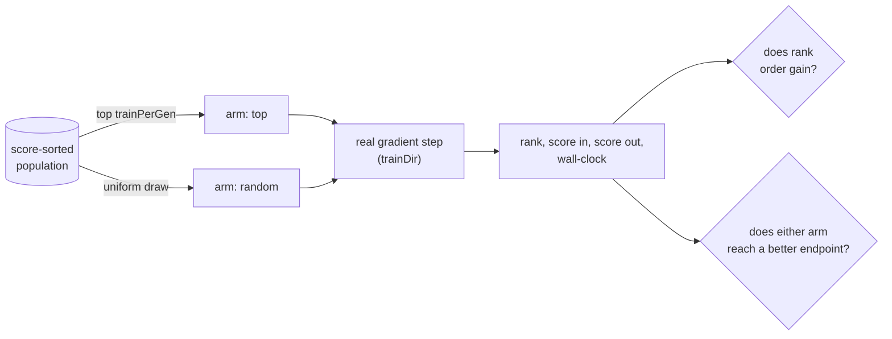

# Memetic local-search budget, Stage 1 (Issue #3934)

[Jin (2011)](../comparison/REFERENCES.md#-surrogate-assisted-search-and-racing)
§5 puts surrogates inside a _memetic_ algorithm to answer one question: **who
gets refined?** Local search is a large fixed cost per individual, so spending
it on individuals that will not benefit is the dominant waste. NEAT-AI's rule is
`selectTrainingCandidates` — the top `trainPerGen` creatures by current score —
and this is the first measurement of whether that rule does anything.

Harness: [`scripts/memetic_gain_study.ts`](../../scripts/memetic_gain_study.ts).
Memetic loop:
[`scripts/lib/memeticGainStudy.ts`](../../scripts/lib/memeticGainStudy.ts).
Arithmetic:
[`scripts/lib/memeticGainAnalysis.ts`](../../scripts/lib/memeticGainAnalysis.ts).
Tests:
[`test/scripts/MemeticGainStudy.ts`](../../test/scripts/MemeticGainStudy.ts) and
[`test/scripts/MemeticGainAnalysis.ts`](../../test/scripts/MemeticGainAnalysis.ts).
Production instrumentation:
[`docs/TRAINING_GAIN_LOG.md`](../TRAINING_GAIN_LOG.md). Artefact:
[`memetic-gain-3934.json`](./memetic-gain-3934.json). Nothing under `src/`
imports the harness, and no selection behaviour changes.

## Verdict

**Stage 2 is a no-go, and the reason is not that rank says nothing — it is that
rank says something too weak to spend a gradient step on.**

Over **15,000 real training events**, the rank a creature was selected at does
correlate with the gain its gradient step realised (ρ = 0.132, p = 0.0005 on the
unbiased arm), in the direction the issue predicted: the **incumbent has least
left to extract**. But |ρ| = 0.132 is below the 0.2 materiality floor the
harness pre-registers, and the endpoint comparison says why that floor matters:
at the same seed, today's rule and uniform-random selection reach the **same
final exact score** — today's rule wins 34 of 75 seeds.

So there is no reallocation to make. A predictor built on this signal would move
the budget towards creatures with more headroom and arrive at the same endpoint,
which is precisely the failure mode the issue names: _"a selector that maximises
measured gain by picking creatures with the most room to improve can
systematically favour poor creatures."_ That is not a hypothetical here — it is
what the numbers show happening.

The finding that **is** worth keeping is about the budget itself, and it is in
the `improved` column below: **94.4 % of the gradient steps today's rule
dispatches make the creature worse and are rolled back.** That is a statement
about how much local search this lineage can absorb, not about who receives it.

## The run

```bash
NEAT_AI_BACKPROP_ENABLED=0 deno task memetic-gain-study \
  --seeds=25 --repeats=3 --generations=25 \
  --json=docs/evidence/memetic-gain-3934.json
```

| Parameter    | Value                                                                                                                         |
| ------------ | ----------------------------------------------------------------------------------------------------------------------------- |
| Arms         | `top` (today's `selectTrainingCandidates`) and `random` (uniform over the same finite-score population), **same seed**        |
| Scale        | 3 repeats × 25 seeds × 25 generations × 4 training events = **15,000 real gradient steps** (7,500 per arm)                    |
| Population   | 20 creatures, elitism 2, real `Offspring.breed` and real `Mutator` operators                                                  |
| Corpus       | 600 records, deterministic non-linear regression, written to a real binary data directory                                     |
| Local search | **Real backpropagation** via `trainDir`, 2 epochs per step, TypeScript/WASM loop (the Rust trainer is absent from a checkout) |
| Score        | `-MSE` over the whole corpus, re-measured after the step; higher is better                                                    |
| Host         | 7-core container, Deno 2.x                                                                                                    |

The `random` arm is not only the baseline the issue insists on. It is the **only
unbiased estimator of rank-versus-gain available**, because today's rule never
observes a gain at any rank past `trainPerGen - 1`. Both readings are published
below; the pooled one is rank-biased by the rule's own choices, and the verdict
is taken from the unbiased arm.



## What the 15,000 events say

| policy | events | median gain | trimmed mean |  mean gain |  max gain | improved | training s |    gain/s |
| ------ | -----: | ----------: | -----------: | ---------: | --------: | -------: | ---------: | --------: |
| top    |  7,500 |  -2.913e-02 |   -4.747e-02 | -5.159e-02 | 1.923e-01 |    5.6 % |       94.3 | -4.105e+0 |
| random |  7,500 |  -1.326e-02 |   -2.490e-02 | -3.008e-02 | 5.479e-01 |   19.9 % |       96.5 | -2.338e+0 |

Read the columns in this order, because the first one is the trap:

- **`gain/s` is negative for both arms.** The issue asks for "realised gain per
  unit of training wall-clock", and the honest answer is that the _average_
  gradient step on this corpus **loses** score and is then rolled back. So this
  metric ranks the arms by which wastes less, and by it today's rule is **1.76×
  worse** than random selection. It is reported because the issue asks for it,
  not because it is the number that decides anything.
- **`improved` is the column that matters.** 5.6 % of the top rule's steps
  improved the creature; 19.9 % of random selection's did. Four times as many
  steps land when the budget is spread over the population.
- **`mean gain` is not a centre.** The `max gain` column shows why: a creature
  whose outputs had exploded scores a colossal negative, and one step that reins
  it in realises a gain no other event comes near. The trimmed mean (10 % each
  tail) and the median are reported beside the raw mean rather than instead of
  it — the outliers are real, so they are trimmed visibly.

### Does score-rank predict training gain?

| sample                              |     ρ |   τ-b |      p |      n | distinct ranks |
| ----------------------------------- | ----: | ----: | -----: | -----: | -------------: |
| randomly-selected events (unbiased) | 0.132 | 0.091 | 0.0005 |  7,500 |             20 |
| all events (rank-biased)            | 0.185 | 0.130 | 0.0005 | 15,000 |             20 |

Positive ρ means a **worse** rank (a higher index) realised a **larger** gain.
The p-value is a seeded two-sided permutation test over 2,000 shuffles, not the
asymptotic approximation — the gains are heavily tied and far from normal, which
is exactly where that approximation flatters itself.

The shape behind the coefficient is monotone and clear:

| rank bucket | events | median gain | improved |
| ----------- | -----: | ----------: | -------: |
| 0–25 %      |  9,428 |  -2.506e-02 |    6.5 % |
| 25–50 %     |  1,818 |  -1.456e-02 |   16.4 % |
| 50–75 %     |  1,834 |  -1.153e-02 |   21.1 % |
| 75–100 %    |  1,920 |  -9.383e-03 |   31.6 % |

A creature in the bottom quartile of its population is **nearly five times**
more likely to benefit from a gradient step than the incumbent. The issue's
reasoning — "the current leader is likely to be the individual closest to its
local optimum and therefore the one with the least left to extract" — is
confirmed.

### Does it buy a better run?

| comparison                                  | value       |
| ------------------------------------------- | ----------- |
| Final exact score, `top` (mean of 75 seeds) | -1.3496e-2  |
| Final exact score, `random`                 | -1.2835e-2  |
| Paired wins, `top` vs `random`              | **34 / 75** |
| Paired mean delta (`top` − `random`)        | -6.614e-4   |
| Paired median delta                         | -2.909e-4   |

No. The two rules are a coin flip on the endpoint, and the paired delta leans
very slightly **against** today's rule. This is the comparison the issue insists
any Stage 2 selector be judged on — "judged on **final exact score**, not on
mean training gain" — and it is already decisive before any predictor is built:
**there is no endpoint gap for a gain predictor to close.**

### Is the reading stable?

| repeat | base seed | events | ρ (random arm) |      p | top wins | decision |
| -----: | --------: | -----: | -------------: | -----: | -------: | -------- |
|      1 |      3934 |  5,000 |          0.156 | 0.0005 |    10/25 | no-go    |
|      2 |      4934 |  5,000 |          0.128 | 0.0005 |     9/25 | no-go    |
|      3 |      5934 |  5,000 |          0.111 | 0.0005 |    15/25 | no-go    |

Three independent repeats, no shared seeds, same verdict each time, ρ inside
`[0.11, 0.16]` throughout. The endpoint stays a coin flip in all three.

## Caveats — what this does not show

- **Small creatures, small corpus.** The ranks and the ordering are real; the
  magnitudes are not GRQ's. A 5,317-neuron creature over a 21.2 GiB corpus could
  have a different gain distribution, and nothing here claims otherwise. What
  transfers is the _ordering_ question, which is what selection consumes.
- **The TypeScript/WASM trainer, not the Rust one.** `trainDir` prefers
  `neat_ai_backpropagation` and refuses to fall back when it is enabled but
  absent; a plain checkout therefore runs the TypeScript loop, and the harness
  says so rather than measuring nothing. The same harness runs on the Rust
  trainer when it is present (`./quality.sh --next`).
- **Reproducible in distribution, not bit for bit.** The seed population's
  neuron UUIDs are named, so generation 1 of two same-seed runs agrees — but the
  mutation operators mint random UUIDs for the neurons they add, crossover
  aligns genes _by_ those UUIDs, and a memetic run amplifies the difference.
  That is why the evidence is 75 seeds across 3 repeats rather than one run
  quoted to four decimal places.
- **Two epochs per step.** Production schedules two (`#3776`), so this matches —
  but a longer local search could shift the gain distribution and is untested
  here.

## What happens next

Nothing is built. The Stage 2 gate — a gain predictor selecting by predicted
improvement — required Stage 1 to show gain is _usefully_ predictable, and the
measurement says it is not: a real but weak ordering with no endpoint gap behind
it. The go/no-go is recorded on #3919.

The instrumentation ships anyway and off by default
([`docs/TRAINING_GAIN_LOG.md`](../TRAINING_GAIN_LOG.md)), because the number
that did come out of this — 94.4 % of scheduled gradient steps are rolled back —
is a production question it can answer on a real run, on real creatures, without
any predictor at all.
