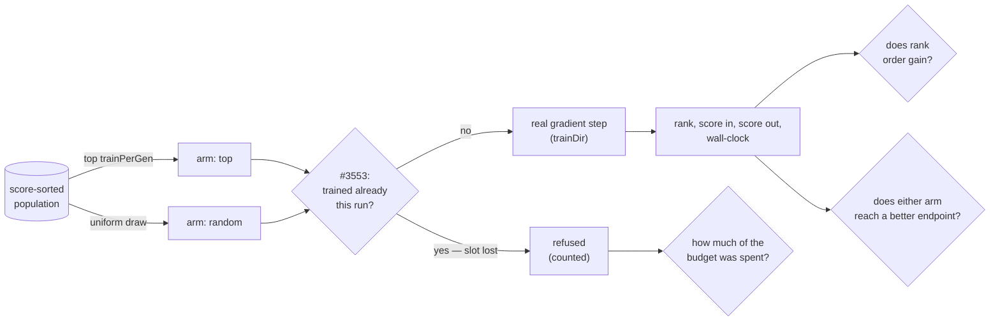

# Memetic local-search budget, Stage 1 (Issue #3934)

[Jin (2011)](../comparison/REFERENCES.md#-surrogate-assisted-search-and-racing)
§5 puts surrogates inside a _memetic_ algorithm to answer one question: **who
gets refined?** Local search is a large fixed cost per individual, so spending
it on individuals that will not benefit is the dominant waste. NEAT-AI's rule is
`selectTrainingCandidates` — the top `trainPerGen` creatures by current score —
and this is the first measurement of whether that rule does anything.

Harness: [`scripts/memetic_gain_study.ts`](../../scripts/memetic_gain_study.ts).
Memetic loop:
[`scripts/lib/memeticGainStudy.ts`](../../scripts/lib/memeticGainStudy.ts).
Arithmetic:
[`scripts/lib/memeticGainAnalysis.ts`](../../scripts/lib/memeticGainAnalysis.ts).
Tests:
[`test/scripts/MemeticGainStudy.ts`](../../test/scripts/MemeticGainStudy.ts) and
[`test/scripts/MemeticGainAnalysis.ts`](../../test/scripts/MemeticGainAnalysis.ts).
Production instrumentation:
[`docs/TRAINING_GAIN_LOG.md`](../TRAINING_GAIN_LOG.md). Artefact:
[`memetic-gain-3934.json`](./memetic-gain-3934.json). Nothing under `src/`
imports the harness, and no selection behaviour changes.

## Verdict

**Stage 2 is a no-go, and the reason is not that rank says nothing — it is that
rank says something too weak to reallocate a gradient step on. What the run did
find is a larger problem one rung up: today's rule cannot spend half the budget
it is given.**

Over **10,645 real training events**, the rank a creature was selected at does
correlate with the gain its gradient step realised (ρ = 0.119, p = 0.0005 on the
unbiased arm), in the direction the issue predicted: the **incumbent has least
left to extract**. But |ρ| = 0.119 is below the 0.2 materiality floor the
harness pre-registers, and the endpoint comparison says why that floor matters:
at the same seed, today's rule and uniform-random selection reach the **same
final exact score**, and which of them is ahead flips between runs of the
identical configuration.

So there is no reallocation to make _on predicted gain_. A predictor built on
this signal would move the budget towards creatures with more headroom and
arrive at the same endpoint, which is precisely the failure mode the issue
names: _"a selector that maximises measured gain by picking creatures with the
most room to improve can systematically favour poor creatures."_

The finding that **is** worth acting on is not about gain at all. Issue #3553
trains a creature at most once per run, and a refused slot is **lost, not
reallocated** — `scheduleTraining` simply returns. Today's rule keeps choosing
the creatures at the head of the population, and with elitism those are largely
the creatures it has already trained, so:

| policy             | slots offered | steps taken | refused by #3553 |  spent |
| ------------------ | ------------: | ----------: | ---------------: | -----: |
| top (today's rule) |         7,500 |       3,841 |            3,659 | 51.2 % |
| random (baseline)  |         7,500 |       6,804 |              696 | 90.7 % |

**Today's rule converts 51.2 % of its local-search budget into gradient steps.
The random baseline converts 90.7 % of the same budget.** That is not a
statistical effect needing a materiality floor — it is an arithmetic property of
selecting by an attribute that barely changes between generations, and it is
squarely inside this issue's scope (_who is selected for local search_).

## The run

```bash
NEAT_AI_BACKPROP_ENABLED=0 deno task memetic-gain-study \
  --seeds=25 --repeats=3 --generations=25 \
  --json=docs/evidence/memetic-gain-3934.json
```

| Parameter    | Value                                                                                                                         |
| ------------ | ----------------------------------------------------------------------------------------------------------------------------- |
| Arms         | `top` (today's `selectTrainingCandidates`) and `random` (uniform over the same finite-score population), **same seed**        |
| Budget       | 3 repeats × 25 seeds × 25 generations × 4 slots = **15,000 offered slots per arm-pair** (7,500 each)                          |
| Guard        | Issue #3553 as production applies it: a creature is trained at most once per run, and a refused slot is lost                  |
| Population   | 20 creatures, elitism 2, real `Offspring.breed` and real `Mutator` operators                                                  |
| Corpus       | 600 records, deterministic non-linear regression, written to a real binary data directory                                     |
| Local search | **Real backpropagation** via `trainDir`, 2 epochs per step, TypeScript/WASM loop (the Rust trainer is absent from a checkout) |
| Score        | `-MSE` over the whole corpus, re-measured after the step; higher is better                                                    |
| Host         | 7-core container, Deno 2.x                                                                                                    |

The `random` arm is not only the baseline the issue insists on. It is the **only
unbiased estimator of rank-versus-gain available**, because today's rule never
observes a gain at any rank past `trainPerGen - 1`. Both readings are published
below; the pooled one is rank-biased by the rule's own choices, and the verdict
is taken from the unbiased arm.



## What the 10,645 events say

| policy | events | median gain | trimmed mean |  mean gain |  max gain | improved | training s |    gain/s | trimmed gain/s |
| ------ | -----: | ----------: | -----------: | ---------: | --------: | -------: | ---------: | --------: | -------------: |
| top    |  3,841 |  -1.938e-02 |   -3.516e-02 | -4.073e-02 | 1.923e-01 |   13.1 % |       48.3 | -3.237e+0 |      -2.794e+0 |
| random |  6,804 |  -1.070e-02 |   -2.153e-02 | -2.655e-02 | 5.480e-01 |   22.9 % |       83.7 | -2.157e+0 |      -1.749e+0 |

Read the columns in this order, because the first one is the trap:

- **`gain/s` is negative for both arms.** The issue asks for "realised gain per
  unit of training wall-clock", and the honest answer is that the _average_
  gradient step on this corpus **loses** score against the creature it trained.
  So this metric ranks the arms by which wastes less, and by it today's rule is
  **1.50× worse** than random selection (**1.60×** on the outlier-resistant
  `trimmed gain/s`, which is reported beside it so one explosive recovery cannot
  set an arm's sign on its own). It is reported because the issue asks for it,
  not because it is the number that decides anything.
- **`improved` is the column that matters.** 13.1 % of the top rule's steps
  produced a better creature; 22.9 % of random selection's did. Put the other
  way: **86.9 % of the gradient steps today's rule dispatches produce a creature
  worse than the one they trained**, and the run throws those away.
- **`events` is not the budget.** Each arm was offered 7,500 slots; the counts
  here are what survived the #3553 guard, which is the headline above.
- **`mean gain` is not a centre.** The `max gain` column shows why: a creature
  whose outputs had exploded scores a colossal negative, and one step that reins
  it in realises a gain no other event comes near. The trimmed mean (10 % each
  tail) and the median are reported beside the raw mean rather than instead of
  it — the outliers are real, so they are trimmed visibly.

### Does score-rank predict training gain?

| sample                              |     ρ |   τ-b |      p |      n | distinct ranks |
| ----------------------------------- | ----: | ----: | -----: | -----: | -------------: |
| randomly-selected events (unbiased) | 0.119 | 0.081 | 0.0005 |  6,804 |             20 |
| all events (rank-biased)            | 0.157 | 0.109 | 0.0005 | 10,645 |             20 |

**The verdict is taken from the first row only.** The pooled row reads higher
precisely because it is contaminated: every one of the top arm's events sits at
a rank below `trainPerGen`, so pooling the arms loads the best ranks with one
arm's outcomes and the rest with the other's. That is exactly why the random arm
exists.

Positive ρ means a **worse** rank (a higher index) realised a **larger** gain.
The p-value is a seeded two-sided permutation test over 2,000 shuffles, not the
asymptotic approximation — the gains are heavily tied and far from normal, which
is exactly where that approximation flatters itself. 0.0005 is the floor of
2,000 draws, so it reads as "smaller than this test can resolve" rather than as
a calibrated value, and the verdict does not turn on it.

The shape behind the coefficient is monotone and clear. These rows are the
**randomly-selected events only**, so the four quartiles are comparable with
each other rather than with a different arm:

| rank bucket | events | median gain | improved |
| ----------- | -----: | ----------: | -------: |
| 0–25 %      |  1,470 |  -1.328e-02 |   14.4 % |
| 25–50 %     |  1,678 |  -1.178e-02 |   19.0 % |
| 50–75 %     |  1,778 |  -1.147e-02 |   21.7 % |
| 75–100 %    |  1,878 |  -6.483e-03 |   34.1 % |

A creature in the bottom quartile of its population is **about 2.4 times** more
likely to benefit from a gradient step than one in the top quartile, and its
median step costs it less than half as much. The issue's reasoning — "the
current leader is likely to be the individual closest to its local optimum and
therefore the one with the least left to extract" — is confirmed.

### Does it buy a better run?

| comparison                                  | value       |
| ------------------------------------------- | ----------- |
| Final exact score, `top` (mean of 75 seeds) | -1.3644e-2  |
| Final exact score, `random`                 | -1.3003e-2  |
| Paired wins, `top` vs `random`              | **35 / 75** |
| Paired mean delta (`top` − `random`)        | -6.410e-4   |
| Paired median delta                         | -1.589e-4   |

No — and more usefully, **the comparison has no stable direction to report**. A
run of this identical configuration immediately before this one gave today's
rule 35 → **43 / 75** wins with a paired mean delta of -1.046e-4 and a
_positive_ median delta: the winner changed between two runs that differ only in
the unseeded neuron UUIDs the mutation operators mint (see the caveats). A
comparison whose sign flips between runs of the same harness cannot support a
claim in either direction.

This is the comparison the issue insists any Stage 2 selector be judged on —
"judged on **final exact score**, not on mean training gain" — and it is already
decisive before any predictor is built: **there is no measurable endpoint gap
for a gain predictor to close.**

### Is the reading stable?

| repeat | base seed | events | ρ (random arm) |      p | top wins | decision |
| -----: | --------: | -----: | -------------: | -----: | -------: | -------- |
|      1 |      3934 |  3,554 |          0.147 | 0.0005 |    13/25 | no-go    |
|      2 |      4934 |  3,469 |          0.127 | 0.0005 |    10/25 | no-go    |
|      3 |      5934 |  3,622 |          0.079 | 0.0005 |    12/25 | no-go    |

Three independent repeats, no shared seeds, same verdict each time, ρ inside
`[0.08, 0.15]` throughout — every repeat below the 0.2 floor on its own
evidence. The budget-utilisation gap is present in all three.

## Caveats — what this does not show

- **Small creatures, small corpus.** The ranks and the ordering are real; the
  magnitudes are not GRQ's. A 5,317-neuron creature over a 21.2 GiB corpus could
  have a different gain distribution, and nothing here claims otherwise. What
  transfers is the _ordering_ question, which is what selection consumes.
- **The utilisation figure is scale-dependent too.** 51.2 % is what a
  20-creature population with elitism 2 and `trainPerGen` 4 produces over 25
  generations. The _mechanism_ — score-rank changes slowly, #3553 refuses a
  repeat, the slot is lost — does not depend on those numbers, but the
  percentage does. The shipped log is what measures it on a real run.
- **The TypeScript/WASM trainer, not the Rust one.** `trainDir` prefers
  `neat_ai_backpropagation` and refuses to fall back when it is enabled but
  absent; a plain checkout therefore runs the TypeScript loop, and the harness
  says so rather than measuring nothing. The same harness runs on the Rust
  trainer when it is present (`./quality.sh --next`).
- **Reproducible in distribution, not bit for bit.** The seed population's
  neuron UUIDs are named, so generation 1 of two same-seed runs agrees — but the
  mutation operators mint random UUIDs for the neurons they add, crossover
  aligns genes _by_ those UUIDs, and a memetic run amplifies the difference.
  That is why the evidence is 75 seeds across 3 repeats rather than one run
  quoted to four decimal places, and why the endpoint comparison above is
  reported as directionless rather than as a win for either arm.
- **The permutation test pools across seeds.** It shuffles 75 seeds × 25
  generations as one exchangeable sample and ignores within-run clustering, so
  its p-value is optimistic about independence. The verdict rests on the
  magnitude of ρ against a pre-registered floor, not on the p-value.
- **Two epochs per step.** Production schedules two (`#3776`), so this matches —
  but a longer local search could shift the gain distribution and is untested
  here.
- **#2382 is not modelled.** Production also skips creatures whose recent
  training attempts all regressed. Modelling it would refuse _more_ of today's
  rule's slots, not fewer, so the 51.2 % above is an upper bound on utilisation.

## What happens next

No selector is built. The Stage 2 gate — a gain predictor selecting by predicted
improvement — required Stage 1 to show gain is _usefully_ predictable, and the
measurement says it is not: a real but weak ordering with no measurable endpoint
gap behind it. The go/no-go is recorded on #3919.

The instrumentation ships anyway and off by default
([`docs/TRAINING_GAIN_LOG.md`](../TRAINING_GAIN_LOG.md)), because both numbers
that did come out of this — 86.9 % of scheduled gradient steps produce a worse
creature, and roughly half the local-search budget never becomes a gradient step
at all — are production questions it can answer on a real run, on real
creatures, without any predictor.
