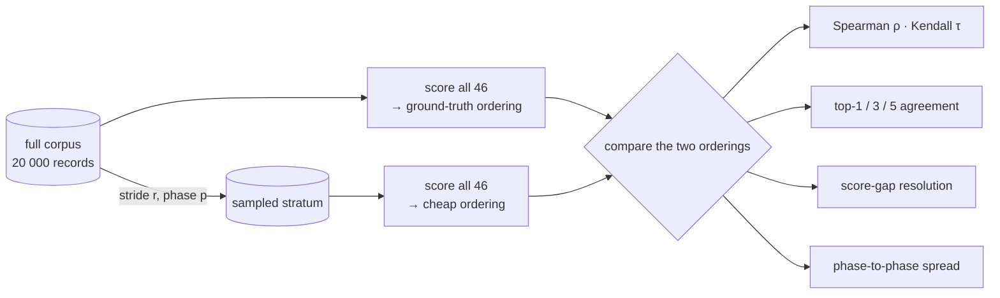

# Rank fidelity of a sub-sampled fitness score (Issue #3927)

Jin (2011) §2 and §4 make the point this measurement exists to test: an
evolutionary algorithm never consumes a fitness **value**, it consumes
**comparisons**. An approximate fitness with terrible absolute error but a
perfect ordering costs nothing; one with excellent absolute error that inverts
two adjacent ranks sends the search somewhere else entirely. So the property
that decides whether a cheap fidelity is usable is **rank preservation**, and
until now nothing in the repository measured it.

[Issue #3926](./fitness-corpus-fidelity-3926.md) measured what a sampled corpus
**costs** — wall-clock tracks corpus size to within a percent — and said in so
many words that it says nothing about score quality. This is the other half:
does the cheap ordering match the expensive one?

Harness:
[`scripts/rank_fidelity_sweep.ts`](../../scripts/rank_fidelity_sweep.ts).
Arithmetic: [`scripts/lib/rankFidelity.ts`](../../scripts/lib/rankFidelity.ts).
Tests: [`test/scripts/RankFidelity.ts`](../../test/scripts/RankFidelity.ts) and
[`test/scripts/RankFidelitySweep.ts`](../../test/scripts/RankFidelitySweep.ts).
It is a measurement harness — nothing under `src/` imports it, and it changes no
scoring behaviour.

## The run

```bash
deno task rank-fidelity \
  --creatures=/path/to/creature-samples --min-creatures=46 \
  --synthetic-records=20000 --seed=3927 \
  --rates=1,0.5,0.25,0.1,0.05,0.01 --phases=4 \
  --json=docs/evidence/rank-fidelity-3927.json
```

| Parameter  | Value                                                                                                                                                                               |
| ---------- | ----------------------------------------------------------------------------------------------------------------------------------------------------------------------------------- |
| Population | **46 real creatures** from the downstream sampler's `samples/` directory — every one `forwardOnly: true`, 2,511 → 1, median 7,598 neurons / 50,305 synapses. Not a fixture.         |
| Corpus     | **Synthetic**, 20,000 records at the production record shape (2,511 → 1, 10,048 B a record). The 21.2 GiB production corpus is not reachable from this container — see the caveats. |
| Fidelities | Rates 1, 0.5, 0.25, 0.1, 0.05, 0.01, each at up to 4 distinct stride phases                                                                                                         |
| Cost       | `MSE` (mean squared error), via `Creature.evaluateDir`                                                                                                                              |
| Host       | 7-core container, Deno 2.x, WASM (WebAssembly) scoring path                                                                                                                         |

A sampled corpus is a **stride** of the full one, matching what the refinery
publishes: rate `r` keeps every `1/r`-th record, and the **phase** picks which
stratum. Rate 0.5 therefore has exactly two strata, so it reports two phases
rather than the four asked for — measuring a stratum twice would report a noise
figure the estimator does not have.



## The measurement

| Rate | Stride | Phases | Records | Spearman ρ (min–max) | Kendall τ (min–max) | Top-1 | Top-3 | Top-5 | Gap resolution | Phase spread (max) | ms / pass | vs full |
| ---- | ------ | ------ | ------- | -------------------- | ------------------- | ----- | ----- | ----- | -------------- | ------------------ | --------- | ------- |
| 1    | 1      | 1      | 20000   | 1.0000–1.0000        | 1.0000–1.0000       | 1.000 | 1.000 | 1.000 | 0.00e+0        | n/a                | 113772    | 1.000   |
| 0.5  | 2      | 2      | 10000   | 0.9886–0.9956        | 0.9378–0.9618       | 1.000 | 0.667 | 0.700 | 3.74e-3        | 1.10e-1            | 56017     | 0.492   |
| 0.25 | 4      | 4      | 5000    | 0.9726–0.9956        | 0.9059–0.9612       | 0.750 | 0.667 | 0.700 | 5.35e-3        | 9.24e-1            | 28044     | 0.246   |
| 0.1  | 10     | 4      | 2000    | 0.9806–0.9925        | 0.9213–0.9604       | 0.750 | 0.667 | 0.700 | 1.09e-2        | 5.88e-1            | 11225     | 0.099   |
| 0.05 | 20     | 4      | 1000    | 0.9543–0.9811        | 0.8685–0.9194       | 0.750 | 0.667 | 0.700 | 4.40e-2        | 1.45e+0            | 5607      | 0.049   |
| 0.01 | 100    | 4      | 200     | 0.7455–0.9950        | 0.6299–0.9644       | 0.250 | 0.667 | 0.750 | 8.01e-2        | 2.65e+0            | 1129      | 0.010   |

Full-corpus scores span **1.1012655 – 6.3686149**; the smallest gap between
adjacent creatures is **8.88e-16** and the median is **5.04e-4**. Top-k figures
are means across the rate's phases. The machine-readable run, including every
creature's score at every rate and phase, is
[`rank-fidelity-3927.json`](./rank-fidelity-3927.json).

Wall-clock reproduces #3926 independently: 0.492, 0.246, 0.099, 0.049 and 0.010
of the full-corpus pass at the five sampled rates, against the 0.5, 0.25, 0.1,
0.05 and 0.01 they were cut at.

## The finding

**No rate is safe. The full corpus stays the fitness of record.**

The reason is the point of the whole issue, and it is not visible in the
correlation columns. **Spearman ρ stays above 0.95 at every rate down to 0.05,
and every one of those rates is unusable.** A ρ of 0.99 is earned by ranking the
bulk of the population correctly; the search only ever looks at the head of the
ordering, and it only ever accepts improvements around **1e-05**.

The column that decides it is **score-gap resolution** — the coarsest
full-corpus gap the sampled score fails to order. Even at rate 0.5, half the
corpus, it is **3.74e-3**: about **370×** coarser than the improvements the
search accepts. By rate 0.01 it is 8.01e-2, roughly **8,000×** coarser. There is
no rate at which the cheap score can see the moves the search is trying to make.

What that looks like concretely, from the head of the recorded ordering:

| Full-corpus rank | Creature             | Score               |
| ---------------- | -------------------- | ------------------- |
| 1                | `Enceladus`          | 1.10126547105212660 |
| 2                | `Enceladus-Terminal` | 1.10126633648702250 |
| 3                | `GRQ-22-lamarck`     | 6.15240130220534500 |
| 4                | `GRQ-25-1`           | 6.15240130220534700 |
| 5                | `GRQ-12-1`           | 6.15240130220535000 |

Ranks 3–5 are separated by about **3e-15** — a genuine tie for practical
purposes, and the reason top-3 agreement sits at a flat 0.667 at every rate.
That particular disagreement is numerically meaningless and should not be read
as a failure. The substantive failures are elsewhere and are unambiguous:

- At **rate 0.1, phase 1** the sampled score puts `Enceladus-Terminal` ahead of
  `Enceladus`, inverting a real **8.65e-07** gap — the top-1 selection the whole
  run turns on.
- At the same rate, phases 0 and 2 rank `GRQ-12-1`/`GRQ-22-lamarck`/`GRQ-25-1`
  into ranks 3–5 while phases 1 and 3 promote a different cluster
  (`GRQ-18-1`/`GRQ-21-1`/`GRQ-22-1`) into those slots. Which creatures appear in
  the head of the ordering depends on **which stratum was drawn**.

That last point is the phase-sensitivity column doing its job: the same rate and
the same creatures, differing only in the offset of the stride, move a score by
up to 1.10e-1 at rate 0.5 and 2.65e+0 at rate 0.01 — three to four orders of
magnitude above the 5.04e-4 median gap between adjacent creatures.

## What this does and does not say

- **It is not the production corpus.** The 21.2 GiB production corpus is not
  reachable from this container, so the records are synthetic at the production
  record shape. The **creatures are real** — the 46-creature sampler population,
  at production topology — and the record shape is production's, but the data
  distribution is not. The measured noise floor is therefore a **stand-in**, and
  most likely a pessimistic one: the synthetic target is uncorrelated with the
  creatures' outputs, so per-record error variance is higher than a fitted
  model's would be on real data.
- **The mechanism does not depend on the corpus, only the magnitude does.** The
  sampling error of a mean over `n` records falls as `1/√n`, so re-running this
  harness with `--corpus=<production dir>` moves the gap-resolution column but
  not the shape of the argument. Given how far the column has to move — 370× at
  rate 0.5 — a change of corpus is very unlikely to reverse the conclusion, but
  **only that run can settle it**, and this harness is what runs it. That is the
  one criterion of Issue #3927 this evidence leaves open.
- **Phase spread partly overstates the risk.** All creatures in a pass see the
  same stratum, so much of that movement is common-mode and cancels in the
  ordering. It is the failure signal Issue #3927 asked for and it is reported as
  asked, but the paired measures — ρ, τ, top-k and gap resolution — are the ones
  to weight. They rule every rate out on their own.
- **It says nothing about a sampled score used as a _screen_.** Ruling out a
  cheap fidelity as the fitness _of record_ is not ruling it out as a filter. A
  gap resolution of 3.7e-3 at rate 0.5 is far too coarse to accept a candidate,
  and ample to reject one that is worse by a whole unit — which is Jin's own
  architecture: propose cheaply, accept expensively. Whether that is worth
  building is #3919's call; this measurement supplies the number it needs.
- **It is the WASM scoring path** and one scoring pass over the population, not
  a full `evolveDir` generation. Both engines do the same per-record work, so
  the ratios are the corpus-size effect in isolation; the absolute milliseconds
  are this harness's, not production's.

## Reproducing

`--creatures=<dir>` is any directory of creature `*.json`. The harness refuses a
population smaller than `--min-creatures` (default 50) rather than reporting a
smaller one silently, and refuses fewer than five creatures outright because
top-5 agreement cannot be formed. Exactly one of `--corpus=<dir>` (real records)
and `--synthetic-records=<n>` must be given, and the corpus provenance is
stamped on the report, so a synthetic table can never be misread as a production
result.

## References

- Jin (2011), §2 and §4 — approximation quality, and why rank preservation is
  the property selection consumes. See
  [`docs/comparison/REFERENCES.md`](../comparison/REFERENCES.md#-surrogate-assisted-search-and-racing).
- Jones, Schonlau & Welch (1998) — deciding what is worth evaluating for real.
