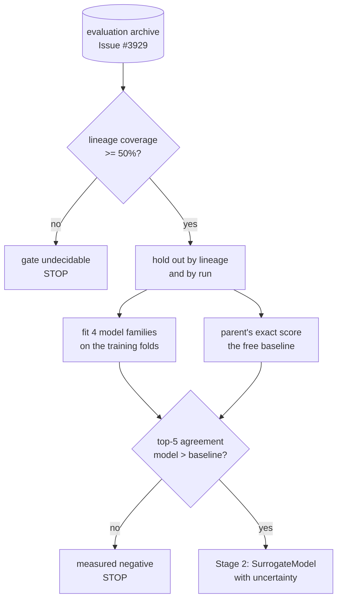

# Surrogate feasibility, Stage 1 (Issue #3930)

Jin (2011) §2 is a survey of models that predict a fitness instead of evaluating
one. [Issue #3929](../EVALUATION_ARCHIVE.md) built the training data those
models need; this is the study that asks the prior question — **is a useful
surrogate possible here at all?** — and it is deliberately scoped so that "no"
is a cheap answer rather than an expensive one.

Harness:
[`scripts/surrogate_feasibility.ts`](../../scripts/surrogate_feasibility.ts).
Model families:
[`scripts/lib/surrogateModels.ts`](../../scripts/lib/surrogateModels.ts). Study
arithmetic:
[`scripts/lib/surrogateStudy.ts`](../../scripts/lib/surrogateStudy.ts). Archive
capture:
[`scripts/surrogate_archive_capture.ts`](../../scripts/surrogate_archive_capture.ts).
Nothing under `src/` imports any of them and no scoring or selection behaviour
changes.

## Verdict

**The kill gate did not pass, and it did not fail on the merits either: it could
not be decided.** The reason is a data gap, not a measured negative, and the two
call for different work — so the report says which one it is.

The gate the issue defines is _lineage-held-out top-5 agreement against the
parent's-score baseline_. That baseline needs each archived creature to name the
parent it came from. On the archive this study could reach, **8 of 1,141 records
name a parent, and 0.7 % name one that is itself in the archive**. With the
parent link absent, two things break at once:

1. The baseline is the training mean for 99.3 % of creatures — a constant, not
   an ordering. Nothing can be shown to beat it.
2. Leave-one-lineage-out degenerates into leave-one-creature-out: 1,133 groups
   for 1,141 creatures, 1,131 of them too small to carry an ordering at all.
   That is the leaky random split the issue explicitly forbids, arrived at by
   accident.

`assessKillGate` refuses on the first of those before it reads a single model
score. An undecidable gate is a stop, exactly as a clear negative is: Stage 2
was not built.

## What the models did manage to show

The **run-held-out** split needs no lineage at all, and it is a legitimate,
non-leaky split — six runs, each held out whole while the models train on the
other five. It is the part of this study that carries real information, and what
it shows is the failure mode the issue predicted in so many words.

| Model                     |      ρ |      τ | top-1 | top-3 | top-5 |         ≤1e-5 |  (1e-5, 1e-4] | ≤1e-4 (cumulative) |
| ------------------------- | -----: | -----: | ----: | ----: | ----: | ------------: | ------------: | -----------------: |
| quadratic-polynomial      |  0.249 |  0.175 | 0.000 | 0.000 | 0.000 | 0.535 (5 390) | 0.288 (2 324) |      0.460 (7 714) |
| rbf-interpolation         |  0.136 |  0.093 | 0.000 | 0.000 | 0.033 | 0.567 (5 390) | 0.425 (2 324) |      0.524 (7 714) |
| gaussian-process          |  0.198 |  0.163 | 0.000 | 0.167 | 0.167 | 0.717 (5 390) | 0.454 (2 324) |      0.638 (7 714) |
| gradient-boosted-trees    |  0.715 |  0.607 | 0.000 | 0.056 | 0.033 | 0.023 (5 390) | 0.003 (2 324) |      0.017 (7 714) |
| **parent-score-baseline** | -0.214 | -0.175 | 0.000 | 0.000 | 0.000 | 0.000 (5 390) | 0.001 (2 324) |      0.001 (7 714) |

Accuracy cells read `accuracy (pairs)`; pair counts are pooled across the six
folds. A **tie** — the predictor giving two creatures the same score — counts as
a failure to order, and the report counts ties separately from inversions
because they are different failures. The tie counts matter here, so they are
spelled out below rather than left in the JSON.

Four things are worth reading off that table, and the third is the one that
would have been missed by quoting a single number.

- **Top-1 agreement is 0.000 for every family, in every fold.** Selection reads
  the head of the ordering and nothing else. The best top-3 and top-5 anywhere
  in the table is the Gaussian process at 0.167 — one fold in six. A model that
  cannot find the head cannot be consumed by selection however well it
  correlates over the tail.
- **The best rank correlation belongs to the worst-resolving model.**
  Gradient-boosted trees post ρ = 0.715, comfortably the highest, and order
  **1.7 %** of ≤1e-4 pairs correctly — because they _tie_ 7 528 of those 7 714
  pairs. A piecewise-constant model cannot separate creatures whose descriptors
  fall in the same leaf, and a rank correlation taken over massively tied
  predictions is not evidence of resolution. Without the tie column this row
  reads as "ordered the close pairs backwards", which is a different and wrong
  conclusion.
- **There is a faint signal at the finest band, and it is not usable.** The
  Gaussian process resolves 71.7 % of pairs separated by ≤1e-5 — above chance,
  and worth recording rather than flattening into a "chance at the margin"
  headline. It resolves only 45.4 % of pairs in the next band up,
  `(1e-5,
  1e-4]`, which is _below_ chance. A predictor that is better on the
  harder pairs than on the easier ones has found a band artefact, not a signal;
  reporting the cumulative 0.638 alone would have hidden the inconsistency in
  both directions.
- **The baseline is a constant, as the coverage number implies.** It ties 7 708
  of 7 714 close pairs and its correlation was unmeasurable in four of six
  folds. It is published because the issue requires it to be published, not
  because it is an ordering.

The lineage-held-out table is in
[`surrogate-feasibility-3930.json`](./surrogate-feasibility-3930.json) for
completeness, but it should not be read as evidence: 1 131 of 1 133 lineage
groups were too small to hold an ordering, and the two folds that survived hold
four creatures each. That is why the coverage guard rejects the split rather
than quoting it.

## What produced these numbers

```bash
deno run --allow-read --allow-write --allow-env --allow-ffi \
  scripts/surrogate_archive_capture.ts \
  --out=/tmp/sa-capture2 --runs=6 --generations=15 --population=24 \
  --records=256 --seed=3930

deno task surrogate-feasibility \
  --archive=/tmp/sa-capture2/evaluations.jsonl \
  --provenance=container-run --accept-gap=1e-04 \
  --json=docs/evidence/surrogate-feasibility-3930.json
```

| Parameter  | Value                                                                                                                                                                    |
| ---------- | ------------------------------------------------------------------------------------------------------------------------------------------------------------------------ |
| Archive    | **1,143 exact evaluations** of 1,143 distinct creatures across 6 runs, descriptor v1, written by the real evaluation path                                                |
| Provenance | `container-run` — real creatures and real exact scores, raised inside this container. **Not** the production GRQ lineage                                                 |
| Features   | 58: the 57 v1 descriptor slots (17 scalars and a 40-slot squash histogram), with `geneticDistanceToReference` split into a value and a "was there a reference" indicator |
| Families   | Quadratic polynomial (ridge), Gaussian RBF (radial-basis function), Gaussian process (kriging, with posterior variance), gradient-boosted trees                          |
| Splits     | Leave-one-lineage-out and leave-one-run-out. No random-row split is implemented, at any setting                                                                          |
| Margin     | `--accept-gap=1e-04`, the band the issue names, reported cumulatively and as disjoint sub-bands                                                                          |



## What this does and does not establish

**Does.** The harness is real and the two negative signals it produced on real
data are real: a respectable aggregate ρ can coexist with chance-level
resolution at the margin selection operates in, and none of the four families
found the head of the ordering. It also establishes, with numbers, that the
archive as it stands cannot decide the gate.

**Does not.** These creatures are container-scale, not the 5,317-neuron /
38,988-synapse forward-only creatures of the GRQ lineage, and the corpus is a
synthetic regression task, not the 21.2 GiB production corpus — neither is
reachable from this container. The score range here is far wider than the
`mean=0.36056` … `max=0.40509` band the production sampler spans, so the ≤1e-4
band is a smaller _relative_ margin there than here, which if anything makes the
production problem harder rather than easier. Nothing in this document licenses
the claim that a surrogate is impossible on GRQ. It licenses the claim that **it
has not been shown possible, that the archive cannot currently decide it, and
that Stage 2 must not be built until it can.**

## What has to happen before the gate can be decided

The parent link is recorded off-creature by `recordLineage`
(`src/archive/CreatureLineage.ts`) and only on the crossover breeding paths in
`src/breed/`. A creature produced by mutating a clone — most of the population,
in the configurations measured here — reaches the archive with no parents at
all, indistinguishable from a seed or a random immigrant. Until an archived
creature reliably names where it came from, the parent's-score baseline cannot
be built, and without that baseline this issue's gate has nothing to compare a
model against.

That gap is a defect in the archive rather than in this study, and it is tracked
as [#4004](https://github.com/stSoftwareAU/NEAT-AI/issues/4004), which carries
the coverage measurements above.

## References

- Jin (2011), §2 — surrogate model families and their trade-offs.
- Jones, Schonlau & Welch (1998) — kriging plus expected improvement; the reason
  the Gaussian process here reports a posterior variance and the other families
  report `null` rather than a comforting zero.
- [`docs/EVALUATION_ARCHIVE.md`](../EVALUATION_ARCHIVE.md) — the archive this
  study consumes, and the descriptor contract it depends on.
- [`rank-fidelity-3927.md`](./rank-fidelity-3927.md) — the sibling measurement:
  ordering, not accuracy, is what an evolutionary search consumes.
