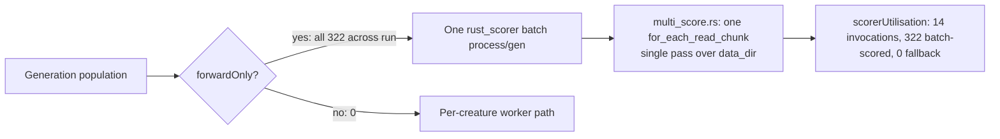

# Practice verification — native batch `rust_scorer` (Issue #3238)

One-off run/log evidence for parent **#3233**: the Rust native scorer's **batch
path** was used and it scored many creatures in **one pass** over the training
data. Regenerate with:

```bash
NEAT_AI_RUST_SCORER_BINARY_PATH=/abs/path/to/rust_scorer \
  deno run --no-prompt --unstable-worker-options \
  --allow-read --allow-write --allow-env --allow-run --allow-net \
  --allow-import --allow-ffi \
  scripts/verifyBatchScorerUtilisation3238.ts docs/evidence
```

The run drives a representative `evolveDataSet` job (feed-forward / forwardOnly
population, 3 inputs, population 24) with the native batch scorer enabled
(`NEAT_AI_RUST_SCORER_ENABLED=true`, `NEAT_AI_RUST_SCORER_BATCH=true`). The real
`rust_scorer` binary is wrapped in a shim that appends one line per launch, so
process spawns are counted at OS granularity. Full machine-readable capture:
[`verify-3238-result.json`](./verify-3238-result.json).

## What was captured (real run)

| Signal                                         | Value                   |
| ---------------------------------------------- | ----------------------- |
| Aggregated generations                         | 14                      |
| `generation_complete` events                   | 14                      |
| Partition log lines emitted                    | 14 (one per generation) |
| OS batch `rust_scorer` spawns                  | 14 (one per generation) |
| OS one-off `--help` cost probe spawns          | 1                       |
| `scorerUtilisation.batchScorerInvocations`     | 14                      |
| `scorerUtilisation.creaturesBatchScored`       | 322                     |
| `scorerUtilisation.creaturesPerCreatureScored` | 0                       |
| `scorerUtilisation.batchFallbackGenerations`   | 0                       |
| Discrepancies                                  | none                    |

The exact `creaturesBatchScored` total is stochastic (population dedup varies
run to run); the invariants that matter are stable across runs:
`batchScorerInvocations == generations`, `creaturesPerCreatureScored == 0`,
`batchFallbackGenerations == 0`.

### 1. Batch partition line (per generation)

```
[NEAT-AI] Batch scorer partition: 24 forwardOnly batched, 0 recurrent per-creature
[NEAT-AI] Batch scorer partition: 10 forwardOnly batched, 0 recurrent per-creature
… (14 lines total, one per aggregated generation)
```

Every generation partitioned its whole population into the forwardOnly batched
subset with **zero** recurrent per-creature creatures — so the entire population
took the one-pass batch path.

### 2. Exactly one `rust_scorer` process per generation

The shim log recorded **14 batch spawns** (plus one `--help` cost probe), each
of the form `--cost MSE <creatures_dir> <data_dir>`:

```
--help
--cost MSE …/dataSet-dcb9b4211e42f289/neat-rust-scorer-batch-9a44f28949c64b2 …/dataSet-dcb9b4211e42f289
--cost MSE …/dataSet-dcb9b4211e42f289/neat-rust-scorer-batch-feac953b54a8e008 …/dataSet-dcb9b4211e42f289
```

Each generation spawns **one** process that is handed a directory of many
creatures and the **same single `<data_dir>`** — not one process per creature.
`batchScorerInvocations (14) == aggregatedGenerations (14) == OS batch spawns
(14)`.

### 3. Single pass over the training data per batch invocation

Each of the 14 batch spawns points at the identical `<data_dir>` and scores the
whole creatures directory. The one-pass property inside a batch invocation is
guaranteed by NEAT-AI-scorer:

- `rust_scorer/src/multi_score.rs` — _"Multi-creature scoring with a single pass
  over training data"_ — drives
  `neat_core::training_bin_stream::for_each_read_chunk` **once** per scoring run
  over the batch.
- `README.md`: a `creatures_dir` path _"scores every `*.json` in that directory
  in one pass over training data"_.

Permanent runtime coverage of this exact property is owned by sibling **#3236**
(scorer test `rust_scorer/tests/single_pass_assertion.rs`). See the discrepancy
note below on its merge state.

### 4. `scorerUtilisation` block (as serialised into `result.json`)

```json
{
  "generations": 14,
  "batchScorerInvocations": 14,
  "creaturesBatchScored": 322,
  "creaturesPerCreatureScored": 0,
  "batchFallbackGenerations": 0
}
```

`creaturesPerCreatureScored: 0` and `batchFallbackGenerations: 0` confirm no
silent fallback to the slow per-creature worker path (Issue #3234).

## Data flow



## Discrepancies called out (not hidden)

- **No runtime fallback occurred** in this run (`batchFallbackGenerations: 0`,
  `creaturesPerCreatureScored: 0`).
- **Permanent one-pass assertion is authored but not yet merged.** Tracking
  issue #3236 is closed as completed, but its implementing NEAT-AI-scorer PR
  **#300** (`rust_scorer/tests/single_pass_assertion.rs`) is still **open**.
  Until #300 merges, the runtime one-pass guarantee is covered by code
  inspection plus the structural single `for_each_read_chunk` call — not yet by
  a green CI gate. No new follow-up is filed: this gap is already tracked by the
  open PR against the existing sibling issue.
