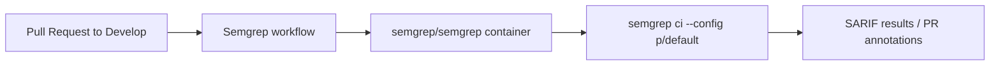

## Summary

Added a Semgrep SAST scanning GitHub Actions workflow at
`.github/workflows/semgrep.yml`. The workflow runs on every pull request
targeting `Develop`, executes inside the official `semgrep/semgrep` container,
and scans the repository with Semgrep's `p/default` ruleset. It only requests
`contents: read` and uses the optional `SEMGREP_APP_TOKEN` secret for Semgrep
AppSec Platform integration when available. Closes #2358.

## Evidence

This is a CI/configuration-only change with no runtime or UI surface, so
screenshots and benchmarks do not apply.

- YAML syntax validated by parsing the file with `@std/yaml` — produced the
  expected workflow structure (job `semgrep`, single `actions/checkout@v4` step,
  and a `semgrep ci --config p/default` run step).
- `pull_request.branches` targets `Develop` to match the existing repository
  convention (see `codeql.yml`, `quality.yml`).

## Test Plan

- [x] Validate `.github/workflows/semgrep.yml` parses as valid YAML.
- [x] Confirm `pull_request.branches` matches the repository convention
      (`Develop`).
- [x] Confirm `permissions.contents: read` (least privilege).
- [ ] On first PR run, verify the GitHub Actions UI shows the
      `Semgrep SAST scan` job executing the scan.
