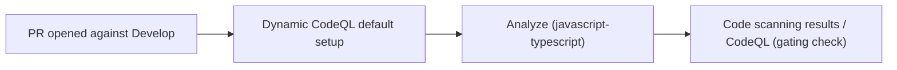

## Summary

Deleted `.github/workflows/codeql.yml` ("CodeQL Advanced") to remove the
duplicate `Analyze (javascript-typescript)` check that ran on every PR to
`Develop`. The repository will continue to be scanned by GitHub's default code
scanning setup (the dynamic `CodeQL` workflow registered by GitHub Advanced
Security), which produces the `Code scanning results / CodeQL` aggregated check
already required by branch protection. Closes #2391.

## Why this approach

The issue offered two options:

1. Delete the manual workflow and keep the GitHub default setup (chosen here).
2. Keep the manual workflow and disable the default setup via the repo Settings
   UI.

Option 1 was chosen because:

- It is a code change reviewable in this PR — option 2 is a UI/API action with
  no audit trail in the repo.
- The default setup is the GitHub-recommended path; it is auto-updated by GitHub
  and integrates natively with code scanning alerts.
- It leaves branch protection intact (`Code scanning results / CodeQL` continues
  to be the gating check).

## Evidence

Before this PR the same `Analyze (javascript-typescript)` check ran twice on
every PR — once from the deleted `codeql.yml` and once from the dynamic default
setup. After this PR only the dynamic default setup remains.

This is a CI/workflow-only change with no runtime code or UI affected, so no
screenshots or benchmarks apply.

## Test Plan

- [ ] After merge, open a PR against `Develop` and run
      `gh api repos/stSoftwareAU/NEAT-AI/commits/<sha>/check-runs` — verify
      exactly one `Analyze (javascript-typescript)` entry.
- [ ] Verify `Code scanning results / CodeQL` still runs and succeeds.
- [ ] Confirm the weekly scheduled scan continues via the dynamic default setup
      (no schedule was unique to the deleted manual workflow that is not also
      covered by the default setup's weekly scan).
- [x] `./quality.sh` passes locally — no source code paths were modified, only a
      workflow YAML was removed.
