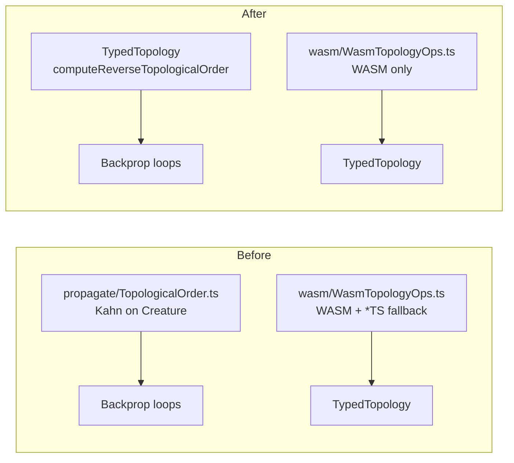

## Summary

Removed the redundant pure-TypeScript fallbacks for topology helpers now that
the NEAT-AI-core Rust implementations (`neat-core/src/topology_ops.rs`) own
these operations and ship in the vendored WASM bundle. The WASM bridge in
`src/wasm/WasmTopologyOps.ts` is now a thin set of wrappers around the core
exports, and the standalone Kahn-on-creature helper at
`src/propagate/TopologicalOrder.ts` has been deleted in favour of
`TypedTopology.computeReverseTopologicalOrder()`. Closes #2415.

## Evidence

This is a backend/refactor change with no UI surface. Verification:

- Targeted tests pass:
  - `test/wasm/WasmTopologyOps.ts` — 14/14 passed
  - `test/wasm/WasmStructuralValidation.ts` — 10/10 passed
  - `test/propagate/TopologicalBackpropagation.ts` — 10/10 passed
  - `test/propagate/WasmTopologicalBackprop.ts` — 6/6 passed
- Lint and format checks clean (`./quality.sh --lint-only`).
- Type-check clean (`./quality.sh --check-only`).

Behaviour parity is guaranteed by the issue premise: the WASM and TS paths must
have produced the same results, so removing the TS path leaves the single source
of truth (NEAT-AI-core) intact.

## Test Plan

- Removed `test/propagate/TopologicalOrder.ts` together with its source.
- Reworked `test/wasm/WasmTopologyOps.ts` and
  `test/wasm/WasmStructuralValidation.ts` to drop the `*TS` parity tests and
  keep the behavioural cases that exercise the WASM-backed API through
  `TypedTopology` and `Creature`. Edge cases that previously relied on
  hand-built typed arrays for `validateStructuralIntegrityTS` and
  `detectCyclesTS` are covered upstream in `neat-core/src/topology_ops.rs` at
  the pinned revision and need not be duplicated here.
- Added an explicit "outputs appear before producers" behavioural test for
  `computeReverseTopologicalOrder` covering the chain ordering that was
  previously verified through the deleted `TopologicalOrder.ts` tests.

## Files touched

- Source (5):
  - `src/wasm/WasmTopologyOps.ts` — removed `*TS` exports; WASM-only wrappers
    now throw a clear error when the bundle is missing.
  - `src/propagate/TopologicalOrder.ts` — deleted.
  - `src/propagate/TopologicalBackpropagation.ts` — calls
    `TypedTopology.fromCreature(creature).computeReverseTopologicalOrder()`.
  - `src/propagate/WasmTopologicalBackprop.ts` — same redirection.
  - `src/architecture/TypedTopology.ts` — JSDoc tweaks (no longer claims a TS
    fallback exists).
- Tests (3): `test/wasm/WasmTopologyOps.ts`,
  `test/wasm/WasmStructuralValidation.ts`, `test/propagate/TopologicalOrder.ts`
  (deleted).
- Bench (1): `bench/TopologicalBackpropProfile.ts` updated to use the
  WASM-backed order computation.
- Docs (1): `docs/WASM_RESIDENT_TOPOLOGY.md` — note the fallback removal.
