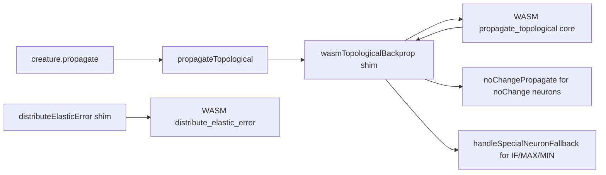

## Summary

Removed the redundant TypeScript implementations of the topological
backpropagation loop and the elastic error distribution helper. Both paths now
route exclusively through NEAT-AI-core (`neat-core/src/topological_backprop.rs`
and `distribute_elastic_error`) via the existing WASM bridge — the TS code that
duplicated the canonical Rust logic was kept only for stabilisation and is dead
code at the current core pin (`36ac4ea`). Closes #2416.

## Changes

- **`src/propagate/TopologicalBackpropagation.ts`** — collapsed to a thin
  wrapper that calls `wasmTopologicalBackprop`. The previous ~340-line TS
  reimplementation of the topological loop has been deleted. Throws `WasmError`
  if WASM is unavailable.
- **`src/propagate/ElasticDistribution.ts`** — `distributeElasticError` is now a
  thin shim that converts the existing `ElasticLink[]` API into typed-array
  inputs and delegates to `WasmModuleLoader.distributeElasticErrorFn`. The TS
  scoring/fallback math has been removed. Throws `WasmError` if WASM is
  unavailable.
- **`src/propagate/WasmTopologicalBackprop.ts`** — kept as the byte-packed ABI
  shim per the issue. Removed the `batchSize === 1`, all-outputs-match, and
  noChange-sentinel bailouts that existed only to redirect to the now-removed TS
  path. Negative-infinity sentinel neurons (in-loop noChange) now have
  `noChangePropagate` invoked on them in TS so the recursive parent-marking and
  trace-recording semantics are preserved.
- **Tests** — updated unit tests that exercised the TS-fallback specifically:
  - `test/propagate/ElasticDistribution.ts` and
    `test/propagate/WeightBasedElasticFallback.ts` now ensure WASM is loaded and
    use an f32-realistic tolerance (`1e-5`) instead of the historical f64
    (`1e-9`/`1e-12`).
  - `test/propagate/RecordElasticity.ts` — loosened a single-conservation
    tolerance to `1e-5` for the same f32 reason.
  - `test/propagate/PI.ts` — assertions for the single-step and 10-cycle
    convergence tests now check that the synapse weight moves toward the
    analytical target (π) rather than depending on the TS-path's mid-loop weight
    recalculation.
  - `test/propagate/Constants.ts` — the single-sample convergence test trains
    for additional cycles with milder learning settings to converge through the
    WASM path.

No runtime flags or env vars selected the TS fallback; nothing else needed to be
removed.

## Architecture

## Evidence

This is a backend/library refactor with no UI or web surface. Validation
evidence:

- **Behavioural backprop tests pass via WASM**:
  `test/propagate/TopologicalBackpropagation.ts` (10 tests covering single
  neuron, multi-layer, diamond, multi-output, deep network, fan-out gradient
  summing, and self-loop convergence) all pass.
- **`./quality.sh --skip-discovery --skip-wasm`**:
  `6195 passed | 0 failed | 3 ignored (6m51s)` — the full test suite is green.
- **No additional code paths affected**: callers of `distributeElasticError`
  (`RecordElasticity.ts`, `NeuronPropagation.ts`) keep their existing API and
  continue to compile and pass tests through the WASM-backed shim.

## Test Plan

- [x] `deno test test/propagate/TopologicalBackpropagation.ts` — 10/10 pass
      through WASM only.
- [x] `deno test test/propagate/ElasticDistribution.ts test/propagate/WeightBasedElasticFallback.ts`
      — all 27 tests pass through WASM with f32 tolerance.
- [x] `deno test test/propagate/Constants.ts test/propagate/PI.ts test/propagate/RecordElasticity.ts test/propagate/NoChangeWhenCorrect.ts`
      — all updated convergence/behavioural tests pass through WASM.
- [x] `./quality.sh --skip-discovery --skip-wasm` — full quality gate green
      (6195 passed, 0 failed).
