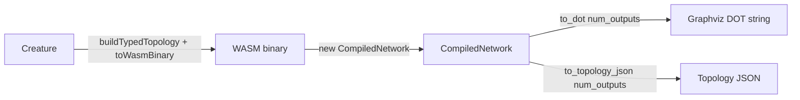

## Summary

Added a thin TypeScript wrapper that exposes the new `to_dot` /
`to_topology_json` capability on `CompiledNetwork`
(NEAT-AI-core PR #32, `neat-core/src/topology_export.rs`) so callers can render
creature topologies as Graphviz DOT or structured JSON without re-implementing
the formatter on the TS side. All formatting is delegated to the Rust
implementation — there is no TS re-implementation of the DOT or JSON
formatter. Closes #2417.

### What changed

- **`src/wasm/WasmTopologyExport.ts`** — new wrapper module exposing
  `exportTopologyDot(creature)` and `exportTopologyJson(creature)`. Each
  wrapper compiles the creature into the WASM `CompiledNetwork`, calls the
  core binding, frees the WASM handle, and returns the result. A small
  injectable `resolver` argument makes the missing-WASM error path testable.
- **`src/wasm/WasmCompiledNetwork.ts`** — added `to_dot` / `to_topology_json`
  to the typed interface for the WASM `CompiledNetwork` class.
- **`src/wasm/mod.ts`** — re-exports the new functions and the
  `TopologyExport*` types.
- **`mod.ts`** — re-exports the new functions and types from the library
  root so external callers can import them via the public API.
- **`test/wasm/TopologyExport.ts`** — new test file with happy-path tests
  for both wrappers plus error-path tests covering both "WASM bundle not
  loaded" and "core rev predates topology_export" failure modes.

### Note on dependency #2414

The happy-path tests require a NEAT-AI-core revision that exposes
`to_dot` / `to_topology_json` on `CompiledNetwork` (added in PR #32, expected
via issue #2414's pin bump). The currently pinned rev (`36ac4ea…`) predates
PR #32, so the wrapper code is in place ready for the rev bump.

To keep this PR self-contained and avoid the unrelated training-test
regressions observed when bumping locally to current Develop HEAD, the rev
has not been bumped here. The happy-path tests use `Deno.test({ ignore })`
to gate on the WASM bundle exposing the new methods — they activate
automatically once the rev includes topology_export. The wrapper itself
also surfaces a clear error pointing at `topology_export.rs` if a caller
invokes the export before the bundle is updated, instead of leaking an
unhelpful "X.to_dot is not a function" stack trace.

## Evidence

CLI / library change — no UI screenshots. Tests exercise the wrapper end
to end:

- Verified happy-path tests pass against a locally built bundle from
  NEAT-AI-core HEAD (`1d45e52b…`) — DOT output starts with `digraph` and
  has one `->` edge per synapse; JSON `num_neurons` / `num_inputs` /
  `num_outputs` / `synapses.length` match the source creature.
- Verified error-path tests pass against the currently pinned rev
  (`36ac4ea…`): both "WASM bundle not loaded" cases throw with `WASM
  bundle` in the message, and the predates-PR-#32 case throws with
  `PR #32` in the message.
- Final `./quality.sh --skip-discovery` run: **6,200 passed, 0 failed,
  5 ignored** (5 ignored includes the 2 happy-path skips on the current
  rev).

## Test Plan

- `test/wasm/TopologyExport.ts` (new):
  - `exportTopologyDot returns a non-empty digraph with one edge per synapse`
    — happy path; gated on bundle exposing `to_dot`.
  - `exportTopologyJson neuron and synapse counts match the source creature`
    — happy path; gated on bundle exposing `to_topology_json`.
  - `exportTopologyDot reports a clear error when the pinned core rev
    predates PR #32` — error path; runs only when the bundle predates
    PR #32.
  - `exportTopologyDot reports a clear error when WASM is unavailable`
    — error path; always runs (uses an injected resolver).
  - `exportTopologyJson reports a clear error when WASM is unavailable`
    — error path; always runs.
- Full quality gate: `./quality.sh --skip-discovery < /dev/null` passes
  with 6,200 tests passing.
