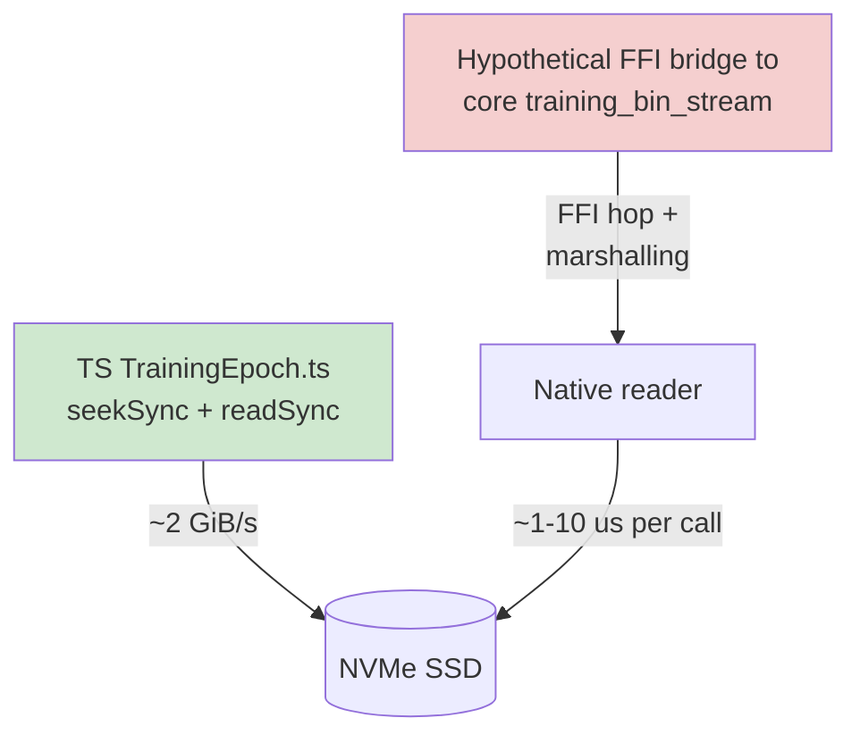

## Summary

Exploratory investigation of whether the TypeScript training binary readers
(driven from `src/architecture/training/TrainingEpoch.ts`) should delegate to
the new `training_bin_stream` module added in NEAT-AI-core PRs #28 / #29.
**Decision: no action.** Closes #2418.

Adds two artefacts only — **no production TypeScript is changed**:

- `bench/binaryFormat/TrainingEpochReader.ts` — baseline benchmark that mirrors
  the production per-record `seekSync` + `readSync` pattern (sequential pass +
  random-sample pass).
- `docs/issue-2418-training-bin-stream-investigation.md` — design note covering
  accessibility, integration shape, baseline numbers, and the "no action"
  decision.

## Evidence

Baseline benchmark over a 1 500 000-record / 3.63 GiB fixture (648 obs + 2 out
per record, 2 600 bytes/record), Apple Silicon, page cache warm by run 3:

```text
Pattern                      records         time  throughput
sequential seekSync run 1       1500000 records     2.033 s      737 758 rec/s    1829.3 MiB/s
sequential seekSync run 2       1500000 records     1.812 s      828 001 rec/s    2053.1 MiB/s
sequential seekSync run 3       1500000 records     1.534 s      978 064 rec/s    2425.2 MiB/s
random sample seekSync 1         200000 records     0.295 s      678 785 rec/s    1683.1 MiB/s
random sample seekSync 2         200000 records     0.298 s      672 067 rec/s    1666.4 MiB/s
random sample seekSync 3         200000 records     0.313 s      638 750 rec/s    1583.8 MiB/s
```

Why this rules out delegation:



- The pinned `wasm_activation/pkg/` bundle does **not** export
  `training_bin_stream` / `for_each_read_chunk` — verified by ripgrep of
  `wasm_activation.{js,d.ts}`. WASM in Deno cannot do synchronous file I/O on
  its own, so even an in-WASM reader would route every read through a JS host
  call.
- A Deno FFI bridge would add per-call overhead. The current Deno reader is
  already at hardware bandwidth (~2 GiB/s sequential), so there is no headroom
  for FFI to recover its own cost.
- Per-epoch I/O is not the bottleneck — activation, backprop, and discovery
  dominate by orders of magnitude.

Per project policy (Performance Task Workflow), no PR for a performance change
without before/after numbers; no measurable improvement is possible here. The
investigation artefacts are preserved in `docs/` and `bench/` for future
reference, and the issue is closed as `negative-result`.

## Test Plan

- [x] `deno fmt` clean on new bench + docs files.
- [x] `deno lint` clean on `bench/binaryFormat/TrainingEpochReader.ts`.
- [x] `deno check bench/binaryFormat/TrainingEpochReader.ts` passes.
- [x] Benchmark executes end-to-end and reports stable numbers across three runs
      of each pattern.
- [x] No production TypeScript files are modified (acceptance criterion of the
      exploratory issue).
