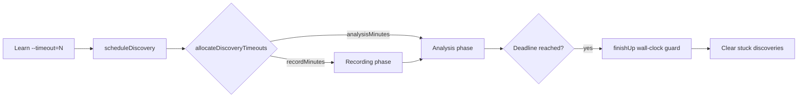

## Summary

`Learn.ts --timeout=N` was treated as a soft hint: discovery silently extended
the deadline, and `Neat.finishUp` fell back to a 20-generation wait when the
wall-clock deadline had already expired. The combination let one Learn run
exceed the requested wall-clock budget by 5–7×.

This PR makes the caller's `--timeout` a hard wall-clock ceiling for the
discovery + analysis pipeline and for the finish-up grace window. **Closes
#2432.**

Three concrete changes:

1. **Split discovery budget at scheduling time** — `scheduleDiscovery` now
   calls a new pure helper `allocateDiscoveryTimeouts(...)` that splits the
   caller's remaining wall-clock budget between the recording phase and the
   analysis phase. The `discoveryConfig` shipped to the worker overrides
   **both** `discoveryRecordTimeOutMinutes` and `discoveryAnalysisTimeoutMinutes`
   so `record + analysis ≤ wallClockBudget`. Previously only the recording
   timeout was clamped; analysis added up to a further 10 minutes on top.

2. **Wall-clock guard inside `finishUp`** — when `endTimeMS` is in the past
   the generation-count fallback now collapses to `1` generation (instead of
   silently using the historical default of `20`). The wait loop also rechecks
   `endTimeMS` on every call, so a deadline that expires *during* the wait
   forces the stuck discoveries to be cleared immediately rather than after
   another N generations.

3. **Adaptive timeout never grows the budget** — the existing
   `Math.min(timeOutMinutes, adaptiveTimeout)` shape is preserved (allocation
   uses the smaller of the two as the recording cap), so adaptive sizing can
   still shrink, but never extend, the caller's request.

## Behaviour change

Caller asks for `--timeout=9` (minutes), creature has ~2.7k neurons / ~41k
synapses, defaults `discoveryRecordTimeOutMinutes=5`,
`discoveryAnalysisTimeoutMinutes=10`:

| Phase                | Before this PR        | After this PR       |
| -------------------- | --------------------- | ------------------- |
| Recording cap        | 9m (wall-clock)       | 5m (config cap)     |
| Analysis cap         | +10m on top           | 4m (slack of 9m)    |
| **Total per discovery** | **up to 19m**     | **≤ 9m**            |
| `finishUp` after deadline | up to 20 gens     | 1 generation        |

## Evidence

CLI/library change, no UI to screenshot. Test results below verify the
behaviour:

## Test Plan

- `test/discovery/DiscoveryTimeout.ts` — added 7 tests covering
  `allocateDiscoveryTimeouts` (happy path, adaptive ceiling, generous budget,
  tight budget, zero/negative inputs, sub-minimum wall-clock).
- `test/NEAT/NeatFinishUp.ts` — added regression test
  `finishUp: clears stuck discoveries promptly when wall-clock deadline has passed`
  which fails against the unfixed code (it loops on the 20-generation fallback)
  and passes after the fix (cleared within a few generations).
- All existing tests (6218) continue to pass: `./quality.sh --skip-discovery
  --skip-wasm` is green.
