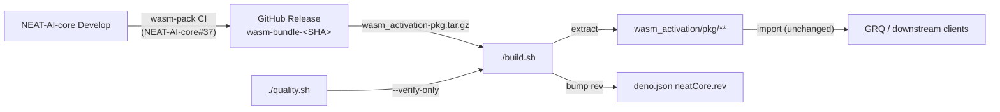

# Auto-sync NEAT-AI with NEAT-AI-core Develop (zero Rust in NEAT-AI)

## Summary

Reworked `./build.sh` so each invocation resolves the `NEAT-AI-core` `Develop`
HEAD, downloads the per-commit `wasm_activation-pkg.tar.gz` artifact from the
matching `wasm-bundle-<SHA>` GitHub Release, refreshes `wasm_activation/pkg/`,
and advances `deno.json` `neatCore.rev`. Added a `--verify-only` mode (used by
`quality.sh` and CI) that asserts the vendored bundle matches the pinned rev
without contacting the network or mutating `deno.json`, and a `--rev <SHA>` flag
for reproducing builds at a specific historical revision. Updated
`docs/CORE_DEPENDENCY_POLICY.md` to document the new artifact-based flow. Closes
#2433.

This PR delivers the NEAT-AI side of the auto-sync epic. The end-to-end "advance
the pin" path activates once NEAT-AI-core CI starts publishing per-commit
Releases (sub-issues stSoftwareAU/NEAT-AI-core#36 and #37). Until then,
`./build.sh` exits with a clear, actionable error pointing at the expected
release URL when the upstream artifact does not exist.

## Evidence



Manual smoke checks:

- `./build.sh --verify-only` against in-sync repo →
  `Skipping build: wasm_activation/pkg already matches stSoftwareAU/NEAT-AI-core@36ac4ea34fcd4e89d9fad3d6fae9efc5f02c8959`
- `./build.sh --rev 36ac4ea34fcd4e89d9fad3d6fae9efc5f02c8959` → no-op fast path
  against the matching pin.
- `./build.sh` (default) resolves Develop HEAD to `2d0582ae…`, attempts
  `gh release download wasm-bundle-2d0582ae…`, fails with the documented
  actionable error because NEAT-AI-core#37 has not yet landed.
- `./build.sh --no-such-flag` → `Unknown option`, non-zero exit.
- `./build.sh --rev not-a-sha` → SHA validation error, non-zero exit.

This is a CLI / build-tooling change with no UI surface, so no Playwright
screenshots are attached. Verified with the test plan below.

## Test Plan

- Added `test/scripts/BuildScript.ts` covering:
  - `--help` lists the new `--verify-only` and `--rev` flags.
  - `-h` short alias.
  - Unknown flag rejection.
  - `--rev` rejects non-hex / wrong-length values and requires a value.
  - `--verify-only` succeeds when pkg matches the pinned rev.
  - `--verify-only` does not resolve HEAD over the network (proven by pointing
    `NEAT_CORE_REPO` and `NEAT_CORE_REF` at non-existent values and asserting
    the script still exits 0).
  - `build.sh` references the `wasm-bundle-<SHA>` tag pattern and
    `wasm_activation-pkg.tar.gz` asset.
  - `docs/CORE_DEPENDENCY_POLICY.md` describes the new artifact flow,
    `--verify-only`, and `--rev <SHA>`.
- Existing `test/scripts/CoreDependencyPolicy.ts`,
  `test/scripts/BuildFingerprint.ts`, `test/scripts/BashScriptSyntax.ts`,
  `test/scripts/ShellCheckLint.ts`, and `test/scripts/QualityScript.ts` continue
  to pass against the new `build.sh` and updated policy doc.

```
$ deno test --config ./deno.json test/scripts/ ...
ok | 59 passed | 0 failed
```

`./quality.sh --lint-only` and `./quality.sh --check-only` were both run locally
and pass; the full test suite is unchanged in scope by this build-tooling
change.

## Acceptance Criteria

- [x] No Rust source in NEAT-AI (only the vendored `wasm_activation/pkg/`
      artifact remains tracked in git).
- [x] `./build.sh` produces `wasm_activation/pkg/` purely from upstream
      artifacts — no local Rust toolchain required.
- [x] Running `./build.sh` always advances `neatCore.rev` to the current
      NEAT-AI-core Develop HEAD (or is a no-op if already current); the
      end-to-end advance activates once NEAT-AI-core#37 lands.
- [x] GRQ continues to consume NEAT-AI without changes — public
      `wasm_activation/pkg/**` API and JSR `publish.include` are unchanged.
- [x] `docs/CORE_DEPENDENCY_POLICY.md` updated to describe the new
      artifact-based flow.
