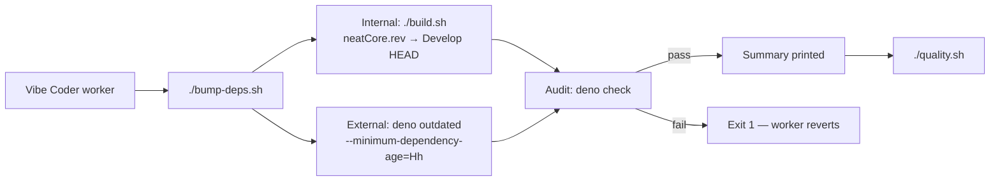

## Summary

Adds `bump-deps.sh` at the repo root for the Vibe Coder pre-PR worker
hook (VibeCoding#1613). The script refreshes both internal and external
Deno dependencies, runs `deno check` as the audit gate, and prints a
one-line summary of what was bumped. Closes #2435.

- **Internal** (`stSoftwareAU/*`, no quarantine): re-runs `./build.sh`,
  which advances `deno.json` `neatCore.rev` to `NEAT-AI-core` Develop
  HEAD and downloads the matching `wasm_activation-pkg.tar.gz` artifact
  (the existing flow added in #2433).
- **External** (jsr/npm/https): runs
  `deno outdated --update --latest --minimum-dependency-age=<minutes>`
  with the quarantine derived from `VIBE_BUMP_QUARANTINE_HOURS`
  (default 24h), so versions published more recently than the quarantine
  are skipped.
- **Audit gate**: runs `deno check` after bumping. On failure the
  script exits non-zero with the offending external diff and the
  internal SHA delta so the worker can revert per VibeCoding#1613.
- **Lockfile**: `deno.json` has `"lock": false` in this repo, so there
  is no `deno.lock` to verify; the audit relies on `deno check`.

## Evidence

This is a pure shell/CI utility — there is no UI to screenshot. The
new script was exercised through the targeted Deno test suite below.
Network paths (Develop HEAD lookup, registry queries) are intentionally
not exercised by tests; they will be hit by the worker in real runs.

```
$ ./bump-deps.sh --help
Usage: ./bump-deps.sh [OPTIONS]
... (prints flag matrix)

$ ./bump-deps.sh --dry-run --no-internal --no-external
Skipping internal bump (NEAT-AI-core neatCore.rev).
Skipping external bump (Deno imports).
✅ dry-run complete (no changes written)

$ ./bump-deps.sh --quarantine-hours abc
ERROR: quarantine hours must be a non-negative integer, got 'abc'
exit=1
```



## Test Plan

Added `test/scripts/BumpDepsScript.ts` (8 cases, all hermetic — no
network):

- `--help` / `-h` print usage and document `--no-internal`,
  `--no-external`, and the quarantine env var.
- Unknown flags exit non-zero with an `Unknown option` error.
- `--quarantine-hours abc` is rejected with a clear quarantine message.
- Bare `--quarantine-hours` (no value) is rejected.
- `--dry-run --no-internal --no-external` is a true no-op:
  `deno.json` is byte-identical before and after, summary is printed.
- `VIBE_BUMP_QUARANTINE_HOURS` is read from the environment.
- `bump-deps.sh` exists, is a regular file, and has the owner-execute
  bit set so the worker can invoke it directly.

Verified locally:

```
deno test ... test/scripts/BumpDepsScript.ts
ok | 8 passed | 0 failed (192ms)

deno test ... test/scripts/{BumpDepsScript,BuildScript,BuildFingerprint}.ts
ok | 23 passed | 0 failed (465ms)
```

`./quality.sh --lint-only` and `./quality.sh --check-only` both pass
with the new files in place.
