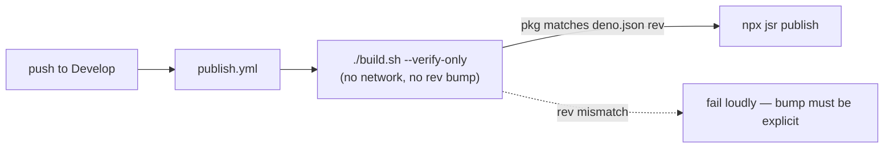

## Summary

Fixed the failing `publish` workflow by switching its WASM sync step from
`./build.sh` to `./build.sh --verify-only`. The bare invocation tried to resolve
`stSoftwareAU/NEAT-AI-core@Develop` HEAD via `gh api`, which fails in the
publish job because the default `GITHUB_TOKEN` only has access to the current
repo. The job logged:

```
Resolving stSoftwareAU/NEAT-AI-core@Develop HEAD...
ERROR: Could not resolve commit SHA for stSoftwareAU/NEAT-AI-core@Develop
Ensure 'gh auth status' is authenticated, or pass --rev <SHA>.
Error: Process completed with exit code 1.
```

`--verify-only` matches the CI policy in `docs/CORE_DEPENDENCY_POLICY.md` ("CI
MUST NOT advance `deno.json` `neatCore.rev` automatically") and mirrors what
`quality.yml` already does. The vendored `wasm_activation/pkg` is committed and
pinned by `deno.json neatCore.rev`, so verifying that pin is sufficient before
`npx jsr publish`.

Closes #2439.

## Evidence

CLI/CI change — no UI to screenshot. Verified by tests:

```
$ deno test test/scripts/PublishWorkflow.ts ...
publish.yml runs build.sh in verify-only mode ... ok
publish.yml does not auto-advance neatCore.rev ... ok
build.sh --verify-only is a no-op when vendored bundle matches pin ... ok
build.sh --verify-only does not resolve HEAD over the network ... ok
ok | 15 passed | 0 failed
```



## Test Plan

- Added `test/scripts/PublishWorkflow.ts` with two regression tests:
  - `publish.yml runs build.sh in verify-only mode` — asserts the exact
    `./build.sh --verify-only` invocation appears in the workflow.
  - `publish.yml does not auto-advance neatCore.rev` — asserts no bare
    `./build.sh` invocation remains, preventing future regressions.
- Existing `test/scripts/BuildScript.ts` tests continue to pass (notably
  `build.sh --verify-only does not resolve HEAD over the network`, which is
  exactly the property the publish job now relies on).
- Existing `test/scripts/CoreDependencyPolicy.ts` tests continue to pass.
