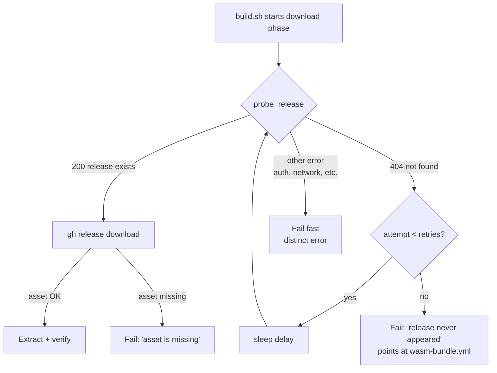

# build.sh: bounded retry for wasm-bundle release propagation race

## Summary

`build.sh` previously failed immediately if NEAT-AI-core's per-commit
`wasm-bundle-<SHA>` Release had not yet propagated. Because NEAT-AI-core's
`wasm-bundle.yml` workflow takes ~30–60 s to publish that Release after a
Develop merge, any NEAT-AI worker PR raised inside that window broke the
`bump-deps.sh -> build.sh` chain.

This change introduces a bounded probe-and-retry loop that fires **only** on the
"release not found" / 404 outcome. Every other error (auth, network, malformed
response) still fails fast. The download itself is unchanged — once the probe
confirms the release exists, the existing `gh release download` (with curl
fallback) runs once.

Retry knobs are overridable via env vars for tests and emergencies:

- `NEAT_CORE_BUNDLE_RETRIES` (default `5`)
- `NEAT_CORE_BUNDLE_RETRY_DELAY_SECONDS` (default `30`)

≈ 2.5 min total wait at defaults.

The final-failure error messages now distinguish the two failure modes the
worker log needs to act on:

- **Release never appeared** — points at the NEAT-AI-core `wasm-bundle.yml`
  workflow runs page and the missing tag URL, and surfaces the retry tunables.
- **Asset is missing** — release exists, but the `wasm_activation-pkg.tar.gz`
  asset could not be retrieved.

Closes #2449.

## Evidence

CLI-only change. The behaviour is verified by four new tests in
`test/scripts/BuildScriptRetry.ts` that drive `build.sh` end-to-end inside an
isolated tmp directory with a fake `gh` shim on `PATH`:

1. `build.sh retries 404 release-not-found and succeeds when release appears` —
   fake `gh` returns 404 for the first two probes, then succeeds; the download
   is invoked exactly once and the bundle is extracted into
   `wasm_activation/pkg/`.
2. `build.sh fails fast on non-404 probe error (auth) without retrying` — fake
   `gh` returns `HTTP 401`; the script exits non-zero after exactly one probe
   call, no download attempted.
3. `build.sh exhausts retries with a clear 'release never appeared' message` —
   exhausts `NEAT_CORE_BUNDLE_RETRIES=3`, asserts the final stderr names the
   `wasm-bundle-<SHA>` tag and the `wasm-bundle.yml` workflow page.
4. `build.sh validates NEAT_CORE_BUNDLE_RETRIES / DELAY env values fail fast` —
   non-positive / non-numeric tunables abort before any network attempt.

Quality gate (`./quality.sh --skip-discovery --skip-wasm`) green: 6212 tests
pass, 0 failed.

## Test Plan

- [x] `deno test test/scripts/BuildScriptRetry.ts` — all 4 new tests pass
- [x] `deno test test/scripts/BuildScript.ts` — 9 existing tests still pass
- [x] `bash -n build.sh` — syntax clean
- [x] `shellcheck --severity=warning build.sh` — no new warnings
- [x] `./quality.sh --skip-discovery --skip-wasm` — 6212 tests pass
