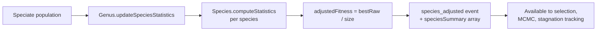

# NEAT: per-species adjusted-fitness telemetry (#2452)

## Summary

Adds the foundational instrumentation step for fitness sharing. Each `Species`
now exposes rolling statistics — `size`, `bestRawFitness`, `meanRawFitness`,
and `adjustedFitness` (best raw fitness divided by species size) — that
`Genus` recomputes once per generation as part of speciation, before parent
selection runs. The existing `species_adjusted` training event now carries a
deterministic `speciesSummary` array so downstream consumers (fitness sharing,
species stagnation tracking, diversity-aware MCMC) can read per-species
signals. No selection or breeding behaviour changes — this is pure
instrumentation and plumbing.

Closes #2452.

## Evidence

This is a backend/CLI change with no UI surface, so no screenshot is captured.
Verification was via the unit tests below plus the full quality gate:

- `./quality.sh --skip-discovery --skip-wasm` — **6237 passed, 0 failed,
  4 ignored** (lint, format, type-check, all tests in parallel).
- The pre-existing breeding/mutation suites (`test/breed/*`,
  `test/NEAT/Mutation.ts`, `test/NEAT/MutatorMutate.ts`,
  `test/NEAT/Evolve.ts`, etc.) continue to pass unchanged, demonstrating no
  behavioural change in selection or breeding.

## Test Plan

New unit tests in `test/NEAT/SpeciesStatistics.ts`:

- `Species.computeStatistics - adjusted fitness equals raw / speciesSize` —
  asserts that for a multi-member species, `adjustedFitness` equals
  `bestRawFitness / size`, plus correct mean and best across members.
- `Species.computeStatistics - size 1 species: adjusted equals raw` —
  asserts the acceptance-criterion property that a size-1 species has
  `adjustedFitness === bestRawFitness === rawFitness`.
- `Species.computeStatistics - non-finite scores are skipped` — guards
  against `-Infinity` scores from WASM-panicked creatures poisoning the
  mean.
- `Genus.updateSpeciesStatistics - builds a multi-species summary` —
  builds a multi-species fixture population (TANH and LOGISTIC squashes
  to drive distinct species keys) and verifies the per-species summary
  values.
- `Genus.speciesSummary - sorted deterministically by speciesKey` —
  asserts deterministic ordering for stable downstream consumption.
- `Species statistics persist across an evolution generation round-trip` —
  drives a real `evolveDataSet` cycle, captures every emitted
  `species_adjusted` event, and asserts the `speciesSummary` is present,
  matches `speciesCount`, and that `adjustedFitness === bestRawFitness /
  size` for every entry.
