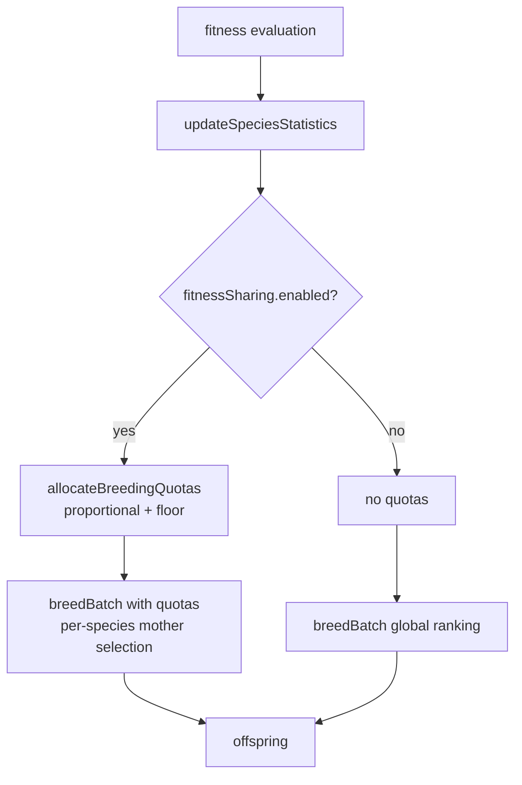

# NEAT: fitness sharing in parent selection and per-species breeding quotas

## Summary

Apply standard NEAT fitness sharing (Stanley & Miikkulainen, 2002) on top of the
per-species adjusted-fitness telemetry added in #2452. Mother selection now
ranks creatures by **adjusted fitness** (`raw / speciesSize`) and breeding slots
are allocated to species in proportion to their summed adjusted fitness, with a
`minSpeciesSlots` floor so a numerous species cannot starve a small but novel
niche. A new `fitnessSharing: { enabled, minSpeciesSlots }` config flag (default
`enabled: true`, `minSpeciesSlots: 1`) gates the behaviour; setting
`enabled: false` restores the previous raw-fitness-only path. Closes #2453.

## Changes

- New `src/config/FitnessSharingConfig.ts` and parser in
  `src/config/parsers/PopulationParsers.ts`; wired through
  `NeatOptions`/`NeatArguments`/`NeatConfig`.
- `src/breed/FitnessRanking.ts` accepts an optional `adjustedScores` map and
  ranks/selects against those values when present (raw-fitness fallback per
  creature).
- `src/breed/ParentSelection.ts` exposes `buildAdjustedFitnessMap(genus)` which
  divides each creature's raw fitness by its species size.
- `src/breed/Breed.ts` and `src/breed/ParallelBreeding.ts` build the global
  ranking with adjusted scores when fitness sharing is enabled.
- `src/breed/ParallelBreeding.ts#breedBatch(count, speciesQuotas?)` now accepts
  an optional per-species quota map; mothers are then drawn from a per-species
  `FitnessRanking` (within a species, raw and adjusted produce identical
  proportional weights).
- New `src/NEAT/BreedingQuotas.ts` with
  `allocateBreedingQuotas(genus,
  totalSlots, minSpeciesSlots)` — proportional
  allocation rounded with largest-fractional-part-first remainder distribution
  and a per-species floor.
- `src/NEAT/NeatEvolution.ts` computes quotas once per generation and passes
  them to `breedBatch`.

## Evidence

Backend/CLI change — no UI to screenshot. Verified by tests and the full
`./quality.sh` run.

### Tests added (`test/breed/FitnessSharing.ts`)

1. **Adjusted ranking gives lone creature ≥ 1 in 5 selections** — two species
   (sizes 9 and 1, equal raw fitness) over 2 000 trials. Confirms adjusted
   fitness ranking lifts the lone creature well above the raw-fitness baseline.
2. **Quota allocation matches proportional shares within ±1** — three species in
   5:3:2 fitness ratio.
3. **`minSpeciesSlots` is enforced even for tiny adjusted fitness** — a dominant
   species plus a near-zero species; floor still applies and total slots match
   the request.
4. **`fitnessSharing.enabled = false` restores raw-fitness behaviour** —
   regression test, lone creature wins ~10% as before.
5. `buildAdjustedFitnessMap` divides raw score by species size.
6. Empty quota map for zero slots.
7. Default config has `enabled: true`, `minSpeciesSlots: 1`.
8. Override path honours user-supplied `enabled: false` and
   `minSpeciesSlots: 3`.

### Test plan

- [x] `deno test` covers the eight new cases above plus the existing
      FitnessRanking, ParentSelection, Breed, ParallelBreeding, Genus and
      SpeciesStatistics suites.
- [x] `./quality.sh --skip-discovery --skip-wasm` — 6 255 tests pass, 0
      failures, 4 ignored.
