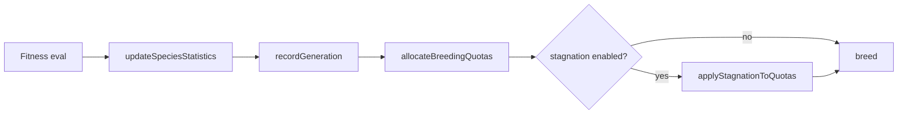

## Summary

Adds per-species stagnation detection so evolution can reclaim breeding
budget from species that have stopped improving and redirect it to
species that are still progressing. Closes #2454.

A new `SpeciesPlateauDetector` tracks the high-water best raw fitness
per species across generations. When a species fails to improve for
`haltWindow` generations (default 15) it is classified as **halted**
and its breeding share is halved. After `extinctionWindow` generations
(default 25) it is classified as **extinct** and dropped from the
breeding pool entirely; its members may still survive via elitism but
contribute no offspring. Reclaimed slots are redistributed
proportionally to the remaining (still-progressing) species using the
largest-fractional-part rule from `BreedingQuotas`, preserving the
total breeding budget.

## Evidence

CLI/library change with no UI surface — verified via unit tests in
`test/NEAT/SpeciesPlateauDetector.ts` and the full
`./quality.sh --skip-discovery --skip-wasm` suite (6265 passed, 0
failed). New tests cover the three issue scenarios (halve at
`haltWindow`, drop at `extinctionWindow`, disabled flag is a no-op)
plus pruning and non-finite-fitness edge cases.

## Test Plan

- [x] `test/NEAT/SpeciesPlateauDetector.ts` — 10 new tests:
  - active when fitness improves each generation
  - status flips to halted at `haltWindow`
  - status flips to extinct at `extinctionWindow`
  - improvement resets the stagnant counter
  - `applyStagnationToQuotas` halves a halted species' breeding share
  - extinct species lose all slots; survivors absorb the share
  - extinct slots split proportionally across multiple active species
  - disabled flag is a no-op (regression test)
  - `pruneAbsent` drops history for species missing from the genus
  - non-finite fitness does not advance stagnation
- [x] Existing `test/NEAT/SpeciesStatistics.ts`, `Genus.ts`, `Species.ts`,
  `PlateauDetection.ts`, `NeatConfig.ts`, `NeatEvolve.ts` — all pass
  unchanged.
- [x] `./quality.sh --skip-discovery --skip-wasm` — 6265 passed,
  0 failed.
