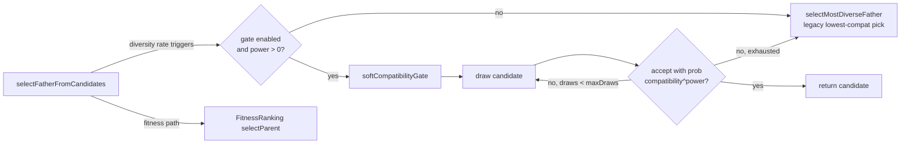

## Summary

Replace the hard "lowest-compatibility father" pick on the diversity-driven
breeding path with a soft probabilistic gate so cross-species pairings
happen at a frequency that matches their compatibility — favouring
similar architectures while still allowing rare exploratory hybrids.
The previous behaviour (always pick the most genetically distant
candidate) empirically produces weak hybrids; the soft gate accepts each
candidate with probability `compatibility ^ power` and falls back to the
lowest-compatibility candidate after `maxDraws` rejections so selection
always terminates.

Closes #2455.

## Changes

- **`src/config/CompatibilityGatingConfig.ts`** (new) — adds the
  `CompatibilityGatingConfig` type, `RequiredCompatibilityGatingConfig`,
  and `DEFAULT_COMPATIBILITY_GATING_CONFIG` (`enabled: true`,
  `power: 1.5`, `maxDraws: 3`).
- **`src/config/NeatArguments.ts`** — adds the `compatibilityGating`
  field with documentation describing intent, defaults, and the
  `power: 0` / `enabled: false` fallback semantics.
- **`src/config/NeatOptions.ts`** — adds the partial-override input
  type for `compatibilityGating` to both `NeatOptions` and
  `NeatOptionsInput` (with `CoerceNumeric<>` for CLI string inputs).
- **`src/config/parsers/PopulationParsers.ts`** — adds
  `parseCompatibilityGating()` to merge user overrides over the
  defaults with bounded numeric validation.
- **`src/config/NeatConfigParsers.ts`** — re-exports the new parser.
- **`src/config/NeatConfig.ts`** — wires the parser into
  `createNeatConfig()`.
- **`src/breed/ParentSelection.ts`** — adds `softCompatibilityGate()`
  (the new probabilistic gate) and routes
  `selectFatherFromCandidates()` through it on the diversity-driven
  path when the gate is enabled and `power > 0`. When disabled or
  `power === 0`, selection falls through to the legacy
  `selectMostDiverseFather()` (lowest-compat pick) — exactly the prior
  behaviour. A short comment next to the implementation explains why
  the soft gate is preferred over a hard threshold.

## Evidence

This change is purely backend — no UI to screenshot. Verification is
via the new unit tests plus the full quality gate.

## Test Plan

- `test/breed/CompatibilityGating.ts` (new) covers the three scenarios
  required by the issue:
  - **`power: 0` regression** — with the gate active but `power: 0`,
    diversity-driven selection falls through to the legacy lowest-compat
    pick, exactly matching the prior selection distribution across 25
    repeated draws on a candidate pool spanning the full compatibility
    range.
  - **`enabled: false` regression** — same legacy behaviour is restored
    when the gate is disabled.
  - **`power: 2` distribution** — across 600 seeded draws on a
    16-candidate pool (8 high-compat, 8 low-compat), high-compat
    fathers are selected ≥3× more often than low-compat fathers.
  - **`maxDraws` fallback** — when every candidate has compatibility 0,
    the gate exhausts `maxDraws` rejections and returns the
    lowest-compat candidate (the bounded fallback path).
  - Plus default-value sanity checks (`enabled: true`, `power: 1.5`,
    `maxDraws: 3`).
- `./quality.sh --skip-discovery --skip-wasm` passes (6271 tests).
- Existing `test/breed/DiversityBreeding.ts` and `test/breed/ParentSelection.ts`
  continue to pass — no behaviour change on the standard fitness path.
