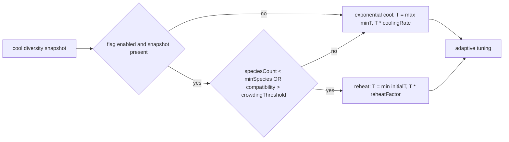

# Diversity-aware MCMC temperature curriculum (#2456)

## Summary

Couples the MCMC cooling schedule in `MCMCState` to the live diversity signal so
that temperature reheats when species count collapses or the population becomes
overcrowded within species, and follows the standard exponential schedule
otherwise. Closes #2456.

The cool step now accepts an optional `DiversitySnapshot` (`speciesCount`,
`meanWithinSpeciesCompatibility`). When `diversityAwareMCMC.enabled` is true and
either branch crosses its threshold, temperature is multiplied by `reheatFactor`
(default 1.5) and clamped to `initialTemperature`. When the flag is disabled, or
the snapshot is omitted, the pre-#2456 exponential schedule applies unchanged.

## Changes

- `src/config/MCMCConfig.ts` — added `DiversityAwareMCMCConfig`,
  `RequiredDiversityAwareMCMCConfig`, and `DEFAULT_DIVERSITY_AWARE_MCMC_CONFIG`.
  Nested `diversityAwareMCMC` field on `MCMCConfig`. Defaults: `enabled=true`,
  `minSpecies=4`, `crowdingThreshold=0.85`, `reheatFactor=1.5`.
- `src/config/parsers/MutationParsers.ts` — new `parseDiversityAwareMCMC`
  parser; `parseMcmc` now returns the nested block.
- `src/NEAT/MCMCState.ts` — `cool(verbose, diversity)` overload, reheat branch,
  `didReheatLastGeneration()`, `getLastDiversitySnapshot()`.
- `src/NEAT/NeatEvolution.ts` — feeds `genus.speciesMap.size` into the cool step
  each generation when MCMC is enabled.
- `mod.ts` — re-exports the new config types and default constant.

## Reheat decision flow

## Evidence

Backend / library change with no UI surface — verified via unit tests
(`test/NEAT/MCMCDiversityAware.ts`, 10 cases) and the existing `MCMCState`
regression suite. `./quality.sh --skip-discovery --skip-wasm` passes: 6247
tests, 0 failed.

## Test Plan

- `test/NEAT/MCMCDiversityAware.ts` — new file:
  - Healthy population follows exponential decay, no reheat flagged.
  - Species collapse below `minSpecies` triggers reheat by `reheatFactor`.
  - Crowding above `crowdingThreshold` triggers reheat.
  - Reheat is capped at `initialTemperature`.
  - Disabled flag preserves the exponential schedule exactly even with a
    collapsing snapshot (regression test).
  - Omitted snapshot leaves the exponential schedule untouched.
  - Either branch alone is enough to trigger reheat.
  - Repeated reheat after long cooling never exceeds `initialTemperature`.
  - `getLastDiversitySnapshot()` exposes the most recent snapshot; `reset()`
    clears it.
  - Reheated temperature still respects the `minTemperature` floor on subsequent
    cooling.
- `test/config/MCMCConfigDocumentation.ts` — extended to assert the new defaults
  and the `diversityAwareMCMC` field in the typed config.
- `test/NEAT/MCMCState.ts` — existing tests still pass (no behavioural
  regression).

## Acceptance Criteria

- [x] `MCMCState.cool()` accepts a diversity snapshot and reheats when diversity
      drops below threshold.
- [x] Temperature is bounded by `initialTemperature` from above and
      `minTemperature` from below.
- [x] Disabling the flag preserves the existing exponential schedule exactly
      (regression test).
- [x] New unit tests cover the three required scenarios (healthy / crowding /
      disabled) plus edge cases.
- [x] `./quality.sh` passes.
