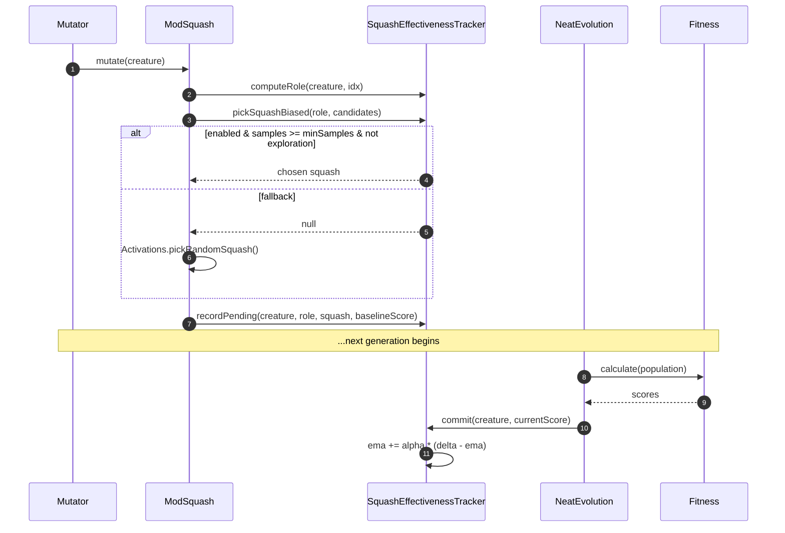

# Fitness-driven squash mutation via per-role activation histogram

## Summary

Bias squash-function mutation toward activations that have historically improved
fitness in similar neuron roles. A new `SquashEffectivenessTracker` records
exponential-moving-average fitness deltas keyed by `(layerBucket, fanInBucket)`
and `ModSquash` consults the tracker for a Boltzmann-weighted draw — falling
back to the existing uniform pool when biasing is disabled, the role lacks
samples, or the exploration draw fires.

Closes #2457.

## Evidence

This is a backend mutation-policy change with no UI surface. Verification is via
the new unit tests in `test/NEAT/SquashEffectivenessTracker.ts` (14 cases, all
passing) and a clean run of the full quality gate.



### Quality gate

`./quality.sh --skip-discovery --skip-wasm` → **6226 passed | 0 failed | 5
ignored**.

## Test Plan

New file `test/NEAT/SquashEffectivenessTracker.ts` covers the three acceptance
scenarios from the issue and additional unit-level cases:

- `enabled=false` — `pickSquashBiased` returns `null` so callers fall back to
  uniform sampling (regression guard) and ModSquash actually exposes multiple
  distinct squashes when run repeatedly.
- Biased deltas — feeding RELU consistently positive deltas leads to RELU
  dominating biased draws by at least `1 - explorationWeight` of the time.
- `minSamples` gate — until `minSamples` samples have been recorded,
  `pickSquashBiased` returns `null` regardless of EMA values.
- EMA / commit semantics — `commit` applies `currentScore - baseline` when a
  baseline is present, returns `false` when nothing is pending, and ignores
  non-finite scores.
- Role bucketing — output neurons map to `output-adjacent`; fan-in buckets
  follow the configured low/high thresholds.
- ModSquash integration — pending entries are recorded when the tracker is
  enabled and never recorded when it is disabled; squashes produced by ModSquash
  always resolve in the `Activations` registry; the operator can be constructed
  without a tracker for standalone use.

## Implementation notes

- **Role** = `(layerBucket × fanInBucket)` where `layerBucket` ∈
  `{input-adjacent, mid, output-adjacent}` and `fanInBucket` ∈
  `{low, medium, high}`. Output neurons are always `output-adjacent`; hidden
  depth is computed via the existing `computeLayerAssignments`. Fan-in is
  `inwardConnections(idx).length`.
- **Sampling** uses `w_i = exp(beta * ema_i)` with a configurable
  inverse-temperature `boltzmannBeta` (default 25) so small fitness deltas
  typical of NEAT runs still concentrate draws on the favoured squash, matching
  the example in the issue (RELU at +0.1 vs 0 alternatives picks RELU ≥
  `1 - explorationWeight` of the time).
- **Pending → commit pipeline.** `ModSquash` records a
  `WeakMap<Creature, PendingEntry>` after a successful mutation, capturing
  `(role, newSquash, baselineScore)`. The next generation's evolution loop calls
  `tracker.commit(creature, currentScore)` after fitness evaluation; the EMA is
  updated with `currentScore - baseline` (or the absolute fitness when no
  baseline exists, e.g. fresh offspring).
- The tracker is owned by `Neat` so its histogram persists across generations
  within a run. The `Mutator` accepts it via constructor; when omitted, the
  `Mutator` constructs an internal tracker from `config.squashEffectiveness` so
  single-population callers (e.g. `populatePopulation`) continue to work.

## Configuration

```ts
squashEffectiveness: {
  enabled: true,         // default
  minSamples: 20,        // default
  explorationWeight: 0.2, // default
  emaAlpha: 0.2,         // default
  boltzmannBeta: 25,     // default
  fanInLowThreshold: 3,  // default
  fanInHighThreshold: 8, // default
}
```

## Files

- New: `src/config/SquashEffectivenessConfig.ts`,
  `src/NEAT/SquashEffectivenessTracker.ts`,
  `test/NEAT/SquashEffectivenessTracker.ts`, `docs/pr-summary-2457.md`.
- Modified: `src/mutate/ModSquash.ts`, `src/NEAT/Mutator.ts`,
  `src/NEAT/Neat.ts`, `src/NEAT/NeatEvolution.ts`,
  `src/config/NeatArguments.ts`, `src/config/NeatOptions.ts`,
  `src/config/NeatConfig.ts`, `src/config/NeatConfigParsers.ts`,
  `src/config/parsers/MutationParsers.ts`.
