# Diagnose WASM `propagate_topological` `RuntimeError: unreachable` trap

Closes #2461.

## Summary

Diagnosed the `RuntimeError: unreachable` trap inside `propagate_topological`
that surfaced after the NEAT-AI-core bump from `36ac4ea3` → `1d45e52b`
(NEAT-AI commit `408021f9`). The regression is caused by a binary ABI
mismatch between the TypeScript encoder
(`src/propagate/WasmTopologicalBackprop.ts`) and the Rust decoder
(`neat-core/src/wasm_exports.rs`) introduced in NEAT-AI-core commit
**`142860e` — Annotate CompiledNetwork, PredictiveCodingEngine, and free
functions with `#[wasm_bindgen]` (#36)**.

This change is purely diagnostic — no TypeScript source is modified, and the
pinned `neatCore.rev` stays on the working baseline `36ac4ea3`. The fix lives
in NEAT-AI-core (issue `#2460-fix-core`).

## Diagnosis

### Bisect findings

| Pin                  | Test result | Notes                                         |
| -------------------- | ----------- | --------------------------------------------- |
| `36ac4ea3` (baseline) | ✅ pass     | current `deno.json` pin                       |
| `b562de1` (earliest published bundle) | ❌ trap | `RuntimeError: unreachable` at `wasm:1:184056` |
| `1d45e52b` (post-bump) | ❌ trap   | identical trap stack and offset             |

`wasm-bundle-<SHA>` releases only exist for `b562de1` onwards (the
`wasm-bundle.yml` workflow was added in that very commit). Earlier commits in
the 15-commit range cannot be bisected via prebuilt bundles. Static
inspection of the NEAT-AI-core tree narrows the regression to `142860e`:

- Before `142860e`, `neat-core/Cargo.toml` declares `crate-type = ["lib"]`
  only — the crate cannot produce a `cdylib` and `wasm-pack build neat-core`
  would not link. There is no `propagate_topological` `#[wasm_bindgen]` entry
  point anywhere in the crate.
- `142860e` adds `crate-type = ["cdylib", "rlib"]`, the `wasm_exports.rs`
  module, and the `#[wasm_bindgen(js_name = propagate_topological)]` shim
  that decodes the byte-packed buffer NEAT-AI sends.

### Root cause: byte-packed ABI contract mismatch

`wasm_exports.rs` mirrors the buffer layout from `WasmTopologicalBackprop.ts`
but with two off-by-N constants:

| Section            | TypeScript writes                  | Rust reads                          |
| ------------------ | ---------------------------------- | ----------------------------------- |
| Header             | `HEADER_SIZE = 36` bytes           | `HEADER_BYTES = 40` bytes           |
| Per-neuron record  | `NEURON_STRIDE = 24` bytes         | `NEURON_RECORD_BYTES = 20` bytes    |
| `adjusted_bias`    | `f32` written as last 4 bytes      | not read; `adjusted_bias = 0.0`     |

Once the header offset is 4 bytes ahead of the data and each neuron record
is 4 bytes short, the synapse and inward-mapping sections are interpreted
against shifted offsets. The decoded `from`/`to` indices reach values
outside the synapse and reverse-topo arrays, and Rust's bounds check on
`reverse_topo_order[..]` and friends panics — which compiles to
`unreachable` in WebAssembly. The deeper the loop goes (more reverse-topo
entries, more inward connections), the more reliably it traps, which is why
the standalone single-input repro passes but a 100-sample training cycle
traps every run.

### Trap stack (pin `1d45e52b`)

```
RuntimeError: unreachable
  wasm_activation_bg.wasm:1:184056   ← inside propagate_topological_loop
  wasm_activation_bg.wasm:1:198533
  wasm_activation_bg.wasm:1:314079
  propagate_topological            (wasm_activation.js)
  wasmPropagateTopological         (src/wasm/WasmStandaloneFunctions.ts:601)
  wasmTopologicalBackprop          (src/propagate/WasmTopologicalBackprop.ts:289)
  propagateTopological             (src/propagate/TopologicalBackpropagation.ts:40)
```

This is the exact offset reported in #2460/#2461 — the diagnosis matches
the field telemetry.

## Evidence

### Minimal deterministic reproducer

`docs/evidence/2461-repro.ts` — a single-file Deno script that builds a
5-input / 4-hidden / 2-output creature with `MAXIMUM` output activations,
runs 100 forward+backward propagation samples, and either trips the
`unreachable` trap (against pin `1d45e52b`) or prints `OK — ...` (against
pin `36ac4ea3`).

```bash
# Reproduces the trap deterministically
./build.sh --rev=1d45e52bc4d15ed1f4c0435ca8bbdd20b78a64c4
deno run -A docs/evidence/2461-repro.ts
# → Uncaught (in promise) RuntimeError: unreachable
#     wasm_activation_bg.wasm:1:184056
#     ...
#     wasmPropagateTopological      (src/wasm/WasmStandaloneFunctions.ts:601)

# Passes against the working baseline
./build.sh --rev=36ac4ea34fcd4e89d9fad3d6fae9efc5f02c8959
deno run -A docs/evidence/2461-repro.ts
# → OK — propagate_topological returned without trapping
```

### Existing tests that already exercise the trap

Of the 22 distinct WASM `unreachable` traps observed running
`deno test 'test/propagate/**/*.ts'` against pin `1d45e52b`,
`test/propagate/Maximum.ts` is the smallest single-test reproducer (one
test, ~30 ms wall-clock). It uses the same 5-input / 4-hidden / 2-output /
`MAXIMUM` shape as the repro script and traps on the very first
`creature.propagate(...)` call.

### Bisect flow

```mermaid
flowchart LR
  A[Bump deno.json pin to 1d45e52b] --> B[Maximum.ts traps with 184056]
  B --> C[Restore pin to 36ac4ea3]
  C --> D[Maximum.ts passes]
  D --> E[Try earliest bundle b562de1]
  E --> F[Also traps with 184056]
  F --> G[Inspect NEAT-AI-core git history]
  G --> H[142860e introduces wasm_exports.rs<br/>+ propagate_topological #wasm_bindgen]
  H --> I[Compare TS encoder vs Rust decoder constants]
  I --> J[HEADER 36 vs 40 bytes<br/>NEURON_STRIDE 24 vs 20 bytes]
  J --> K[Root cause = ABI mismatch in 142860e]
```



## Test Plan

- [x] `./build.sh --rev=1d45e52bc4d15ed1f4c0435ca8bbdd20b78a64c4 && deno run -A docs/evidence/2461-repro.ts` — traps with `RuntimeError: unreachable` at `wasm:1:184056`.
- [x] `./build.sh --rev=36ac4ea34fcd4e89d9fad3d6fae9efc5f02c8959 && deno run -A docs/evidence/2461-repro.ts` — prints `OK — propagate_topological returned without trapping`.
- [x] `deno test -A --no-check test/propagate/Maximum.ts` — passes against the baseline pin.
- [x] `./quality.sh --check-only` — passes (no TS-side changes).

## Hand-off to `#2460-fix-core`

The fix needs to live in NEAT-AI-core's `neat-core/src/wasm_exports.rs` and
must do one of:

1. **Preferred** — read `adjusted_bias` from the 5th `f32` of each neuron
   record, set `NEURON_RECORD_BYTES = 24`, and set `HEADER_BYTES = 36` to
   match the TS encoder. The TS layout is the canonical contract (it is
   what production has used since Issue #1954).
2. Or change the TS encoder to match the current Rust layout (40-byte
   header, 20-byte per-neuron record without `adjusted_bias`). This
   requires retrieving `adjusted_bias` separately at the boundary, which is
   strictly more work and breaks the `WasmTopologicalBackprop.ts` contract
   in `mod.ts`.

A regression test covering at least the 5-input / `MAXIMUM` shape from
`docs/evidence/2461-repro.ts` should land alongside the core fix to prevent
this drift recurring.
