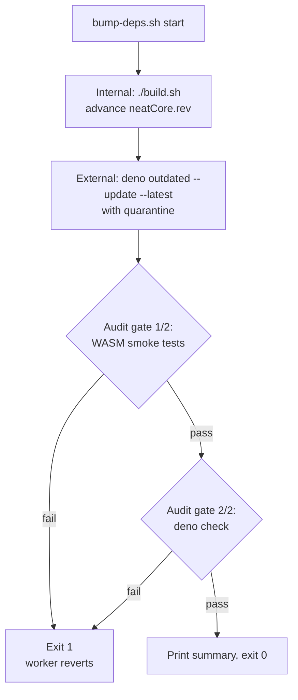

# PR Summary — Issue #2465

## Summary

Strengthen the `bump-deps.sh` audit gate with a WASM smoke test step so a
freshly bumped WASM bundle that traps at runtime (e.g.
`RuntimeError: unreachable` inside `propagate_topological`) cannot reach `main`
silently. The previous single-phase gate ran only `deno check`, which catches
type errors but not runtime traps — the root cause of Issue #2460's 120 silent
test failures.

The gate is now two-phase: first a small, fast `deno test` subset over the WASM
hot paths, then the existing `deno check`. Either failing fails the script with
exit 1 so the worker reverts per the VibeCoding#1613 contract.

Closes #2465.

## Evidence

This is a backend / shell change with no UI surface.

### Audit gate flow



The smoke specs cover the WASM `propagate_topological`,
`wasmTopologicalBackprop`, and `compute_score_components` paths:

- `test/propagate/WasmTopologicalBackprop.ts`
- `test/propagate/SingleNeuron.ts`
- `test/propagate/TopologicalBackpropagation.ts`

### Acceptance evidence

- `bump-deps.sh --help` documents the new gate and the `--skip-smoke` escape
  hatch.
- A live run with both bumps skipped completes within the documented time
  budget:

  ```
  Skipping internal bump (NEAT-AI-core neatCore.rev).
  Skipping external bump (Deno imports).
  Audit gate (1/2): WASM smoke tests...
  Audit gate (2/2): running 'deno check'...
  ✅ no bumps — dependencies already current
  ```

- A run against a deliberately-broken smoke spec list exits non-zero with a
  clear message identifying the smoke gate as the cause:

  ```
  Audit gate (1/2): WASM smoke tests...
  error: Import 'file:///.../test/propagate/_DOES_NOT_EXIST.ts' failed, not found.

  ERROR: WASM smoke audit gate failed (exit 1).
         Specs:
           - test/propagate/_DOES_NOT_EXIST.ts
           - test/propagate/SingleNeuron.ts
           - test/propagate/TopologicalBackpropagation.ts
  Worker should revert per VibeCoding#1613.
  exit: 1
  ```

  This same code path fires when a WASM bundle traps at runtime — the
  `deno test` invocation returns non-zero and is reported as a smoke-gate
  failure, not a `deno check` failure.

- `AGENTS.md` documents the gate alongside the existing WASM-only operations
  section.

## Test Plan

Tests added to `test/scripts/BumpDepsScript.ts`:

- `bump-deps.sh --help documents the WASM smoke audit gate (Issue #2465)` —
  asserts `--help` mentions "smoke", "WASM", and `--skip-smoke`.
- `bump-deps.sh accepts --skip-smoke under --dry-run (Issue #2465)` — confirms
  the flag is parsed and is a no-op under `--dry-run`.
- `bump-deps.sh --dry-run announces the smoke audit gate (Issue #2465)` —
  confirms dry-run output mentions the smoke gate.

All 11 tests in `BumpDepsScript.ts` pass:

```
ok | 11 passed | 0 failed (285ms)
```

The existing 8 tests are untouched; existing behaviour (flag parsing, quarantine
validation, dry-run hermetic) is preserved.

### Manual verification

| Scenario                                | Expected                             | Observed |
| --------------------------------------- | ------------------------------------ | -------- |
| `--help`                                | mentions smoke, WASM, `--skip-smoke` | ✅       |
| `--dry-run --no-internal --no-external` | announces smoke gate                 | ✅       |
| `--dry-run --skip-smoke`                | announces skip                       | ✅       |
| Live run, no bumps                      | both gates run, exit 0               | ✅       |
| Live run, broken smoke spec             | exits 1, names smoke gate            | ✅       |
