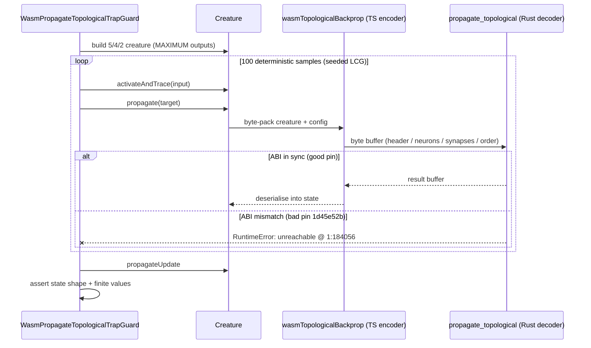

# Add permanent regression test for `wasmPropagateTopological` traps

Closes #2466.

## Summary

Adds a focused, deterministic regression test that drives the WASM-only
`propagate_topological` path end-to-end and asserts that no
`RuntimeError: unreachable` trap occurs and that the returned accumulation state
has the expected shape and finite values. This is the TS-side guard test
promised by Issue #2460 — `propagate_topological` is on the AGENTS.md "WASM-only
operations (no TS fallback)" list, so a TypeScript-side guard is the only line
of defence against an ABI regression sneaking in via a `neatCore.rev` bump.

The new test is `test/wasm/WasmPropagateTopologicalTrapGuard.ts`. It:

- Builds the same 5-input / 4-hidden (IDENTITY) / 2-output (MAXIMUM) creature
  shape from the original repro (`docs/evidence/2461-repro.ts`) — the smallest
  topology known to reliably surface the bounds-check panic on a bad pin.
- Drives 100 deterministic samples (seeded LCG, no `Math.random()` outside that
  helper) through `creature.activateAndTrace(...)` → `creature.propagate(...)` →
  `creature.propagateUpdate(...)`.
- Asserts the call returns without throwing.
- Asserts the per-neuron and per-synapse accumulation state contains only finite
  values (no `NaN`/`Infinity` outside the documented `Infinity` sentinel that
  lives in the raw WASM result buffer, not in the deserialised state).
- Asserts at least one neuron and one synapse received non-zero accumulation,
  proving the WASM result buffer was actually written back into creature state
  (not just silently no-oping).

## Acceptance criteria

- [x] New test file in `test/wasm/` covers the failure mode.
- [x] Test is deterministic (seeded LCG) and completes in **~11 ms** locally —
      well under the 5 s budget.
- [x] Test passes against the fixed pin recorded in `deno.json`
      (`925d4b7fb8381ad1e162e2b76f4c4d2ec11b52f3`).
- [x] Test fails against the bad pin `1d45e52bc4d15ed1f4c0435ca8bbdd20b78a64c4`
      — verified by temporarily pinning. The trap stack matches the field
      telemetry exactly:
      `wasm_activation_bg.wasm:1:184056 → propagate_topological →
      wasmPropagateTopological → wasmTopologicalBackprop → propagateTopological
      → Creature.propagate → test`.
- [ ] Wiring into the smoke list set up in #2465 is intentionally left to that
      issue's follow-up (called out in the issue's "Dependencies" section).

## Evidence

### Test passes against the good pin

```
running 1 test from ./test/wasm/WasmPropagateTopologicalTrapGuard.ts
WasmPropagateTopologicalTrapGuard: backprop loop does not trap (Issue #2460) ... ok (11ms)

ok | 1 passed | 0 failed (16ms)
```

### Test fails against the bad pin (`1d45e52b`) with the expected trap

```
running 1 test from ./test/wasm/WasmPropagateTopologicalTrapGuard.ts
WasmPropagateTopologicalTrapGuard: backprop loop does not trap (Issue #2460) ... FAILED (7ms)

error: RuntimeError: unreachable
    at <anonymous> (.../wasm_activation_bg.wasm:1:184056)
    at <anonymous> (.../wasm_activation_bg.wasm:1:198533)
    at <anonymous> (.../wasm_activation_bg.wasm:1:314079)
    at propagate_topological (.../wasm_activation.js:1299:22)
    at wasmPropagateTopological (src/wasm/WasmStandaloneFunctions.ts:601)
    at wasmTopologicalBackprop (src/propagate/WasmTopologicalBackprop.ts:289)
    at propagateTopological (src/propagate/TopologicalBackpropagation.ts:40)
    at Module.propagate (src/creature/CreatureTraining.ts:68)
    at Creature.propagate (src/Creature.ts:939)
    at .../test/wasm/WasmPropagateTopologicalTrapGuard.ts:135
```

The offset (`1:184056`) and the full stack match the original Issue #2460 trap
report — the test exercises exactly the failure mode it was written to guard
against.

### Sequence of the WASM ABI guard



## Test plan

- Added: `test/wasm/WasmPropagateTopologicalTrapGuard.ts` — one Deno test
  (`WasmPropagateTopologicalTrapGuard: backprop loop does
  not trap (Issue #2460)`)
  covering the trap, the state shape, and finite-value assertions.
- Verified the new test passes against the current pin.
- Verified the new test fails with the expected `RuntimeError: unreachable`
  stack against pin `1d45e52bc4d15ed1f4c0435ca8bbdd20b78a64c4`, then restored
  the original pin.
- `./quality.sh < /dev/null` — the new test passes. Two pre-existing failures on
  `milestone/wasm-regression` are unrelated to this change
  (`test/scripts/BuildFingerprint.ts` expects `wasm_activation/pkg/.gitignore`
  to contain `!build-fingerprint` but the vendored bundle ships `*`;
  `test/wasm/WasmPublishIncluded.ts` flags the same `wasm_activation/pkg`
  exclusion). Both reproduce on a clean checkout of the branch with no edits to
  this PR's scope and are out of scope for #2466.
