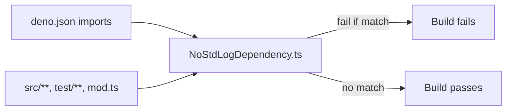

# Issue #2481 — Guardrail test: no `@std/log` dependency

## Summary

Adds `test/utils/NoStdLogDependency.ts`, a guardrail unit test that fails
the build if `@std/log` (or `jsr:@std/log`) is ever introduced as a
direct dependency of NEAT-AI. The check has two layers:

1. Parses `deno.json` and asserts no `imports` key or value resolves to
   `@std/log`.
2. Walks `src/**/*.ts`, `test/**/*.ts`, and `mod.ts` and asserts no file
   contains a banned `import` statement, using a specifier-anchored
   regex so benign substrings (`getLogger`, `LogLevel`, `console.log`,
   JSDoc prose) do not trigger false positives.

The "richer" `deno info --json` layer described as *optional* in the
issue was skipped — the deno.json + source-walk check is sufficient and
keeps the test under 5 seconds locally (~140 ms in practice).

Closes #2481.

## Evidence

### Happy-path run against current tree

```
running 8 tests from ./test/utils/NoStdLogDependency.ts
BANNED_LOG_IMPORT_RE flags `from "@std/log"` ... ok (0ms)
BANNED_LOG_IMPORT_RE flags `from "jsr:@std/log"` ... ok (0ms)
BANNED_LOG_IMPORT_RE flags submodule imports ... ok (0ms)
BANNED_LOG_IMPORT_RE flags side-effect imports ... ok (0ms)
BANNED_LOG_IMPORT_RE does not false-positive on benign 'log' usages ... ok (0ms)
findBannedLogImports reports line numbers for offending sources ... ok (0ms)
deno.json imports do not include @std/log ... ok (0ms)
no source file imports @std/log ... ok (126ms)

ok | 8 passed | 0 failed (136ms)
```

### Failure scenario 1 — fake source import

Adding `src/utils/__FakeStdLogProbe.ts` containing
`import { getLogger } from "@std/log";` produces:

```
-   [
-     {
-       file: "src/utils/__FakeStdLogProbe.ts",
-       line: 2,
-       text: 'import { getLogger } from "@std/log";',
-     },
-   ]
+   []

no source file imports @std/log => ./test/utils/NoStdLogDependency.ts:167:6
FAILED | 7 passed | 1 failed
```

### Failure scenario 2 — fake `deno.json` entry

Adding `"@std/log": "jsr:@std/log@^0.224"` to `deno.json` `imports`
produces:

```
-   [
-     'key "@std/log"',
-     'value "jsr:@std/log@^0.224" (key "@std/log")',
-   ]
+   []

deno.json imports do not include @std/log => ./test/utils/NoStdLogDependency.ts:110:6
FAILED | 7 passed | 1 failed
```

Full failure output is preserved in
`docs/evidence/issue-2481-guardrail-failure.txt`.

### Architecture



## Test Plan

Tests added in `test/utils/NoStdLogDependency.ts`:

- `BANNED_LOG_IMPORT_RE flags 'from "@std/log"'` — positive happy path
- `BANNED_LOG_IMPORT_RE flags 'from "jsr:@std/log"'` — positive with JSR prefix
- `BANNED_LOG_IMPORT_RE flags submodule imports` — `@std/log/levels`
- `BANNED_LOG_IMPORT_RE flags side-effect imports` — bare `import "@std/log"`
- `BANNED_LOG_IMPORT_RE does not false-positive on benign 'log' usages` —
  covers `getLogger`, `LogLevel`, `console.log`, JSDoc/comments, and the
  hypothetical sibling specifier `@std/logger-shim`
- `findBannedLogImports reports line numbers for offending sources` —
  asserts the helper returns the matching line number
- `deno.json imports do not include @std/log` — happy path against
  current `deno.json`
- `no source file imports @std/log` — happy path scan of `src/`,
  `test/`, and `mod.ts`

Failure behaviour was verified manually by injecting a fake source file
and a fake `deno.json` entry; both reverted before commit (see Evidence
above).
