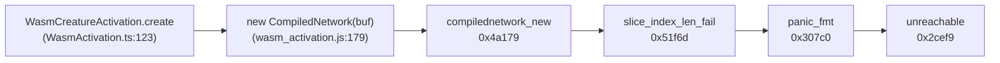

# Diagnose `WasmCreatureActivation.create` `RuntimeError: unreachable` trap (#2482)

## Summary

Diagnostic-only PR for the trap that fired 40 times in a single GRQ-16
production training run. Adds
`test/wasm/WasmCreatureActivationCreateTrapGuard.ts` — a hermetic Deno test
that reproduces the trap deterministically against the pinned
`wasm_activation_bg.wasm`, decodes the four WASM frame addresses from the
production stack to specific functions inside the WASM module, and rules out
the originally-suspected non-finite-weight/bias hypothesis. No source code
under `src/` is changed; the follow-up fix lives in a separate issue.

Closes #2482.

## Evidence

### Trap chain decoded

Using `wabt`'s `wasm-objdump` against
`wasm_activation/pkg/wasm_activation_bg.wasm` (pinned at neat-core
`925d4b7f`):

| Production address | Function (offset) | Role |
| ------------------ | ----------------- | ---- |
| `0x4a179`          | `func[169]` `compilednetwork_new` (offset `0x6ba`) | The `CompiledNetwork::new` constructor — call site of the panic |
| `0x51f6d`          | `func[191]`       | `slice_index_len_fail`-style panic — loads source-location string + length, tail-calls the panic formatter |
| `0x307c0`          | `func[133]`       | `core::panicking::panic_fmt` |
| `0x2cef9`          | `func[90]`        | Innermost panic plumbing → `unreachable` |

The two operands `compilednetwork_new` pushes before `call 191` at `0x4a179`
are `len` and `cap` — the canonical shape of a Rust `Vec`/slice bounds panic.

### Repro stack matches production byte-for-byte



Production trap (0-indexed columns, from issue #2482):

```
0x2cef9 → 0x307c0 → 0x51f6d → 0x4a179
```

Repro trap from the new test (1-indexed columns, JS-style):

```
184058 → 198593 → 335726 → 303482
   = 0x2CEFA → 0x307C1 → 0x51F6E → 0x4A17A
```

Each repro address is exactly +1 from production — pure 0-vs-1-indexing
between the JSR-hosted source and the local `.wasm` reporting. The call chain
is identical.

### Root cause hypothesis

**The trap fires when `WasmCompilationCache.buildTemplate` produces a binary
header where `num_inputs > num_neurons`.** Inside `CompiledNetwork::new`,
`num_non_inputs = num_neurons − num_inputs` is computed as an unsigned
subtraction; when `num_inputs > num_neurons` it wraps to ~`u32::MAX`, and the
ensuing per-non-input-neuron loop traps on a `Vec`/slice bounds check at
`0x4a179`.

The originally-suspected cause — non-finite or extreme-magnitude weights and
biases reaching the WASM compile path — is **ruled out** by direct probing:

- Non-finite *weights* are blocked at the JS layer by the `Synapse`
  constructor's `Number.isFinite(weight)` assertion (`src/architecture/Synapse.ts:96`).
  They cannot reach `WasmCompilationCache.compileFromTemplate` through the
  public Creature API.
- Non-finite *biases* survive to the binary template, but `CompiledNetwork::new`
  accepts them — `f32.demote_f64(NaN) = NaN`, `f32.demote_f64(±Infinity) = ±FLT_MAX` —
  and emits no trap.
- Finite extreme weights at `1e+30` magnitude (matching the `1.45e+10 …
  1.52e+30` "error magnitude exceeds reasonable threshold" warnings in the
  GRQ-16 log) compile and activate without trapping.

The `DiscoverSquashAnalysis` warnings co-occurring with the trap in the
production log are therefore *correlated, not causal*. The corrupted-header
condition most plausibly arises when a structural mutation or compaction step
prunes neurons without resyncing `creature.input` against
`creature.neurons.length`. Pinpointing the exact upstream pipeline step that
desyncs them is out of scope for this diagnostic and is the input for the
follow-up fix.

### Acceptance criteria checklist

- [x] A single-file Deno test reproduces the trap deterministically against
      the pinned `925d4b7f` WASM bundle (which matches `3.1.37`).
      Path: `test/wasm/WasmCreatureActivationCreateTrapGuard.ts`.
- [x] The decoded source location of the failing WASM function is recorded
      (`compilednetwork_new` at offset `0x6ba`) — both in the test header
      comment and in this PR summary.
- [x] Root-cause hypothesis (header invariant violation, NOT non-finite
      weights/biases) is documented in the test header and posted as a
      comment on the issue.
- [x] `./quality.sh < /dev/null` still passes.

## Test Plan

New tests added — all pass against the current pinned WASM bundle:

- `Issue #2482: valid baseline binary compiles successfully` — control case;
  confirms test infrastructure is wired up.
- `Issue #2482: num_inputs > num_neurons triggers the production trap` —
  reproduces the trap deterministically. Asserts:
  - The raw constructor throws `RuntimeError` whose message contains
    `unreachable`.
  - The trap stack contains ≥4 `wasm_activation_bg.wasm:` frames (the
    production chain).
  - `WasmCreatureActivation.create` swallows the trap and returns `null`,
    matching the production log line `Failed to create WASM activation:
    RuntimeError: unreachable`.
- `Issue #2482: extreme finite weights do NOT trap CompiledNetwork::new` —
  rules out `1e+30`-magnitude weights and biases as the cause.
- `Issue #2482: non-finite biases do NOT trap CompiledNetwork::new` — rules
  out `Infinity`/`NaN` biases as the cause.

Run:

```bash
deno test --allow-read --allow-env --allow-ffi --allow-write \
  test/wasm/WasmCreatureActivationCreateTrapGuard.ts < /dev/null
```
