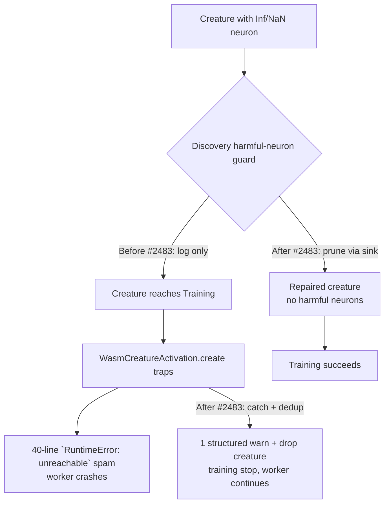

# Issue #2483 — Make `WasmCreatureActivation.create` recoverable + actually prune harmful neurons

## Summary

Two layers of defence against a single bad creature killing a training step:

1. **Call-site recovery for the WASM compile trap.** `WasmCreatureActivation.create` now records the trap message instead of logging on every retry, the WASM compilation cache emits a single deduplicated warning per offending creature uuid (previously 40-line spam in GRQ-16), and `runSingleEpoch` and `DiscoverStructureRecording.recordSamples` catch the resulting `WasmError` to drop the creature gracefully rather than crashing the worker.
2. **Squash analysis actually removes harmful neurons.** The squash analyser previously logged "this neuron should be removed rather than having its activation function changed" but did not produce a removal candidate when the sequential `analyzeSelectedNeuronsSquashes` path was active. `findCandidateSquash` now accepts an optional `harmfulSink: CandidateHarmfulNeuron[]`, and `DataRecorderAnalysis` drains that sink into `discoverResult.removeHarmfulNeurons` so the existing `removeHarmfulNeuron` helper actually prunes the neuron and re-emits the creature.

Closes #2483.

## Evidence

### Mermaid — flow before/after

### Tests verifying the fix

- `test/wasm/WasmCompileFailureRecovery.ts` — new file, 6 unit tests covering both layers:
  - `WasmCreatureActivation.create returns null AND records the trap message on bad binary`
  - `repeated bad-binary calls do not throw — they keep returning null`
  - `activateWasm surfaces WasmError so training can drop the creature without crashing`
  - `a regular creature still creates an activation successfully (control)`
  - `findCandidateSquash promotes over-threshold neurons to harmful sink`
  - `harmful candidate from squash sink is removable via removeHarmfulNeuron`
- Pre-existing `test/wasm/WasmInstantiationFailure.ts` (#2146) and `test/wasm/WasmCreatureActivationCreateTrapGuard.ts` (#2482) continue to pass — `activateAndTraceWasm`/`activateWasm` still surface `WasmError`, never raw `RuntimeError`.

### Quality gate

- `./quality.sh --skip-discovery --skip-wasm < /dev/null` — **6281 passed | 0 failed | 4 ignored** in 16m50s.

## Files changed

- `src/wasm/WasmActivation.ts` — `create()` no longer logs per call; records `lastCreateFailure` for dedup-aware callers. New helpers: `getLastWasmCreateFailure()`, `resetLastWasmCreateFailure()`.
- `src/wasm/WasmCompilationCache.ts` — `getOrCompile()` emits a single structured `WARN` per offending creature uuid (creature uuid, neuron count, trap message, drop guidance). New helper `resetFailedCompileDedup()` for tests.
- `src/wasm/mod.ts` — re-exports the new helpers.
- `src/architecture/training/TrainingEpoch.ts` — catches `WasmError` from `creature.activateAndTrace`, logs once, sets `trainingStopped = true`, breaks the epoch instead of crashing.
- `src/architecture/ErrorGuidedStructuralEvolution/DiscoverStructureRecording.ts` — same pattern around the recording-time `activateAndTrace`.
- `src/architecture/ErrorGuidedStructuralEvolution/DiscoverSquashAnalysis.ts` — `findCandidateSquash` accepts an optional `harmfulSink: CandidateHarmfulNeuron[]` and pushes a candidate when error magnitude exceeds `MAX_REASONABLE_SQUASH_ERROR` (1e10).
- `src/architecture/ErrorGuidedStructuralEvolution/DiscoverStructureAnalysis.ts` — `analyzeSelectedNeuronsSquashes` forwards the sink.
- `src/architecture/ErrorGuidedStructuralEvolution/DataRecorderAnalysis.ts` — sequential analysis path drains the sink into `removeHarmfulNeurons`.
- `test/wasm/WasmCompileFailureRecovery.ts` — new test file (above).

## Test plan

- [x] `WasmCreatureActivation.create` returns `null` on a bad binary and records the trap message.
- [x] `activateWasm` / `activateAndTraceWasm` surface `WasmError` (never raw `RuntimeError`).
- [x] Repeated traps for the same creature uuid emit a single structured warning (no 40-line spam).
- [x] `findCandidateSquash` promotes over-threshold neurons into the harmful-sink output.
- [x] The harmful candidate produced by the squash path is acceptable to `removeHarmfulNeuron` and the harmful neuron is removed from the resulting creature.
- [x] `./quality.sh` passes (6281 / 0 / 4).

## Notes

- The harmful-sink wiring is added to the **sequential** rust-combined-analysis path. The **parallel** path already calls `analyzeSelectedNeuronsForHarmfulRemoval` independently, so the sink is left optional there to avoid duplicating candidates.
- The dedup set is bounded at 1024 entries to prevent long-running training from leaking unbounded uuids; cleared on overflow.
