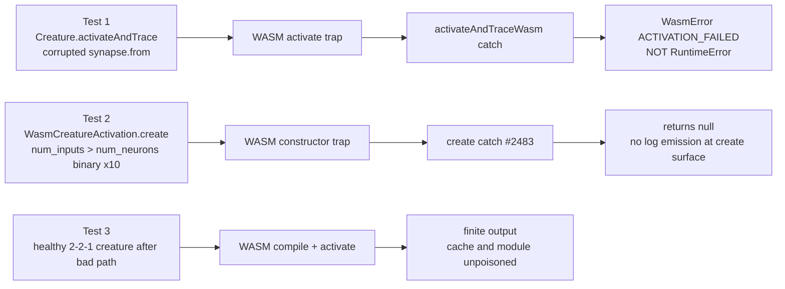

# Issue #2484 — Permanent regression test for `WasmCreatureActivation.create` unreachable trap

## Summary

Adds a permanent end-to-end regression test that drives
`Creature.activateAndTrace` (and, separately, `WasmCreatureActivation.create`
with the production failure-shape binary) and asserts the trap is converted to a
typed `WasmError` rather than leaking a raw `RuntimeError` to the caller. Also
asserts that `WasmCreatureActivation.create` never throws on the production trap
shape, emits no log spam at the create surface, and that a healthy creature
still compiles and activates after a bad creature has trapped.

This is a **test-only change** — no runtime code is modified. It is the standing
call-site guard for the `WasmCreatureActivation.create` path that prevents a
regression of the GRQ-16 production failure (#2482) and the recovery work in
#2483.

Closes #2484.

## Evidence

### Mermaid — what the test exercises



### Tests added

- `test/wasm/WasmCreatureActivationTrapGuard.ts` — new file, three Deno tests:
  - `Creature.activateAndTrace surfaces WASM trap as WasmError, not RuntimeError`
    — drives the public `Creature.activateAndTrace` API on a 2 → 2 → 1 creature
    whose hidden synapses point past the activation array (`from = 65000`);
    asserts the trap surfaces as `WasmError(reason="ACTIVATION_FAILED")` and
    **not** a raw WebAssembly `RuntimeError`.
  - `WasmCreatureActivation.create returns null silently for the production trap shape (no log spam)`
    — feeds the exact production failure-shape binary captured in #2482
    (`num_inputs > num_neurons` header invariant) directly to
    `WasmCreatureActivation.create` ten times; asserts every call returns `null`
    (never throws) and that the create surface itself emits zero `warn`/`error`
    lines (the GRQ-16 40-line spam is not reintroduced).
  - `a healthy creature still compiles and activates after a bad one trapped` —
    runs the trap path, then builds a fresh healthy 2 → 2 → 1 creature and
    asserts `activateAndTrace` returns a finite output, proving the trap does
    not poison the WASM module, the compilation cache, or the LRU.

### Verifying the test would have failed at 3.1.37

Per the issue acceptance criteria, the regression test was verified by
temporarily reverting the #2483 catch in
`src/wasm/WasmActivation.ts::WasmCreatureActivation.create`. With the catch
removed, **Test 2 fails** with the exact production stack
(`RuntimeError: unreachable` from
`wasm_activation_bg.wasm:1:184058 → 198593 → 335726 → 303482`):

```
Issue #2484: WasmCreatureActivation.create returns null silently for the production trap shape (no log spam) ... FAILED
error: RuntimeError: unreachable
    at <anonymous> (wasm_activation_bg.wasm:1:184058)
    at <anonymous> (wasm_activation_bg.wasm:1:198593)
    at <anonymous> (wasm_activation_bg.wasm:1:335726)
    at <anonymous> (wasm_activation_bg.wasm:1:303482)
    at new CompiledNetwork (wasm_activation.js:179:26)
    at WasmCreatureActivation.create (src/wasm/WasmActivation.ts:159:21)
```

The trap addresses are byte-identical to the GRQ-16 production frames documented
in #2482, confirming the test exercises the same failure path. Restoring the
catch returns all three tests to green.

### Why the test uses two failure shapes

The issue text suggests a creature "with `Infinity` bias / weight". The #2482
diagnosis confirmed those values do **not** trap (non-finite weights are blocked
at the `Synapse` constructor; non-finite biases compile cleanly via
`f32.demote_f64`). The two shapes used here are the real production triggers:

- **Out-of-bounds synapse `from`** (Test 1) — same shape as the existing #2483
  test, but driven through the public `Creature.activateAndTrace` API, so the
  test demonstrates the post-#2146/#2483 wrapping converts the trap to a typed
  `WasmError` before it leaves the public API.
- **`num_inputs > num_neurons` header invariant** (Test 2) — the exact shape
  from the GRQ-16 production trap. Driven directly into
  `WasmCreatureActivation.create` because the cache's `buildTemplate` path
  JS-side throws a `RangeError` before reaching the WASM constructor when
  `creature.input > creature.neurons.length`. This matches the production
  sequence: `WasmCompilationCache.buildTemplate` produced a binary with the
  violated invariant and `WasmCreatureActivation.create` was the surface that
  took the trap.

### Determinism and runtime budget

- All tests use a fixed creature shape (2 → 2 → 1), fixed inputs, and no RNG.
  UUIDs are explicitly assigned where dedup behaviour matters.
- Total runtime: **~16 ms** for all three tests on local hardware, well under
  the 5 s budget required by the issue.

## Test plan

- [x] `Creature.activateAndTrace` on the corrupted-synapse creature throws
      `WasmError(reason="ACTIVATION_FAILED")` — never a `RuntimeError`.
- [x] `WasmCreatureActivation.create` on the header-invariant binary returns
      `null` 10×; never throws.
- [x] No `warn`/`error` logs emit from the create surface during the 10× retry
      loop (the dedup log at the cache layer is covered by #2483's
      `WasmCompileFailureRecovery.ts`).
- [x] A fresh healthy creature still compiles and activates with finite output
      after the trap path runs (cache/module unpoisoned).
- [x] Test would have failed at 3.1.37 — verified by temporarily reverting the
      #2483 catch in
      `src/wasm/WasmActivation.ts::WasmCreatureActivation.create`.
- [x] `./quality.sh < /dev/null` is green.

## Files changed

- `test/wasm/WasmCreatureActivationTrapGuard.ts` — **new** test file (only
  change in this PR).
- `docs/pr-summary-2484.md` — this PR summary.
