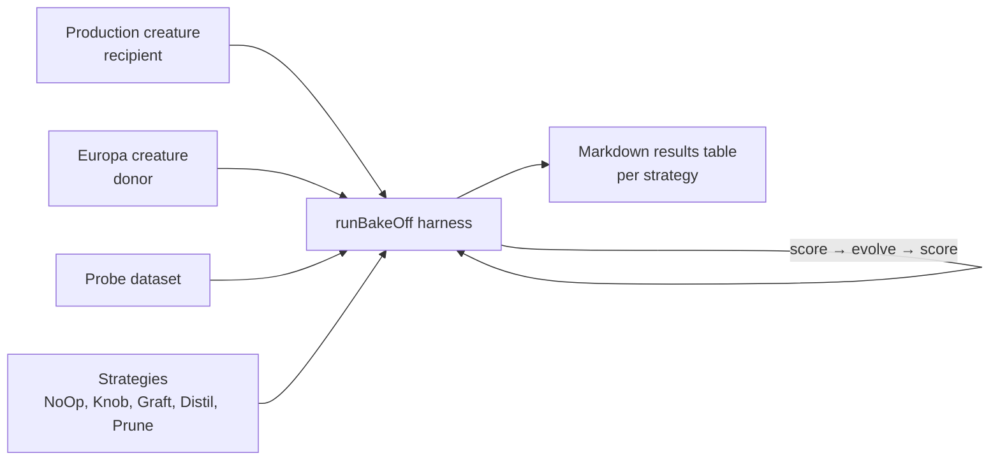

# DNA sharing bake-off harness and strategy interface

## Summary

Lands the foundation for the DNA-sharing primitive bake-off described in parent
issue #2490. Each future primitive — knob tuning, compact sub-graph graft,
knowledge distillation, pruning template — implements the same
`DnaSharingStrategy` interface and gets its row in a Markdown table produced by
a reproducible harness against a fixed probe dataset, fixed seed, and shared
`NeatOptions`.

Closes #2491.

### What landed

- `DnaSharingStrategy` interface (`src/transfer/DnaSharingStrategy.ts`) with
  `prepare(recipient, donor, options)` and a short `name` for the output table.
- `NoOpStrategy` baseline (`src/transfer/NoOpStrategy.ts`) — every candidate
  primitive must beat this row on absolute lift.
- `runBakeOff` harness (`src/transfer/DnaSharingBakeOff.ts`) returning one
  `BakeOffRow` per strategy with all fields the parent issue calls for: `name`,
  `baselineScore`, `finalScore`, `lift`, `hiddenUuidsShared`, `neurons`,
  `synapses`, `durationMs`. `formatBakeOffMarkdown` renders the rows as a
  Markdown table.
- CLI entry point (`bench/DnaSharingBakeOff.ts`) that loads the recipient,
  donor, and probe dataset by URL or filesystem path (`PRODUCTION_URL`,
  `EUROPA_URL`, `PROBE_DATASET_URL`), with fallbacks to the small
  `test/breed/samples/*.json` fixtures and a built-in XOR-style probe so CI runs
  without network. Generation budget and seed are `--generations` / `--seed`
  (defaults 1000 / 42).
- Public re-exports from `src/transfer/mod.ts`.

### Diagram



## Evidence

CLI smoke test on the default fixtures:

```text
# DNA Sharing Bake-Off (generations=5, seed=42)

| Strategy | Baseline | Final | Lift | Hidden UUIDs Shared | Neurons | Synapses | Duration (ms) |
| --- | ---: | ---: | ---: | ---: | ---: | ---: | ---: |
| NoOp | -0.250279 | -0.250279 | 0.000000 | 2 | 6 | 7 | 3.68 |
```

Backend/CLI change — no UI screenshot.

## Test Plan

- `test/transfer/DnaSharingStrategy.ts`
  - `runBakeOff - fake strategy is invoked with harness options and
    recorded`
    — fake `DnaSharingStrategy` is invoked with the recipient, donor, seed, and
    generations the harness was given; confirms the row is recorded with all
    fields populated.
  - `runBakeOff - NoOpStrategy produces zero lift` — baseline row is
    well-defined and lift is exactly zero.
  - `runBakeOff - rows preserve strategy order` — output rows match input
    strategy order.
  - `runBakeOff - custom evolveStep is invoked and result is recorded` — harness
    forwards `generations` and `seed` to the evolution hook.
  - `countSharedHiddenUuids - counts donor hidden UUIDs present in
    recipient`
    — shared-UUID accounting.
  - `formatBakeOffMarkdown - emits header, separator, and one row per
    result`
    — Markdown table shape.
- `deno test --allow-all test/transfer/` — 30 passed, 0 failed (existing
  Checkpoint and PopulationSeeding tests still green).
- `deno lint src test bench mod.ts` — clean.
- `deno check` — clean.
