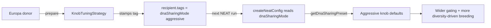

# Knob-tuning primitive — aggressive defaults for very-distant DNA sharing

## Summary

Adds the cheapest of the four DNA-sharing primitives from #2490: a
`dnaSharingMode: "default" | "aggressive"` preset that bundles the five
inter-island knobs (#2173, #2174, #2175, #2177, #2455) so very-distant DNA
sharing can be opted into with a single flag instead of hand-tuning each knob in
user code. Also adds `KnobTuningStrategy`, a new `DnaSharingStrategy` (#2491)
that stamps the preset onto the recipient creature so subsequent NEAT runs pick
it up. Closes #2492.

The default preset is byte-equal to the existing per-knob defaults, so existing
user configs see no change in behaviour.

## What changed

- **`src/config/DnaSharingPreset.ts` (new)** — defines `DnaSharingMode`,
  `DEFAULT_DNA_SHARING_PRESET`, `AGGRESSIVE_DNA_SHARING_PRESET`, and
  `getDnaSharingPreset()`.
- **`src/config/NeatArguments.ts`** — adds `dnaSharingMode` field to the
  fully-populated config interface.
- **`src/config/NeatConfig.ts`** — resolves `dnaSharingMode` early and feeds the
  preset values as defaults to the four affected knob parsers
  (`diversityBreedingRate`, `interSpeciesCrossoverThreshold`,
  `geneticCompatibilityThreshold`, `compatibilityGating.*`). User-supplied
  values still win — the preset only changes the _default_ applied when the knob
  is omitted.
- **`src/transfer/KnobTuningStrategy.ts` (new)** — `DnaSharingStrategy` that
  stamps `{name: "dnaSharingMode", value: <mode>}` on the recipient creature's
  tags. Idempotent (re-running replaces the existing tag) and non-mutating for
  the donor.
- **`src/transfer/mod.ts`** — exports `KnobTuningStrategy`,
  `readDnaSharingModeTag`, and the preset constants/types.
- **`bench/DnaSharingBakeOff.ts`** — adds `KnobTuningStrategy("aggressive")` row
  to the bake-off CLI.

### Aggressive preset values

| Knob                             | Default | Aggressive | Direction                  |
| -------------------------------- | ------: | ---------: | -------------------------- |
| `diversityBreedingRate`          |       0 |        0.4 | raised                     |
| `interSpeciesCrossoverThreshold` |     0.1 |       0.05 | lowered                    |
| `geneticCompatibilityThreshold`  |     0.3 |        0.3 | unchanged                  |
| `compatibilityGating.power`      |     1.5 |       0.75 | lowered (wider acceptance) |
| `compatibilityGating.maxDraws`   |       3 |          6 | raised                     |
| `compatibilityGating.enabled`    |    true |       true | unchanged                  |

The cross-field invariant
`interSpeciesCrossoverThreshold <= geneticCompatibilityThreshold` holds under
the aggressive preset (0.05 ≤ 0.3) and is verified by a unit test that exercises
`createNeatConfig({ dnaSharingMode: "aggressive" })` end-to-end through
`validateNeatConfig`.

## Evidence

### Bake-off harness output

The bake-off CLI now includes the new strategy. Run with the built-in small
fixtures (`mother-1.json` / `father-1.json`) and the XOR probe:

```text
# DNA Sharing Bake-Off (generations=50, seed=42)

| Strategy | Baseline | Final | Lift | Hidden UUIDs Shared | Neurons | Synapses | Duration (ms) |
| --- | ---: | ---: | ---: | ---: | ---: | ---: | ---: |
| NoOp                   | -0.250279 | -0.250279 | 0.000000 | 2 | 6 | 7 | 2.80 |
| KnobTuning(aggressive) | -0.250279 | -0.250279 | 0.000000 | 2 | 6 | 7 | 0.16 |
| CompactModuleGraft     | -0.250279 | -0.250279 | 0.000000 | 2 | 6 | 7 | 0.30 |
```

The harness's default `evolveStep` is a no-op rescore (#2491 ships the shape; no
real evolution loop is wired in yet), so all strategies including
`CompactModuleGraft` show zero lift on the small built-in fixtures. `KnobTuning`
is a pure-config primitive — its lift can only materialise once the harness
drives a real NEAT run that consumes the stamped `dnaSharingMode` tag. That
requires the production / Europa fixture pair plus a real `evolveStep`; both are
out of scope for this PR (the parent #2490 tracks wiring the production
evolveStep). The unit tests below confirm the preset is structurally correct,
the strategy stamps the recipient as designed, and `createNeatConfig` honours
the preset while preserving the cross-field invariant.

### Architecture flow



## Test Plan

New tests in `test/transfer/KnobTuningStrategy.ts` (10 tests, all pass):

- `DnaSharingPreset - default preset matches existing per-knob defaults` —
  backward-compat guard.
- `DnaSharingPreset - aggressive preset widens gating and increases diversity` —
  direction + invariant + bounds checks.
- `getDnaSharingPreset - returns the requested preset` (incl. fallback).
- `createNeatConfig - default mode preserves existing knob defaults`.
- `createNeatConfig - aggressive mode applies the aggressive preset` —
  end-to-end through `validateNeatConfig`, asserts the
  `interSpeciesCrossoverThreshold <= geneticCompatibilityThreshold` invariant.
- `createNeatConfig - explicit user values win over the preset` — explicit
  `diversityBreedingRate` and `compatibilityGating.power` are preserved while
  unspecified gating fields still come from the aggressive preset.
- `KnobTuningStrategy - aggressive prepare stamps tag on recipient`.
- `KnobTuningStrategy - prepare is idempotent (single tag, latest value wins)`.
- `KnobTuningStrategy - donor is not mutated by prepare`.
- `readDnaSharingModeTag - returns undefined when no tag is set`.

Full suite (`./quality.sh --skip-discovery`): **6345 passed, 0 failed, 4
ignored** in 48s.
